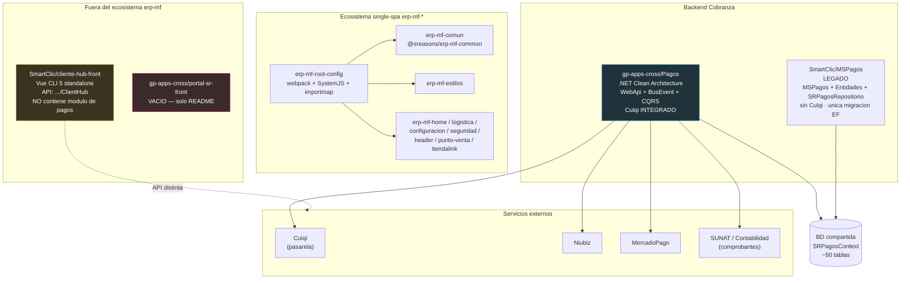
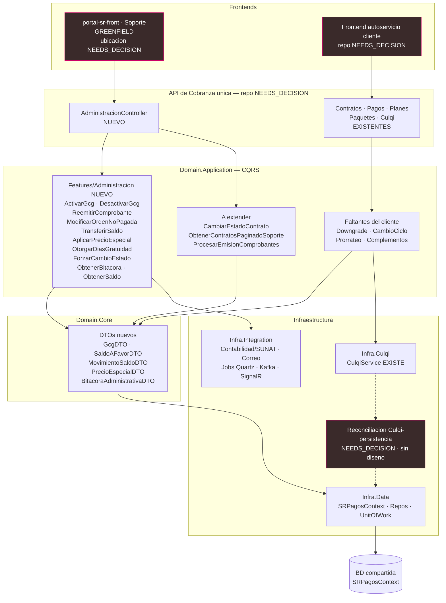
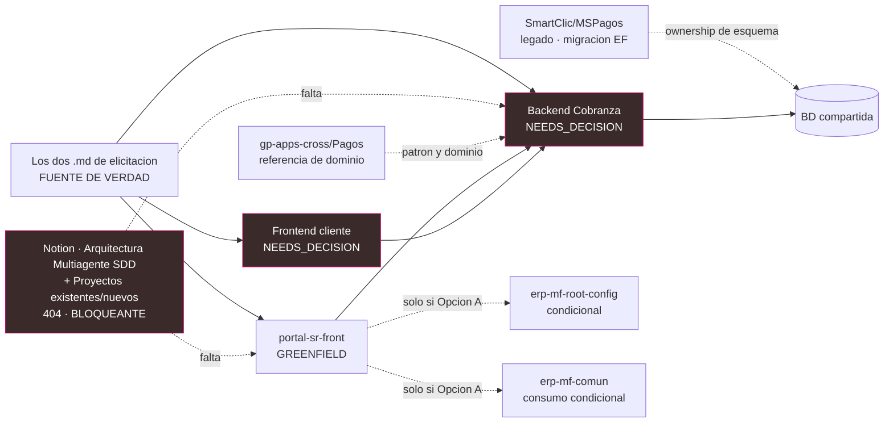
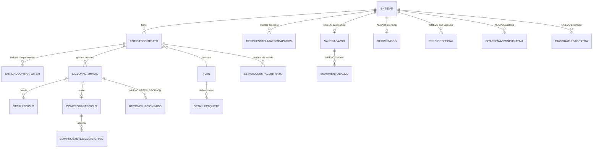
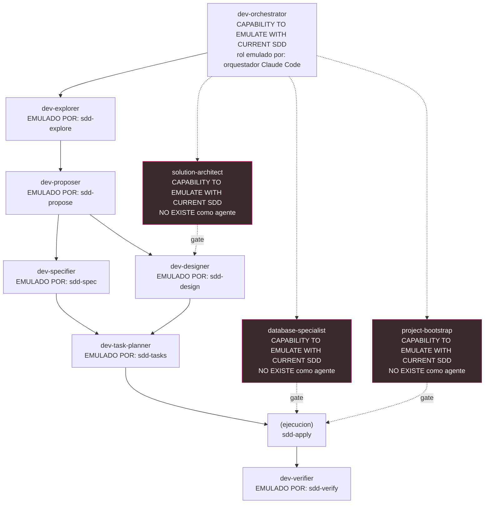

# SDD Engineering Assessment — cobranza-soporte-cliente

> **Modo de este documento:** ANÁLISIS / PLANIFICACIÓN. No se ejecutó ninguna acción de escritura sobre GitLab, base de datos o infraestructura. Toda inspección de repositorios fue estrictamente de solo lectura (`get_repository_tree`, `get_file_content`, `search_projects`). Todo lo referente a Git/GitLab en este documento está marcado `PROPUESTO - NO EJECUTADO`. Toda fila de la matriz de verificación está marcada `NOT EXECUTED`.
>
> **Fecha de análisis:** 2026-08-14 · **Change:** `cobranza-soporte-cliente` · **Proyecto:** gentle-ai

---

## 1. Executive Summary

El requerimiento cubre dos documentos de elicitación hermanos (Soporte administrativo y Autoservicio de cliente) que, según sus propios textos, "comparten la misma API de Cobranza y la misma base de datos" pero son "proyectos de interfaz separados". La inspección de solo lectura de los repositorios confirma parcialmente esa premisa y **contradice** otra parte de ella.

**Lo confirmado por observación directa:**

- `gp-apps-cross/Pagos` es un backend .NET Clean Architecture real y desarrollado (7 proyectos, CQRS por carpeta `Features/`, EF Core con `SRPagosContext`, repositorios + `UnitOfWork`, Quartz para demonios de cobro recurrente, Kafka, SignalR), con **integración Culqi ya implementada** (`Pagos.Infra.Culqi/Services/CulqiService.cs`: CreateCard, CreateCharge, CreateCustomer, CreateToken, CreateTokenYape).
- `SmartClic/MSPagos` es el legado del mismo dominio (DTOs casi 1:1 con `Pagos.Domain.Core`), **sin ninguna referencia a Culqi** (solo Niubiz y MercadoPago). Es el único repo que contiene una **migración EF real** (`SRPagosRepositorio/Migraciones/20220705211757_First.cs` + `SRPagosContextModelSnapshot.cs`).
- `gp-apps-cross/portal-sr-front` está **vacío**: el árbol del repositorio contiene exactamente un archivo, `README.md`, con el template por defecto de GitLab. Greenfield puro.
- Existe un ecosistema de microfrontends **single-spa real y en producción**: `SmartClic/erp-mf-root-config` con `registerApplication`, `importmap-{local,dev,crt,prd}.json`, SystemJS y despliegue por Jenkins a `https://app.smartclic.pe/erp-mf-<name>/app.js`. Hay 14 repos `erp-mf-*`.

**Lo contradicho por observación directa (crítico):**

- El insumo del usuario describe `SmartClic/cliente-hub-front` como "frontend cliente YA desarrollado, corresponde a `elicitacion-modulo-pagos-cliente-v1.md`". **La inspección no respalda esto.** El árbol completo de `src/views` es: `clientes-recomendados`, `contadores`, `contratos`, `recomendados`, `revendedores`, `simple-views` (pantallas de felicitación/regalos), `usuarios`, más `Bienvenida/Registro/Resumen/Home/Login/DataTables/NotFound`. **No existe ninguna vista de planes, complementos, suscripción, órdenes de pago, tarjetas, upgrade/downgrade, cambio de ciclo, saldo a favor ni modal "Ver pago".** Su API base apunta a `.../ClientHub`, no a Cobranza. Es un portal de referidos/revendedores/contadores, no el módulo de pagos del cliente. → `NEEDS_DECISION`.

**Conclusión operativa:** el frente de Soporte es greenfield en frontend y mayormente greenfield en backend administrativo; el frente de cliente **no tiene repositorio destino identificado con evidencia** — el repo que el usuario señaló no contiene ese producto. Antes de planificar implementación hacen falta tres decisiones humanas: (a) cuál es el repositorio backend de trabajo (la memoria de Engram contiene una corrección explícita del usuario que invalida "Pagos" como destino, sin nombrar sustituto), (b) dónde vive el frontend de autoservicio del cliente, y (c) si `portal-sr-front` se integra al single-spa `erp-mf-*` o se construye standalone. A eso se suma un insumo faltante bloqueante: las dos páginas de Notion de arquitectura corporativa devolvieron 404.

`DATABASE SPECIALIST REVIEW: REQUIRED` (justificación en §13).

---

## 2. Request Classification

| Campo | Valor |
|---|---|
| **Categoría** | **C — Mixto** |
| **Componente "cambio sobre sistema existente"** | Backend de Cobranza (dominio ya implementado en .NET con Culqi), y — condicionalmente — el frontend de autoservicio del cliente **si se identifica su repositorio real** |
| **Componente "proyecto nuevo / greenfield"** | Frontend administrativo de Soporte (`gp-apps-cross/portal-sr-front`, repo vacío) |
| **¿Amerita Greenfield Discovery completo?** | **Sí, acotado** — ver §8. El repo no tiene código, ni convenciones, ni CI, ni stack elegido, y su ubicación arquitectónica (single-spa vs standalone) es una decisión abierta con impacto en build, deploy, autenticación y reutilización de componentes |
| **Repos observados en lectura** | 6 inspeccionados + 14 `erp-mf-*` enumerados |
| **Nivel de confianza global** | **Medio-bajo** — dos insumos de arquitectura corporativa inaccesibles, una premisa del usuario contradicha por la evidencia, y el repositorio backend destino sin confirmar |

---

## 3. Sources Reviewed

### 3.1 Locales — fuente de verdad de requerimientos (leídos completos)

| Fuente | Estado | Notas |
|---|---|---|
| `E:\2026-II\gentle-ai\aplicativo-administrativo-soporte-v1.md` | Leído íntegro (295 líneas) | 12 acciones de Soporte, 11 reglas de negocio, 5 bloques Gherkin, 6 pendientes abiertos |
| `E:\2026-II\gentle-ai\elicitacion-modulo-pagos-cliente-v1.md` | Leído íntegro (514 líneas) | 11 flujos, 26 reglas de negocio, 5 bloques Gherkin, 6 pendientes abiertos |

Ambos son "documentos vivos", v1 desglosados de un v4 unificado, fechados 13/08/2026. **Metadatos incompletos en ambos:** Responsable, Stakeholder, Figma, mapas de flujo y manual de componentes están todos marcados *(pendiente)*.

### 3.2 Arquitectura / SDD corporativa — INSUMO FALTANTE BLOQUEANTE

| Fuente | Estado | Impacto |
|---|---|---|
| Notion — "Arquitectura Multiagente para Desarrollo SDD" (documento **principal**) | ❌ `object_not_found` (404) | `NEEDS_DECISION` |
| Notion — "Arquitectura multiagente — Proyectos existentes y proyectos nuevos" (documento **complementario**) | ❌ `object_not_found` (404) | `NEEDS_DECISION` |

La integración de Notion conectada **no tiene acceso** a esas dos páginas privadas. **No se reintentó la lectura** por indicación explícita. Consecuencia: no hay forma de validar que la organización de agentes, los gates y el Architecture Catalog propuestos en este documento coincidan con el estándar corporativo. **Esto bloquea el cierre con confianza plena de Gate 1 (Scope/Proposal) y Gate 2 (Technical/Architecture)** — ver §21 y §23. **Acción requerida del usuario:** compartir ambas páginas con la integración de Notion.

### 3.3 Engram — memoria complementaria (contexto adicional, NO reemplaza Git/docs)

| Observación | ID | Tratamiento |
|---|---|---|
| `sdd/cobranza-soporte-cliente/explore` | #2838 | Aceptada como contexto. Su propia sección "Incertidumbres" declara que no pudo inspeccionar GitLab; **este assessment cierra esa brecha** |
| `sdd/cobranza-soporte-cliente/proposal` | #2843 | **Revisada críticamente, NO copiada.** Su §3 afirma "Backend — construir sobre `gp-apps-cross/Pagos` … `SmartClic/MSPagos` es el predecesor legado y NO recibe trabajo nuevo" y su §3 punto 3 asume que `cliente-hub-front` "ya está desarrollado y corresponde al autoservicio". **Ambas afirmaciones están contradichas** — la primera por #2827, la segunda por la inspección directa del repo |
| `architecture/cobranza-pagos-repos` | #2827 (`decision`) | **Corrección explícita del usuario.** Cita: "gp-apps-cross/Pagos NO es la solución ni el repositorio donde se va a trabajar… las conclusiones anteriores de este topic_key sobre 'dónde construir' quedan INVALIDADAS hasta nueva confirmación". El repo sustituto **nunca fue nombrado** |

### 3.4 GitLab — inspección SOLO LECTURA

| Repo | Alcance inspeccionado | Convenciones (`AGENTS.md` / `CONTRIBUTING.md` / `repo-profile`) |
|---|---|---|
| `gp-apps-cross/Pagos` | `.sln`, árbol de los 7 proyectos, `Features/`, `Domain.Core/Models`, `Infra.Culqi`, `Infra.Data`, `Infra.Integration`, `WebApi/Controllers`, `Program.cs`, `BusEvent` | **AUSENTES**. Solo `README.md` trivial ("# Pagos") y `Pagos.WebApi/CHANGELOG.md` |
| `SmartClic/MSPagos` | Split MSPagos / MSPagosEntidades / SRPagosRepositorio, controladores, DTOs, migraciones | **AUSENTES**. Solo `Jenkinsfile`, `.gitattributes`, `.gitignore` |
| `SmartClic/cliente-hub-front` | `package.json`, `vue.config.js`, `src/` recursivo completo, `src/config/config.js`, servicios | **AUSENTES**. Sin `.gitlab-ci.yml` (usa Jenkins) |
| `gp-apps-cross/portal-sr-front` | Árbol raíz recursivo completo | **AUSENTES**. Solo `README.md` template de GitLab |
| `SmartClic/erp-mf-root-config` | `package.json`, `webpack.config.js`, `tsconfig.json`, `src/` recursivo, `importmap-*.json`, `index.ejs`, `sreasons-erp-mf-root-config.ts`, `devops/` | **AUSENTES**. Sin `.gitlab-ci.yml` (Jenkins Groovy) |
| `SmartClic/erp-mf-comun` | `package.json`, `src/` (components, core/seguridad, core/shared) | **AUSENTES** |
| `SmartClic/erp-mf-configuraciones` | `package.json`, `src/components` | No confirmado (árbol truncado) |
| 9 repos `erp-mf-*` restantes | Solo existencia/paths vía `search_projects` | **NO VERIFICADO** |

> **Hallazgo transversal:** **ningún repositorio inspeccionado tiene `AGENTS.md`, `CONTRIBUTING.md` ni `repo-profile`.** No existe documentación de convenciones versionada en los repos. Ninguno usa GitLab CI: todos despliegan con pipelines Jenkins Groovy bajo `devops/`. Esto es relevante para §17 y §18: los agentes SDD no tendrán reglas de proyecto pre-resueltas y deberán inferirlas del código.

### 3.5 Verificación de nomenclatura solicitada

Se verificó explícitamente la duda `erp-mf-configuraciones` (plural) vs `erp-mf-configuracion` (singular): **ambos existen como proyectos separados**. `erp-mf-root-config` registra `@sreasons/erp-mf-configuracion` (singular) en `registerApplication` con `activeWhen: /configuracion`; `erp-mf-configuraciones` (plural) también tiene entrada de importmap. No es un typo: son dos microfrontends distintos. Lista completa (14): `erp-mf-tiendalink`, `erp-mf-configuracion`, `erp-mf-logistica`, `erp-mf-home`, `erp-mf-configuraciones`, `erp-mf-seguridad`, `erp-mf-punto-venta-menu`, `erp-mf-resources`, `erp-mf-comun`, `erp-mf-menu`, `erp-mf-header`, `erp-mf-punto-venta`, `erp-mf-root-config`, `erp-mf-estilos`.

---

## 4. Assumptions and Unknowns

### 4.1 Supuestos declarados (no verificados — si alguno es falso, el plan cambia)

| # | Supuesto | Base | Riesgo si es falso |
|---|---|---|---|
| A1 | La base de datos de Cobranza mencionada en ambos documentos es la que respalda `SRPagosContext` (esquema compartido entre `Pagos` y `MSPagos`) | Nombre `SRPagosContext` idéntico en ambos repos; DTOs 1:1 | Todo el §13 queda invalidado |
| A2 | El "aplicativo web de administración" no existe hoy en ninguna forma | `portal-sr-front` vacío; no se encontró otro candidato | Trabajo duplicado |
| A3 | El dominio "Contrato/EntidadPago/CicloFacturado" del backend equivale a "Suscripción/Empresa/Orden de pago" de los documentos | Correspondencia semántica de nombres y campos observados | Todo el mapeo de §7 y §13 se desalinea |
| A4 | Los 14 `erp-mf-*` sirven al ERP y `cliente-hub-front` sirve a un producto distinto (ClientHub) | Base URL `.../ClientHub`, cero dependencias `@sreasons/*` compartidas | La decisión de §8 se replantea |

### 4.2 Incógnitas abiertas (`NEEDS_DECISION` — no resueltas aquí a propósito)

| # | Incógnita | Por qué no se resuelve |
|---|---|---|
| U1 | **¿Cuál es el repositorio backend de trabajo?** | Engram #2827 invalida `Pagos` por instrucción del usuario, sin nombrar reemplazo. No inventar arquitectura sin respaldo |
| U2 | **¿Dónde vive el frontend de autoservicio del cliente?** | `cliente-hub-front` no contiene ese producto (evidencia en §3.4/§6). Ningún otro repo inspeccionado lo contiene |
| U3 | **¿`portal-sr-front` va dentro del single-spa o standalone?** | Decisión arquitectónica con pros/contras reales — se plantea en §8, no se decide |
| U4 | **Contenido de las 2 páginas de Notion** | 404 |
| U5 | ¿Existe ya una entidad de auditoría reutilizable? | Se observan `Logdemonios` y `Logrequests` (logs operativos), pero no se pudo confirmar si sirven como bitácora de cambios de negocio |
| U6 | ¿Quién gobierna el esquema de la BD compartida? | `Pagos` no tiene carpeta `Migrations`; la única migración EF vive en el legado |

### 4.3 Contradicciones documentadas (no resueltas silenciosamente)

| # | Fuente A | Fuente B | Resolución |
|---|---|---|---|
| C1 | Instrucción del usuario en esta sesión: "`cliente-hub-front` … frontend cliente YA desarrollado, corresponde a `elicitacion-modulo-pagos-cliente-v1.md`" | Inspección read-only: `src/views` = referidos/revendedores/contadores/contratos/usuarios; **cero** pantallas de pagos/planes/complementos/órdenes; API base `.../ClientHub` | **NO RESUELTA → `NEEDS_DECISION`.** Se documenta la discrepancia. Posibles explicaciones no verificadas: (i) el módulo de pagos vive en otra rama, (ii) vive en otro repo, (iii) aún no existe |
| C2 | Engram #2843 (proposal): "construir sobre `gp-apps-cross/Pagos`" | Engram #2827 (decisión posterior del usuario): "`Pagos` NO es la solución ni el repositorio donde se va a trabajar" | **RESUELTA a favor de B** por antigüedad y por ser corrección explícita del usuario. `Pagos` se trata como **referencia de dominio**, no como destino. Pero el destino sustituto sigue sin nombrar → `NEEDS_DECISION` |
| C3 | Docs: "ambos aplicativos … comparten la misma API de Cobranza y la misma base de datos" | No se identificó un frontend de cliente que consuma esa API | **NO RESUELTA → `NEEDS_DECISION`.** Depende de U2 |
| C4 | `erp-mf-root-config` `package.json`: `single-spa: ^5.9.3` | `importmap-prd.json` fija `single-spa@6.0.0` desde CDN | **NO RESUELTA.** Discrepancia real observada entre dependencia instalada y runtime. Reportar al equipo dueño del root-config; no es alcance de este change pero afecta cualquier MF nuevo |
| C5 | `erp-mf-header` declara `activeWhen` incluyendo el prefijo `/planes` | Ningún `registerApplication` monta una aplicación en `/planes` | **NO RESUELTA — hallazgo relevante.** El shell ya reserva una ruta `/planes` sin microfrontend detrás. Puede indicar un espacio previsto para la UI de planes/facturación. Requiere confirmación humana |
| C6 | `importmap-prd.json` mapea `erp-mf-planillas` a `//localhost:8085/app.js` | Es un import map de **producción** | **NO RESUELTA.** Aparente residuo de desarrollo en el mapa productivo. Fuera de alcance; se reporta por higiene |

---

## 5. Discovery

### 5.1 Qué pide el negocio (derivado estrictamente de los dos `.md`)

**Frente A — Aplicativo administrativo de Soporte (12 acciones, §7 del doc administrativo):**

1. Activar GCG/Gratuita — anula orden pendiente, respeta periodo pagado activo, la empresa **pierde** el saldo a favor, periodo gratuito indefinido sin órdenes, complementos exentos, se respetan límites del plan base.
2. Desactivar GCG/Gratuita — se reanuda facturación normal.
3. Reemitir comprobante rechazado por SUNAT — el dinero cobrado no se toca; se actualiza el sub-estado del comprobante.
4. Modificar orden ya generada **no pagada** — solo `Deuda Pendiente` / `Deuda Vencida`; **nunca** `Pagada`; queda en bitácora con origen administrativo.
5. Consultar histórico completo de órdenes/pagos por empresa (solo lectura).
6. Forzar cambio de estado de cuenta/suscripción — registra estado anterior, nuevo, usuario de Soporte y motivo.
7. Consultar bitácora de cambios comerciales y financieros.
8. Ejecutar cambios de plan y periodos en nombre del cliente.
9. Transferir saldo a favor entre empresas — descuenta de A, acredita a B, registra en bitácora.
10. Consultar y gestionar saldo a favor y su historial de movimientos.
11. Aplicar precios especiales **con vigencia definida** (fecha inicio/fin).
12. Otorgar días adicionales de periodo gratuito.

Transversal (regla 5, §8): **bitácora de cambios administrativos** para toda acción — usuario, momento, empresa/entidad, valores anterior/nuevo.

**Frente B — Autoservicio del cliente (11 flujos, §7 del doc de cliente):**

Emisión 5 días antes del corte · pago adelantado · compra de complementos con matriz de 4 condiciones + fórmula `(precio / 30 ó 365) × días restantes` y opciones A/B en las condiciones 2 y 3 · baja de complementos (marcada v1/provisional, en revisión de UX) · cambio de plan con matriz upgrade 2×2 (orden generada/no × periodo pagado/gratuito) y downgrade siempre a saldo a favor inmediato · cambio de ciclo mensual↔anual con crédito por lo no usado · pago automático 3 intentos (días −2, −1, 0 respecto al vencimiento, predeterminada primero, pago manual cancela el intento) · morosidad → suspensión → reactivación reeligiendo plan con complementos precargados removibles · cancelación voluntaria · saldo a favor · modal "Ver pago" con **7 variantes**.

**Fuera de alcance explícito en los propios `.md`:** reversión/anulación de pagos confirmados; penalidades de reactivación; segmentación de roles/permisos de Soporte; segmentación por empresa/región; nota de crédito como documento formal; eliminación de recursos (solo deshabilitar).

### 5.2 Qué existe hoy (observado, no supuesto)

`gp-apps-cross/Pagos` — .NET Clean Architecture, 7 proyectos:

- **`Pagos.WebApi`** — 9 controladores: `Conectividad`, `Configuraciones`, `Contratos`, `Culqi`, `Demonios`, `Niubiz`, `Pagos`, `Paquetes`, `Planes`. `Program.cs` con top-level statements, Steeltoe Config Server, Serilog + Elasticsearch, Quartz, Swagger, `VPNAuthorizationFilter`.
- **`Pagos.Domain.Application`** — CQRS por carpeta (`*Cmd.cs`/`*Query.cs` + `*Handler.cs`). ~28 comandos y ~16 queries en `Contratos`; `Demonios` con `ActualizarVencimientos`, `AnularSuscripciones`, `CobroRecurrenteErp2`, `GenerarCobroMensual`, `GenerarCobroRecurrente`; `Pagos` con `ProcesarCreacionComprobantes`, `ProcesarEmisionComprobantes`, `ProcesarWebHook`, `ValidarPago`, `RechazarPago`, `PagarYape`.
- **`Pagos.Domain.Core`** — DTOs por dominio (`Contratos`, `Culqi`, `Pagos`, `Planes`, `Tarjetas`, `Integraciones/PasarelaPago`, `Mensajeria`).
- **`Pagos.Infra.Culqi`** — `CulqiService` (Card/Charge/Customer/Token/YapeToken/AntiFraud), `RestFulClient`, `CulqiSettingsResolver`.
- **`Pagos.Infra.Data`** — **EF Core**: `SRPagosContext`, ~50 POCOs en `Persistence/Models/`, repositorios (`ContratosRepo`, `PagosRepo`, `PlanesRepo`, `SuscripcionRepo`, `TarjetaRepo`…), `UnitOfWork`, `RedisCacheRepository`, y `Constants/StoreProcedures.cs` (uso mixto EF + stored procedures). **Sin carpeta `Migrations`.**
- **`Pagos.Infra.Integration`** — Contabilidad, Correo, Finanzas, Hubs (SignalR), Jobs (Quartz), Kafka (consumers/producers), PasarelaPagos, Seguridad, Storage.
- **`Pagos.BusEvent`** — microservicio separado con `PagosHostedService`.

### 5.3 Cobertura del backend existente vs. lo que pide el negocio

| Capacidad requerida | ¿Existe en `Pagos`? | Evidencia observada |
|---|---|---|
| GCG / empresa gratuita | **No** | Ningún feature ni entidad con ese nombre |
| Saldo a favor / crédito | **No** | Sin entidad `SaldoAFavor`/`Credito` |
| Transferencia de saldo entre empresas | **No** | Ausente |
| Precios especiales con vigencia | **No** (solo genéricos) | Existen `Parametro`, `Parametromodulo`, `Parametropais`, `Parametropaquete`; ninguno modela vigencia de precio por empresa |
| Bitácora / auditoría de cambios de negocio | **Parcial** | `Logdemonios`, `Logrequests` son logs **operativos**, no auditoría funcional con valores anterior/nuevo |
| Forzar cambio de estado | **Sí (base)** | `CambiarEstadoContrato` (Cmd+Handler), tablas `Estado`, `Estadocuentacontrato` |
| Reemisión de comprobante / SUNAT | **Parcial** | `ProcesarCreacionComprobantes`, `ProcesarEmisionComprobantes`, `Comprobanteciclo`, `ComprobanteDTO`, `ContabilidadService` — pero **ninguna lógica nombrada "reemisión"** ni SUNAT explícita |
| Complementos / recursos adicionales | **Parcial** | `Caracteristica`, `Caracteristicapaquete`, `Entidadcontratoitem`, `Detallepaquete` — no existe entidad "Complemento" |
| Prorrateo | **No (por nombre)** | `ProcesarDescuentoCicloFacturado` existe pero no es prorrateo |
| Upgrade de plan | **Sí** | `ObtenerUpdagradePlan`, `DetalleUpgradeDTO`, `ResumenUpgradeDTO`, `UpgradePlanResponseDTO` |
| Downgrade de plan | **No** | Sin feature ni DTO de downgrade |
| Cambio de ciclo mensual↔anual | **Parcial** | `GenerarCiclosAdelantados`, `ProcesarCiclosFacturados`, `Ciclofacturado`, `Detalleciclo` — sin comando de cambio de ciclo |
| Intentos de cobro automático | **Sí** | `CobroRecurrenteErp2`, `GenerarCobroRecurrente`, `GenerarCobroMensual` + jobs Quartz `CobroRecurrenteJob`, `CobroRecurrenteErp2Job`. **Sin evidencia de la política exacta "3 intentos, días −2/−1/0, predeterminada primero"** |
| Reconciliación Culqi↔persistencia | **No** | Sin patrón outbox, saga, ni tabla de reconciliación observable |

> **Dato relevante para el alcance:** ya existe `ObtenerContratosPaginadoSoporte` — una query **explícitamente orientada a Soporte**. Es evidencia de que el backend ya contempla un consumidor administrativo, aunque hoy sea solo de consulta.

---

## 6. Current System / Repository Map



### 6.1 Ficha por repositorio

| Repo | Estado real observado | Stack | CI/CD | Rol candidato |
|---|---|---|---|---|
| `gp-apps-cross/Pagos` | Desarrollado, activo | .NET, Clean Arch, CQRS, EF Core, Quartz, Kafka, SignalR, Redis | (no observado en árbol raíz) | **Referencia de dominio / candidato a extensión** — NO confirmado como destino (U1) |
| `SmartClic/MSPagos` | Legado | .NET Core clásico, EF Core con migraciones | Jenkinsfile | Sistema a no tocar; **único poseedor de la migración EF** |
| `SmartClic/cliente-hub-front` | Desarrollado, **otro dominio** | Vue 3 + Vue CLI 5, Vuex 4, Vue Router 4, Bootstrap 5, DataTables, SweetAlert2, Axios | Jenkins (`cicd-frontclienthub.groovy`) | **Contradice** la premisa de ser el frontend de pagos (C1) |
| `gp-apps-cross/portal-sr-front` | **Vacío** (1 archivo) | Ninguno | Ninguno | **Greenfield — frontend administrativo de Soporte** |
| `SmartClic/erp-mf-root-config` | Desarrollado, productivo | TypeScript, webpack raw, single-spa, SystemJS, importmaps por entorno | Jenkins (5 variantes Groovy) | Shell del ecosistema; punto de integración si se elige single-spa |
| `SmartClic/erp-mf-comun` | Desarrollado | Vue 3, webpack raw + `webpack-config-single-spa`, arquitectura hexagonal en `core/seguridad` y `core/shared` | Jenkins | **Librería compartida reutilizable** (componentes base + dominio + adapters) |
| `SmartClic/erp-mf-configuraciones` | Desarrollado | Vue 3, **Vue CLI 4 + `vue-cli-plugin-single-spa`**, Storybook, `vue-i18n`, `@erp-mf/erp2-components-vue` | Jenkins | Referencia de patrón admin/settings |

> **Observación importante sobre el "patrón" del ecosistema:** no hay un patrón único. `root-config` y `comun` usan **webpack crudo** con `webpack-config-single-spa`; `erp-mf-configuraciones` usa **Vue CLI + `vue-cli-plugin-single-spa`**. Es decir, el Architecture Catalog tiene **dos variantes válidas** de microfrontend, no una. Esto amplía las opciones de §8.

---

## 7. Impact Map

```yaml
impact_map:
  change: cobranza-soporte-cliente
  classification: mixed_category_C
  confidence: medium_low
  blocking_unknowns: [U1_backend_repo, U2_client_frontend_repo, U4_notion_docs]

  repositories:
    - repository: "TBD — repositorio backend de Cobranza"
      status: NEEDS_DECISION
      reason: >
        Engram #2827 invalida gp-apps-cross/Pagos como destino por correccion
        explicita del usuario, sin nombrar sustituto. Todo el impacto backend
        queda condicionado a esta decision.
      reference_implementation: gp-apps-cross/Pagos
      impact_type: extension
      areas_touched:
        - Domain.Core/Models (nuevos DTOs de dominio administrativo)
        - Domain.Application/Features (nuevos Commands/Queries CQRS)
        - Infra.Data/Persistence/Models + Repositories (nuevas entidades)
        - WebApi/Controllers (nuevo controlador administrativo)
        - Infra.Integration (reemision de comprobantes, notificaciones)
      new_capabilities_required:
        - GCG activar/desactivar
        - SaldoAFavor (entidad + movimientos + transferencia inter-empresa)
        - PrecioEspecial con vigencia inicio/fin
        - BitacoraAdministrativa (auditoria funcional valor_anterior/valor_nuevo)
        - DiasGratuidadAdicionales
        - Reemision de comprobante (SUNAT)
        - Downgrade de plan
        - Cambio de ciclo mensual<->anual
        - Prorrateo explicito
        - Reconciliacion Culqi<->persistencia
      existing_capabilities_to_extend:
        - CambiarEstadoContrato (agregar motivo + usuario + matriz de transiciones)
        - ObtenerContratosPaginadoSoporte (ya orientado a Soporte)
        - ProcesarEmisionComprobantes (base para reemision)
        - CobroRecurrente* jobs (alinear a politica de 3 intentos)
      risk: high
      database_impact: true

    - repository: gp-apps-cross/portal-sr-front
      status: CONFIRMED_EMPTY
      impact_type: greenfield
      areas_touched: [todo el repositorio]
      scope: >
        Frontend administrativo de Soporte: 12 acciones + 3 vistas de solo
        lectura (historico, bitacora, saldo).
      blocked_by: [U3_single_spa_vs_standalone, sin_disenos_figma]
      risk: medium
      database_impact: false

    - repository: "TBD — frontend de autoservicio del cliente"
      status: NEEDS_DECISION
      reason: >
        CONTRADICCION C1. SmartClic/cliente-hub-front fue senalado como este
        frontend, pero su src/views no contiene ninguna pantalla de pagos,
        planes, complementos, ordenes, tarjetas ni saldo, y su API base apunta
        a /ClientHub, no a Cobranza.
      impact_type: unknown
      risk: high
      database_impact: false

    - repository: SmartClic/MSPagos
      status: LEGACY_READ_ONLY
      impact_type: none_planned
      note: >
        No recibe trabajo nuevo, PERO es el unico repo con historial de
        migraciones EF del esquema compartido. Cualquier cambio de esquema
        debe considerar su ownership.
      risk: medium
      database_impact: indirect

    - repository: SmartClic/erp-mf-root-config
      status: CONDITIONAL
      impact_type: configuration_only
      condition: solo si U3 se resuelve a favor de integrar en single-spa
      areas_touched:
        - src/sreasons-erp-mf-root-config.ts (registerApplication)
        - src/importmap-{local,dev,crt,prd}.json
        - devops/*.groovy
      risk: low
      database_impact: false

    - repository: SmartClic/erp-mf-comun
      status: CONDITIONAL_REUSE
      impact_type: consume_only
      condition: solo si U3 -> single-spa
      note: se consume como dependencia; no se planifica modificarlo
      risk: low
      database_impact: false

  cross_cutting_concerns:
    - concern: bitacora_administrativa
      spans: [backend, portal-sr-front]
      mandated_by: "doc Soporte, seccion 8, regla 5"
    - concern: inmutabilidad_de_pagos_confirmados
      spans: [backend]
      mandated_by: "doc Soporte, seccion 8, regla 3"
    - concern: reconciliacion_culqi_persistencia
      spans: [backend]
      mandated_by: "doc Cliente, seccion 12 (pendiente de diseno tecnico)"
      severity: critical
    - concern: ausencia_total_de_AGENTS.md/CONTRIBUTING.md
      spans: [todos los repos]
      effect: sin reglas de proyecto pre-resueltas para agentes SDD
```

---

## 8. Greenfield Assessment

`CAPABILITY TO EMULATE WITH CURRENT SDD: project-bootstrap`
`CAPABILITY TO EMULATE WITH CURRENT SDD: solution-architect`

### 8.1 ¿Amerita Greenfield Discovery completo?

**Sí, acotado.** `gp-apps-cross/portal-sr-front` contiene exactamente un archivo (`README.md`, template por defecto de GitLab). No hay stack, ni convenciones, ni pipeline, ni componentes, ni autenticación. No es un "cambio": es un producto nuevo. Sin embargo, el discovery **no parte de cero conceptualmente**, porque existe un Architecture Catalog observable y reutilizable dentro de la organización (ecosistema `erp-mf-*` + `erp-mf-comun`).

Alcance recomendado del discovery: **decisión de ubicación arquitectónica + stack + autenticación + patrón de datos**, sin re-litigar lenguaje ni framework (Vue 3 está adoptado en los 7 frontends observados).

### 8.2 La decisión abierta: single-spa vs standalone — `NEEDS_DECISION` (Gate 2)

Evidencia observada, sin decidir:

| Dimensión | Opción A — Integrar al single-spa `erp-mf-*` | Opción B — Standalone tipo `cliente-hub-front` |
|---|---|---|
| **Precedente observado** | `erp-mf-root-config` + 13 módulos, productivo en `app.smartclic.pe` | `cliente-hub-front`, productivo, Vue CLI 5 puro |
| **Build** | webpack crudo + `webpack-config-single-spa` (como `root-config`/`comun`) **o** Vue CLI + `vue-cli-plugin-single-spa` (como `erp-mf-configuraciones`) — hay **dos variantes válidas** | `vue.config.js` estándar, sin tooling adicional |
| **Entry point** | Bundle `app.js` exportando ciclo `bootstrap/mount/unmount`, registrado con `registerApplication` + `activeWhen` | `src/main.js` montando en `#app` de `public/index.html` |
| **Despliegue** | Bundle independiente en `https://app.smartclic.pe/erp-mf-<name>/app.js`, cableado en runtime vía `importmap-{env}.json` + SystemJS. **Requiere tocar `erp-mf-root-config`** (registerApplication + 9 importmaps + Jenkins) | SPA completa autónoma, pipeline Jenkins propio, cero cambios en otros repos |
| **Reutilización** | Acceso a `@sreasons/erp-mf-common` (componentes base, `cmp-modal-error`, `cmp-page-error`, core hexagonal de seguridad) y `@sreasons/erp-mf-styles`; posible `@erp-mf/erp2-components-vue` | Cero reutilización. Habría que reconstruir tabla, modales, manejo de errores y auth |
| **Autenticación** | Hereda el flujo de `@sreasons/erp-mf-security` (`/auth`, `/error-permiso`, `/error-plan`) ya productivo | Auth propia desde cero (`cliente-hub-front` tiene `auth.service.js` aislado) |
| **Acoplamiento / riesgo** | Cambios en el shell afectan al MF nuevo. Hereda la discrepancia `single-spa ^5.9.3` vs `@6.0.0` del importmap (C4) y el residuo `localhost:8085` en `importmap-prd.json` (C6) | Aislamiento total. Divergencia de UX respecto al ERP. Un frontend administrativo más que mantener aparte |
| **Señal a favor de A** | `erp-mf-header` ya declara `activeWhen` con prefijo **`/planes`** sin microfrontend registrado detrás (C5) — el shell parece tener un espacio reservado para el área de planes/facturación | — |
| **Señal a favor de B** | — | Soporte es público **interno**, distinto del usuario final del ERP; podría no querer el shell, el menú ni los permisos del ERP |
| **Costo de reversión** | Medio (extraer un MF del shell) | Alto (migrar una SPA completa a single-spa después) |

**Recomendación de proceso (no decisión):** llevar esta comparación a Gate 2 con el dueño de `erp-mf-root-config`. La señal C5 (`/planes` reservado) es la evidencia más fuerte a favor de A y debe confirmarse o descartarse con una persona antes de decidir.

### 8.3 Elementos del discovery pendientes por falta de insumos

| Elemento | Estado | Bloqueo |
|---|---|---|
| Estándar corporativo de proyectos nuevos vs existentes | ❌ | Notion 404 (U4) |
| Diseños Figma / manual de componentes | ❌ | Marcados *(pendiente)* en ambos `.md` |
| Modelo de autenticación/autorización para Soporte | ❌ | Los `.md` difieren la segmentación de roles a "iteración posterior" |
| Convenciones de código y branching | ❌ | Ningún repo tiene `AGENTS.md` ni `CONTRIBUTING.md` |
| Backend contra el cual desarrollar | ❌ | U1 |

---

## 9. Proposal and Alternatives

`CAPABILITY TO EMULATE WITH CURRENT SDD: dev-proposer`

### 9.1 Revisión crítica de la propuesta previa (Engram #2843)

La propuesta anterior es sólida en alcance de negocio (lo hereda fielmente de los `.md`) pero **inválida en dos afirmaciones de destino**:

1. "Backend — construir sobre `gp-apps-cross/Pagos`" → **invalidada** por la corrección explícita del usuario (#2827).
2. "Frontend Cliente — ajustar `SmartClic/cliente-hub-front` … Ya está desarrollado y corresponde al autoservicio" → **invalidada por la evidencia**: ese repo no contiene el módulo de pagos (C1).

Lo que **sí se conserva** de #2843: la enumeración de alcance, el listado de fuera-de-alcance, y la identificación del riesgo crítico de reconciliación Culqi↔persistencia.

### 9.2 Alternativas de arquitectura backend (no se elige — Gate 2)

| Alt. | Descripción | A favor | En contra | Estado |
|---|---|---|---|---|
| **B1** | Extender el backend existente estilo `Pagos` con un módulo administrativo (nuevo controlador + features CQRS + entidades), sirviendo a ambos frontends con una sola API | Coincide con el mandato de los `.md` ("misma API, misma BD"); reutiliza Culqi, comprobantes, jobs y CQRS ya probados; menor superficie operativa | Aumenta un servicio ya grande; acopla el ciclo administrativo al de facturación | `NEEDS_DECISION` — depende de U1 |
| **B2** | Microservicio administrativo separado sobre la misma BD | Aísla el riesgo de las acciones administrativas; despliegue independiente | **Viola** el mandato "misma API de Cobranza"; dos escritores sobre el mismo esquema sin transacción común; duplica las reglas de inmutabilidad de pagos | `NEEDS_DECISION` |
| **B3** | BFF administrativo delgado que orquesta la API de Cobranza existente | Frontend desacoplado; no toca el core | Las 12 acciones requieren escrituras transaccionales que hoy **no existen** en la API; el BFF no puede inventarlas | Descartable salvo que B1 aporte primero los endpoints |

> **Ninguna de las tres puede evaluarse honestamente sin resolver U1.** Elegir un ganador aquí sería inventar arquitectura sin respaldo.

### 9.3 Alternativas de frontend administrativo

Ver §8.2 (Opción A single-spa / Opción B standalone). Se añade una tercera observada:

| Alt. | Descripción | Nota |
|---|---|---|
| **F3** | Crear un nuevo microfrontend `erp-mf-*` en `SmartClic/` en vez de usar `gp-apps-cross/portal-sr-front` | El nombre `portal-sr-front` y su grupo (`gp-apps-cross`) no siguen la convención `erp-mf-*` del ecosistema (`SmartClic/`). Si se elige la Opción A, hay una **incoherencia de naming y de grupo** que debe resolverse con el dueño del catálogo. `PROPUESTO - NO EJECUTADO` |

---

## 10. Project Blueprint

> Aplica a `gp-apps-cross/portal-sr-front` (greenfield). **Todos los valores marcados `NEEDS_DECISION` deben cerrarse en Gate 2 antes de que este blueprint sea accionable.**

```yaml
project_blueprint:
  name: portal-sr-front
  repository: gp-apps-cross/portal-sr-front
  current_state: empty_repository_readme_only
  purpose: >
    Aplicativo web de administracion usado por el equipo de Soporte para
    ejecutar las 12 acciones administrativas del documento
    aplicativo-administrativo-soporte-v1.md sobre el dominio de Cobranza.

  architecture_placement:
    decision: NEEDS_DECISION
    options:
      - id: A_single_spa
        integrate_into: SmartClic/erp-mf-root-config
        requires_changes_in:
          - src/sreasons-erp-mf-root-config.ts
          - src/importmap-local.json
          - src/importmap-dev.json
          - src/importmap-crt.json  # + variantes 2..5
          - src/importmap-prd.json  # + variantes 2..5
          - devops/cicd-mfrootconfig*.groovy
        build_variants:
          - raw_webpack + webpack-config-single-spa   # patron root-config / comun
          - vue-cli + vue-cli-plugin-single-spa       # patron erp-mf-configuraciones
        naming_conflict: >
          El repo se llama portal-sr-front y vive en gp-apps-cross, no en
          SmartClic/erp-mf-*. Incoherencia con el catalogo. NEEDS_DECISION.
      - id: B_standalone
        reference: SmartClic/cliente-hub-front
        build: vue-cli-service (vue.config.js)

  stack:
    language: JavaScript o TypeScript    # NEEDS_DECISION: cliente-hub-front usa JS; root-config usa TS
    framework: Vue 3                      # unanime en los 7 frontends observados
    router: vue-router 4
    state: Vuex 4                         # unanime en los repos observados; Pinia no aparece en ninguno
    http: axios
    ui_kit:
      if_option_A: "@sreasons/erp-mf-common + @sreasons/erp-mf-styles"
      if_option_B: "NEEDS_DECISION (cliente-hub-front usa Bootstrap 5 + DataTables + SweetAlert2)"
    i18n: NEEDS_DECISION   # solo erp-mf-configuraciones usa vue-i18n

  configuration_pattern:
    observed_convention: >
      Archivos config.{js,dev.js,crt.js,prd.js} en src/config/ (cliente-hub-front)
      o devops/config/config-{dev,crt,prd}.yml (ecosistema erp-mf-*).
    environments: [local, dev, crt, prd]

  ci_cd:
    platform: Jenkins (Groovy)
    evidence: >
      Ningun repo inspeccionado usa .gitlab-ci.yml. Todos tienen
      devops/cicd-*.groovy + devops/config/config-{dev,crt,prd}.yml.
    action: PROPUESTO - NO EJECUTADO

  authentication:
    decision: NEEDS_DECISION
    option_A: heredar @sreasons/erp-mf-security (rutas /auth, /error-permiso, /error-plan)
    option_B: implementar auth propia (patron auth.service.js de cliente-hub-front)
    note: >
      Los .md difieren la segmentacion de roles/permisos de Soporte a una
      iteracion posterior; hoy todos los usuarios de Soporte tienen el mismo
      nivel de acceso a todas las empresas.

  quality_gates:
    linting: eslint + eslint-plugin-vue   # presente en todos los repos observados
    testing: NEEDS_DECISION
    note: >
      No se observo NINGUNA infraestructura de test (unit, e2e, componente)
      en cliente-hub-front, erp-mf-root-config ni erp-mf-comun. Establecer un
      baseline de testing es una decision explicita, no un default heredado.

  documentation_baseline:
    AGENTS.md: PROPUESTO - crear (ausente en los 7 repos)
    CONTRIBUTING.md: PROPUESTO - crear
    README.md: PROPUESTO - reemplazar el template de GitLab
```

---

## 11. Specs

> Especificaciones derivadas **estrictamente** de los dos `.md`. Los "Pendientes / Temas Abiertos" de los documentos **no se resuelven aquí** — se reportan como preguntas abiertas (§23) y las specs que dependen de ellos quedan marcadas `NEEDS_DECISION`.

### SPEC-001 — Activación del régimen GCG/Gratuita

```gherkin
Feature: Activacion del regimen GCG por Soporte

  Scenario: Activar GCG con orden pendiente
    Given una empresa con una Orden de pago en estado "Deuda Pendiente"
    When un usuario de Soporte activa la condicion de Empresa Gratuita
    Then la Orden pendiente se anula
    And el periodo gratuito se repite indefinidamente sin generar nuevas ordenes
    And se registra la accion en la bitacora administrativa

  Scenario: Activar GCG con periodo pagado activo
    Given una empresa con un periodo pagado activo
    When un usuario de Soporte activa la condicion de GCG
    Then el periodo pagado se respeta hasta que termine
    And recien al terminar arranca el periodo gratuito indefinido

  Scenario: Activar GCG con saldo a favor existente
    Given una empresa con saldo a favor disponible
    When un usuario de Soporte activa la condicion de GCG
    Then la empresa pierde el saldo a favor existente
    And no genera ni conserva saldo a favor mientras dure la condicion

  Scenario: Complementos bajo regimen GCG
    Given una empresa bajo regimen GCG con complementos contratados
    When transcurre el ciclo de facturacion
    Then los complementos quedan exentos de cobro
    And la cuenta sigue respetando los limites de recursos del plan base
```

### SPEC-002 — Desactivación de GCG

```gherkin
Feature: Desactivacion del regimen GCG

  Scenario: Desactivar GCG
    Given una empresa bajo el regimen GCG
    When un usuario de Soporte desactiva la condicion
    Then la facturacion se reanuda de forma normal segun el ciclo estandar
    And se registra la accion en la bitacora administrativa
```

### SPEC-003 — Reemisión de comprobante rechazado por SUNAT

```gherkin
Feature: Reemision de comprobante

  Scenario: Reemitir comprobante rechazado por SUNAT
    Given un pago en estado "Pagado" con Comprobante en estado "Rechazado"
    When un usuario de Soporte ejecuta la reemision del comprobante
    Then se genera un nuevo comprobante para ese pago
    And el dinero ya cobrado no se ve afectado
    And se actualiza el sub-estado del comprobante
    And se registra la accion en la bitacora administrativa
```

### SPEC-004 — Modificación de orden no pagada e inmutabilidad de pagos

```gherkin
Feature: Modificacion administrativa de ordenes

  Scenario: Intento de modificar una orden pagada
    Given una orden en estado "Pagado"
    When un usuario de Soporte intenta modificarla
    Then el sistema impide la modificacion

  Scenario: Modificar una orden pendiente
    Given una orden en estado "Deuda Pendiente"
    When un usuario de Soporte aplica una correccion manual
    Then la orden se actualiza
    And se registra el cambio en la bitacora indicando el origen administrativo

  Scenario: Modificar una orden vencida
    Given una orden en estado "Deuda Vencida"
    When un usuario de Soporte aplica una correccion manual
    Then la orden se actualiza
    And se registra el cambio en la bitacora indicando el origen administrativo
```

### SPEC-005 — Transferencia de saldo a favor entre empresas

```gherkin
Feature: Transferencia de saldo entre empresas

  Scenario: Transferencia gestionada por Soporte
    Given que el cliente de la Empresa A solicita transferir su saldo a la Empresa B
    When un usuario de Soporte ejecuta la transferencia
    Then el saldo se descuenta de la Empresa A
    And se acredita a la Empresa B
    And se registra el movimiento en la bitacora administrativa
    And el saldo transferido conserva las reglas generales de saldo a favor

  Scenario: El cliente no puede transferir saldo por autoservicio
    Given un cliente con saldo a favor disponible
    When el cliente busca transferirlo a otra empresa desde el autoservicio
    Then la operacion no esta disponible en el autoservicio
```

### SPEC-006 — Forzar cambio de estado `NEEDS_DECISION`

```gherkin
Feature: Forzado administrativo de estado

  Scenario: Forzar cambio de estado por caso excepcional
    Given una cuenta con un estado inconsistente con su situacion real
    When un usuario de Soporte fuerza el cambio a un nuevo estado
    Then la cuenta queda en el estado indicado
    And se registra en la bitacora el estado anterior, el nuevo, el usuario y el motivo

  # BLOQUEADO: el doc Soporte seccion 12 deja abierto si existe una matriz de
  # transiciones validas o si se puede forzar cualquier estado desde cualquiera.
  # Sin esa definicion esta spec NO es implementable de forma segura.
```

### SPEC-007 — Precios especiales con vigencia `NEEDS_DECISION`

```gherkin
Feature: Precios especiales

  Scenario: Aplicar un precio especial con vigencia
    Given que Soporte necesita otorgar una condicion comercial particular
    When configura un precio especial con fecha de inicio y fin
    Then las ordenes generadas dentro de esa vigencia usan el precio especial
    And se registra la accion en la bitacora administrativa

  # BLOQUEADO: el doc Soporte secciones 7.5 y 12 dejan sin definir el
  # comportamiento al vencer la vigencia (catalogo estandar vs precio
  # contratado previo del cliente).
```

### SPEC-008 — Días adicionales de gratuidad `NEEDS_DECISION`

```gherkin
Feature: Extension de periodo gratuito

  Scenario: Otorgar dias adicionales de periodo gratuito
    Given que Soporte decide extender la gratuidad de una empresa
    When otorga dias adicionales desde el aplicativo
    Then la empresa permanece en "PERIODO_GRATUITO" por el tiempo adicional otorgado
    And se registra la accion en la bitacora administrativa

  # BLOQUEADO: el doc Soporte secciones 7.6 y 12 dejan sin definir si los dias
  # se SUMAN al periodo estandar (extendiendo el corte) o REEMPLAZAN la
  # duracion total con un nuevo valor.
```

### SPEC-009 — Bitácora administrativa (transversal)

```gherkin
Feature: Bitacora de cambios administrativos

  Scenario: Toda accion administrativa deja rastro
    Given cualquier accion ejecutada desde el aplicativo administrativo
    When la accion se completa
    Then queda registrado que usuario de Soporte la realizo
    And cuando la realizo
    And sobre que empresa o entidad
    And con que valores anteriores y nuevos

  Scenario: Consulta de bitacora por empresa
    Given un usuario de Soporte investigando un caso
    When consulta la bitacora de cambios de una empresa
    Then ve los cambios comerciales y financieros de esa empresa
```

### SPEC-010 — Consultas de solo lectura

```gherkin
Feature: Vistas de consulta de Soporte

  Scenario: Historico completo de ordenes y pagos
    Given un usuario de Soporte investigando un caso
    When consulta el historico de una empresa
    Then ve todas las ordenes y pagos de esa empresa

  Scenario: Saldo a favor y sus movimientos
    Given un usuario de Soporte atendiendo un reclamo
    When consulta el saldo a favor de una empresa
    Then ve el saldo disponible y su historial de movimientos
```

### SPEC-011 — Emisión y pago del ciclo (cliente)

```gherkin
Feature: Ciclo de facturacion basico

  Scenario: Se genera la orden 5 dias antes del corte
    Given que faltan 5 dias para la Fecha de Vencimiento del periodo actual
    When el sistema ejecuta el proceso de emision automatica
    Then se genera una Orden de pago con Fecha de Emision = hoy
    And se envia una notificacion de "debes pagar"

  Scenario: El cliente paga dentro del plazo
    Given una Orden de pago en estado "Deuda Pendiente"
    When el cliente paga el monto total antes de la Fecha de Vencimiento
    Then la Orden pasa a estado "Pagado"
    And se envia notificacion y correo de pago exitoso
    And se renueva el periodo por la duracion correspondiente
    And se genera el comprobante fiscal despues de la confirmacion del pago

  Scenario: El cierre del plazo ocurre a las 00:00 del dia siguiente
    Given una orden cuya Fecha de Vencimiento es hoy
    When el cliente paga hoy
    Then el pago se considera dentro del plazo
```

### SPEC-012 — Pago adelantado

```gherkin
Feature: Pago adelantado

  Scenario: Pagar antes de que exista orden generada
    Given que no existe orden generada para el siguiente periodo
    When el cliente usa el boton "Pagar por adelantado" y confirma el pago
    Then el sistema no genera una orden duplicada en la fecha automatica
    And el nuevo periodo se activa en la fecha de corte, no antes

  Scenario: Etiqueta del boton sin orden generada
    Given que no existe una orden generada
    When el cliente entra a "Gestion de suscripcion"
    Then el boton dice "Pagar por adelantado"
    And el detalle indica para que periodo es ese pago
```

### SPEC-013 — Compra de complementos (matriz de 4 condiciones)

```gherkin
Feature: Compra de complementos

  Scenario: Condicion 1 - sin orden del periodo y plan no prepagado
    Given que no existe orden generada para el siguiente periodo
    And el plan no esta pagado por adelantado
    When el cliente compra un complemento
    Then se cobra de inmediato el prorrateo de los dias restantes
    And el cobro queda condicionado a la confirmacion de la pasarela
    And el complemento se incluye automaticamente en la proxima orden
    And no se presentan opciones al cliente

  Scenario: Condicion 2 - orden del siguiente periodo ya generada, opcion A
    Given una Orden en "Deuda Pendiente" para el siguiente periodo
    When el cliente compra un complemento y elige la Opcion A (default)
    Then se cobra aparte el prorrateo del periodo actual
    And el costo completo del complemento se suma a la Orden ya existente
    And no se genera ninguna orden nueva

  Scenario: Condicion 2 - opcion B
    Given una Orden en "Deuda Pendiente" para el siguiente periodo
    When el cliente compra un complemento y elige la Opcion B
    Then se cobra aparte el prorrateo del periodo actual
    And se paga todo de inmediato junto con la orden ya generada

  Scenario: Condicion 3 - plan prepagado con fecha automatica pendiente
    Given que el plan ya esta pagado por adelantado
    And aun queda fecha automatica pendiente
    When el cliente compra un complemento
    Then se cobra el prorrateo aparte
    And se le ofrecen dos opciones: (A) orden nueva solo de complementos en la
        fecha automatica, o (B) pagar tambien por adelantado

  Scenario: Condicion 4 - plan prepagado sin fecha automatica pendiente
    Given que el plan esta pagado por adelantado
    And no queda fecha automatica pendiente
    When el cliente compra un complemento
    Then la unica opcion es pagar tambien por adelantado

  Scenario: Formula de prorrateo
    Given un complemento con precio conocido
    When se calcula el prorrateo
    Then Monto = (precio del complemento / 30 o 365) x dias restantes hasta el proximo corte
```

### SPEC-014 — Baja de complementos `NEEDS_DECISION`

```gherkin
Feature: Baja de complementos

  Scenario: Baja con exceso de recursos al llegar el corte
    Given un cliente con 4 cajas habilitadas y nuevo limite 3 tras la baja
    When llega la Fecha de Vencimiento del periodo actual
    Then el sistema deshabilita automaticamente la caja mas reciente
    And notifica por in-app y correo cual caja fue deshabilitada

  Scenario: Advertencia previa
    Given un cliente que va a dar de baja un complemento
    When confirma la baja
    Then antes de confirmar se le muestra cual instancia se autodeshabilitara

  Scenario: Uso hasta fin del periodo pagado
    Given un cliente que dio de baja un complemento
    When aun no llega el corte
    Then sigue usandolo sin corte inmediato y sin reembolso

  Scenario: Tiendas virtuales nunca se eliminan
    Given una tienda virtual excedente al llegar el corte
    When el sistema aplica el nuevo limite
    Then la tienda virtual se deshabilita y nunca se elimina

  # BLOQUEADO: el doc Cliente seccion 7.4 marca este flujo como v1/provisional,
  # en revision de UX con el PO por posible cambio (elegir antes vs
  # auto-seleccionar). El alcance de esta spec puede cambiar.
```

### SPEC-015 — Cambio de plan (upgrade / downgrade)

```gherkin
Feature: Cambio de plan

  Scenario: Upgrade en periodo pagado sin orden generada
    Given un cliente en periodo pagado y sin orden para el siguiente periodo
    When cambia a un plan mas caro
    Then se cobra la diferencia prorrateada por los dias restantes
    And el cambio no se aplica hasta que la pasarela confirme el pago
    And en la fecha automatica se genera la orden normal con el plan nuevo

  Scenario: Upgrade en periodo pagado con orden ya generada
    Given un cliente en periodo pagado con orden ya generada
    When cambia a un plan mas caro
    Then se cobra el ajuste
    And al confirmarse el pago la orden ya generada se actualiza al plan nuevo

  Scenario: Upgrade en periodo gratuito sin orden generada
    Given un cliente en periodo gratuito sin orden generada
    When cambia a un plan mas caro
    Then se cobra el precio completo del plan nuevo por adelantado obligatorio
    And el cambio se aplica al confirmarse el pago

  Scenario: Upgrade en periodo gratuito con orden ya generada
    Given un cliente en periodo gratuito con orden ya generada
    When cambia a un plan mas caro
    Then solo se actualiza la orden ya generada, sin cobro inmediato

  Scenario: Downgrade genera saldo a favor
    Given un cliente que cambia a un plan mas economico
    When el calculo de la diferencia prorrateada resulta negativo
    Then se genera un saldo a favor por ese monto
    And el cambio se aplica de inmediato, sin esperar confirmacion de pago

  Scenario: Advertencia previa por impacto en recursos
    Given un plan nuevo con menos sucursales que las habilitadas
    When el cliente confirma el cambio de plan
    Then se muestra una advertencia previa a cualquier pago
    And se indica que recursos se veran afectados

  Scenario: Independencia respecto a complementos
    Given un cliente con complementos contratados
    When cambia de plan
    Then los complementos contratados no se ven afectados
```

### SPEC-016 — Cambio de ciclo mensual ↔ anual

```gherkin
Feature: Cambio de ciclo de facturacion

  Scenario: Cambio de ciclo con cobro neto pendiente de confirmacion
    Given un cliente que decide cambiar de ciclo mensual a anual
    And el calculo neto resulta en un cobro
    When el cliente confirma el cambio
    Then el sistema espera la confirmacion de la pasarela antes de activar el nuevo ciclo

  Scenario: Cambio de ciclo con resultado negativo
    Given un cambio de ciclo cuyo calculo neto resulta negativo
    When el cliente confirma
    Then se genera saldo a favor
    And el cambio se aplica de inmediato

  Scenario: Formula de credito
    Given un cambio de ciclo
    When se calcula el credito
    Then Credito = (precio_viejo / dias_ciclo_viejo) x dias_restantes
    And Cobro neto = precio_nuevo_completo - Credito

  Scenario: Tarifa de complementos tras el cambio
    Given un cliente con complementos que cambia de ciclo
    When el cambio se aplica
    Then los complementos cambian automaticamente a la tarifa del nuevo ciclo
```

### SPEC-017 — Pago automático con tarjetas guardadas

```gherkin
Feature: Pago automatico

  Scenario: Registro de tarjeta activa el cobro automatico
    Given un cliente sin tarjetas registradas
    When registra una tarjeta
    Then el cobro automatico queda activado

  Scenario: Ventana y orden de los 3 intentos
    Given una orden con Fecha de Vencimiento conocida
    When el sistema ejecuta los intentos automaticos
    Then ejecuta 3 intentos, uno por dia, en los ultimos 3 dias incluyendo el Vencimiento
    And prueba primero la tarjeta predeterminada y luego las demas en orden de registro

  Scenario: Primer intento automatico exitoso
    Given que faltan 3 dias para el Vencimiento
    And el cliente tiene una tarjeta predeterminada registrada
    When el sistema ejecuta el primer intento de cobro automatico
    Then se cobra con la tarjeta predeterminada
    And la orden pasa a estado "Pagado"

  Scenario: Intento automatico rechazado
    Given que el sistema intenta cobrar automaticamente una tarjeta
    When la pasarela rechaza el cobro
    Then se notifica al cliente el rechazo
    And se registra el intento en la Bitacora de la orden
    And se prueba con la siguiente tarjeta registrada, si existe

  Scenario: Se agotan los 3 intentos
    Given que los 3 intentos automaticos fueron rechazados
    When se cumple la Fecha de Vencimiento
    Then la cuenta pasa a estado "MOROSA"

  Scenario: Pago manual cancela el intento programado
    Given un intento de cobro automatico programado para hoy
    When el cliente paga manualmente antes de que se ejecute
    Then el intento automatico programado se cancela

  Scenario: Sin tarjeta registrada
    Given un cliente sin tarjetas registradas
    When se acerca la Fecha de Vencimiento
    Then no se ejecutan intentos automaticos
```

### SPEC-018 — Morosidad, suspensión y reactivación

```gherkin
Feature: No pago, bloqueo y reactivacion

  Scenario: Entrada en morosidad
    Given que la Fecha de Vencimiento de una orden paso sin pago
    When pasan las 00:00 del dia siguiente
    Then el estado de la cuenta cambia a "MOROSA"
    And el cliente puede ver el sistema pero no ejecutar ninguna accion
    And no se generan ordenes nuevas

  Scenario: Modal bloqueante de deuda
    Given una cuenta en estado "MOROSA"
    When el cliente intenta realizar cualquier accion
    Then el sistema muestra un modal con el detalle de la deuda y boton de pago
    And bloquea la accion

  Scenario: Suspension tras superar el umbral
    Given una cuenta "MOROSA" por mas dias que el umbral configurado (10 por defecto)
    When se cumple ese plazo sin pago
    Then el estado cambia a "SUSPENDIDA"
    And el cliente solo puede ver la pantalla de opciones de pago

  Scenario: Perdida de saldo a favor por suspension
    Given una cuenta con saldo a favor que pasa a "SUSPENDIDA" por morosidad
    When se aplica la suspension
    Then la cuenta pierde el saldo a favor

  Scenario: Reactivacion de una cuenta suspendida
    Given una cuenta en estado "SUSPENDIDA"
    When el cliente decide pagar y reactivar su cuenta
    Then debe seleccionar un plan nuevamente desde cero
    And sus complementos anteriores aparecen precargados con opcion de eliminarlos
```

### SPEC-019 — Cancelación voluntaria

```gherkin
Feature: Cancelacion voluntaria

  Scenario: Cancelar la suscripcion
    Given un cliente con suscripcion activa
    When hace clic en "Cancelar suscripcion" y confirma
    Then el sistema informa hasta cuando mantendra el acceso
    And la cuenta pasa a "CANCELACION_PROGRAMADA"
    And el cliente sigue usando el sistema hasta el fin del periodo vigente

  Scenario: Fin del periodo tras cancelacion programada
    Given una cuenta en "CANCELACION_PROGRAMADA"
    When llega el fin del periodo vigente
    Then la suscripcion pasa a "CANCELADA"
    And el cliente pierde el acceso

  Scenario: CANCELADA es exclusivo de baja voluntaria
    Given una cuenta bloqueada por morosidad
    When se aplica el bloqueo automatico
    Then el estado resultante es "SUSPENDIDA" y nunca "CANCELADA"
```

### SPEC-020 — Saldo a favor (cliente)

```gherkin
Feature: Saldo a favor

  Scenario: Aplicacion automatica contra la siguiente orden
    Given una cuenta con saldo a favor disponible
    When se genera la siguiente orden real, sea de plan o de complementos
    Then el saldo se aplica automaticamente sin que el cliente lo active
    And si sobra saldo, se guarda para la proxima orden

  Scenario: No coexisten saldo sobrante y deuda
    Given una cuenta con saldo a favor sobrante
    When se evalua su situacion financiera
    Then no puede tener simultaneamente deuda o bloqueo

  Scenario: Perdida por baja inmediata
    Given una empresa con saldo a favor que se da de baja inmediatamente
    When se ejecuta la baja
    Then pierde el saldo a favor
```

### SPEC-021 — Modal "Ver pago" (7 variantes)

```gherkin
Feature: Modal Ver pago

  Scenario Outline: Variantes del modal segun estado
    Given una orden en estado "<estado_pago>" con comprobante "<estado_comprobante>"
    When el cliente selecciona "Ver pago" desde la grilla de Ordenes de pago
    Then el modal muestra la estructura fija con N de orden, badge de Estado,
         Fecha de Emision y Vencimiento, Plan y Complementos, Descuento global,
         Total y Periodo
    And muestra el bloque de la variante correspondiente

    Examples:
      | # | estado_pago     | estado_comprobante    |
      | 1 | Pagado          | Aceptado              |
      | 2 | Pagado          | Rechazado por SUNAT   |
      | 3 | Pagado          | En Proceso            |
      | 4 | Deuda Pendiente | sin intento           |
      | 5 | Deuda Pendiente | con intento rechazado |
      | 6 | Deuda Vencida   | sin intento           |
      | 7 | Deuda Vencida   | con intento rechazado |

  Scenario: Bloques exclusivos de una orden pagada
    Given una orden en estado "Pagado"
    When se abre el modal "Ver pago"
    Then muestra el bloque Comprobante
    And la Forma de pago con datos reales
    And la tabla itemizada

  Scenario: Bloques de una orden no pagada
    Given una orden que no esta pagada
    When se abre el modal "Ver pago"
    Then el Comprobante se muestra como "-"
    And la Forma de pago corresponde al ultimo intento, si hubo
    And el motivo de rechazo usa el catalogo de mensajes genericos
```

### SPEC-022 — Motivo de rechazo

```gherkin
Feature: Motivo de rechazo de un cobro

  Scenario: La pasarela entrega el motivo
    Given un cobro rechazado en el que Culqi entrega un motivo especifico
    When se muestra el motivo al usuario
    Then se usa el motivo especifico entregado por la pasarela

  Scenario: La pasarela no entrega el motivo
    Given un cobro rechazado sin motivo especifico de la pasarela
    When se muestra el motivo al usuario
    Then se usa un mensaje del catalogo de mensajes genericos
    And nunca se inventa un motivo
```

### SPEC-023 — Reconciliación Culqi ↔ persistencia `NEEDS_DECISION`

```gherkin
Feature: Integridad del pago confirmado

  Scenario: Culqi confirma el pago pero el sistema falla al persistir
    Given que Culqi confirma la entrega del dinero
    When el sistema falla al persistir la confirmacion
    Then el dinero cobrado no debe perderse ni duplicarse
    And el estado de la orden debe converger a "Pagado"

  # BLOQUEADO: el doc Cliente seccion 12 marca esto explicitamente como
  # "pendiente de diseno tecnico". No existe diseno de compensacion ni de
  # reconciliacion en los documentos, y no se observo patron outbox, saga ni
  # tabla de reconciliacion en el backend inspeccionado.
  # Este es el riesgo tecnico critico del change. Ver secciones 13 y 22.
```

---

## 12. Technical Design

`CAPABILITY TO EMULATE WITH CURRENT SDD: dev-designer`
`CAPABILITY TO EMULATE WITH CURRENT SDD: solution-architect`

> **Advertencia de validez:** este diseño es **condicional**. Está expresado contra el patrón observable en `gp-apps-cross/Pagos` porque es la única implementación real y moderna del dominio que se pudo inspeccionar. **No implica que `Pagos` sea el repositorio de trabajo** — la corrección del usuario (#2827) sigue vigente y U1 sigue abierta. Si el backend destino resulta ser otro, el patrón de capas debe re-derivarse de ese repositorio.

### 12.1 Arquitectura propuesta (condicional)



### 12.2 Dependencias entre repositorios



### 12.3 Decisiones de diseño y su estado

| # | Decisión | Estado | Nota |
|---|---|---|---|
| D1 | CQRS por carpeta `Features/<Dominio>/<Commands\|Queries>/<Accion>/` con par `*Cmd.cs` + `*Handler.cs` | **Observado y adoptable** | Patrón consistente en todo `Pagos.Domain.Application` |
| D2 | Persistencia vía `SRPagosContext` + repositorio + `UnitOfWork` | **Observado y adoptable** | `BaseRepo` + repos por dominio |
| D3 | Controlador administrativo separado (`AdministracionController`) en lugar de ampliar `ContratosController` | **Propuesto** | Mantiene el límite entre autoservicio y administración; permite aplicar un filtro de autorización a todo el bloque administrativo |
| D4 | Bitácora administrativa como entidad propia, sin reutilizar `Logrequests`/`Logdemonios` | **Propuesto** | Los logs observados son operativos (requests HTTP, ejecuciones de demonios), no auditoría de negocio con valor anterior/nuevo. Requiere confirmación (U5) |
| D5 | Inmutabilidad del pago confirmado forzada en la capa de dominio, no solo en UI | **Propuesto** | Regla 3, §8 doc Soporte. Debe ser invariante del handler |
| D6 | Estrategia de reconciliación Culqi↔persistencia | **`NEEDS_DECISION`** | Sin diseño en los `.md` ni patrón observable. Opciones a evaluar en Gate 2: outbox transaccional, job de conciliación contra la API de Culqi, o idempotencia por `charge_id` + reintento |
| D7 | Matriz de transiciones de estado válidas para el forzado | **`NEEDS_DECISION`** | §12 del doc Soporte lo deja abierto |
| D8 | Versionado de API para endpoints administrativos | **Propuesto** | El repo ya muestra convivencia de versiones (`CrearContratoV2`, `V3`, `ObtenerSesionV2`); seguir esa convención |
| D9 | Lenguaje del frontend administrativo (JS vs TS) | **`NEEDS_DECISION`** | `cliente-hub-front` es JS; `erp-mf-root-config` es TS; `erp-mf-comun` es mixto |

---

## 13. Database Impact Assessment

### `DATABASE SPECIALIST REVIEW: REQUIRED`

**Justificación (cinco motivos independientes, cada uno suficiente):**

1. **Esquema compartido con ownership ambiguo.** `gp-apps-cross/Pagos` usa `SRPagosContext` pero **no tiene carpeta `Migrations`**. La única migración EF del sistema (`20220705211757_First.cs` + `SRPagosContextModelSnapshot.cs`) vive en el repo **legado** `SmartClic/MSPagos/SRPagosRepositorio/Migraciones/`. Dos aplicaciones escriben sobre el mismo esquema y el historial de migraciones lo custodia el sistema considerado obsoleto.
2. **Acceso mixto EF + stored procedures.** Existe `Pagos.Infra.Data/Constants/StoreProcedures.cs`, lo que implica lógica en la base de datos fuera del modelo EF. Un cambio de esquema puede romper procedimientos almacenados invisibles desde el código de aplicación.
3. **Dinero e integridad transaccional.** La transferencia de saldo entre empresas (SPEC-005) es un débito/crédito atómico entre dos agregados. La activación de GCG (SPEC-001) anula órdenes y destruye saldo. Ambas requieren garantías transaccionales y trazabilidad contable.
4. **Auditoría regulada.** La bitácora administrativa (SPEC-009) exige valores anterior/nuevo por acción, empresa y usuario — con implicaciones de volumen, retención, indexado y posiblemente inmutabilidad (append-only).
5. **El gap de reconciliación (SPEC-023).** No existe diseño para "Culqi confirmó, el sistema no persistió". Resolverlo casi con certeza implica estructuras nuevas (outbox, tabla de conciliación, claves de idempotencia) y decisiones de aislamiento transaccional.

```yaml
database_impact:
  review_required: true
  reviewer_capability: database-specialist
  status: CAPABILITY TO EMULATE WITH CURRENT SDD
  database: BD de Cobranza (SRPagosContext) — compartida
  migration_tooling: EF Core
  migration_ownership: AMBIGUO — NEEDS_DECISION
  evidence:
    - "gp-apps-cross/Pagos/Pagos.Infra.Data: sin carpeta Migrations"
    - "SmartClic/MSPagos/SRPagosRepositorio/Migraciones/20220705211757_First.cs: unica migracion"
    - "gp-apps-cross/Pagos/Pagos.Infra.Data/Constants/StoreProcedures.cs: uso de SPs"

  existing_entities_observed:
    contratos_y_suscripciones:
      [Entidad, Entidadcontrato, Entidadcontratoitem, Entidadcontratoarchivo,
       Entidadpago, Entidadpagobaja, Entidadpagorelacion, Entidadplan,
       Entidaddetallepaquete, Entidadparametro, Estadocuentacontrato, Estado,
       Motivocancelacion, Contacto]
    facturacion:
      [Ciclofacturado, Detalleciclo, Comprobanteciclo, Comprobantecicloarchivo,
       Prepago, Archivo]
    catalogo:
      [Plan, Tipoplan, Paquete, Detallepaquete, Parametropaquete, Caracteristica,
       Caracteristicapaquete, Unidad, Modulo, Modulotipoplan]
    pagos_y_pasarelas:
      [Pagoniubiz, Tarjetaniubiz, Transaccionniubiz, Mercadopagolog,
       Respuestaplataformapagos, Modopago, Suscripcionqueue]
    configuracion:
      [Parametro, Parametromodulo, Parametropais, Pais, Moneda, Monedapais,
       Tipodocumentopais, Catalogocodigos, Apikey, Permiso, Permisoapi]
    logs_operativos: [Logdemonios, Logrequests]
    otros: [Altasbajas]

  gaps_vs_requirements:
    - requirement: "Regimen GCG / Empresa Gratuita (SPEC-001, SPEC-002)"
      existing_support: none_observed
      change_type: NEW_ENTITY + posible flag/estado en Entidadcontrato
      risk: medium
    - requirement: "Saldo a favor unico por empresa + historial (SPEC-010, SPEC-020)"
      existing_support: none_observed
      change_type: NEW_ENTITY (saldo + movimientos)
      risk: high
      note: >
        Es dinero. Requiere consistencia, no puede coexistir saldo sobrante con
        deuda (regla 16 doc Cliente), y se pierde en tres eventos distintos
        (baja inmediata, suspension por morosidad, activacion GCG).
    - requirement: "Transferencia de saldo entre empresas (SPEC-005)"
      existing_support: none_observed
      change_type: NEW_OPERATION transaccional sobre la entidad de saldo
      risk: high
    - requirement: "Precios especiales con vigencia inicio/fin (SPEC-007)"
      existing_support: parcial — solo Parametro* genericos, sin vigencia
      change_type: NEW_ENTITY con rango de fechas + resolucion de precedencia
        frente a precio contratado y precio de catalogo
      risk: high
      blocked_by: "regla de expiracion no definida (doc Soporte seccion 12)"
    - requirement: "Bitacora administrativa con valor anterior/nuevo (SPEC-009)"
      existing_support: parcial — Logrequests/Logdemonios son logs operativos
      change_type: NEW_ENTITY (append-only)
      risk: medium
      open_question: >
        El doc Soporte seccion 12 deja abierto el nombre de la categoria
        "Eliminacion" en la Bitacora del Contrato (transversal a todo el sistema).
    - requirement: "Dias adicionales de gratuidad (SPEC-008)"
      existing_support: none_observed
      change_type: NEW_FIELD o NEW_ENTITY segun se decida sumar vs reemplazar
      risk: medium
      blocked_by: "sumar vs reemplazar no definido (doc Soporte seccion 12)"
    - requirement: "Forzado de estado con motivo y usuario (SPEC-006)"
      existing_support: parcial — CambiarEstadoContrato + Estadocuentacontrato
      change_type: EXTEND (motivo, usuario, origen administrativo) + posible
        tabla de transiciones validas
      risk: medium
      blocked_by: "matriz de transiciones no definida"
    - requirement: "Reemision de comprobante (SPEC-003)"
      existing_support: parcial — Comprobanteciclo + ProcesarEmisionComprobantes
      change_type: EXTEND (sub-estado, relacion de reemisiones)
      risk: medium
    - requirement: "Downgrade de plan (SPEC-015)"
      existing_support: none_observed — solo upgrade
      change_type: probablemente ninguno de esquema; genera saldo a favor
      risk: low
    - requirement: "Cambio de ciclo mensual<->anual (SPEC-016)"
      existing_support: parcial — Ciclofacturado / Detalleciclo
      change_type: EXTEND
      risk: medium
    - requirement: "Reconciliacion Culqi<->persistencia (SPEC-023)"
      existing_support: none_observed
      change_type: NEW_ENTITY probable (outbox / tabla de conciliacion /
        clave de idempotencia por charge_id)
      risk: CRITICAL
      blocked_by: "sin diseno tecnico (doc Cliente seccion 12)"
    - requirement: "3 intentos automaticos con orden de tarjetas (SPEC-017)"
      existing_support: parcial — jobs CobroRecurrente*; sin evidencia de la
        politica exacta ni de tarjetas Culqi persistidas (solo Tarjetaniubiz)
      change_type: NEEDS_INVESTIGATION
      risk: high
      note: >
        Se observa Tarjetaniubiz pero NO una entidad equivalente para tarjetas
        Culqi, pese a que Culqi es la pasarela vigente segun ambos documentos.

  destructive_operations_planned: NONE
  migrations_executed: NONE — NOT EXECUTED
  schema_altered: NONE — NOT EXECUTED
  data_touched: NONE — solo lectura de codigo fuente
```

### 13.1 Relación de datos propuesta (conceptual)



> Las entidades marcadas `NUEVO` son **propuestas conceptuales**, no un modelo físico. El modelo físico es responsabilidad de `database-specialist` en Gate 2, y `RECONCILIACIONPAGO` ni siquiera tiene forma definida porque el patrón de reconciliación está sin decidir.

---

## 14. Git / GitLab Plan — PROPOSED, NOT EXECUTED

> ⛔ **NADA DE ESTA SECCIÓN FUE EJECUTADO.** No se creó ningún repositorio, rama, tag, release, MR ni pipeline. No se modificó configuración de GitLab. No se hizo push. Todo lo siguiente es una propuesta de nomenclatura para revisión humana.

```yaml
git_plan:
  status: PROPUESTO - NO EJECUTADO
  executed: false
  blocked_by:
    - U1_repositorio_backend_sin_confirmar
    - U2_frontend_cliente_sin_identificar
    - U3_ubicacion_arquitectonica_portal_sr_front
    - U4_notion_docs_inaccesibles
  note: >
    Este plan NO debe ejecutarse hasta cerrar Gate 1 y Gate 2. Los nombres de
    repositorio backend estan como placeholder porque el destino real fue
    invalidado por el usuario y no reemplazado.

  repositories_to_create:
    - name: NINGUNO
      status: PROPUESTO - NO EJECUTADO
      rationale: >
        gp-apps-cross/portal-sr-front YA EXISTE (vacio). No hace falta crear un
        repositorio nuevo salvo que Gate 2 resuelva la alternativa F3 (crear
        SmartClic/erp-mf-<nombre> para respetar la convencion del catalogo
        single-spa), en cuyo caso la creacion la debe hacer una persona.

  branches:
    - repository: gp-apps-cross/portal-sr-front
      base: main
      name: feat/cobranza-soporte-bootstrap
      purpose: "Bootstrap del proyecto: stack, config por entorno, lint, CI, shell de rutas"
      status: PROPUESTO - NO EJECUTADO
    - repository: gp-apps-cross/portal-sr-front
      base: feat/cobranza-soporte-bootstrap
      name: feat/cobranza-soporte-consultas
      purpose: "Vistas de solo lectura: historico, bitacora, saldo (SPEC-009, SPEC-010)"
      status: PROPUESTO - NO EJECUTADO
    - repository: gp-apps-cross/portal-sr-front
      base: feat/cobranza-soporte-consultas
      name: feat/cobranza-soporte-acciones-gcg
      purpose: "Acciones GCG activar/desactivar (SPEC-001, SPEC-002)"
      status: PROPUESTO - NO EJECUTADO
    - repository: "<BACKEND-TBD>"
      base: "<rama por defecto del repo destino>"
      name: feat/cobranza-bitacora-administrativa
      purpose: "Entidad y endpoints de bitacora administrativa (SPEC-009)"
      status: PROPUESTO - NO EJECUTADO
      blocked_by: U1
    - repository: "<BACKEND-TBD>"
      base: feat/cobranza-bitacora-administrativa
      name: feat/cobranza-saldo-a-favor
      purpose: "Entidad de saldo, movimientos y transferencia (SPEC-005, SPEC-020)"
      status: PROPUESTO - NO EJECUTADO
      blocked_by: [U1, database-specialist-review]
    - repository: "<BACKEND-TBD>"
      base: feat/cobranza-bitacora-administrativa
      name: feat/cobranza-gcg
      purpose: "Regimen GCG (SPEC-001, SPEC-002)"
      status: PROPUESTO - NO EJECUTADO
      blocked_by: [U1, database-specialist-review]
    - repository: SmartClic/erp-mf-root-config
      base: "<rama por defecto>"
      name: feat/registrar-portal-soporte
      purpose: "registerApplication + entradas de importmap por entorno"
      status: PROPUESTO - NO EJECUTADO
      condition: "solo si Gate 2 resuelve U3 = Opcion A (single-spa)"

  merge_requests:
    - title: "feat(portal-sr): bootstrap del aplicativo administrativo de Soporte"
      source: feat/cobranza-soporte-bootstrap
      target: main
      repository: gp-apps-cross/portal-sr-front
      estimated_lines: "~250-400"
      status: PROPUESTO - NO EJECUTADO
    - title: "feat(portal-sr): vistas de consulta (historico, bitacora, saldo)"
      source: feat/cobranza-soporte-consultas
      target: feat/cobranza-soporte-bootstrap
      repository: gp-apps-cross/portal-sr-front
      chained: true
      status: PROPUESTO - NO EJECUTADO
    - title: "feat(cobranza): bitacora de cambios administrativos"
      source: feat/cobranza-bitacora-administrativa
      target: "<rama por defecto>"
      repository: "<BACKEND-TBD>"
      status: PROPUESTO - NO EJECUTADO
    - title: "feat(cobranza): saldo a favor y transferencia entre empresas"
      source: feat/cobranza-saldo-a-favor
      target: feat/cobranza-bitacora-administrativa
      repository: "<BACKEND-TBD>"
      chained: true
      requires: DATABASE SPECIALIST REVIEW
      status: PROPUESTO - NO EJECUTADO
    - title: "feat(cobranza): regimen GCG activar/desactivar"
      source: feat/cobranza-gcg
      target: feat/cobranza-bitacora-administrativa
      repository: "<BACKEND-TBD>"
      chained: true
      requires: DATABASE SPECIALIST REVIEW
      status: PROPUESTO - NO EJECUTADO
    - title: "chore(root-config): registrar portal de Soporte en el shell single-spa"
      source: feat/registrar-portal-soporte
      target: "<rama por defecto>"
      repository: SmartClic/erp-mf-root-config
      condition: "solo si U3 = Opcion A"
      status: PROPUESTO - NO EJECUTADO

  tags_releases: NINGUNO - NO EJECUTADO
  pipelines_triggered: NINGUNO - NO EJECUTADO
  gitlab_config_changes: NINGUNO - NO EJECUTADO
  branches_deleted: NINGUNO - NO EJECUTADO
  pushes: NINGUNO - NO EJECUTADO

  review_workload_forecast:
    chained_prs_recommended: "Si"
    rationale: >
      El alcance completo (12 acciones administrativas + 11 flujos de cliente +
      un frontend greenfield) excede por amplio margen cualquier presupuesto
      razonable de revision en un solo MR. Se propone encadenar por capacidad de
      dominio, con la bitacora administrativa como primer eslabon porque es
      prerequisito transversal de las 12 acciones.
    decision_needed_before_apply: "Si"
```

---

## 15. Cross-Repo Change Manifest

```yaml
cross_repo_change_manifest:
  change: cobranza-soporte-cliente
  status: PLANIFICADO - NADA EJECUTADO
  total_repositories_affected: 3 confirmados + 2 condicionales + 1 sin identificar

  manifest:
    - repository: gp-apps-cross/portal-sr-front
      confirmed: true
      role: frontend_administrativo_soporte
      change_kind: greenfield
      current_content: "README.md unicamente"
      depends_on: ["<BACKEND-TBD>"]
      blocked_by: [U3, U1, ausencia_de_disenos]
      specs_covered:
        [SPEC-001, SPEC-002, SPEC-003, SPEC-004, SPEC-005, SPEC-006,
         SPEC-007, SPEC-008, SPEC-009, SPEC-010]
      database_impact: false

    - repository: "<BACKEND-TBD>"
      confirmed: false
      role: api_de_cobranza_unica
      change_kind: extension
      reference_implementation: gp-apps-cross/Pagos
      blocked_by: [U1]
      specs_covered:
        [SPEC-001 .. SPEC-023]
      database_impact: true
      requires_database_specialist: true

    - repository: "<FRONTEND-CLIENTE-TBD>"
      confirmed: false
      role: autoservicio_del_cliente
      change_kind: unknown
      blocked_by: [U2, C1]
      specs_covered: [SPEC-011 .. SPEC-022]
      database_impact: false
      note: >
        SmartClic/cliente-hub-front fue senalado como este repositorio pero la
        inspeccion no encontro ninguna pantalla del dominio de pagos. Ver C1.

    - repository: SmartClic/erp-mf-root-config
      confirmed: true
      role: shell_single_spa
      change_kind: configuration_only
      condition: "solo si U3 = Opcion A"
      files_that_would_change:
        - src/sreasons-erp-mf-root-config.ts
        - src/importmap-local.json
        - src/importmap-dev.json
        - src/importmap-crt.json
        - src/importmap-crt-2.json
        - src/importmap-crt-3.json
        - src/importmap-crt-4.json
        - src/importmap-crt-5.json
        - src/importmap-prd.json
        - devops/cicd-mfrootconfig.groovy
      database_impact: false

    - repository: SmartClic/erp-mf-comun
      confirmed: true
      role: libreria_compartida
      change_kind: consume_only
      condition: "solo si U3 = Opcion A"
      note: "Se consume como dependencia; no se planifica modificarlo"
      database_impact: false

    - repository: SmartClic/MSPagos
      confirmed: true
      role: legado
      change_kind: none
      note: >
        No recibe trabajo nuevo. PERO custodia el unico historial de migraciones
        EF del esquema compartido — cualquier cambio de esquema debe considerar
        su ownership. Ver seccion 13.
      database_impact: indirect

  execution_order_proposed:
    1: "Resolver U1, U2, U3, U4 (Gates 1 y 2) — HUMANO"
    2: "database-specialist: modelo fisico de saldo, GCG, precios especiales, bitacora y reconciliacion"
    3: "<BACKEND-TBD>: bitacora administrativa (prerequisito transversal)"
    4: "<BACKEND-TBD>: saldo a favor + GCG + precios especiales (en paralelo tras 3)"
    5: "gp-apps-cross/portal-sr-front: bootstrap"
    6: "gp-apps-cross/portal-sr-front: consultas de solo lectura"
    7: "gp-apps-cross/portal-sr-front: acciones administrativas"
    8: "erp-mf-root-config: registro (solo si Opcion A)"
    9: "<FRONTEND-CLIENTE-TBD>: gap analysis y alineacion"
```

---

## 16. Task Plan

> Todas las tareas están en estado `NOT STARTED`. Ninguna fue ejecutada. Las tareas T00x son de desbloqueo humano y **preceden a todo lo demás**.

```yaml
task_plan:
  status: PLANIFICADO - NADA EJECUTADO

  tasks:
    - id: T001
      repository: N/A (humano)
      agent_capability: "solution-architect — CAPABILITY TO EMULATE WITH CURRENT SDD"
      depends_on: []
      goal: "Confirmar el repositorio backend de Cobranza donde se trabajara (U1)"
      expected_changes: "ninguno — decision documentada"
      related_specs: [todas]
      required_skills: []
      database_impact: false
      verification: "NOT EXECUTED"

    - id: T002
      repository: N/A (humano)
      agent_capability: "solution-architect — CAPABILITY TO EMULATE WITH CURRENT SDD"
      depends_on: []
      goal: "Identificar el repositorio del frontend de autoservicio del cliente y resolver la contradiccion C1"
      expected_changes: "ninguno — decision documentada"
      related_specs: [SPEC-011 .. SPEC-022]
      required_skills: []
      database_impact: false
      verification: "NOT EXECUTED"

    - id: T003
      repository: N/A (humano)
      agent_capability: "solution-architect — CAPABILITY TO EMULATE WITH CURRENT SDD"
      depends_on: []
      goal: "Compartir las 2 paginas de Notion con la integracion y validar el estandar corporativo (U4)"
      expected_changes: "ninguno"
      related_specs: [todas]
      required_skills: []
      database_impact: false
      verification: "NOT EXECUTED"

    - id: T004
      repository: gp-apps-cross/portal-sr-front + SmartClic/erp-mf-root-config
      agent_capability: "solution-architect — CAPABILITY TO EMULATE WITH CURRENT SDD"
      depends_on: [T003]
      goal: "Decidir single-spa (Opcion A) vs standalone (Opcion B) para portal-sr-front (U3), y confirmar/descartar la senal /planes (C5)"
      expected_changes: "ninguno — decision arquitectonica documentada"
      related_specs: [SPEC-001 .. SPEC-010]
      required_skills: [cognitive-doc-design]
      database_impact: false
      verification: "NOT EXECUTED"

    - id: T005
      repository: N/A (negocio)
      agent_capability: "dev-explorer — CAPABILITY TO EMULATE WITH CURRENT SDD"
      depends_on: []
      goal: "Elevar al stakeholder las 6+6 preguntas abiertas de los .md (seccion 23) y obtener respuestas"
      expected_changes: "actualizacion de los dos .md a v2"
      related_specs: [SPEC-006, SPEC-007, SPEC-008, SPEC-014]
      required_skills: []
      database_impact: false
      verification: "NOT EXECUTED"

    - id: T006
      repository: "<BACKEND-TBD>"
      agent_capability: "database-specialist — CAPABILITY TO EMULATE WITH CURRENT SDD"
      depends_on: [T001, T005]
      goal: "Modelo fisico para saldo a favor, movimientos, GCG, precios especiales con vigencia, dias de gratuidad y bitacora administrativa; y estrategia de ownership de migraciones frente a MSPagos"
      expected_changes: "diseno de esquema + plan de migracion — NO EJECUTADO"
      related_specs: [SPEC-001, SPEC-005, SPEC-007, SPEC-008, SPEC-009, SPEC-020]
      required_skills: []
      database_impact: true
      verification: "NOT EXECUTED"

    - id: T007
      repository: "<BACKEND-TBD>"
      agent_capability: "database-specialist + dev-designer — CAPABILITY TO EMULATE WITH CURRENT SDD"
      depends_on: [T001]
      goal: "Disenar la estrategia de reconciliacion Culqi<->persistencia (SPEC-023): outbox, job de conciliacion o idempotencia por charge_id"
      expected_changes: "documento de diseno + posible entidad nueva — NO EJECUTADO"
      related_specs: [SPEC-023]
      required_skills: []
      database_impact: true
      verification: "NOT EXECUTED"

    - id: T008
      repository: "<BACKEND-TBD>"
      agent_capability: "dev-explorer — CAPABILITY TO EMULATE WITH CURRENT SDD"
      depends_on: [T001]
      goal: "Gap analysis del cobro automatico existente (jobs CobroRecurrente*) contra la politica de 3 intentos en dias -2/-1/0 con tarjeta predeterminada primero; y confirmar si existe persistencia de tarjetas Culqi (solo se observo Tarjetaniubiz)"
      expected_changes: "informe de brechas"
      related_specs: [SPEC-017]
      required_skills: []
      database_impact: true
      verification: "NOT EXECUTED"

    - id: T009
      repository: "<BACKEND-TBD>"
      agent_capability: "sdd-apply"
      depends_on: [T006]
      goal: "Implementar la bitacora administrativa: entidad, repositorio, comando de registro y query de consulta"
      expected_changes:
        - "Domain.Core/Models: BitacoraAdministrativaDTO"
        - "Domain.Application/Features/Administracion/Commands/RegistrarBitacora"
        - "Domain.Application/Features/Administracion/Queries/ObtenerBitacoraPorEmpresa"
        - "Infra.Data/Persistence/Models + Repositories"
        - "WebApi/Controllers/AdministracionController"
      related_specs: [SPEC-009]
      required_skills: [work-unit-commits]
      database_impact: true
      verification: "NOT EXECUTED"

    - id: T010
      repository: "<BACKEND-TBD>"
      agent_capability: "sdd-apply"
      depends_on: [T009]
      goal: "Implementar saldo a favor: entidad, movimientos, aplicacion automatica y transferencia entre empresas"
      expected_changes: "features CQRS + entidades + endpoints"
      related_specs: [SPEC-005, SPEC-010, SPEC-020]
      required_skills: [work-unit-commits, chained-pr]
      database_impact: true
      verification: "NOT EXECUTED"

    - id: T011
      repository: "<BACKEND-TBD>"
      agent_capability: "sdd-apply"
      depends_on: [T009, T010]
      goal: "Implementar regimen GCG activar/desactivar con sus cuatro efectos (anular orden pendiente, respetar periodo pagado, perder saldo, exencion de complementos)"
      expected_changes: "features CQRS + entidad de regimen"
      related_specs: [SPEC-001, SPEC-002]
      required_skills: [work-unit-commits]
      database_impact: true
      verification: "NOT EXECUTED"

    - id: T012
      repository: "<BACKEND-TBD>"
      agent_capability: "sdd-apply"
      depends_on: [T009, T005]
      goal: "Implementar precios especiales con vigencia y dias adicionales de gratuidad"
      expected_changes: "features CQRS + entidades"
      related_specs: [SPEC-007, SPEC-008]
      required_skills: [work-unit-commits]
      database_impact: true
      blocked_by: "T005 — reglas de expiracion y de suma/reemplazo sin definir"
      verification: "NOT EXECUTED"

    - id: T013
      repository: "<BACKEND-TBD>"
      agent_capability: "sdd-apply"
      depends_on: [T009]
      goal: "Modificacion de orden no pagada con invariante de inmutabilidad de pagos confirmados en la capa de dominio"
      expected_changes: "feature CQRS + validacion de dominio"
      related_specs: [SPEC-004]
      required_skills: [work-unit-commits]
      database_impact: false
      verification: "NOT EXECUTED"

    - id: T014
      repository: "<BACKEND-TBD>"
      agent_capability: "sdd-apply"
      depends_on: [T009, T005]
      goal: "Forzado de estado con motivo, usuario y matriz de transiciones validas"
      expected_changes: "extension de CambiarEstadoContrato"
      related_specs: [SPEC-006]
      required_skills: [work-unit-commits]
      database_impact: true
      blocked_by: "T005 — matriz de transiciones sin definir"
      verification: "NOT EXECUTED"

    - id: T015
      repository: "<BACKEND-TBD>"
      agent_capability: "sdd-apply"
      depends_on: [T009]
      goal: "Reemision de comprobante rechazado por SUNAT sin afectar el pago confirmado"
      expected_changes: "feature CQRS + extension de ProcesarEmisionComprobantes"
      related_specs: [SPEC-003]
      required_skills: [work-unit-commits]
      database_impact: true
      verification: "NOT EXECUTED"

    - id: T016
      repository: gp-apps-cross/portal-sr-front
      agent_capability: "project-bootstrap — CAPABILITY TO EMULATE WITH CURRENT SDD"
      depends_on: [T004]
      goal: "Bootstrap: stack, config por entorno, eslint, pipeline Jenkins, shell de rutas, AGENTS.md y CONTRIBUTING.md"
      expected_changes: "estructura completa del proyecto"
      related_specs: []
      required_skills: [cognitive-doc-design, work-unit-commits]
      database_impact: false
      verification: "NOT EXECUTED"

    - id: T017
      repository: gp-apps-cross/portal-sr-front
      agent_capability: "sdd-apply"
      depends_on: [T016, T009, T010]
      goal: "Vistas de solo lectura: historico de ordenes/pagos, bitacora de cambios, saldo a favor y movimientos"
      expected_changes: "vistas, servicios y rutas"
      related_specs: [SPEC-009, SPEC-010]
      required_skills: [work-unit-commits, chained-pr]
      database_impact: false
      verification: "NOT EXECUTED"

    - id: T018
      repository: gp-apps-cross/portal-sr-front
      agent_capability: "sdd-apply"
      depends_on: [T017, T011, T013, T015]
      goal: "Las 12 acciones administrativas en UI, cada una con confirmacion y registro en bitacora"
      expected_changes: "vistas de accion, formularios y modales"
      related_specs: [SPEC-001 .. SPEC-008]
      required_skills: [work-unit-commits, chained-pr]
      database_impact: false
      blocked_by: "sin disenos Figma aprobados"
      verification: "NOT EXECUTED"

    - id: T019
      repository: SmartClic/erp-mf-root-config
      agent_capability: "sdd-apply"
      depends_on: [T004, T016]
      goal: "Registrar el portal de Soporte en el shell single-spa"
      expected_changes: "registerApplication + 9 importmaps + Jenkins"
      related_specs: []
      required_skills: [work-unit-commits]
      database_impact: false
      condition: "solo si U3 = Opcion A"
      verification: "NOT EXECUTED"

    - id: T020
      repository: "<FRONTEND-CLIENTE-TBD>"
      agent_capability: "dev-explorer — CAPABILITY TO EMULATE WITH CURRENT SDD"
      depends_on: [T002]
      goal: "Gap analysis del autoservicio implementado contra los 11 flujos y el modal de 7 variantes"
      expected_changes: "informe de brechas"
      related_specs: [SPEC-011 .. SPEC-022]
      required_skills: []
      database_impact: false
      verification: "NOT EXECUTED"

    - id: T021
      repository: todos
      agent_capability: "dev-verifier — CAPABILITY TO EMULATE WITH CURRENT SDD"
      depends_on: [T009 .. T020]
      goal: "Verificar la implementacion contra las 23 specs"
      expected_changes: "informe de verificacion"
      related_specs: [todas]
      required_skills: [judgment-day, code-review]
      database_impact: false
      verification: "NOT EXECUTED"
```

---

## 17. Agent / Capability Assignment

### 17.1 Organización conceptual simulada



### 17.2 Mapa de asignación

| Rol conceptual | ¿Existe como agente real? | Cómo se cubre | Tareas asignadas |
|---|---|---|---|
| `dev-orchestrator` | No como agente dedicado | `CAPABILITY TO EMULATE WITH CURRENT SDD: dev-orchestrator` — el orquestador de Claude Code cumple el rol | coordinación general |
| `dev-explorer` | **Sí** — `sdd-explore` | Directo | T008, T020 |
| `dev-proposer` | **Sí** — `sdd-propose` | Directo | §9 |
| `dev-specifier` | **Sí** — `sdd-spec` | Directo | §11 |
| `dev-designer` | **Sí** — `sdd-design` | Directo | §12, T007 |
| `dev-task-planner` | **Sí** — `sdd-tasks` | Directo | §16 |
| `dev-verifier` | **Sí** — `sdd-verify` | Directo | T021 |
| **`database-specialist`** | **No** | `CAPABILITY TO EMULATE WITH CURRENT SDD: database-specialist` — emular con `sdd-design` restringido al modelo de datos + revisión humana obligatoria de DBA. **No hay skill de base de datos en el registro disponible** | T006, T007 |
| **`solution-architect`** | **No** | `CAPABILITY TO EMULATE WITH CURRENT SDD: solution-architect` — emular con `sdd-design` a nivel de sistema + decisión humana en Gate 2 | T001, T002, T003, T004 |
| **`project-bootstrap`** | **No** | `CAPABILITY TO EMULATE WITH CURRENT SDD: project-bootstrap` — emular con `sdd-apply` guiado por el Project Blueprint de §10 | T016 |

> **Limitación estructural a declarar:** los tres especialistas ausentes son precisamente los que gobiernan los riesgos más altos de este change (integridad de datos financieros, ubicación arquitectónica, y arranque de un proyecto nuevo sin convenciones). Emularlos con agentes generalistas es aceptable para **producir borradores**, pero **no sustituye la revisión humana** en los tres gates de §21.

---

## 18. Skills Required

> Resueltas contra el listado de skills disponible en esta sesión. **No se pudo consultar un `skill-registry` del proyecto para las convenciones de los repos GitLab inspeccionados** — ninguno de ellos contiene `AGENTS.md`, `CONTRIBUTING.md` ni `repo-profile` (§3.4), por lo que no existen reglas compactas de proyecto que inyectar a los sub-agentes.

| Skill | Aplica a | Motivo |
|---|---|---|
| `work-unit-commits` | T009–T019 | El alcance obliga a partir la implementación en unidades revisables; mantiene tests y docs junto al código |
| `chained-pr` | T010, T017, T018 | El pronóstico de §14 estima ampliamente por encima de 400 líneas por frente; se requieren PRs encadenados |
| `branch-pr` | Todo MR eventual | Checks issue-first antes de abrir MRs. **NOTA:** esta skill está orientada a GitHub/`gh`; los repos objetivo son **GitLab con Jenkins**. Su aplicabilidad directa es dudosa → `NEEDS_DECISION` |
| `issue-creation` | T001–T005 | Las decisiones humanas pendientes deberían quedar como issues rastreables. Misma reserva GitHub vs GitLab |
| `code-review` | T021 | Revisión de corrección sobre los diffs |
| `judgment-day` | T021 | Revisión adversarial dual sobre cambios que tocan dinero |
| `cognitive-doc-design` | T004, T016 | Documentos de decisión arquitectónica y `AGENTS.md`/`CONTRIBUTING.md` del proyecto nuevo |
| `skill-registry` | Previo a cualquier `sdd-apply` | **Recomendado ejecutar primero**: hoy no hay registro de skills para los repos GitLab, por lo que los sub-agentes trabajarían sin estándares de proyecto |
| `sdd-init` | Previo a todo | El guard de SDD exige `sdd-init` por proyecto; además detecta capacidades de testing. **Relevante porque no se observó infraestructura de tests en ningún frontend** |

**Skills que NO existen y harían falta:** una skill de convenciones .NET/Clean Architecture para el backend, y una skill de convenciones single-spa/microfrontend para el frontend. Ambas ausencias son reportables al equipo.

---

## 19. Apply Plan — NOT EXECUTED

> ⛔ **NO SE EJECUTÓ NINGÚN CAMBIO DE CÓDIGO.** No se escribió, modificó ni eliminó ningún archivo en ningún repositorio GitLab. El único archivo escrito en esta sesión es este assessment, en el repositorio local `gentle-ai`.

```yaml
apply_plan:
  status: NOT EXECUTED
  files_written_in_gitlab_repos: 0
  commits_created: 0
  branches_created: 0
  merge_requests_opened: 0
  migrations_run: 0
  pipelines_triggered: 0

  preconditions_before_any_apply:
    - id: P1
      condition: "U1 resuelto — repositorio backend confirmado"
      status: NOT MET
    - id: P2
      condition: "U2 resuelto — repositorio del frontend de cliente identificado"
      status: NOT MET
    - id: P3
      condition: "U3 resuelto — ubicacion de portal-sr-front decidida"
      status: NOT MET
    - id: P4
      condition: "U4 resuelto — acceso a las 2 paginas de Notion"
      status: NOT MET
    - id: P5
      condition: "DATABASE SPECIALIST REVIEW completado y aprobado"
      status: NOT MET
    - id: P6
      condition: "Preguntas abiertas de negocio respondidas (al menos las que bloquean SPEC-006, 007, 008, 014)"
      status: NOT MET
    - id: P7
      condition: "Disenos Figma aprobados para el aplicativo administrativo"
      status: NOT MET
    - id: P8
      condition: "Estrategia de reconciliacion Culqi<->persistencia disenada (SPEC-023)"
      status: NOT MET
    - id: P9
      condition: "skill-registry generado para los repos objetivo"
      status: NOT MET
    - id: P10
      condition: "Baseline de testing acordado (no existe hoy en los frontends)"
      status: NOT MET

  batches_proposed:
    - batch: 1
      name: "Desbloqueo humano"
      tasks: [T001, T002, T003, T004, T005]
      executor: humano
      status: NOT EXECUTED
    - batch: 2
      name: "Diseno de datos"
      tasks: [T006, T007, T008]
      executor: "database-specialist (emulado) + revision humana"
      status: NOT EXECUTED
    - batch: 3
      name: "Backend — cimiento de auditoria"
      tasks: [T009]
      status: NOT EXECUTED
    - batch: 4
      name: "Backend — capacidades administrativas"
      tasks: [T010, T011, T012, T013, T014, T015]
      status: NOT EXECUTED
    - batch: 5
      name: "Frontend Soporte"
      tasks: [T016, T017, T018, T019]
      status: NOT EXECUTED
    - batch: 6
      name: "Alineacion del autoservicio"
      tasks: [T020]
      status: NOT EXECUTED
    - batch: 7
      name: "Verificacion"
      tasks: [T021]
      status: NOT EXECUTED
```

---

## 20. Verification Plan — NOT EXECUTED

> **Ninguna verificación fue ejecutada.** Toda fila está en `NOT EXECUTED`. No existe implementación que verificar; y aunque existiera, este documento es de análisis, no de ejecución.

| Spec | Evidencia requerida | Tipo de prueba | Repo | Estado actual |
|---|---|---|---|---|
| SPEC-001 | Orden pendiente anulada, periodo pagado respetado, saldo perdido, complementos exentos | Unit (handler) + Integration (BD) | `<BACKEND-TBD>` | **NOT EXECUTED** |
| SPEC-002 | Facturación se reanuda tras desactivar GCG | Unit + Integration | `<BACKEND-TBD>` | **NOT EXECUTED** |
| SPEC-003 | Nuevo comprobante generado, pago inalterado, sub-estado actualizado | Integration + Contract (SUNAT/Contabilidad) | `<BACKEND-TBD>` | **NOT EXECUTED** |
| SPEC-004 | Rechazo al modificar orden pagada; éxito y bitácora en orden no pagada | Unit (invariante de dominio) | `<BACKEND-TBD>` | **NOT EXECUTED** |
| SPEC-005 | Débito en A, crédito en B, atomicidad, entrada en bitácora | Integration transaccional | `<BACKEND-TBD>` | **NOT EXECUTED** |
| SPEC-006 | Estado cambiado, motivo/usuario/estado anterior registrados | Unit + Integration | `<BACKEND-TBD>` | **NOT EXECUTED** |
| SPEC-007 | Órdenes dentro de vigencia usan precio especial | Unit (cálculo) + Integration | `<BACKEND-TBD>` | **NOT EXECUTED** |
| SPEC-008 | Cuenta permanece en `PERIODO_GRATUITO` el tiempo otorgado | Unit + Integration | `<BACKEND-TBD>` | **NOT EXECUTED** |
| SPEC-009 | Toda acción administrativa produce un registro con usuario, fecha, entidad y valores | Integration + auditoría cruzada | `<BACKEND-TBD>` | **NOT EXECUTED** |
| SPEC-010 | Histórico, bitácora y saldo consultables por empresa | API contract + E2E | `<BACKEND-TBD>` + `portal-sr-front` | **NOT EXECUTED** |
| SPEC-011 | Orden emitida a T−5; pago dentro de plazo renueva; comprobante posterior al pago | Integration + job scheduling | `<BACKEND-TBD>` | **NOT EXECUTED** |
| SPEC-012 | Sin orden duplicada; periodo arranca en fecha de corte; botón "Pagar por adelantado" | Integration + E2E UI | `<BACKEND-TBD>` + `<FRONTEND-CLIENTE-TBD>` | **NOT EXECUTED** |
| SPEC-013 | Las 4 condiciones y la fórmula de prorrateo producen los montos esperados | Unit (tabla de casos) + E2E | `<BACKEND-TBD>` + `<FRONTEND-CLIENTE-TBD>` | **NOT EXECUTED** |
| SPEC-014 | Auto-deshabilitación de la instancia más nueva + advertencia previa | Integration + E2E UI | `<BACKEND-TBD>` + `<FRONTEND-CLIENTE-TBD>` | **NOT EXECUTED** |
| SPEC-015 | Matriz 2×2 de upgrade + downgrade a saldo inmediato + advertencia de recursos | Unit (matriz) + E2E | `<BACKEND-TBD>` + `<FRONTEND-CLIENTE-TBD>` | **NOT EXECUTED** |
| SPEC-016 | Fórmula de crédito y espera de confirmación de pasarela | Unit + Integration | `<BACKEND-TBD>` | **NOT EXECUTED** |
| SPEC-017 | 3 intentos en días −2/−1/0, predeterminada primero, cancelación por pago manual | Integration + prueba de scheduler | `<BACKEND-TBD>` | **NOT EXECUTED** |
| SPEC-018 | Transición a `MOROSA` a las 00:00, a `SUSPENDIDA` tras umbral, reactivación reeligiendo plan | Integration + E2E | `<BACKEND-TBD>` + `<FRONTEND-CLIENTE-TBD>` | **NOT EXECUTED** |
| SPEC-019 | `CANCELACION_PROGRAMADA` → `CANCELADA`; `CANCELADA` nunca por bloqueo automático | Unit + Integration | `<BACKEND-TBD>` | **NOT EXECUTED** |
| SPEC-020 | Aplicación automática contra siguiente orden; no coexiste sobrante con deuda | Unit + Integration | `<BACKEND-TBD>` | **NOT EXECUTED** |
| SPEC-021 | Las 7 variantes del modal renderizan la estructura fija y su bloque específico | Component test + visual | `<FRONTEND-CLIENTE-TBD>` | **NOT EXECUTED** |
| SPEC-022 | Motivo específico si Culqi lo entrega; catálogo genérico si no; nunca inventado | Unit + Contract (Culqi) | `<BACKEND-TBD>` | **NOT EXECUTED** |
| SPEC-023 | Ante fallo de persistencia post-confirmación, el sistema converge sin perder ni duplicar dinero | Chaos/fault injection + Integration | `<BACKEND-TBD>` | **NOT EXECUTED** |

**Bloqueo transversal de verificación:** no se observó **ninguna infraestructura de testing** en `cliente-hub-front`, `erp-mf-root-config` ni `erp-mf-comun`, y no se identificó suite de tests en `Pagos` ni `MSPagos`. Antes de poder ejecutar esta matriz habría que **establecer la capacidad de testing**, no solo escribir pruebas. Esto también afecta al Strict TDD Mode declarado en la configuración del proyecto local.

---

## 21. Human Gates

### Gate 1 — Scope / Proposal `NOT PASSED`

| Decisión humana pendiente | Origen |
|---|---|
| **Confirmar el alcance de esta iteración**: ¿los dos frentes (Soporte + alineación de cliente) van juntos, o Soporte primero? | Ambos `.md` son productos separados |
| **Resolver la contradicción C1**: ¿dónde está el frontend de autoservicio del cliente? `cliente-hub-front` no lo contiene | §3.4, §4.3 |
| **Resolver U1**: nombrar el repositorio backend de trabajo. La corrección del usuario invalidó `Pagos` sin designar sustituto | Engram #2827 |
| **Responder las preguntas de negocio** que bloquean SPEC-006, 007, 008 y 014 | §12 de ambos `.md` |
| **Designar Responsable y Stakeholder** — ambos marcados *(pendiente)* en los dos documentos | §1 de ambos `.md` |
| 🔴 **BLOQUEO DE ACCESO — Notion**: las dos páginas de arquitectura corporativa devolvieron `object_not_found` (404). Sin ellas no se puede validar que este alcance y esta organización de agentes cumplan el estándar corporativo. **El usuario debe compartir ambas páginas con la integración de Notion.** | §3.2 |

### Gate 2 — Technical / Architecture `NOT PASSED`

| Decisión humana pendiente | Origen |
|---|---|
| **U3 — Ubicación de `portal-sr-front`**: integrar al single-spa `erp-mf-*` (Opción A) o standalone tipo `cliente-hub-front` (Opción B) | §8.2 |
| **Confirmar o descartar la señal C5**: `erp-mf-header` reserva el prefijo `/planes` sin microfrontend registrado. ¿Es un espacio previsto para facturación? | §4.3 |
| **Resolver la incoherencia de naming/grupo**: `gp-apps-cross/portal-sr-front` no sigue la convención `SmartClic/erp-mf-*` | §9.3 alternativa F3 |
| **Elegir entre B1 / B2 / B3** para la arquitectura backend administrativa | §9.2 |
| **`DATABASE SPECIALIST REVIEW: REQUIRED`** — aprobar el modelo físico de saldo, GCG, precios especiales, gratuidad y bitácora | §13 |
| **Decidir el ownership de migraciones** del esquema compartido: `Pagos` no tiene `Migrations`; la única migración vive en el legado `MSPagos` | §13 motivo 1 |
| **Aprobar la estrategia de reconciliación Culqi↔persistencia** (SPEC-023) | §12.3 D6 |
| **Decidir el baseline de testing** — hoy no existe en ningún repo observado | §10, §20 |
| **Decidir JS vs TS** para el frontend administrativo | §12.3 D9 |
| 🔴 **BLOQUEO DE ACCESO — Notion**: el documento complementario "Proyectos existentes y proyectos nuevos" es exactamente el insumo que gobernaría la decisión U3 (greenfield vs integración). Sin acceso, cualquier decisión de Gate 2 se toma sin el estándar corporativo a la vista. | §3.2 |

### Gate 3 — Pre-Implementation `NOT PASSED`

| Decisión humana pendiente | Origen |
|---|---|
| **Aprobar diseños Figma** del aplicativo administrativo — hoy marcados *(pendiente)* | §4 doc Soporte |
| **Confirmar el flujo de baja de complementos** (SPEC-014), marcado v1/provisional en revisión de UX con el PO | §7.4 doc Cliente |
| **Aprobar el plan de PRs encadenados** y el orden de ejecución de §15 | §14 |
| **Autorizar explícitamente cualquier operación de escritura en GitLab** — nada de §14 puede ejecutarse sin esta autorización | §14 |
| **Confirmar el modelo de autenticación/autorización** de Soporte, aunque la segmentación de roles esté diferida | §10 |
| **Aprobar el plan de migración de base de datos**, incluyendo ventana, reversibilidad e impacto sobre `MSPagos` | §13 |
| **Definir el nombre de la categoría "Eliminación"** en la Bitácora del Contrato (transversal a todo el sistema) | §12 doc Soporte |

---

## 22. Risks

| # | Riesgo | Severidad | Probabilidad | Origen | Mitigación propuesta |
|---|---|---|---|---|---|
| R1 | **Culqi confirma el pago y el sistema falla al persistir** — sin diseño de compensación ni reconciliación, y sin patrón outbox/saga observable en el código | **Crítica** | Media | Doc Cliente §12; ausencia observada en el backend | Bloquear la implementación hasta que Gate 2 apruebe una estrategia (T007). No construir saldo ni transferencias sobre un cimiento no resuelto |
| R2 | **Se implementa sobre el repositorio backend equivocado** | **Crítica** | Alta | Engram #2827 invalidó `Pagos` sin sustituto | No iniciar ninguna tarea de código hasta cerrar U1 |
| R3 | **El frontend de autoservicio no existe donde se cree que existe** | **Alta** | Alta | Contradicción C1 confirmada por inspección | T020 (gap analysis) no puede correr hasta identificar el repo. Riesgo de dimensionamiento completamente errado del frente de cliente |
| R4 | **Cambio de esquema sobre una BD compartida con ownership de migraciones ambiguo** — dos aplicaciones escriben; el historial EF vive en el legado | **Alta** | Alta | §13 motivo 1 | `DATABASE SPECIALIST REVIEW: REQUIRED` + decisión explícita de ownership en Gate 2 |
| R5 | **Stored procedures invisibles rotos por un cambio de esquema** | **Alta** | Media | `StoreProcedures.cs` observado | Inventario de SPs antes de cualquier DDL |
| R6 | **Transferencia de saldo entre empresas mal implementada = pérdida o duplicación de dinero** | **Alta** | Media | SPEC-005 | Transaccionalidad estricta + `judgment-day` en revisión + pruebas de concurrencia |
| R7 | **"Forzar cambio de estado" sin matriz de transiciones introduce estados inconsistentes** | **Alta** | Alta | Doc Soporte §12 | Bloquear SPEC-006 hasta respuesta de negocio (T005) |
| R8 | **Precios especiales con regla de expiración indefinida producen cobros incorrectos** | **Alta** | Alta | Doc Soporte §7.5, §12 | Bloquear SPEC-007 hasta respuesta de negocio |
| R9 | **No existe infraestructura de testing en ningún repositorio observado**, mientras el proyecto local declara Strict TDD Mode | **Alta** | Alta | §20 | Establecer capacidad de testing como precondición de apply (P10) |
| R10 | **Ningún repo tiene `AGENTS.md` ni `CONTRIBUTING.md`** — los sub-agentes SDD trabajarían sin estándares de proyecto | Media | Alta | §3.4 | Ejecutar `skill-registry` y crear los documentos base (T016) |
| R11 | **Decisión arquitectónica (single-spa vs standalone) tomada sin el estándar corporativo a la vista** por el 404 de Notion | **Alta** | Alta | §3.2 | No cerrar Gate 2 hasta obtener acceso |
| R12 | **No se observó persistencia de tarjetas Culqi** (solo `Tarjetaniubiz`), pese a que Culqi es la pasarela vigente — el pago automático de SPEC-017 podría no tener sustrato | **Alta** | Media | §13 gaps | T008 (gap analysis del cobro automático) antes de planificar SPEC-017 |
| R13 | **Frontend sin diseños aprobados** — Figma, mapas de flujo y manual de componentes marcados *(pendiente)* en ambos documentos | Media | Alta | §4 de ambos `.md` | Gate 3 |
| R14 | **El alcance real excede ampliamente un ciclo de entrega** — 12 acciones + 11 flujos + un frontend greenfield | Media | Alta | §16 | PRs encadenados (§14) y entrega por fases |
| R15 | **Doble mantenimiento `Pagos` / `MSPagos`** si el legado sigue activo sobre el mismo esquema | Media | Media | §6 | Confirmar el estado real de `MSPagos` en producción |
| R16 | **Deuda técnica heredada del shell single-spa** si se elige la Opción A: `single-spa ^5.9.3` vs `@6.0.0` en el importmap (C4) y `localhost:8085` en `importmap-prd.json` (C6) | Baja | Media | §4.3 | Reportar al equipo dueño del root-config; no bloquea pero conviene resolver antes de sumar un MF |
| R17 | **Los documentos son "vivos" y sus pendientes pueden cambiar el alcance** (ej. baja de complementos en revisión de UX) | Media | Alta | §12 de ambos `.md` | Congelar versión de referencia antes de spec definitiva |

---

## 23. Open Decisions

### 23.1 Bloqueos de acceso a insumos

| # | Decisión | Estado | Gate |
|---|---|---|---|
| **OD-01** | 🔴 **Compartir con la integración de Notion las páginas "Arquitectura Multiagente para Desarrollo SDD" (principal) y "Arquitectura multiagente — Proyectos existentes y proyectos nuevos" (complementario).** Ambas devolvieron `object_not_found` (404). **Insumo faltante bloqueante.** Sin ellas, ni Gate 1 ni Gate 2 pueden cerrarse con confianza plena: no hay forma de validar que la clasificación, la organización de agentes, los gates ni el tratamiento greenfield-vs-existente de este documento coincidan con el estándar corporativo | `NEEDS_DECISION` | 1 y 2 |

### 23.2 Decisiones de arquitectura y destino

| # | Decisión | Estado | Gate |
|---|---|---|---|
| **OD-02** | ¿Cuál es el repositorio backend de Cobranza donde se trabajará? La corrección del usuario invalidó `gp-apps-cross/Pagos` sin nombrar sustituto (U1) | `NEEDS_DECISION` | 1 |
| **OD-03** | ¿Dónde vive el frontend de autoservicio del cliente? `cliente-hub-front` **no contiene** el módulo de pagos — contradicción C1 (U2) | `NEEDS_DECISION` | 1 |
| **OD-04** | ¿`portal-sr-front` se integra al single-spa `erp-mf-*` o se construye standalone? (U3) | `NEEDS_DECISION` | 2 |
| **OD-05** | ¿La ruta `/planes` reservada en `erp-mf-header` sin microfrontend detrás corresponde al área de facturación? (C5) | `NEEDS_DECISION` | 2 |
| **OD-06** | ¿Se acepta `gp-apps-cross/portal-sr-front` pese a no seguir la convención `SmartClic/erp-mf-*`, o se crea un repo nuevo conforme al catálogo? | `NEEDS_DECISION` | 2 |
| **OD-07** | Arquitectura backend administrativa: B1 (extender), B2 (microservicio) o B3 (BFF) | `NEEDS_DECISION` | 2 |
| **OD-08** | ¿Quién es dueño de las migraciones del esquema compartido? El único historial EF vive en el legado `MSPagos` | `NEEDS_DECISION` | 2 |
| **OD-09** | Estrategia de reconciliación Culqi↔persistencia: outbox, job de conciliación o idempotencia por `charge_id` | `NEEDS_DECISION` | 2 |
| **OD-10** | Baseline de testing — no existe infraestructura de pruebas en ningún repositorio observado | `NEEDS_DECISION` | 2 |
| **OD-11** | JavaScript o TypeScript para el frontend administrativo | `NEEDS_DECISION` | 2 |
| **OD-12** | Modelo de autenticación/autorización para Soporte | `NEEDS_DECISION` | 3 |

### 23.3 Preguntas abiertas de negocio — doc Soporte §12 (reportadas tal cual, NO respondidas)

| # | Pregunta | Spec afectada |
|---|---|---|
| **OD-13** | Al vencer la vigencia de un precio especial, ¿se vuelve al precio de catálogo estándar o al precio contratado previo del cliente? | SPEC-007 |
| **OD-14** | Los días adicionales de gratuidad, ¿se **suman** al periodo gratuito estándar (extendiendo la fecha de corte) o **reemplazan** la duración total con un nuevo valor? | SPEC-008 |
| **OD-15** | Nombre de la categoría **"Eliminación"** en la Bitácora del Contrato (aplica a todo el sistema, no solo a pagos) | SPEC-009 |
| **OD-16** | Segmentación de roles y permisos dentro del equipo de Soporte — hoy diferida a iteración posterior | fuera de alcance declarado |
| **OD-17** | Segmentación de alcance por empresa/región dentro de Soporte — hoy diferida | fuera de alcance declarado |
| **OD-18** | El forzado de cambio de estado, ¿admite cualquier estado desde cualquier estado, o existe una matriz de transiciones válidas? | SPEC-006 |

### 23.4 Preguntas abiertas de negocio — doc Cliente §12 (reportadas tal cual, NO respondidas)

| # | Pregunta | Spec afectada |
|---|---|---|
| **OD-19** | ¿La lógica A/B de la Regla 2 de compra de complementos (§7.3) aplica también al caso análogo "Periodo PAGADO + Orden YA generada" del cambio de plan (§7.5)? Hoy ahí no se ofrece alternativa | SPEC-013, SPEC-015 |
| **OD-20** | Notificación in-app de comprobante rechazado por SUNAT — depende de que exista el sistema de notificaciones in-app, hoy en construcción | SPEC-003, SPEC-021 |
| **OD-21** | Baja de complementos con impacto en recursos en uso: mecánica v1/provisional en revisión de UX con el PO (posible cambio a "elegir antes" en lugar de auto-seleccionar la instancia más nueva) | SPEC-014 |
| **OD-22** | Manejo técnico de la falla cuando Culqi confirma el pago pero el sistema falla al persistir — pendiente de diseño técnico | SPEC-023 |
| **OD-23** | Reversión/anulación de pagos confirmados — declarado fase futura, fuera de alcance de esta iteración | fuera de alcance declarado |
| **OD-24** | Penalidades de reactivación — declarado fase futura, fuera de alcance de esta iteración | fuera de alcance declarado |

### 23.5 Contradicciones sin resolver

| # | Contradicción | Estado |
|---|---|---|
| **OD-25** | C1 — `cliente-hub-front` señalado como frontend de pagos vs. evidencia de que es un portal de referidos/revendedores | `NEEDS_DECISION` |
| **OD-26** | C4 — `single-spa ^5.9.3` en `package.json` vs `single-spa@6.0.0` en `importmap-prd.json` de `erp-mf-root-config` | Reportado; fuera de alcance |
| **OD-27** | C6 — `erp-mf-planillas` apuntando a `//localhost:8085/app.js` en el import map de **producción** | Reportado; fuera de alcance |
| **OD-28** | Coexistencia de `erp-mf-configuracion` (singular) y `erp-mf-configuraciones` (plural) como proyectos distintos — verificado, no es typo, pero la razón de la coexistencia no está documentada | Reportado |

---

## 24. Recommended Next Action

**No iniciar implementación.** El change no está listo para `sdd-spec` definitivo ni para `sdd-apply`. Hay tres bloqueos de destino y uno de insumo que hacen que cualquier código escrito hoy tenga alta probabilidad de ir al repositorio equivocado o construirse sobre supuestos falsos.

**Secuencia recomendada, en este orden:**

1. **Desbloquear el insumo faltante (OD-01).** Compartir con la integración de Notion las dos páginas de arquitectura corporativa. Es el paso más barato y condiciona Gate 1 y Gate 2.
2. **Resolver los tres destinos (OD-02, OD-03, OD-04).** Sin repositorio backend confirmado, sin saber dónde vive el autoservicio del cliente, y sin decidir la ubicación de `portal-sr-front`, el Task Plan de §16 no es accionable. La contradicción C1 en particular merece una verificación humana directa: puede que el módulo de pagos del cliente esté en una rama, en otro repositorio, o simplemente no exista todavía — y cada caso cambia radicalmente el dimensionamiento.
3. **Elevar al stakeholder las 12 preguntas abiertas de negocio (OD-13 a OD-24).** Cuatro de ellas bloquean specs completas (SPEC-006, 007, 008, 014). Actualizar los dos `.md` a v2 con las respuestas.
4. **Convocar la revisión de base de datos.** `DATABASE SPECIALIST REVIEW: REQUIRED`. El punto de partida obligado es el ownership de migraciones sobre un esquema compartido cuyo historial EF vive en el sistema legado, y el diseño de la reconciliación Culqi↔persistencia (OD-09), que es el riesgo crítico del change.
5. **Recién entonces**, correr `sdd-spec` y `sdd-design` con los destinos confirmados, y `skill-registry` + `sdd-init` sobre los repositorios objetivo para que los agentes de implementación tengan estándares y capacidad de testing detectada.

**Lo que NO se debe hacer todavía:** crear ramas, abrir MRs, ejecutar migraciones, bootstrapear `portal-sr-front`, ni escribir código en ningún repositorio. Todo el §14 permanece `PROPUESTO - NO EJECUTADO` hasta que Gate 3 lo autorice explícitamente.

---

*Documento de análisis — SDD Engineering Assessment. Generado en modo estrictamente lectura/planificación. Ninguna operación de escritura fue ejecutada sobre GitLab, base de datos ni infraestructura.*
