# Auditoría de estado REAL — Arquitectura Multiagente (gentle-ai)

Fecha: 2026-08-17. Metodología: lectura directa de código Go, ejecución de tests reales (`go build ./...`, `go test`), grep exhaustivo, y `git status`/`git log` para confirmar estado de versionado. Ningún hallazgo se basa en lo que un `.md` *dice* que hace — solo en lo que el código *hace*.

**Contexto crítico transversal**: prácticamente todo lo auditado (`skills/agents/`, `skills/domain/`, `skills/repo-profiles/`, `skills/methodology/`, `skills/policy/`, `skills/technology/`, `docs/architecture-catalog.md`, `docs/repository-registry.md`, los 12 agentes en `internal/assets/claude/agents/dev-*.md`) es trabajo **no commiteado** (`??` en `git status`, cero historial en `git log`). Nada de esto sobrevive un `git clean` o un checkout limpio todavía.

---

## Tabla de estado por componente

| # | Componente | Estado | Archivo/Evidencia | Qué hace hoy | Qué falta |
|---|---|---|---|---|---|
| 1 | **Architecture Catalog** | DOCUMENTED-ONLY | `docs/architecture-catalog.md` (9 líneas, untracked). Referenciado en `skills/agents/solution-architect/SKILL.md:14,26` e `internal/assets/claude/agents/solution-architect.md:23,38`. `grep "architecture-catalog" *.go` → 0 resultados. | 3 bullets de texto ("Microservices Java/Spring", "Microfrontends Angular", "PostgreSQL"). Ningún código lo lee ni valida. | Parser, esquema, comando que lo consuma. Hoy depende 100% de que el LLM lo lea por buena fe. |
| 2 | **Repository Profiles** | PARTIAL | 31 carpetas en `skills/repo-profiles/*/SKILL.md`. 21 con contenido real (72–110 líneas: `ERPLogistica`, `erp-mf-logistica`, `ERPPlanillas`, etc.), 10 stubs (12–18 líneas). Solo 7/31 declaran `gitlab_path` en frontmatter (ej. `ERPBalanceContable/SKILL.md:14`). `grep "repo-profile\|RepositoryProfile"` en `.go` → 0. | Perfiles ricos y reales para 21 repos, pero cero mecanismo de carga automática. | Ningún código Go los descubre/carga; mapeo namespace→carpeta inconsistente (solo 7/31 con `gitlab_path`). |
| 3 | **Context Package** | DOCUMENTED-ONLY | Única aparición literal en todo el repo: `skills/agents/dev-orchestrator/SKILL.md:15` e `internal/assets/claude/agents/dev-orchestrator.md:26` ("...prepare context packages..."). | Una frase suelta en una lista de responsabilidades. | No existe struct, tipo, ni esquema JSON/YAML. Es una palabra, no un artefacto. |
| 4 | **Agent Router** | NOT IMPLEMENTED | `grep -i "agent.router\|agent_router"` en `.md`+`.go` → **0 resultados**. Único mecanismo real: tabla de prosa "## Decision Gates" (`dev-orchestrator/SKILL.md:18-24`, 4 filas). | Una tabla markdown de 4 filas que un LLM debe interpretar manualmente. | El término no existe en ningún archivo. Cero lógica de decisión programática, cero tipo, cero test. |
| 5 | **Repository Resolver** | NOT IMPLEMENTED | La convención `apply-progress/{repo-slug}` aparece en 8 `SKILL.md` nuevos — todo prosa. El único match real en `.go` (`internal/cli/review_artifact.go:64`) es terminología de flags CLI (`--repository-context`) sin relación con generar slugs multi-repo. `docs/repository-registry.md` (8 líneas, 1 fila placeholder) no lista repos reales. | El agente debe "inventar" el `{repo-slug}` manualmente cada vez (ej. instrucción: "e.g. `gp-apps-cross-pagos`"). | Cero función `slugify`, cero tabla real de repos de la que derivar el slug. |
| 6 | **Traceability Manager** | NOT IMPLEMENTED | `grep "traceability" *.go` → 0 resultados en `internal/`. Único elemento estructural real: `status.go:134` `DependsOn []string` — pero es a nivel de **change**, no de artefacto. | Nada rastrea qué artefacto derivó de cuál (proposal→spec→design→tasks). | Cualquier grafo de derivación artefacto-a-artefacto; hoy es prosa de agente ("incluye traceability links") sin persistencia estructurada. |
| 7 | **State/Gate Manager** | PARTIAL (sistema equivocado) | Existe un motor de gates REAL y maduro: `internal/reviewtransaction/gate.go:110` `EvaluateNativeGate(...)` con `GatePreCommit/PostApply/PrePush/PrePR/Release`, cientos de tests. Pero `status.go:1926-1940` `resolveDependencies()` confirma que Proposal/Specs/Design/Tasks se calculan **solo por existencia de archivo**, sin ningún booleano de aprobación humana. | El gate de revisión de código (4R/Judgment Day) SÍ bloquea de verdad basado en hashes de árbol Git — pero es un sistema completamente distinto al de "Human Gate 1/2/3" de planeación SDD. | El "Human Gate 1 Scope/Proposal, Gate 2 Technical, Gate 3 Pre-Implementation" que describen los 12 agentes nuevos NO tiene ninguna implementación Go — es puro texto de prompt ("must be reviewed by Human Gate"), sin ningún campo que bloquee el avance. |
| 8 | **Artifact IDs** | NOT IMPLEMENTED | `internal/assets/skills/_shared/engram-convention.md:136`: mismo `topic_key` → UPDATE (overwrite), no INSERT, "no revision history is kept". Los hashes reales en Go (`reviewtransaction/gate.go:183` `HashArtifact`) son de integridad de gate, no de versión de artefacto SDD. | El "ID" sigue siendo el `topic_key` string o la ruta de archivo — confirmado también en los 12 agentes nuevos. | UUID, hash de versión o autoincremental para proposal/spec/design/tasks. Hoy sobreescribir = perder historial. |
| 9 | **Frontmatter** | PARTIAL | `internal/assets/skills_frontmatter_test.go:27` `TestSkillFrontmatterIsLintClean` existe y **pasa** (verificado corriendo el test), pero solo camina `internal/assets/skills/` (26 SKILL.md preexistentes) — **cero cobertura de los 12 agentes nuevos** en `internal/assets/claude/agents/`. Además existe una copia divergente sin trackear en `skills/agents/*/SKILL.md` (frontmatter distinto: `license`/`metadata.author` en vez de `model`/`tools`) que no está en ningún `go:embed`. | El conteo golden (`TestClaudeEmbeddedAssetLayout`, ya corregido a 30) pasa; los 12 nuevos SÍ se embeben en el binario vía `go:embed all:claude`. | Ningún test valida el frontmatter real de los 12 agentes nuevos. Dos fuentes de verdad divergentes para los mismos 12 roles, sin sincronización. |
| 10 | **Git Trailers** | NOT IMPLEMENTED (y la política vigente es lo opuesto) | `AI_POLICY.md:38`: *"AI tools must not receive human attribution, including `Co-Authored-By`"* — activamente prohibido, con tests que lo hacen cumplir (`persona/inject_test.go:1367`, etc.). `grep "SDD-Change\|SDD-Phase\|git trailer"` → 0 resultados. | El repo prohíbe `Co-Authored-By`; permite opcionalmente `Assisted-by`, mencionado UNA vez en `AI_POLICY.md`, usado en 0 lugares de código. | Ningún trailer estructurado (`SDD-Change:`, `SDD-Phase:`) existe, ni siquiera de forma aspiracional. |
| 11 | **Greenfield Routing** | DOCUMENTED-ONLY | `grep -i "greenfield" *.go` → 0 resultados en todo el repo. Solo existe como fila de tabla en `dev-orchestrator.md:38`. | Una fila de prosa que el LLM interpreta. | Ninguna heurística codificada (detección de "repo sin dueño", parseo de `repository-registry.md`, función `isGreenfield()`). |
| 12 | **Database Routing** | DOCUMENTED-ONLY | `grep "database-specialist" *.go` → 0 archivos .go (20 matches, todos `.md`). | Criterio 100% de prompt/LLM. | Ningún analizador de diff/AST/regex sobre migraciones que decida escalar automáticamente. |
| 13 | **Multi-repo Handling** | NOT IMPLEMENTED | `status.go:199,202`: `ChangeName *string`, `ChangeRoot *string` — **singulares**, no slices. `resolveArtifactPaths(changeRoot string)` toma una sola ruta. 0 matches de "repo-slug" en `.go`. | El sistema de status resuelve exactamente un `changeRoot` por invocación — un change = un repo. | Ningún tipo `[]RepoStatus`, ningún campo de lista de repos en `Status`. La convención `apply-progress/{repo-slug}` (agregada esta sesión) es 100% prosa sin ningún código Go que la conozca. |
| 14 | **Git Integration** | PARTIAL (solo lectura/plumbing) | `internal/reviewtransaction/snapshot.go` usa `diff`, `status --porcelain`, `rev-parse`, `mktree` — todo de solo lectura/auditoría. **Cero** `exec.Command("git", ...)` con `commit`/`branch`/`push` fuera de archivos `_test.go`. | Diffea y audita el árbol de trabajo existente. No crea commits ni branches como parte del pipeline SDD. | Automatización real de `git commit`/`git branch`/`git push` en `sdd-apply`/`sdd-archive` — hoy asume que un humano (o Claude vía Bash normal) lo hace manualmente. |
| 15 | **GitLab Integration** | NOT IMPLEMENTED (en este repo) | `grep -i "gitlab" *.go` → 1 match irrelevante (URL de fixture de Alpine Linux en un test de detección de OS). Sin paquete `internal/gitlab`, sin cliente HTTP/API. | Nada — el MCP `mcp__gitlab__*` usado en esta sesión es un servidor externo de terceros conectado a Claude, sin ningún código correspondiente en `gentle-ai`. | Todo — cliente GitLab, creación de MR desde el propio pipeline SDD, etc. |
| 16 | **CI Integration** | IMPLEMENTED (para el propio build), NOT IMPLEMENTED (SDD↔CI) | `.github/workflows/ci.yml`, `pr-check.yml`, `release.yml` reales y funcionales (Go test/vet, GoReleaser firmado). Las menciones "sdd" en `ci.yml:76-135` son nombres de journeys de benchmark internos, no triggers reales. | CI robusto para el CLI de `gentle-ai` mismo. | Ningún paso de CI ejecuta `sdd-verify`/`dev-verifier` ni lee `verify-report.md` para condicionar el pipeline de un proyecto consumidor. |
| 17 | **Build/Release Traceability** | PARTIAL | `docs/release-v0.1.0-checklist.md` (checklist genérico, todo sin marcar). `docs/releases/v2.2.0-closure-ledger.md` (440 líneas, real y detallado, pero traza contra issues/commits de GitHub, no contra `openspec/changes/<change>`). `internal/releasepolicy/policy.go` valida integridad de build (YAML/dist), no contenido SDD. Sin `CHANGELOG` en ningún lado. | Trazabilidad real de releases del propio `gentle-ai`, desconectada de artefactos SDD de un proyecto consumidor. | Ningún mecanismo conecta un release/tag con IDs de change SDD específicos. |
| 18 | **Engram Integration** | PARTIAL (real, pero sin degradación elegante) | `status.go:1167`: `exec.Command("engram", "export", path)`. Guard de activación en `shouldTryEngram` (`:1130-1146`, env var o `.engram/` o mención en `openspec/config.yaml`). Si Engram fue activado pero el binario no está en PATH, el error se propaga tal cual (`resolveEngramStatus` línea 904-911) — `sdd-status` falla duro en vez de fallback silencioso. | Integración real y funcional cuando el binario existe; degradación correcta si Engram nunca fue activado. | Manejo específico de "binario no encontrado" (hoy no se distingue de cualquier otro fallo de Engram); mensaje de error orientado a instalación. |

### Hallazgo transversal más grave (afecta a 1, 2, 3, 4, 5 y parcialmente a 9)

`internal/skillregistry/registry.go`, función `findAllSkillFiles` (líneas 285-312), escanea **exactamente un nivel de profundidad** (`<root>/<skill>/SKILL.md`). Toda la estructura nueva usa dos niveles (`skills/agents/dev-orchestrator/SKILL.md`, `skills/repo-profiles/ERPLogistica/SKILL.md`). **Son estructuralmente invisibles para el propio indexador del proyecto** — confirmado: `.atl/skill-registry.md` (cache real generado por `gentle-ai skill-registry refresh` el 2026-08-14) no contiene ni una sola entrada de `agents/`, `repo-profiles/`, `domain/`, `methodology/`, `policy/` ni `technology/`.

Además, ninguno de estos directorios está embebido en el binario compilado (`internal/assets/assets.go:5` solo hace `go:embed all:skills` sobre `internal/assets/skills/`, un árbol completamente distinto).

### Inconsistencia autoinfligida (de esta misma sesión)

Al agregar el esquema `apply-progress/{repo-slug}` solo se actualizó en los 12 archivos de `skills/agents/`, no en los 16 de `skills/repo-profiles/`/`skills/domain/` que ya mencionaban `apply-progress` en su propia sección — al menos `erp-mf-header/SKILL.md:41` sigue con la key singular vieja, contradiciendo lo que `dev-orchestrator`/`frontend-implementer` ahora exigen.

---

## Diagrama 1 — ARQUITECTURA REAL ACTUAL

```mermaid
graph TB
    subgraph session["Sesión Claude Code (este chat)"]
        Orchestrator["Yo (orquestador conversacional)<br/>NO es código, es LLM"]
    end

    subgraph claudeAgents["internal/assets/claude/agents/ — REAL, embebido, auto-instalado"]
        SDDOld["sdd-explore/propose/spec/design/<br/>tasks/apply/verify/archive/init/onboard<br/>(10 agentes, preexistentes)"]
        DevNew["dev-orchestrator, dev-explorer, dev-proposer,<br/>dev-specifier, dev-designer, dev-task-planner,<br/>dev-verifier, backend/frontend-implementer,<br/>database-specialist, solution-architect,<br/>project-bootstrap<br/>(12 agentes, creados esta sesión)"]
    end

    subgraph shared["internal/assets/skills/_shared/ — REAL, instalado sin whitelist"]
        Common["sdd-phase-common.md<br/>(Secciones B/C/D: retrieval, persistence, envelope)"]
    end

    subgraph projectSkills["skills/ (raíz del repo) — NO embebido, NO indexado"]
        Agents2["skills/agents/* (12 carpetas)"]
        Profiles["skills/repo-profiles/* (31 carpetas, 21 con contenido real)"]
        Domain["skills/domain/* (6 carpetas)"]
        Other["methodology/ policy/ technology/ (todos stubs)"]
    end

    subgraph goEngine["internal/sddstatus/status.go — REAL, con tests"]
        Status["Status / Dependencies /<br/>resolveNextRecommended()<br/>UN SOLO changeRoot (no multi-repo)"]
    end

    subgraph gateEngine["internal/reviewtransaction/ — REAL, sistema DISTINTO"]
        Gate["EvaluateNativeGate()<br/>PreCommit/PostApply/PrePush/PrePR/Release<br/>(gate de revisión de código, NO Human Gate SDD)"]
    end

    subgraph persistence["Persistencia"]
        Engram[("Engram (MCP externo)<br/>mem_save/mem_search")]
        OpenSpec[("openspec/changes/&lt;change&gt;/*.md<br/>(filesystem)")]
    end

    subgraph external["Externo a gentle-ai — sin código propio"]
        GitLabMCP["MCP GitLab<br/>(servidor de terceros)"]
        CI["GitHub Actions<br/>(CI del propio gentle-ai,<br/>NO conectado a SDD verify)"]
    end

    Orchestrator -->|Task tool| SDDOld
    Orchestrator -->|Task tool| DevNew
    SDDOld -.referencia.-> Common
    DevNew -.referencia.-> Common
    DevNew -.->|"prosa 'Decision Gates',<br/>sin código de ruteo real"| DevNew

    Status --> OpenSpec
    Status -->|"exec.Command('engram export')"| Engram
    SDDOld -.escribe vía prompt.-> Engram
    SDDOld -.escribe vía prompt.-> OpenSpec

    Agents2 -.->|"copia divergente,<br/>sin test, sin embed"| DevNew
    Profiles -.->|"agente debe leer manualmente,<br/>sin mecanismo automático"| DevNew

    Orchestrator -.->|"MCP externo,<br/>sin relación con código Go"| GitLabMCP
    CI -.->|"NO existe este enlace"| Status

    style projectSkills fill:#3a1f1f,stroke:#c0392b
    style Agents2 fill:#3a1f1f,stroke:#c0392b
    style Profiles fill:#3a1f1f,stroke:#c0392b
    style Other fill:#3a1f1f,stroke:#c0392b
    style external fill:#2c2c2c,stroke:#7f8c8d
```

---

## Diagrama 2 — ARQUITECTURA OBJETIVO (según documentos/prompts)

```mermaid
graph TB
    User["Usuario"] --> Orch["dev-orchestrator<br/>(coordina, no escribe código)"]

    Orch --> Router["Agent Router<br/>(decide especialista según tarea)"]
    Router --> Resolver["Repository Resolver<br/>(deriva repo-slug de path GitLab)"]

    Orch --> Explorer["dev-explorer"]
    Explorer --> Proposer["dev-proposer"]
    Proposer -->|Human Gate 1: Scope| Specifier["dev-specifier"]
    Proposer -->|Human Gate 1: Scope| Designer["dev-designer"]

    Specifier -->|Human Gate 2: Technical| Planner["dev-task-planner"]
    Designer -->|Human Gate 2: Technical| Planner

    Planner -->|Human Gate 3: Pre-Implementation| Backend["backend-implementer<br/>(repo A)"]
    Planner -->|Human Gate 3: Pre-Implementation| Frontend["frontend-implementer<br/>(repo B)"]
    Planner --> DBSpec["database-specialist<br/>(si aplica)"]

    Proposer -.greenfield.-> SolArch["solution-architect"]
    SolArch --> Bootstrap["project-bootstrap"]

    Backend --> Verifier["dev-verifier<br/>(agrega TODOS los repos)"]
    Frontend --> Verifier
    DBSpec --> Verifier

    Verifier --> Trace["Traceability Manager<br/>(grafo artefacto-a-artefacto)"]
    Verifier --> GitInt["Git Integration<br/>(branch/commit/trailers automáticos)"]
    GitInt --> GitLabInt["GitLab Integration nativa<br/>(crea/aprueba MR)"]
    GitLabInt --> CIReal["CI real<br/>(dispara sdd-verify, lee verify-report)"]
    CIReal --> Release["Build/Release Traceability<br/>(release ↔ change IDs)"]

    Catalog[("Architecture Catalog")] -.consulta.-> SolArch
    Registry[("Repository Registry<br/>(repos reales + gitlab_path)")] -.consulta.-> Resolver
    Registry -.consulta.-> SolArch
    Profiles[("Repository Profiles<br/>(cargados automáticamente<br/>por Repository Resolver)")] -.-> Backend
    Profiles -.-> Frontend

    Trace --> IDs["Artifact IDs<br/>(versionados: hash/UUID,<br/>no overwrite)"]

    style Router fill:#1f2f3a,stroke:#3498db
    style Resolver fill:#1f2f3a,stroke:#3498db
    style Trace fill:#1f2f3a,stroke:#3498db
    style IDs fill:#1f2f3a,stroke:#3498db
    style GitInt fill:#1f2f3a,stroke:#3498db
    style GitLabInt fill:#1f2f3a,stroke:#3498db
    style CIReal fill:#1f2f3a,stroke:#3498db
    style Release fill:#1f2f3a,stroke:#3498db
```

---

## GAP ANALYSIS

### P0 — necesario para primer MVP (sin esto, el sistema nuevo no es usable de forma confiable ni sobrevive un checkout limpio)

1. **Commitear todo el trabajo actual** — hoy 100% untracked (`skills/`, `docs/architecture-catalog.md`, `docs/repository-registry.md`, `internal/assets/claude/agents/dev-*.md`, el fix de `assets_test.go`). Un `git clean -fd` o clonar el repo en otra máquina lo pierde todo.
2. **Resolver el mismatch de profundidad del skill-registry** (`findAllSkillFiles` solo depth-1) — hoy `skills/agents/`, `skills/repo-profiles/`, `skills/domain/` son invisibles para el propio indexador del proyecto. Sin esto, ningún futuro mecanismo automático de descubrimiento va a encontrar nada de esto.
3. **Reconciliar las 2 fuentes divergentes de los 12 agentes** (`skills/agents/*/SKILL.md` vs `internal/assets/claude/agents/*.md`) — decidir cuál es la fuente de verdad y eliminar/derivar la otra.
4. **Arreglar la inconsistencia de `apply-progress` singular vs `/{repo-slug}`** en los 16 archivos de `repo-profiles`/`domain` editados esta sesión.
5. **Extender el validador de frontmatter** para cubrir los 12 agentes nuevos en `internal/assets/claude/agents/` (hoy `TestSkillFrontmatterIsLintClean` los ignora por completo).

### P1 — necesario para piloto (sin esto, el sistema "funciona" solo en el caso feliz de un solo repo, sin gates reales, sin conexión a CI)

6. **Multi-repo real en `status.go`** — hoy `ChangeRoot *string` es singular; sin esto, `apply-progress/{repo-slug}` es cosmético, ningún código lo agrega/lee.
7. **Repository Resolver mínimo** — función `slugify(gitlab_path)` + poblar `docs/repository-registry.md` con los repos reales (Pagos, MSPagos, cliente-hub-front, portal-sr-front, erp-mf-*, etc.) en vez de la fila placeholder actual.
8. **Human Gate 1/2/3 como estado real** (no el gate de `reviewtransaction`, que es otro sistema) — al menos un marcador de archivo/Engram que `resolveNextRecommended` verifique antes de permitir propose→spec/design y apply→archive.
9. **Puente SDD↔CI** — un job de CI (o subcomando `gentle-ai`) que corra verify y falle el pipeline si hay CRITICAL, cerrando la desconexión confirmada en el punto 16 de la tabla.
10. **Poblar `docs/architecture-catalog.md`** con contenido real (hoy 9 líneas de 3 bullets) — `solution-architect` depende de él para no inventar arquitectura.

### P2 — evolución posterior (mejoras de madurez, no bloqueantes para un piloto controlado)

- **Traceability Manager** real (grafo de derivación artefacto-a-artefacto).
- **Artifact IDs versionados** (hash/UUID) en vez de overwrite silencioso.
- **Git Integration automatizada** (branch/commit reales en `sdd-apply`, respetando `AI_POLICY.md` — `Assisted-by`, nunca `Co-Authored-By`).
- **GitLab Integration nativa** en `gentle-ai` (no depender de un MCP externo de terceros).
- **Build/Release Traceability** — conectar tags/releases con IDs de change SDD específicos.
- **Context Package formalizado** como payload tipado real, no una frase suelta.
- **Agent Router codificado** — al menos heurística básica, no 100% interpretación de LLM.
- **Git Trailers estructurados** (`SDD-Change:`, `SDD-Phase:`) usando el `Assisted-by` ya permitido por política.

---

## RECOMMENDED NEXT 10 IMPLEMENTATION STEPS

1. Commitear el estado actual (`skills/`, `docs/architecture-catalog.md`, `docs/repository-registry.md`, `internal/assets/claude/agents/dev-*.md`, fix de `assets_test.go`) como baseline revisado — nada es seguro hasta esto.
2. Decidir y ejecutar la reconciliación `skills/agents/*` vs `internal/assets/claude/agents/*` — una sola fuente de verdad (recomendado: `internal/assets/` como fuente compilada; `skills/agents/` se elimina o se genera desde ahí).
3. Extender `findAllSkillFiles` en `internal/skillregistry/registry.go` para recursar más allá de depth-1, o aplanar `skills/agents/`, `skills/repo-profiles/`, `skills/domain/` a depth-1.
4. Corregir la inconsistencia `apply-progress` singular vs `/{repo-slug}` en los 16 archivos ya editados de `repo-profiles`/`domain`.
5. Agregar cobertura de frontmatter (`TestSkillFrontmatterIsLintClean` o test equivalente) para los 12 agentes de `internal/assets/claude/agents/dev-*.md`.
6. Poblar `docs/repository-registry.md` con los repos reales confirmados esta sesión (Pagos, MSPagos, cliente-hub-front, portal-sr-front, los ~14 `erp-mf-*`), incluyendo `gitlab_path`.
7. Implementar `slugify(gitlab_path) → repo-slug` y extender `internal/sddstatus/status.go` para soportar N repos por change (aunque sea una versión mínima).
8. Implementar un marcador real de Human Gate (archivo o key de Engram) que `resolveNextRecommended` verifique antes de avanzar de fase.
9. Agregar un job de CI (o subcomando `gentle-ai`) que ejecute verify y falle el build en CRITICAL — cerrando el gap SDD↔CI.
10. Solo después de 1-9 estables: abordar Traceability Manager, Artifact IDs versionados, Git Integration automatizada y GitLab Integration nativa, en ese orden, cada uno como su propio change SDD.

---

*Ningún hallazgo de este documento fue implementado — es auditoría pura, según lo solicitado.*
