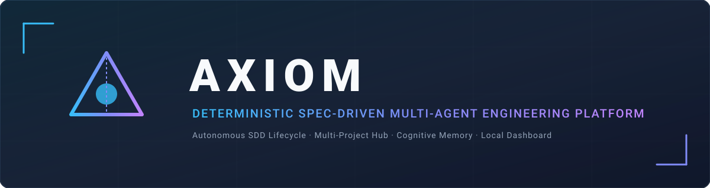
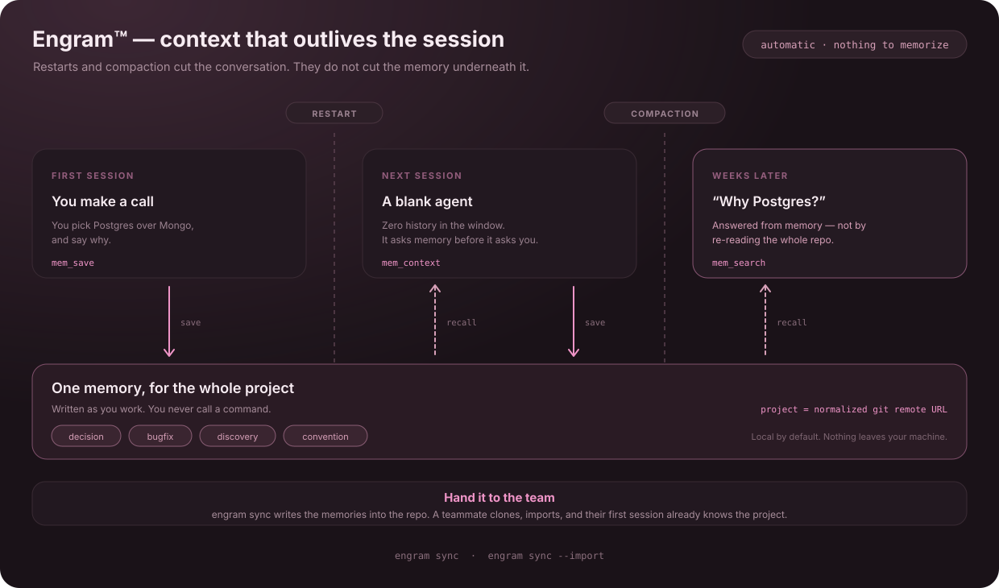
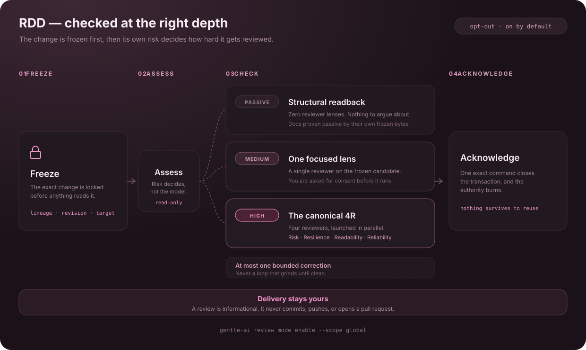
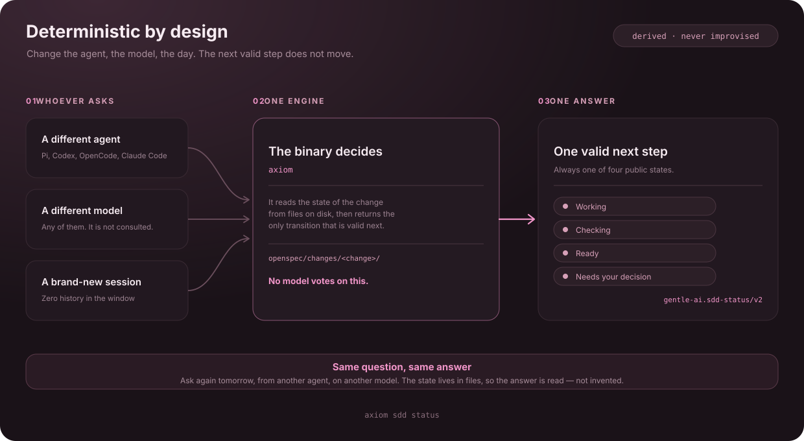
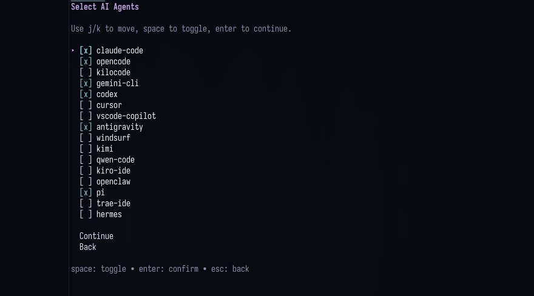

<!-- markdownlint-disable-next-line MD041 -->
<a id="top"></a>

<div align="center">



<h1>Axiom</h1>

<p><strong>Plataforma Determinista de Ingeniería de Software, Orquestación Multi-Agente y Spec-Driven Development (SDD).</strong></p>

<p>


<a href="LICENSE"></a>
</p>

<p>
<a href="docs/manual-de-inicio.md"><strong>Manual de Inicio</strong></a> &bull;
<a href="docs/quickstart.md"><strong>Guía Rápida</strong></a> &bull;
<a href="docs/architecture.md"><strong>Arquitectura</strong></a> &bull;
<a href="docs/agents.md"><strong>Agentes</strong></a> &bull;
<a href="docs/intended-usage.md"><strong>Documentación</strong></a>
</p>

<br/>

<p>
Tus agentes de IA generan código, pero pierden contexto en cada sesión y carecen de un método determinista para validar lo que hacen.
<strong>Axiom les dota de memoria cognitiva acumulativa, un ciclo de vida SDD riguroso, arquitectura multi-proyecto y evidencia auditable.</strong>
</p>

<br/>

<sub><strong>COMPATIBLE CON EL AGENTE QUE YA UTILIZAS</strong></sub>

<strong><a href="docs/agents.md#pi">Pi</a></strong> ·
<strong><a href="docs/agents.md#opencode">OpenCode</a></strong> ·
<strong><a href="docs/agents.md#claude-code">Claude Code</a></strong> ·
<strong><a href="docs/agents.md#codex">Codex</a></strong> ·
<strong><a href="docs/agents.md#cursor">Cursor</a></strong> ·
<strong><a href="docs/agents.md#vs-code-copilot">VS Code Copilot</a></strong> ·
<strong><a href="docs/agents.md#gemini-cli">Gemini CLI</a></strong> ·
<strong><a href="docs/agents.md#kilo-code">Kilo Code</a></strong><br/>
<strong><a href="docs/agents.md#kimi-code">Kimi Code</a></strong> ·
<strong><a href="docs/agents.md#kiro-ide">Kiro IDE</a></strong> ·
<strong><a href="docs/agents.md#qwen-code">Qwen Code</a></strong> ·
<strong><a href="docs/agents.md#hermes">Hermes</a></strong> ·
<strong><a href="docs/agents.md#antigravity">Antigravity</a></strong> ·
<strong><a href="docs/agents.md#windsurf">Windsurf</a></strong> ·
<strong><a href="docs/agents.md#openclaw">OpenClaw</a></strong> ·
<strong><a href="docs/agents.md#trae">Trae</a></strong>

<sub>16 integraciones · configuración no-intrusiva · <a href="docs/agents.md">comparar capacidades →</a></sub>

</div>

---

## Características y Capacidades

---

### Engram™ — Keep your project context



The cost of a fresh session is not the tokens — it is you, re-explaining the same decisions every morning. Engram removes that: your agent writes down what it learns as it goes and reaches for it before it reaches for you, so context accumulates instead of resetting.

**[Docs →](docs/engram.md)**

---

### SDD — Give each change a clear path


When you explicitly choose Spec-Driven Development, proposal, specification, design, and task artifacts make the plan reviewable before implementation. File-backed storage keeps them on disk; Engram-backed storage keeps them in memory. Apply follows the configured TDD mode. Research and Verify are optional: Verify can diagnose partial work and report practical findings, but it is not an archive gate. Archive records the actual state and history, including unfinished work when you explicitly archive it; it does not ship or approve the change, and SDD does not invoke RDD. TDD is also available in ODD; it does not require an SDD phase.

**[Docs →](docs/intended-usage.md)**

---

### RDD — Check finished work at the right depth



Receipt-Driven Development (RDD) is opt-in and stays off until you enable it. Its point is that a review cannot drift: the candidate is frozen before anything reads it, so the evidence belongs to the exact version you are about to rely on — not to whatever the worktree looked like a moment later. The depth comes from that frozen candidate rather than from the model's judgment, and the result is informational. Commit, push and release stay your call.

**[Docs →](docs/review-integration.md)**

---

### Deterministic by design — Know the next valid step



Si el modelo tiene que adivinar el siguiente paso, mañana puede proponer uno distinto, y otro diferente a tu compañero. Esa es la diferencia entre un flujo determinista y una sugerencia. El ejecutable **`axiom`** resuelve las transiciones nativas de SDD y RDD leyendo el estado persistido, no el contexto efímero de una conversación; así, el siguiente paso válido no depende de quién pregunte ni de cuándo.

**[Docs →](docs/trigger-rules.md)**

---

### Interfaz de Axiom — Operación local del proyecto

**Axiom incluye interfaces locales para trabajar con el proyecto.** `axiom tui` abre la interfaz de terminal; `axiom ui` inicia el panel web local. Ambas forman parte del producto Axiom y no requieren instalar un tema visual.

**[Docs →](docs/pi.md)**

---

### 16 agents — Keep the agent you already use



Axiom lleva sus flujos a Pi, OpenCode, Claude Code, Codex y otras integraciones. Cada adaptador usa las capacidades nativas del agente, por lo que funciones como la delegación y la revisión RDD pueden variar.

**[Docs →](docs/agents.md)**

---

### Also in the box

| Componente | Función |
| :--- | :--- |
| **Biblioteca de skills** | Carga las skills cuando coinciden con la tarea |
| **Context7 MCP** | Documentación actualizada y opcional de frameworks y bibliotecas |
| **CodeGraph** | Grafo de símbolos de solo lectura del código |
| **Lista de denegación de seguridad** | Bloquea el acceso a `~/.ssh`, `.env` y ficheros de credenciales |
| **Copias de configuración** | Crea respaldos antes de escribir |
| **Diagnóstico** | `axiom doctor` — comprobación de solo lectura |
| **Personas** | Persona opcional de mentor o neutral, si se selecciona |
| **Temas visuales** | Axiom no instala ni sincroniza temas visuales |
| **Asignación de modelos por fase** | Permite asignar modelos por fase en Pi y OpenCode |

> **Every component, skill and preset: [Full breakdown →](docs/components.md)**

<div align="right"><a href="#top">Back to top</a></div>

<div align="center"></div>

## Get started

```bash
git clone https://github.com/IGutierrezZ/axiom.git
cd axiom
go install ./cmd/axiom
```

```bash
axiom              # abre la TUI en una terminal interactiva
axiom doctor       # diagnóstico de solo lectura
```

Después, usa el agente con normalidad. Axiom crea respaldos antes de modificar ficheros de configuración; algunas integraciones también pueden aprovisionar runtimes si se selecciona esa acción. Axiom ya no instala ni sincroniza temas visuales.

> **Beta channel, signature verification and per-distro prerequisites: [Quickstart →](docs/quickstart.md)**

<div align="right"><a href="#top">Back to top</a></div>

<div align="center"></div>

## Documentation

| Where to go | What you'll find |
| :--- | :--- |
| **[Intended Usage](docs/intended-usage.md)** | The mental model. If you read one page, read this one. |
| **[Inicio rápido](docs/quickstart.md)** | Instalación desde el repositorio, configuración inicial, sincronización y diagnóstico. |
| **[Uso y comandos](docs/usage.md)** | Guía de comandos y flujos operativos del CLI de Axiom; las opciones heredadas se identifican como tales. |
| **[Agents](docs/agents.md)** | Feature matrix and per-agent notes for all 16 |
| **[Routing](docs/trigger-rules.md)** | How the agent picks direct, delegated or SDD |
| **[Review](docs/review-integration.md)** · **[Architecture](docs/architecture/organic-rdd.md)** | The RDD contract, lifecycle and threat model |
| **[Engram](docs/engram.md)** · **[Components](docs/components.md)** | Memory commands, skills, presets and personas |
| **[Contributing](CONTRIBUTING.md)** · **[Codebase Guide](docs/CODEBASE-GUIDE.md)** | Extend or contribute |
| **[Telemetry](docs/telemetry.md)** | What we count, and how to turn it off |

<div align="right"><a href="#top">Back to top</a></div>

<div align="center"></div>

## Community

Las incidencias de Axiom etiquetadas como [`up-for-grabs`](https://github.com/IGutierrezZ/axiom/issues?q=is%3Aissue+is%3Aopen+label%3Aup-for-grabs) están disponibles para colaborar.

<div align="center">

<a href="docs/community-roadmap.md"></a>
<a href="CONTRIBUTING.md"></a>
<a href="CONTRIBUTORS.md"></a>

<br/><br/>

<a href="CONTRIBUTORS.md">
  
</a>

<p><sub>This project exists because of these people.</sub></p>

</div>

<div align="right"><a href="#top">Back to top</a></div>

---

## Origen y Evolución

**Axiom** es una plataforma independiente de ingeniería aumentada que evolucionó a partir de una bifurcación de *Gentle AI*. Conserva atribución e identificadores heredados cuando son necesarios para la compatibilidad, y desarrolla por separado su producto, su CLI y su gobernanza multi-rol y multi-repositorio.

<div align="center">

<br/>

<h3>Axiom: Deterministic Multi-Agent Engineering</h3>

<br/>

<a href="LICENSE"></a>

</div>

> **Nota de marca y atribución:** Axiom respeta los derechos y marcas originales de sus componentes base (Gentle AI™, Engram™). El código se distribuye bajo licencia de código abierto MIT. Véase [LICENSE](LICENSE).
