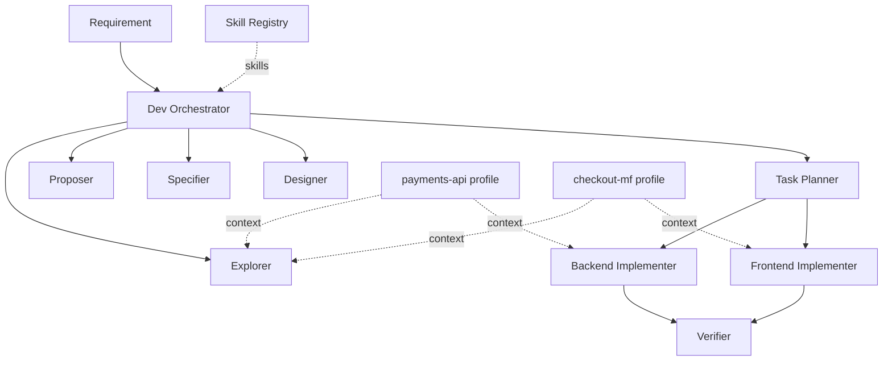
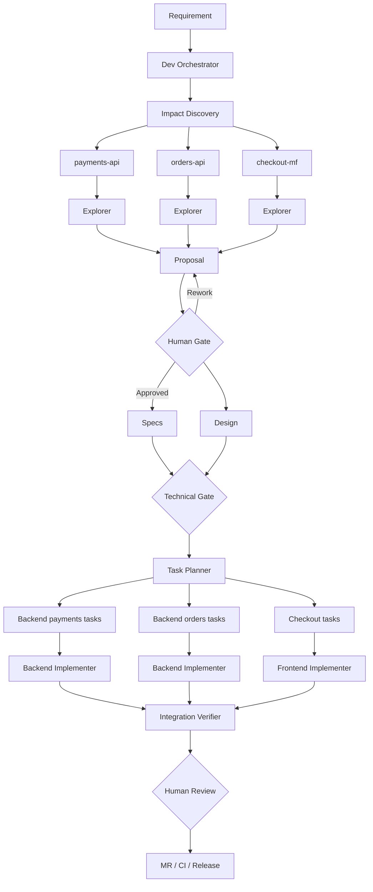
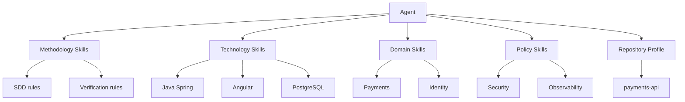
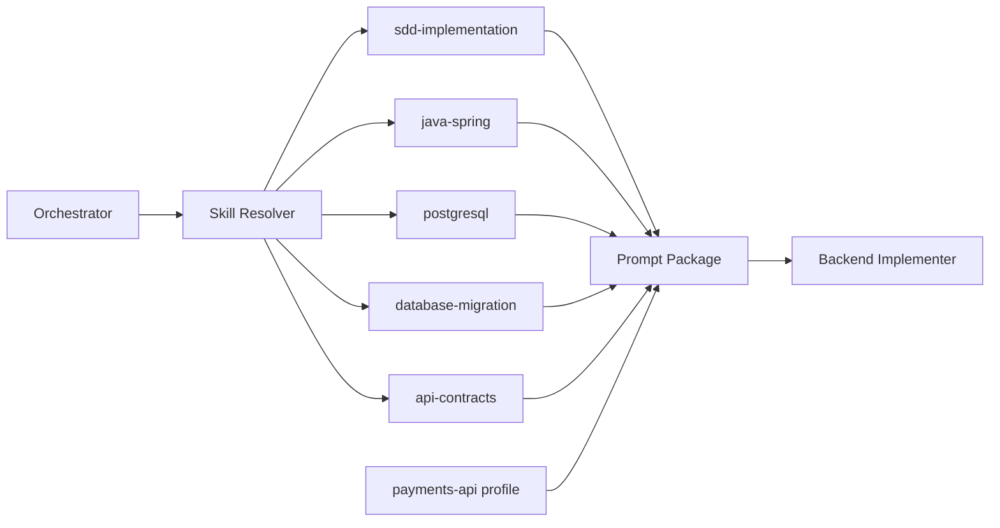
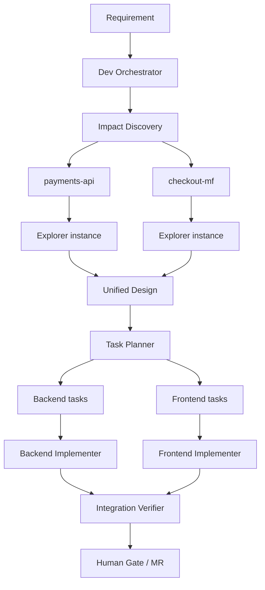
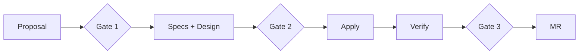
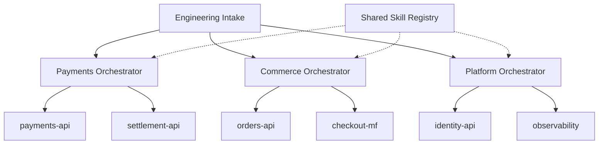
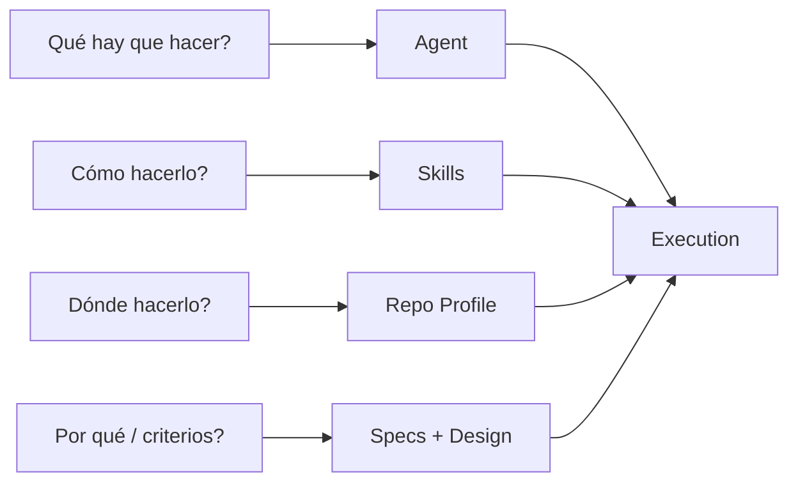

# Arquitectura Multiagente para Desarrollo SDD

> **Estado:** Propuesta de arquitectura v0.1
> 
> 
> **Objetivo:** Definir cómo escalar SDD a múltiples microservicios, microfrontends y repositorios sin crear una explosión de agentes y orquestadores difíciles de mantener.
> 

---

## 1. Decisión arquitectónica principal

### No hacer esto

```
payments-api
├── payments-orchestrator
├── payments-explorer
├── payments-designer
├── payments-implementer
└── payments-verifier

orders-api
├── orders-orchestrator
├── orders-explorer
├── orders-designer
├── orders-implementer
└── orders-verifier

users-api
├── users-orchestrator
├── users-explorer
├── users-designer
├── users-implementer
└── users-verifier
```

Con 20 repositorios terminaríamos fácilmente con:

```
20 repos
×
6 agentes
=
120 definiciones de agentes
```

La mayoría contendrían instrucciones casi idénticas.

Eso genera:

- duplicación;
- divergencia de reglas;
- mantenimiento costoso;
- agentes desactualizados;
- dificultad para cambiar la metodología;
- contextos enormes;
- problemas en cambios que afectan varios repositorios.

---

# 2. Modelo recomendado

La arquitectura debería separar tres conceptos:

```
ORQUESTACIÓN
      +
CAPACIDADES / SKILLS
      +
CONTEXTO DEL REPOSITORIO
```

Es decir:



La idea central:

> **El agente representa una capacidad reutilizable. El repositorio representa contexto.**
> 

Por ejemplo:

```
backend-implementer
        +
java-spring skill
        +
payments-api profile
        +
SPEC-032
        +
TASK-017
        =
Implementer especializado temporalmente
en payments-api
```

No necesitamos crear permanentemente un `payments-implementer`.

---

# 3. ¿Por qué es mejor?

## Agente por repositorio

### Ventajas

Un agente específico puede conocer profundamente un repositorio y requerir menos descubrimiento inicial.

### Problemas

Duplica metodología, reglas y prompts.

Si mañana modificamos la política:

> “Toda migración DB necesita rollback.”
> 

tendríamos que modificar:

```
payments-agent
orders-agent
users-agent
inventory-agent
...
```

Y probablemente alguno quede desactualizado.

---

## Agente reutilizable + contexto por repositorio

La metodología vive una sola vez:

```
backend-implementer
```

y recibe:

```
payments-api profile
```

o:

```
orders-api profile
```

según corresponda.

Entonces modificar una regla global modifica el comportamiento de todos.

Esto además coincide con el principio de Skills que ya tienen documentado: las skills buscan cargar **contexto preciso bajo demanda**, en lugar de mantener un gran prompt permanente.

---

# 4. Arquitectura propuesta completa



Observa algo importante:

Tenemos:

```
1 definición de Backend Implementer
```

pero pueden existir:

```
Backend Implementer instance #1
Backend Implementer instance #2
Backend Implementer instance #3
```

en paralelo.

**Instancias múltiples ≠ agentes distintos.**

---

# 5. Orquestador

Yo empezaría con:

```
dev-orchestrator
```

No con:

```
payments-orchestrator
orders-orchestrator
users-orchestrator
checkout-orchestrator
```

El `dev-orchestrator` debe conocer **el proceso**, no necesariamente cada detalle técnico.

Su responsabilidad es:

```
Requirement
     ↓
¿qué necesitamos hacer?
     ↓
¿qué repositorios afecta?
     ↓
¿qué agentes necesito?
     ↓
¿qué Skills necesitan?
     ↓
¿qué contexto reciben?
     ↓
¿qué dependencias existen?
     ↓
¿qué Gate corresponde?
```

Esto mantiene la misma filosofía del orquestador existente: coordinar y enrutar responsabilidades especializadas.

---

# 6. Responsabilidades exactas del Dev Orchestrator

El Orchestrator **NO debería**:

```
escribir código
crear migrations
editar componentes
implementar endpoints
resolver bugs directamente
hacer self-review
```

Debe:

```
clasificar request
identificar alcance
identificar repositorios
crear DAG
seleccionar agentes
resolver Skills
preparar context packages
controlar estados
controlar Human Gates
detectar bloqueos
coordinar cambios multi-repo
consolidar resultados
```

---

# 7. Agentes iniciales

No empezaría con 30 agentes.

Empezaría con:

| Agente | Responsabilidad |
| --- | --- |
| `dev-explorer` | Descubrimiento y análisis |
| `dev-proposer` | Propuesta y alternativas |
| `dev-specifier` | Criterios funcionales verificables |
| `dev-designer` | Diseño técnico |
| `dev-task-planner` | Descomposición en tareas |
| `backend-implementer` | Implementación backend |
| `frontend-implementer` | Implementación frontend |
| `dev-verifier` | Verificación independiente |

Esto mantiene directamente la lógica SDD: primero explorar/proponer/especificar/diseñar/planificar; recién posteriormente implementar; y finalmente verificar contra los artefactos aprobados.

Después agregaría agentes únicamente cuando haya evidencia de necesidad:

```
database-specialist
security-reviewer
api-contract-reviewer
integration-verifier
performance-reviewer
```

No todos deberían ejecutarse siempre.

---

# 8. Entonces, ¿qué es una Skill?

Esta distinción será fundamental.

```
AGENT
=
QUIÉN ejecuta una responsabilidad

SKILL
=
CÓMO debe ejecutar una capacidad

REPO PROFILE
=
DÓNDE está trabajando y cuáles son
las reglas particulares de ese repo
```

Ejemplo:

```
AGENT
backend-implementer

SKILLS
├── java-spring
├── postgres-migrations
├── api-contracts
└── secure-backend

CONTEXT
└── payments-api

TASK
└── TASK-039
```

---

# 9. Arquitectura de Skills

Yo manejaría cinco capas.



---

# 10. Capa 1 — Skills metodológicas

Son compartidas por toda la empresa.

Por ejemplo:

```
sdd-exploration
sdd-specification
sdd-design
sdd-task-planning
sdd-implementation
sdd-verification
```

Pero cuidado:

No significa necesariamente que sustituyan al agente.

El agente puede tener:

```
role = dev-explorer
```

y recibir la Skill:

```
sdd-exploration
```

---

# 11. Skill `sdd-exploration`

Debe contener exactamente las reglas de exploración.

### Objetivo

Entender el sistema actual **sin modificarlo**.

### Instrucciones

```
READ ONLY.

Analizar:
- estructura
- arquitectura
- módulos
- dependencias
- tests
- documentación
- implementaciones similares
- contratos
- base de datos
- eventos
- integraciones
- riesgos

NO:
- implementar
- editar
- decidir arquitectura
- asumir información faltante
```

### Output contract

```
exploration:
  repositories:
  impacted_modules:
  current_behavior:
  dependencies:
  similar_implementations:
  contracts:
  tests:
  risks:
  unknowns:
  contradictions:
```

---

# 12. Skill `sdd-specification`

Responsabilidad:

> **Qué debe suceder.**
> 

No:

> Cómo implementarlo.
> 

Debe incluir:

```
Given
When
Then
```

y además:

```
functional requirements
business rules
edge cases
error scenarios
non-functional constraints
traceability
```

Ejemplo:

```
SPEC-PAY-001

Given:
  un pago aprobado

When:
  payment-service confirma settlement

Then:
  checkout debe mostrar status PAID
```

---

# 13. Skill `sdd-design`

Responsabilidad:

> Cómo construiremos técnicamente lo especificado.
> 

Debe analizar:

```
arquitectura
componentes
contratos
eventos
datos
persistencia
transacciones
errores
seguridad
observabilidad
migraciones
compatibilidad
rollback
```

Output:

```
technical_design:
  architecture:
  repositories:
  components:
  contracts:
  database:
  transactions:
  failure_modes:
  security:
  observability:
  rollout:
  rollback:
```

---

# 14. Skill `sdd-task-planning`

Transforma:

```
Specs
+
Design
```

en trabajo ejecutable.

Cada tarea:

```
id: TASK-PAY-004

repository: payments-api

depends_on:
  - TASK-PAY-003

goal:
  "Expose settlement status"

expected_files:
  - src/...

acceptance_criteria:
  - SPEC-PAY-001

verification:
  - unit tests
  - integration tests
```

Tareas pequeñas.

No:

```
TASK-1: implementar pagos
```

Sí:

```
TASK-1: agregar modelo
TASK-2: persistir status
TASK-3: extender endpoint
TASK-4: agregar tests
```

---

# 15. Skill `sdd-implementation`

Regla fundamental:

```
Implement only approved Tasks
against approved Specs + Design.
```

El Implementer recibe:

```
Task
Specs relacionadas
Design relevante
Repo Profile
Skills necesarias
```

No recibe necesariamente todo el historial.

El patrón SDD original insiste precisamente en que el Implementer comienza con contexto limpio y trabaja contra Tasks + Specs + Design, en lugar de improvisar desde la conversación previa.

---

# 16. Skill `sdd-verification`

Muy importante:

**Verify no debería heredar todo el razonamiento de Apply.**

Debe recibir:

```
Specs
Design
Tasks
Diff
Build results
Test results
```

Y comprobar:

```
SPEC-001 PASS
SPEC-002 PASS
SPEC-003 FAIL
```

No:

```
"se ve bien"
```

---

# 17. Capa 2 — Skills tecnológicas

Aquí están las capacidades reutilizables.

Por ejemplo:

```
backend/
├── java-spring
├── dotnet
├── node-nest
└── golang

frontend/
├── angular
├── react
└── vue

database/
├── postgresql
├── mysql
└── redis

integration/
├── rest-api
├── kafka
└── rabbitmq
```

---

# 18. Ejemplo Skill `java-spring`

Debe contener reglas como:

```
architecture patterns
dependency injection
transaction boundaries
DTO conventions
exception handling
validation
logging
testing
Spring Security
JPA usage
performance cautions
build commands
```

Pero **no debe contener conocimiento de `payments-api`**.

---

# 19. Skill `postgresql`

Contendría:

```
migration conventions
indexes
transactions
locking
schema evolution
rollback
query safety
performance
backward compatibility
```

Así:

```
payments-api
+
postgresql

orders-api
+
postgresql
```

reutilizan la misma Skill.

---

# 20. Capa 3 — Domain Skills

Aquí sí puede existir conocimiento corporativo específico.

Ejemplos hipotéticos:

```
payments-domain
identity-domain
inventory-domain
orders-domain
```

Una Skill `payments-domain` puede contener:

```
payment states
allowed transitions
idempotency requirements
settlement terminology
refund invariants
business constraints
```

Pero no contiene:

```
/src/main/java/com/...
```

Eso pertenece al Repo Profile.

# 21. Capa 4 — Policy Skills

Compartidas entre todos.

Por ejemplo:

```
company-secure-coding
company-observability
company-api-standards
company-database-policy
company-testing-standards
company-git-policy
company-error-handling
```

Una regla modificada aquí afecta a todos.

---

# 22. Capa 5 — Repository Profile

Aquí está la respuesta más importante a:

> ¿Necesitamos Skills por repositorio?
> 

### Mi recomendación

**No hacer inicialmente una Skill completa por repositorio.**

Crear un:

```
Repository Profile
```

por repositorio.

Ejemplo:

```
payments-api/
└── .agent/
    └── repo-profile.yaml
```

---

# 23. Contenido exacto del Repository Profile

Yo usaría algo parecido a:

```
repository:
  id: payments-api
  type: backend
  domain: payments

ownership:
  squad: payments

technology:
  language: java
  runtime: java-21
  framework: spring-boot
  database: postgresql

architecture:
  style: layered
  layers:
    - controller
    - application
    - domain
    - infrastructure

commands:
  install: "./gradlew dependencies"
  build: "./gradlew build"
  test: "./gradlew test"
  integration_test: "./gradlew integrationTest"

directories:
  source: src/main
  tests: src/test
  migrations: src/main/resources/db/migration

constraints:
  - "Never modify an existing migration"
  - "Public APIs must remain backward compatible"
  - "New DB fields must support rolling deployment"

contracts:
  provides:
    - payments-rest-api
  consumes:
    - customer-api
  events:
    - payment-approved
    - payment-rejected

testing:
  unit_required: true
  integration_required: true

observability:
  logging: structured
  metrics_required: true

documentation:
  architecture:
    - "..."
  api:
    - "..."

memory:
  engram_project: payments-api
```

---

# 24. ¿Qué NO debe ir en Repo Profile?

No poner:

```
passwords
API keys
DB credentials
production secrets
tokens
AWS secrets
```

Solo:

```
nombres
convenciones
referencias
rutas
comandos
arquitectura
```

---

# 25. Cuándo SÍ crear una Skill específica del repositorio

Puede ocurrir.

Yo usaría esta regla:

> **Si el conocimiento describe QUÉ ES el repo → Profile.**
> 
> 
> **Si describe CÓMO ejecutar una capacidad especial del repo → Skill.**
> 

Ejemplo.

### Profile

```
payments-api utiliza Java 21
usa PostgreSQL
las migrations están en X
consume customer-api
```

### Skill específica

```
payments-reconciliation
```

porque reconciliar pagos podría involucrar una secuencia propietaria muy particular.

Entonces sí:

```
skills/
└── payments-reconciliation/
    └── SKILL.md
```

---

# 26. Regla 80/20

Una buena regla práctica:

Si una Skill específica de repo es:

```
80% idéntica
20% diferente
```

a otra Skill global:

**no crearla.**

Usar:

```
Shared Skill
+
Repo Profile
```

Si es:

```
80% comportamiento exclusivo
```

entonces sí considerar Skill propia.

---

# 27. Skill Registry

Yo mantendría un registro central.

Eso también está alineado con el diseño que ya tienes: vuestro Skill Registry está pensado para que **el delegador resuelva reglas compactas y las inyecte al prompt del subagente; el subagente no necesita recorrer todo el registry por sí mismo**.

Ejemplo:

```
skills:

  java-spring:
    triggers:
      - language: java
      - framework: spring

  angular:
    triggers:
      - framework: angular

  postgresql:
    triggers:
      - database: postgresql

  api-contracts:
    triggers:
      - modifies_api: true

  db-migration:
    triggers:
      - modifies_database: true

  security-review:
    triggers:
      - modifies_auth: true
      - modifies_permissions: true
```

---

# 28. Resolución automática de Skills

El Orchestrator podría hacer:

```
Task:
"Agregar status de settlement"

Repo:
payments-api

Profile:
Java
Spring
PostgreSQL

Impact:
API + database
```

Resolver:

```
sdd-implementation
java-spring
postgresql
database-migrations
api-contracts
company-secure-coding
```

Y luego:



El principio de cargar únicamente las Skills necesarias también coincide con la documentación que ya tienen sobre “contexto preciso bajo demanda”.

---

# 29. Context Package

Este concepto puede ser crucial.

Antes de lanzar un agente, el Orchestrator construye:

```
context_package:

  phase:
    apply

  change:
    CHG-2026-042

  repository:
    payments-api

  task:
    TASK-PAY-017

  artifacts:
    specs:
      - SPEC-PAY-003
    design:
      - DESIGN-PAY-002

  skills:
    - sdd-implementation
    - java-spring
    - postgresql
    - api-contracts

  repo_profile:
    payments-api

  constraints:
    - no architecture changes
    - no unrelated refactors
```

Ese paquete se entrega al subagente.

---

# 30. Cambio multi-repositorio

Supongamos:

> “Cuando un pago sea confirmado, checkout debe mostrar el nuevo estado.”
> 

Impacto:

```
payments-api
+
checkout-mf
```

No necesitamos dos orquestadores.

Tenemos:



---

# 31. Artefacto especial: Impact Map

Para desarrollo multi-repo agregaríamos:

```
impact-map.md
```

Ejemplo:

```
change: CHG-042

repositories:

  payments-api:
    impact: high
    changes:
      - endpoint
      - database
    produces:
      - payment-status

  checkout-mf:
    impact: medium
    changes:
      - UI
      - API client
    consumes:
      - payment-status

dependencies:
  - payments-api before checkout-mf integration

risk:
  - backward compatibility
```

---

# 32. Artefactos SDD empresariales

Yo establecería:

```
intake.md
exploration.md
impact-map.md
proposal.md
specs.md
design.md
tasks.md
apply-report.md
verify-report.md
decision-log.md
```

Para multi-repo:

```
repo-plan-payments-api.md
repo-plan-checkout-mf.md
integration-plan.md
```

---

# 33. Traceability

Cada cambio debe poder seguirse:

```
REQ-042
   ↓
SPEC-042-01
   ↓
DESIGN-042
   ↓
TASK-PAY-01
   ↓
payments-api commit
   ↓
MR-938
   ↓
VERIFY-042
```

El beneficio del SDD original es precisamente esa relación entre especificación, implementación y verificación.

---

# 34. Human Gates

Yo pondría tres inicialmente.



### Gate 1 — Scope

Validar:

```
problema
alcance
repos afectados
riesgo
alternativa
```

### Gate 2 — Technical

Validar:

```
specs
arquitectura
contratos
DB
seguridad
rollout
```

### Gate 3 — Evidence

Validar:

```
diff
tests
build
verify report
riesgo residual
```

---

# 35. Estado del Orchestrator

```
INTAKE
   ↓
EXPLORE
   ↓
PROPOSAL
   ↓
GATE_SCOPE
   ↓
SPECS + DESIGN
   ↓
GATE_TECH
   ↓
TASKS
   ↓
APPLY
   ↓
VERIFY
   ↓
GATE_FINAL
   ↓
MR
```

Estados transversales:

```
DRAFT
IN_PROGRESS
BLOCKED
REVIEW
APPROVED
REWORK
DONE
```

---

# 36. Qué ocurre si Apply encuentra algo inesperado

Esto es importante.

No:

```
Implementer descubre problema
        ↓
improvisa arquitectura nueva
```

Debe ser:

```
Implementer descubre problema
        ↓
STOP
        ↓
Orchestrator
        ↓
Design
        ↓
actualizar artefacto
        ↓
Human Gate
        ↓
nuevo Task
```

Así preservamos SDD.

---

# 37. Estructura técnica propuesta

Podría quedar:

```
gentle-ai/
│
├── agents/
│   ├── dev-orchestrator.md
│   ├── dev-explorer.md
│   ├── dev-proposer.md
│   ├── dev-specifier.md
│   ├── dev-designer.md
│   ├── dev-task-planner.md
│   ├── backend-implementer.md
│   ├── frontend-implementer.md
│   └── dev-verifier.md
│
├── skills/
│   ├── methodology/
│   │   ├── sdd-exploration/
│   │   ├── sdd-specification/
│   │   ├── sdd-design/
│   │   ├── sdd-task-planning/
│   │   ├── sdd-implementation/
│   │   └── sdd-verification/
│   │
│   ├── backend/
│   │   ├── java-spring/
│   │   └── node/
│   │
│   ├── frontend/
│   │   ├── angular/
│   │   └── react/
│   │
│   ├── database/
│   │   └── postgresql/
│   │
│   ├── domain/
│   │   ├── payments/
│   │   └── identity/
│   │
│   └── policies/
│       ├── secure-coding/
│       ├── api-standards/
│       └── observability/
│
└── registry/
    ├── skill-registry.md
    └── repo-registry.yaml
```

Mientras cada repositorio posee:

```
payments-api/
│
├── .agent/
│   └── repo-profile.yaml
│
├── AGENTS.md
├── src/
└── ...
```

---

# 38. Registry de repositorios

También crearía un registro central:

```
repositories:

  payments-api:
    type: backend
    domain: payments
    stack:
      - java
      - spring
      - postgresql
    profile:
      payments-api/.agent/repo-profile.yaml

  checkout-mf:
    type: microfrontend
    domain: checkout
    stack:
      - typescript
      - angular
    profile:
      checkout-mf/.agent/repo-profile.yaml
```

---

# 39. ¿Un Engram Project por repo?

Para esta arquitectura, mi propuesta sería inicialmente:

```
payments-api       → Engram project payments-api
orders-api         → Engram project orders-api
checkout-mf        → Engram project checkout-mf
```

Eso mantiene memoria alineada con fronteras técnicas estables.

Para conocimiento transversal podríamos tener:

```
engineering-architecture
```

o memoria asociada al cambio.

Pero evitaría:

```
engram-global-toda-la-empresa
```

con todo mezclado.

Eso sería una **adaptación nuestra**, no una exigencia del SDD base.

---

# 40. ¿Cuándo crear otro Orchestrator?

No por cantidad de repositorios automáticamente.

Consideraría separar cuando aparezcan fronteras organizacionales reales.

Por ejemplo:

```
Engineering
│
├── Payments Domain Orchestrator
│
├── Commerce Domain Orchestrator
└── Platform Domain Orchestrator
```

Solo cuando cada dominio tenga:

```
muchos repos
equipo independiente
políticas distintas
arquitectura distinta
volumen alto de cambios
límites de seguridad
```

No:

```
1 microservicio
=
1 orchestrator
```

---

# 41. Arquitectura futura escalada



Pero **no empezaría aquí**.

Primero:

```
1 Dev Orchestrator
```

y medir.

---

# 42. Reglas arquitectónicas que propondría

> **R1.** Los Agents representan responsabilidades, no repositorios.
> 

> **R2.** Las Skills representan capacidades reutilizables.
> 

> **R3.** Los Repository Profiles representan conocimiento específico del repositorio.
> 

> **R4.** El Orchestrator selecciona Agent + Skills + Context.
> 

> **R5.** Ningún Agent recibe todo el contexto por defecto.
> 

> **R6.** Los cambios multi-repo son coordinados por un único DAG.
> 

> **R7.** Un Implementer trabaja sobre Tasks aprobadas, no sobre prompts vagos.
> 

> **R8.** Verify es independiente de Apply.
> 

> **R9.** Las reglas corporativas viven centralizadas, no duplicadas por repo.
> 

> **R10.** Solo se crea una Skill específica de repo cuando existe comportamiento verdaderamente exclusivo.
> 

---

# 43. La fórmula completa

La arquitectura se puede explicar con una ecuación sencilla:

```
EXECUTION CONTEXT
=
Agent Role
+
Phase Artifact
+
Technology Skills
+
Domain Skills
+
Corporate Policies
+
Repository Profile
+
Relevant Memory
```

Ejemplo:

```
Backend Implementer
+
TASK-PAY-021
+
Java Spring
+
PostgreSQL
+
Payments Domain
+
Secure Coding
+
payments-api profile
+
relevant Engram context
```

Eso genera un agente **muy especializado para esa tarea** sin tener que mantener un agente permanente llamado:

```
payments-api-agent
```

---

# 44. Flujo mental para explicarlo al equipo



En una frase:

> **Agent = quién. Skill = cómo. Repository Profile = dónde. Specs = qué debe cumplir. Orchestrator = quién decide la combinación.**
> 

---

# 45. MVP que yo implementaría

No intentaría construir todo de una vez.

### Fase 1

```
dev-orchestrator
dev-explorer
dev-specifier
dev-designer
dev-task-planner
backend-implementer
frontend-implementer
dev-verifier
```

### Skills iniciales

```
sdd-core
java-spring
angular/react según corresponda
postgresql
api-contracts
company-testing
company-secure-coding
```

### Repository Profiles

Empezaría con:

```
1 backend
1 microfront
```

preferentemente dos repos que participen en el mismo requerimiento.

---

# 46. Primera prueba que realmente validaría la arquitectura

No elegiría un CRUD aislado.

Elegiría algo así:

```
Requirement
     ↓
backend A
     +
microfront B
```

Eso obliga al sistema a probar:

```
impact discovery
multi-repo exploration
contract design
parallel tasks
backend implementer
frontend implementer
integration verification
```

Si eso funciona, habrás demostrado la parte interesante del sistema multiagente.

---

## Decisión final

La arquitectura que recomendaría adoptar como base es:

```
                         DEV ORCHESTRATOR
                                │
                     Skill + Context Resolver
                                │
        ┌───────────────────────┼───────────────────────┐
        │                       │                       │
     Explorer                Designer               Planner
        │                       │                       │
        └───────────────────────┼───────────────────────┘
                                │
                   ┌────────────┴────────────┐
                   ▼                         ▼
          Backend Implementer        Frontend Implementer
                   │                         │
                   └────────────┬────────────┘
                                ▼
                             Verify
```

debajo:

```
SHARED SKILLS
├── methodology
├── backend
├── frontend
├── database
├── domain
└── corporate policies
```

y finalmente:

```
REPOSITORY CONTEXT
├── payments-api/profile
├── orders-api/profile
├── checkout-mf/profile
└── ...
```

**No haría agentes por repo.
No haría orquestadores por microservicio.
Sí haría un Profile por repo.
Sí haría Skills compartidas por tecnología/capacidad/dominio.
Solo haría Skills específicas de repo cuando exista conocimiento procedimental realmente único.**

Este diseño mantiene exactamente la ventaja que busca el patrón de Skills que ya tienen: resolver e inyectar únicamente el contexto necesario en cada delegación, en lugar de contaminar cada agente con todo el conocimiento disponible.