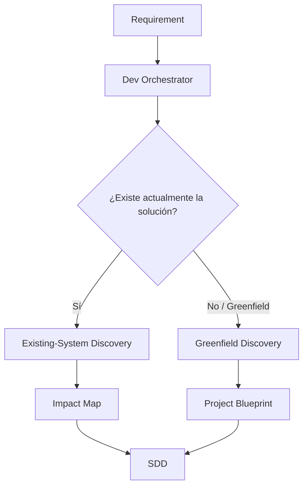
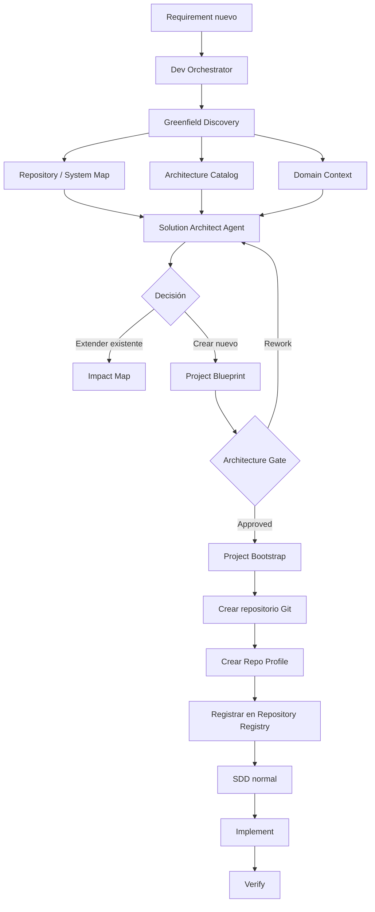
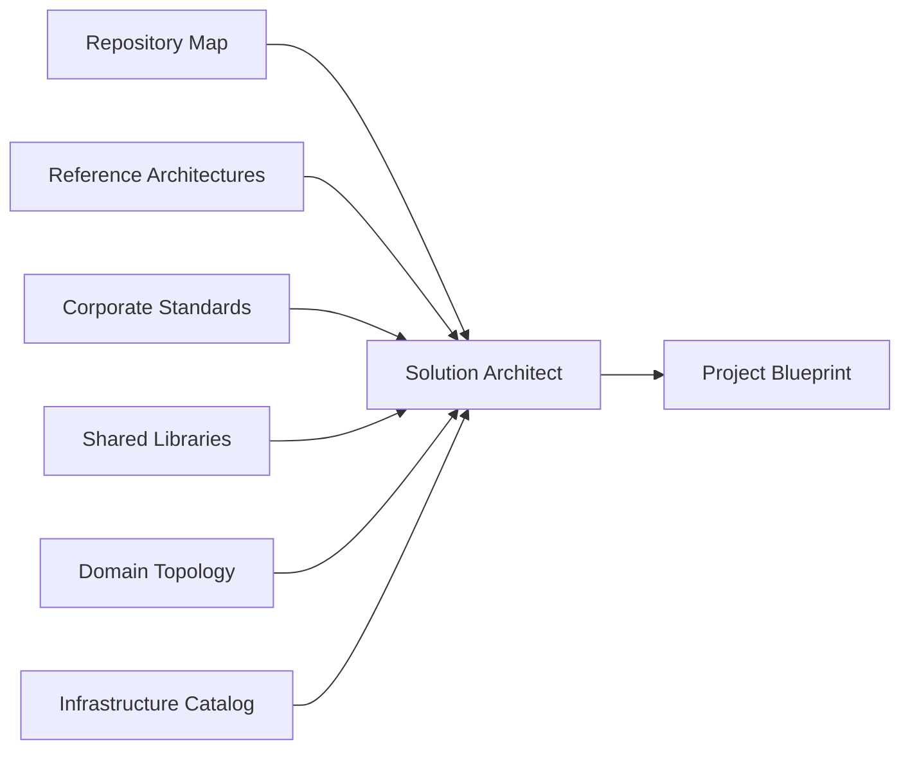
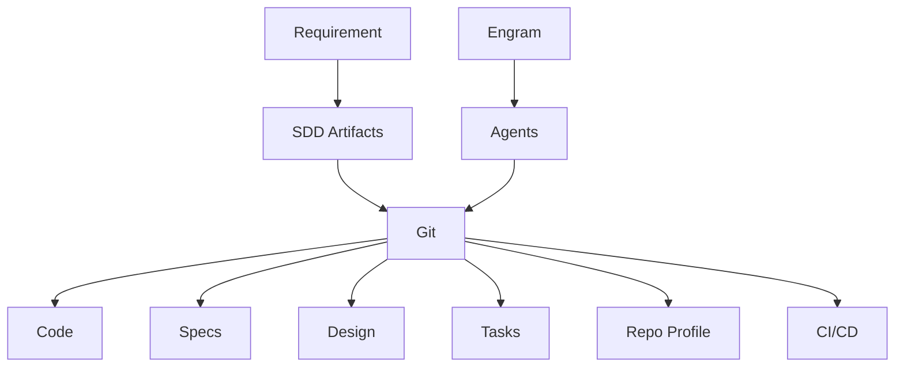
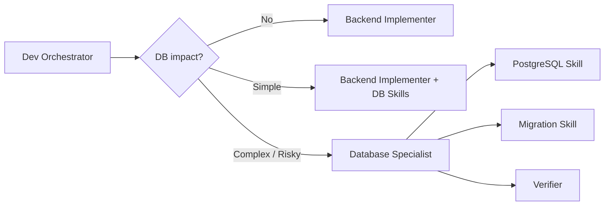
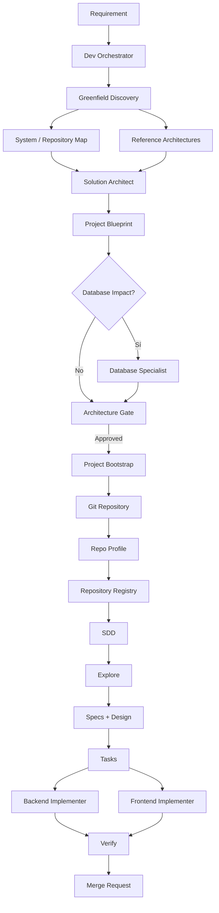

# Arquitectura multiagente — Proyectos existentes y proyectos nuevos

## 1. Tenemos dos tipos diferentes de Discovery

Hasta ahora veníamos hablando principalmente de:

```
Requirement
    ↓
Impact Discovery
    ↓
¿Qué repos existentes toca?
```

Eso funciona muy bien cuando el producto **ya existe**.

Pero para un proyecto nuevo la pregunta cambia.

No es solamente:

> “¿Qué repositorio modifica esto?”
> 

sino:

> **“¿Dónde debería vivir esta nueva capacidad?”**
> 

Por tanto, el Discovery debería tener dos modos:



---

# 2. Existing-System Discovery

Este es el que ya habíamos diseñado.

Ejemplo:

> “El estado de pago debe visualizarse en checkout.”
> 

El Orchestrator consulta el mapa:

```
payments-api
    ↓
payment-status
    ↓
checkout-mf
```

Y determina:

```
impact:
  payments-api:
    level: high
    changes:
      - API
      - persistence

  checkout-mf:
    level: medium
    changes:
      - API client
      - UI
```

Después continúa:

```
Explore
   ↓
Proposal
   ↓
Specs + Design
   ↓
Tasks
   ↓
Apply
   ↓
Verify
```

Esto mantiene el modelo SDD que ya tienes: las fases generan artefactos revisables y las responsabilidades se delegan a agentes con contextos limpios.

---

# 3. Greenfield Discovery

Aquí aparece algo nuevo.

Supongamos que llega:

> “Necesitamos una nueva plataforma de conciliación bancaria.”
> 

No existe:

```
reconciliation-api
```

Entonces no puedes comenzar preguntando:

```
¿Qué archivos modifico?
```

Primero debes resolver:

```
¿Esto debería ser realmente un sistema nuevo?

¿Ya existe una capacidad parecida?

¿Debe extenderse un servicio existente?

¿Debe crearse un nuevo microservicio?

¿Necesita microfront?

¿Qué contratos necesita?

¿Qué datos necesita?

¿Quién es dueño de esos datos?

¿Qué infraestructura existente se reutiliza?

¿Qué arquitectura aprobada podemos utilizar?
```

Ahí es donde entra un **Greenfield/Architecture Discovery**.

---

# 4. Nuevo flujo para proyectos greenfield

Yo propondría:



Eso evita crear repositorios simplemente porque alguien dijo:

> “hagamos un microservicio”.
> 

Primero existe una **decisión arquitectónica explícita**.

---

# 5. El Orchestrator NO debería diseñar la arquitectura

Esto es importante.

No haría:

```
Requirement
     ↓
Dev Orchestrator
     ↓
"Creo que Spring + PostgreSQL + Kafka..."
```

El Orchestrator debería decidir:

```
Esta solicitud es Greenfield
        ↓
necesito Architecture Discovery
        ↓
delegar a Solution Architect
```

El agente especializado podría llamarse:

```
solution-architect
```

o:

```
greenfield-architect
```

Pero sería **uno reutilizable**, no:

```
payments-architect
orders-architect
inventory-architect
```

---

# 6. ¿Qué información usa el Solution Architect?

Aquí tu respuesta al gerente era parcialmente correcta.

Sí debe mirar el mapa completo de repositorios existentes.

Pero debería recibir además:



Porque:

```
Repositorio existente
≠
Arquitectura recomendada
```

Puede haber repositorios antiguos que nadie quiera volver a utilizar como patrón.

---

# 7. Necesitamos un mapa real del ecosistema

Aquí aparece una pieza nueva que creo que nos va a hacer falta:

# Engineering Repository Registry

Por ejemplo:

```
repositories:

  payments-api:
    type: backend
    domain: payments
    owner: payments-team

    stack:
      language: java
      framework: spring-boot
      database: postgresql

    provides:
      APIs:
        - payments-api-v2
      events:
        - payment-approved
        - payment-rejected

    consumes:
      APIs:
        - customer-api

    database:
      ownership: payments
      type: postgresql

    deployment:
      platform: aws

    dependencies:
      - customer-api
      - notification-api

  checkout-mf:
    type: microfrontend
    domain: commerce

    stack:
      framework: angular

    consumes:
      - payments-api
      - orders-api
```

El Discovery Agent puede consultar este registro en lugar de intentar analizar 80 repos completos cada vez.

---

# 8. Pero además necesitamos Architecture Catalog

Esta es la parte que agregaría después de lo que discutimos anteriormente.

Algo como:

```
architecture/
│
├── reference/
│   ├── spring-rest-service.md
│   ├── event-driven-service.md
│   ├── angular-microfrontend.md
│   └── batch-processing.md
│
├── standards/
│   ├── api-standards.md
│   ├── database-standards.md
│   ├── security-standards.md
│   ├── observability.md
│   └── deployment.md
│
└── templates/
    ├── spring-service-template
    ├── angular-mf-template
    └── worker-template
```

Entonces Greenfield no hace:

```
copiar payments-api
```

Hace:

```
Requirement
+
Domain
+
Reference Architecture
+
Corporate Standards
+
Reusable Components
+
Existing System Map
```

---

# 9. Resultado: Project Blueprint

Antes de crear Git, produciría un artefacto:

```
project-blueprint.md
```

Por ejemplo:

```
project:
  name: reconciliation-api
  type: backend-service

domain:
  banking

purpose:
  "Conciliar transacciones bancarias"

architecture:
  reference: spring-rest-service

technology:
  language: java-21
  framework: spring-boot
  database: postgresql

integrations:
  consumes:
    - payments-api
    - banking-provider

  publishes:
    - reconciliation-completed

data:
  ownership:
    - reconciliation

deployment:
  target: aws

observability:
  logs: structured
  metrics: required
  tracing: required

security:
  authentication: required

repository:
  name: reconciliation-api

skills:
  - java-spring
  - postgresql
  - api-contracts
  - secure-coding
  - observability
```

Y eso pasa por un **Architecture Gate humano** antes de crear nada.

---

# 10. Después recién creamos Git

Sí: **yo utilizaría Git como la columna vertebral del desarrollo multiagente**.

Muy importante:

```
Git
≠
Engram
```

Tendrían funciones distintas.



### Git sería la fuente de verdad para

| Información | Git |
| --- | --- |
| Código | ✅ |
| Specs | ✅ |
| Design | ✅ |
| Tasks del cambio | ✅ |
| Migrations | ✅ |
| Repo Profile | ✅ |
| Configuración versionada | ✅ |
| Historial de cambios | ✅ |

### Engram sería

```
Memoria operativa
Contexto histórico
Decisiones relevantes
Aprendizajes
Sesiones
Conocimiento recuperable
```

Engram **no debería sustituir Git**.

---

# 11. Nuevo proyecto → Git automáticamente

Podríamos llegar a algo así:

```
Architecture Gate
      ↓
Approved
      ↓
project-bootstrap agent
      ↓
crear repo
      ↓
aplicar template
      ↓
crear estructura
      ↓
crear repo-profile
      ↓
initial commit
      ↓
registrarlo en Repository Registry
```

Por ejemplo:

```
reconciliation-api/
│
├── .agent/
│   └── repo-profile.yaml
│
├── docs/
│   └── architecture/
│
├── src/
├── tests/
├── migrations/
├── Dockerfile
├── README.md
└── AGENTS.md
```

---

# 12. Skills para proyectos nuevos

No crearía una Skill:

```
reconciliation-api-skill
```

por defecto.

Crearía capacidades reutilizables:

| Skill | Propósito |
| --- | --- |
| `greenfield-discovery` | Evaluar si realmente necesitamos un proyecto nuevo |
| `solution-architecture` | Diseñar arquitectura usando patrones aprobados |
| `project-bootstrap` | Crear estructura inicial |
| `java-spring` | Reglas Spring |
| `angular` | Reglas frontend |
| `postgresql` | Uso PostgreSQL |
| `database-migrations` | Cambios de esquema |
| `api-contracts` | Contratos REST/eventos |
| `aws-deployment` | Convenciones de infraestructura |
| `secure-coding` | Seguridad |

Y después se crea el:

```
repo-profile.yaml
```

específico del nuevo proyecto.

Esto encaja especialmente bien con vuestro modelo de Skills, donde el delegador resuelve reglas concretas y las inyecta al subagente únicamente cuando hacen falta.

---

# 13. Ahora viene Base de Datos

Aquí sí creo que la pregunta que te hicieron es muy importante.

¿Necesitamos un nuevo agente?

**Sí recomendaría tener un `database-specialist`, pero como subagente especializado y condicional.**

No como otro Orchestrator.

Es decir:

```
Dev Orchestrator
      │
      ├── Backend Implementer
      ├── Frontend Implementer
      │
      └── Database Specialist
```

No:

```
Database Orchestrator
       ↓
Database agents
```

al menos inicialmente.

---

# 14. ¿Por qué Base de Datos merece especialización?

Porque un cambio aparentemente pequeño:

```
Agregar columna status
```

puede implicar:

```
migration
backward compatibility
locks
indexes
NULL/default
data migration
transactions
rollback
performance
deployment ordering
old application instances
new application instances
```

Eso tiene riesgos bastante diferentes a modificar una clase Java.

---

# 15. Database Agent + Database Skills

Haría esta separación:

```
AGENT

database-specialist
```

y las capacidades:

```
SKILLS

postgresql
database-design
database-migrations
query-performance
transaction-safety
data-migration
```

Entonces:



---

# 16. No todo cambio DB necesita el Database Specialist

Por ejemplo:

```
Agregar campo nullable sencillo
+
migration estándar
+
sin gran volumen
```

puede hacerlo:

```
backend-implementer
+
postgresql skill
+
database-migration skill
```

Pero:

```
cambio de PK
renombrar columnas
migración masiva
nuevo índice grande
particionamiento
procedimientos
cambio de relaciones
cross-database
modificación sensible en producción
```

debería disparar:

```
database-specialist
```

automáticamente.

---

# 17. Database Impact tendría que formar parte del Discovery

Esto es incluso más importante que crear el agente.

El Discovery debería producir:

```
database_impact:

  affected: true

  owner:
    payments-api

  database:
    payments

  schema_changes:
    - payment.status

  migration_required: true

  data_migration_required: false

  backward_compatibility:
    required: true

  risks:
    - rolling deployment

  specialist_required: false
```

Así el Orchestrator sabe qué hacer.

---

# 18. Base de datos en proyecto nuevo

Greenfield también debe decidir:

```
¿Necesitamos nueva DB?
        ↓
¿Schema propio?
        ↓
¿DB compartida?
        ↓
¿Quién es dueño de los datos?
        ↓
¿Quién puede escribir?
        ↓
¿Quién solamente consulta?
```

Yo pondría una política importante:

> **Los agentes no deberían inferir automáticamente que un nuevo microservicio necesita una nueva base de datos.**
> 

Tiene que salir del diseño arquitectónico.

---

# 19. Entonces el Greenfield completo sería así



---

# 20. Y cuando varios agentes trabajan con Git

Aquí tendremos que ser cuidadosos.

No pondría a cinco agentes editando simultáneamente:

```
C:\repos\payments-api
```

en el mismo working tree.

Idealmente:

```
payments-api
│
├── main
│
├── worktree TASK-001
├── worktree TASK-002
└── worktree TASK-003
```

o branches aisladas.

Por ejemplo:

```
change/PAY-125
│
├── task/PAY-125-01
├── task/PAY-125-02
└── task/PAY-125-03
```

Los agentes hacen commits pequeños y trazables.

Después:

```
Integrator / Orchestrator
           ↓
verify dependencies
           ↓
integrate
           ↓
CI
           ↓
MR
```

---

# 21. Un cambio que toca varios repositorios

No intentaría hacer un único commit imposible.

Ejemplo:

```
CHG-042
```

produce:

```
payments-api
feature/CHG-042
MR #101

checkout-mf
feature/CHG-042
MR #204

notifications-api
feature/CHG-042
MR #331
```

Y tenemos un artefacto central:

```
change: CHG-042

repositories:

  payments-api:
    branch: feature/CHG-042
    merge_request: 101

  checkout-mf:
    branch: feature/CHG-042
    merge_request: 204

dependencies:
  - payments-api before checkout-mf
```

Eso hace el cambio multi-repo rastreable.

# 22. La arquitectura completa que yo propondría ahora

```
                        REQUIREMENT
                             │
                             ▼
                      DEV ORCHESTRATOR
                             │
              ┌──────────────┴──────────────┐
              │                             │
       EXISTING SYSTEM                  GREENFIELD
              │                             │
       Impact Discovery             Greenfield Discovery
              │                             │
      Repository Registry           Repository Registry
              │                             +
              │                    Architecture Catalog
              │                             │
              │                      Solution Architect
              │                             │
              │                      Project Blueprint
              │                             │
              │                     Architecture Gate
              │                             │
              │                       Project Bootstrap
              │                             │
              └──────────────┬──────────────┘
                             │
                            GIT
                             │
                            SDD
                             │
             ┌───────────────┼────────────────┐
             ▼               ▼                ▼
        Backend Agent   Frontend Agent   DB Specialist
             │               │                │
             └───────────────┼────────────────┘
                             ▼
                       Integration Verify
                             │
                             ▼
                          CI / MR
```

---

# 23. Esto nos obliga a agregar algunas piezas a lo anterior

Nuestra arquitectura anterior tenía principalmente:

```
Dev Orchestrator
Agents
Skills
Repo Profiles
Engram
```

Ahora yo agregaría formalmente:

```
Repository Registry
Architecture Catalog
Greenfield Discovery
Solution Architect Agent
Project Bootstrap Agent
Database Specialist
Git Isolation Strategy
Cross-Repo Change Manifest
```

No contradice lo anterior. Es la siguiente capa.

---

# 24. Cómo explicárselo al gerente

Yo lo resumiría así:

> **Para proyectos existentes**, el Discovery utiliza un mapa de repositorios y dependencias para determinar qué componentes serán impactados.
> 
> 
> **Para proyectos nuevos**, el Discovery cambia a modo Greenfield. Primero revisa el ecosistema existente para determinar si la capacidad puede reutilizar o extender componentes actuales. Luego consulta arquitecturas de referencia y estándares internos. Un agente de arquitectura propone el Project Blueprint y, después de aprobación, un agente de bootstrap crea el nuevo repositorio y lo incorpora al mapa.
> 
> Git será la fuente de verdad para código, especificaciones y cambios versionados; Engram actuará como memoria contextual, no como sustituto de Git.
> 
> Los cambios de base de datos serán detectados durante Discovery. Para cambios simples, el implementador utiliza Skills de base de datos; para cambios complejos o de riesgo, el Orchestrator delega en un Database Specialist.
>