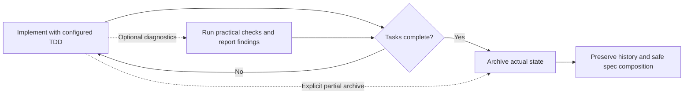

# Usage

← [Back to README](../README.md)

---

## Persona Modes

| Persona   | ID          | Description                                                                       |
| --------- | ----------- | --------------------------------------------------------------------------------- |
| Gentleman | `gentleman` | Teaching-oriented mentor persona — pushes back on bad practices, explains the why |
| Neutral   | `neutral`   | Same teacher, same philosophy, no regional language — warm and professional       |
| Custom    | `custom`    | Mantiene la persona/configuración existente fuera de la gestión de Axiom |

`custom` es una opción de compatibilidad y propiedad, no un editor de personas. Úsala si ya tienes instrucciones propias y quieres que Axiom las deje intactas.

---

## Interactive TUI

Just run it — the Bubbletea TUI guides you through agent selection, components, skills, presets, and managed uninstall flows:

```bash
axiom
```

The uninstall flow is also available from the TUI menu. It lets you:

- select one or more configured agents
- select which managed components to remove (for example `sdd`, `persona`, or `context7`)
- confirm the exact uninstall scope before applying changes

Antes de modificar cualquier fichero gestionado, Axiom crea una copia de seguridad que permite restaurar la configuración si es necesario.

### Receipt-Driven Development during installation

Before the final installation confirmation, the customizable installer explains Receipt-Driven Development (RDD) and asks you to choose **RDD ON** or **RDD OFF**. RDD records bounded, independent review evidence for a frozen change candidate and supports a bounded correction process. It can add review time and model cost.

La elección es opcional y, si no existe una preferencia global, el valor predeterminado es OFF. Puedes volver desde la pantalla de confirmación para cambiarla. Axiom guarda la preferencia global seleccionada solo cuando la instalación termina correctamente; una instalación interrumpida o fallida no la modifica. Los ajustes locales existentes de cada clon se conservan, por lo que el modo efectivo de un clon puede diferir del global. La evidencia de RDD no autoriza commits, pushes, pull requests ni releases: la entrega sigue sujeta a las normas habituales del repositorio.

### Disable TUI spinner animation

Define `AXIOM_NO_ANIMATION=1` para detener la animación del indicador de la TUI. El nombre anterior `GENTLE_AI_NO_ANIMATION` se mantiene como alternativa de compatibilidad:

```bash
AXIOM_NO_ANIMATION=1 axiom
```

Esto solo detiene la animación del indicador; las operaciones de instalación, actualización, sincronización y desinstalación siguen funcionando con normalidad. Elimina la variable o asígnale un valor distinto de `1` para conservar la animación predeterminada. `AXIOM_NO_ANIMATION` tiene prioridad sobre la variable heredada.

---

## CLI Commands

### install

Configuración inicial: detecta tus herramientas y configura los agentes y componentes seleccionados. Al instalar un único agente con `--agent X`, Axiom **añade** el nuevo agente a la lista `installed_agents` existente en `~/.axiom/state.json` y **conserva** los valores de `model_assignments`; no sobrescribe todo el estado. Si solo existe el estado heredado en `~/.gentle-ai/state.json`, Axiom puede migrarlo al directorio actual.

```bash
# Ecosistema completo para varios agentes
axiom install \
  --agent claude-code,opencode,gemini-cli \
  --preset full-gentleman

# Configuración mínima para Cursor
axiom install \
  --agent cursor \
  --preset minimal

# Configuración de OpenClaw después de instalarlo manualmente
axiom install \
  --agent openclaw \
  --preset full-gentleman

# Selección de componentes y skills concretos
axiom install \
  --agent claude-code \
  --component engram,sdd,skills,context7,persona,permissions \
  --skill go-testing,skill-creator,branch-pr,issue-creation \
  --persona gentleman

# Previsualiza primero el plan sin aplicar cambios
axiom install --dry-run \
  --agent claude-code,opencode \
  --preset full-gentleman
```

### skill-registry refresh

Refresh the project-local skill registry used by orchestrators before they delegate work:

```bash
axiom skill-registry refresh
axiom skill-registry refresh --force
axiom skill-registry refresh --cwd /path/to/project --quiet
```

The command scans project skills first (`skills/`, `.opencode/skills/`, `.claude/skills/`, `.github/skills/`, and other supported workspace skill roots), then global agent skill directories. Project-local skills win over same-name global skills.

The command writes `.atl/skill-registry.md` and `.atl/.skill-registry.cache.json`. The cache fingerprint includes schema version plus each discovered `SKILL.md` file path, mtime, and size, so normal startup is a cheap cache-hit when skills have not changed.

Codex, Claude Code, and OpenCode installs wire this command into startup/plugin hooks. Pi gets the equivalent behavior from `gentle-pi`; keep those hook/plugin scan roots in sync when changing these discovery rules.

See [Skill Registry](skill-registry.md) for the full index-first flow and diagrams.

### sync

Actualiza los recursos gestionados a la versión vigente. Ejecútalo después de sustituir o actualizar el binario `axiom`, por ejemplo con `axiom upgrade` o `go install`. No reinstala otros binarios (Engram, GGA); solo actualiza el contenido de prompts, las skills, las configuraciones MCP y los orquestadores SDD.

Managed reviewer and runtime assets are version-bound to the binary. Until sync succeeds, review lifecycle operations fail closed when managed writer provenance is missing or mismatched.

> **Importante:** `axiom sync` actualiza los agentes registrados como instalados por Axiom, no todos los directorios de configuración de agentes de tu equipo.
>
> Axiom guarda los destinos seleccionados en `~/.axiom/state.json`. Las siguientes ejecuciones de `sync` utilizan esa selección para no escribir accidentalmente en herramientas que no hayas elegido gestionar. El estado existente en `~/.gentle-ai/state.json` es una fuente de migración heredada, no la ruta actual. Si repites la instalación y seleccionas un único agente, esa selección pasa a ser el ámbito predeterminado de sincronización.
>
> Antes de sincronizar, puedes previsualizar el ámbito activo con `axiom sync --dry-run`. Para sincronizar agentes que no figuran en la selección guardada, indícalos explícitamente con `--agent`.

```bash
# Previsualiza qué agentes actualizará la sincronización
axiom sync --dry-run

# Sincroniza los agentes registrados en ~/.axiom/state.json
axiom sync

# Sincroniza solo agentes concretos
axiom sync --agent claude-code --agent opencode

# Actualiza las instrucciones del workspace y la configuración MCP de OpenClaw
axiom sync --agent openclaw
```

Sync is safe and idempotent — running it twice produces no changes the second time. When files change, the summary reports the changed file count and lists the changed file paths.

`sync` actualiza el conjunto de componentes gestionados para los agentes seleccionados. No admite `--component`; usa `--include-permissions` para incluir voluntariamente el componente de permisos. La opción heredada `--include-theme` aún se interpreta por compatibilidad, pero no instala ni sincroniza temas.

Tras actualizar el binario, `axiom sync --dry-run` previsualiza los destinos seleccionados y `axiom sync` actualiza sus instrucciones principales de autorización remota. Para elegir un cliente gestionado concreto, por ejemplo, usa `axiom sync --agent opencode`. Estas instrucciones de comportamiento se incorporan siempre, sin necesidad de seleccionar persona, SDD o `--include-permissions`. Exigen autorización explícita del destino, la operación y las credenciales o sesión antes de realizar trabajo remoto o descubrir y reutilizar accesos existentes.

This update covers the 15 non-Pi primary instruction carriers only. Executor roles, named profiles, and Pi's package-owned instructions require separate behavioral coverage. Existing automation modes and remembered approvals may suppress runtime prompts. The guidance is not a sandbox or a fresh-human-per-execution guarantee. Shared settings merging and profile cleanup preserve existing permission-rule order.

Para activar por separado las solicitudes nativas de autorización de comandos remotos en OpenCode, usa `axiom sync --agent opencode --include-permissions` (o `--agent kilocode` para la configuración generada compartida). De forma predeterminada se solicita autorización para `ssh`, `scp`, `sftp` y `rsync` directos, con o sin argumentos; también se solicita de forma conservadora para `rsync` local. Las restricciones existentes y las autorizaciones personalizadas explícitas siguen teniendo prioridad, por lo que una configuración propia puede permitir comandos remotos. Los valores predeterminados no reescriben esas autorizaciones. Las excepciones por agente y las autorizaciones recordadas también pueden omitir la solicitud.

Matcher fixtures follow OpenCode [v1.2.27 wildcard matching](https://github.com/anomalyco/opencode/blob/v1.2.27/packages/opencode/src/util/wildcard.ts) and its last-matching permission evaluation. They do not prove interception of absolute executable paths, env wrappers, interpreters, or arbitrary compound shell syntax; the runtime extracts command nodes separately. Kilocode runtime equivalence is not verified. Issue #4324 remains open for all-client/all-role completion.

For OpenClaw, sync reads the active workspace from `~/.openclaw/openclaw.json` (`agents.defaults.workspace`). It writes `AGENTS.md` / `SOUL.md` into that workspace, while MCP servers stay in the global OpenClaw config under `mcp.servers`.

Para Hermes, Axiom solo detecta la instalación: no instala Hermes. Instálalo manualmente primero. La detección se basa en el directorio de configuración `~/.hermes` (la presencia del binario en `PATH` se informa por separado). Una vez detectado Hermes, `axiom install --agent hermes` añade bloques MCP de Context7 y Engram a `~/.hermes/config.yaml`, escribe el orquestador SDD y la persona en `~/.hermes/SOUL.md` y copia las skills a `~/.hermes/skills/`. Usa `axiom sync --agent hermes` para actualizar la configuración gestionada tras una actualización.

### uninstall

Elimina únicamente la configuración de Axiom de uno o más agentes. No desinstala paquetes ni binarios externos: retira secciones gestionadas de prompts, entradas MCP, skills, fragmentos de configuración y otros ficheros gestionados; después actualiza `~/.axiom/state.json`.

Antes de aplicar cualquier cambio, Axiom crea una copia de seguridad de los ficheros afectados.

```bash
# Desinstalación parcial para agentes concretos
axiom uninstall \
  --agent claude-code \
  --agent opencode

# Desinstalación parcial solo de componentes concretos
axiom uninstall \
  --agent claude-code \
  --component sdd,persona,context7

# Desinstalación completa de la configuración gestionada en todos los agentes compatibles
axiom uninstall --all

# Omite la solicitud de confirmación
axiom uninstall --agent cursor --component skills --yes
```

En una desinstalación parcial sin `--component`, Axiom retira todos los componentes desinstalables que gestiona para los agentes seleccionados.

### update / upgrade

Busca e instala nuevas versiones de Axiom. La copia de seguridad previa a la actualización incluye únicamente los agentes registrados en `state.InstalledAgents` (`~/.axiom/state.json`), no todos los directorios de configuración de agentes que existan en el equipo. Los ficheros `~/.gentle-ai/state.json` que ya existan son fuentes de migración heredadas.

```bash
# Comprueba si hay una versión nueva
axiom update

# Actualiza a la última versión publicada y sustituye el binario actual
axiom upgrade
```

Después de una actualización o de sustituir manualmente el binario, ejecuta `axiom sync` para actualizar todos los recursos gestionados al contenido de la nueva versión.

Si GitHub limita las comprobaciones de actualización, define `GITHUB_TOKEN` o `GH_TOKEN` antes de ejecutar `axiom update` o `axiom upgrade`.

Para instalar o actualizar Axiom, sigue el [Inicio rápido](quickstart.md), que documenta la instalación desde el código fuente. Los comandos Homebrew de Gentle AI no forman parte del método actual de instalación de Axiom.

**Self-update prompt behavior** (changed in v1.x slice 5 — `GENTLE_AI_CONFIRM_UPDATE` removed):

| Situation | Behavior |
|-----------|----------|
| Interactive terminal (TTY) | Always prompts `Apply now? [Y/n]`. Empty Enter accepts. |
| Non-TTY (CI, pipe, script) | Auto-declines — never hangs. |
| `GENTLE_AI_YES=1` | Variable heredada que acepta sin preguntar (para actualizaciones mediante scripts). Se hereda en los subprocesos; si es necesario, limítala a una invocación (por ejemplo, `GENTLE_AI_YES=1 axiom upgrade …`). |
| `GENTLE_AI_NO_SELF_UPDATE=1` | Variable heredada que omite por completo la comprobación de actualización automática. |

`GENTLE_AI_CONFIRM_UPDATE` was removed in slice 5. It is now ignored if set.

`GENTLE_AI_SELF_UPDATE_DONE` es un control interno del bucle de actualización y no debe definirse manualmente.

### model assignment

The TUI **Configure Models** screen can assign different models to SDD phases, `sdd-onboard`, and Judgment Day agents (`jd-judge-a`, `jd-judge-b`, `jd-fix-agent`) when the selected agent supports those slots. This lets you keep review or apply phases on stronger models while routing cheaper phases to faster models.

### doctor

Diagnóstico de solo lectura del estado del ecosistema; no modifica la configuración:

```bash
axiom doctor
```

Checks performed:

| Check | What it verifies |
|-------|-----------------|
| Tool binaries | Required tools present on `PATH`; shadow detection (wrong binary resolves first) |
| Validez de `state.json` | Analiza `~/.axiom/state.json` e informa de errores de esquema o corrupción; puede migrar `~/.gentle-ai/state.json` si todavía no existe estado de Axiom |
| Engram MCP reachability | Confirms the Engram MCP server responds |
| Disk space | Warns when available space is critically low |

Each check reports **pass**, **warn**, or **fail** with an optional remedy hint. Run `doctor` first when troubleshooting an unexpected install or sync result.

### version

```bash
axiom version
axiom --version
axiom -v
```

---

## CLI Flags (install)

| Flag                          | Description                                                                                                       |
| ----------------------------- | ----------------------------------------------------------------------------------------------------------------- |
| `--agent`, `--agents`         | Agents to configure (comma-separated)                                                                             |
| `--component`, `--components` | Components to install (comma-separated)                                                                           |
| `--skill`, `--skills`         | Skills to install (comma-separated)                                                                               |
| `--persona`                   | Persona mode: `gentleman`, `neutral`, `custom` (`custom` keeps your existing persona unmanaged)                   |
| `--preset`                    | Preset: `full-gentleman`, `ecosystem-only`, `minimal`, `custom` (`custom` means manual component/skill selection) |
| `--sdd-mode`                  | SDD orchestrator mode: `single` or `multi`                                                                        |
| `--scope`                     | Ámbito de instalación: `global` (predeterminado, escribe en la configuración global de cada agente seleccionado) o `workspace` (escribe en la raíz del proyecto actual). También admite `AXIOM_INSTALL_SCOPE`; `GENTLE_AI_INSTALL_SCOPE` es la alternativa heredada para CI y usos no interactivos. |
| `--dry-run`                   | Preview the install plan without applying changes                                                                 |

## CLI Flags (sync)

| Flag                     | Description                                                                                          |
| ------------------------ | ---------------------------------------------------------------------------------------------------- |
| `--agent`, `--agents`    | Agents to sync (defaults to all installed agents)                                                    |
| `--skill`, `--skills`    | Skills to sync (comma-separated; defaults to selected preset skills)                                  |
| `--sdd-mode`             | SDD orchestrator mode: `single` or `multi`                                                           |
| `--strict-tdd`           | Enable Strict TDD Mode for SDD agents                                                                |
| `--profile`              | Create or update an SDD profile: `name:provider/model` (sets the default model for all phases)       |
| `--profile-phase`        | Override a specific phase in a profile: `name:phase:provider/model`                                  |
| `--sdd-profile-strategy` | OpenCode profile sync strategy: `generated-multi` or `external-single-active`                        |
| `--include-permissions`  | Include permissions sync (opt-in)                                                                    |
| `--include-theme`        | Opción heredada de compatibilidad: se interpreta, pero no instala ni sincroniza temas                  |
| `--dry-run`              | Preview the sync plan without applying changes                                                       |

**Profile examples:**

```bash
# Crea un perfil «cheap» con un modelo gratuito para todas las fases
axiom sync --profile cheap:openrouter/qwen/qwen3-30b-a3b:free

# Asigna un modelo más potente a la fase de diseño
axiom sync --profile-phase cheap:sdd-design:anthropic/claude-sonnet-4-20250514

# Crea varios perfiles en un único comando
axiom sync \
  --profile cheap:openrouter/qwen/qwen3-30b-a3b:free \
  --profile premium:anthropic/claude-sonnet-4-20250514

# Usa el modo de compatibilidad con un gestor externo de perfiles de OpenCode
axiom sync --agent opencode --sdd-profile-strategy external-single-active
```

See [OpenCode SDD Profiles](opencode-profiles.md) for the full guide.

## CLI Flags (uninstall)

| Flag                          | Description                                                             |
| ----------------------------- | ----------------------------------------------------------------------- |
| `--agent`, `--agents`         | Agents to uninstall managed config from (required unless using `--all`) |
| `--component`, `--components` | Managed components to remove only from the selected agents              |
| `--all`                       | Remove managed configuration from all supported agents                  |
| `--yes`, `-y`                 | Skip the confirmation prompt                                            |

---

## Typical Workflow

```bash
# Primera instalación: clona el repositorio e instala Axiom desde el código fuente
git clone https://github.com/IGutierrezZ/axiom.git
cd axiom
go install ./cmd/axiom
axiom install --agent claude-code,cursor --preset full-gentleman

# Tras una nueva versión: actualiza Axiom y sincroniza sus recursos gestionados
axiom upgrade
axiom sync

# Retira solo la configuración SDD y de persona gestionada para un agente
axiom uninstall --agent claude-code --component sdd,persona

# Añade otro agente más adelante
axiom install --agent windsurf --preset full-gentleman
```

### Install and update troubleshooting

La ruta vigente de instalación de Axiom figura en el [Inicio rápido](quickstart.md). Los comandos `brew install`/`brew upgrade` de Gentle AI no instalan Axiom. Si falla una configuración o sincronización, ejecuta `axiom doctor` y revisa el informe de verificación antes de volver a intentarlo.


---

## Dependency Management

`axiom` detecta los requisitos previos antes de instalar y ofrece indicaciones específicas para cada plataforma:

- **Detected tools**: git, curl, node, npm, brew, go
- **Version checks**: validates minimum versions where applicable
- **Platform-aware hints**: suggests `brew install`, `apt install`, `pacman -S`, `dnf install`, or `winget install` depending on your OS
- **Node LTS alignment**: on apt/dnf systems, Node.js hints use NodeSource LTS bootstrap before package install
- **Dependency-first approach**: detects what's installed, calculates what's needed, shows the full dependency tree before installing anything, then verifies each dependency after installation

### Optional SDD verification and honest archive

SDD normally continues from completed implementation directly to archive. Request
`/sdd-verify` when practical diagnostics are useful; it can inspect partial work,
run applicable checks, and report real results and limitations. Configured Strict
TDD still applies to implementation and to assessment of available TDD evidence.

A missing, stale, malformed, or failed verification report is not an archive gate.
An explicit archive may close unfinished work, preserving task/report history and
reporting unresolved findings without inventing PASS or completing checkboxes.
Edit permissions, mechanical copy/move and collision checks, and native delta-spec
composition still apply. SDD does not invoke RDD; ordinary delivery policy remains.



The retired `sdd-verify-validate` command is no longer required or available;
reports are diagnostics, not certificates. Gentle Pi companion work is separate.

### Optional SDD research

After exploration, request or accept research when external evidence would clarify a real question. It remains optional even after selection: partial findings, unavailable tools or missing/divergent research metadata do not create a proposal-admission gate. The orchestrator asks focused product questions one at a time and waits; only dependent decisions pause when user input or safety-critical evidence is missing.

Collectors use only available, authorized tools and return source-attributed findings, assumptions, contradictions, freshness limits, tradeoffs and implementation implications. They do not persist state or choose for the user. Existing tool restrictions remain in force, including managed OpenCode web denial; no new access is granted by this guidance. Historical research and preproposal artifacts remain intact, without revision or cross-store equality certificates.
