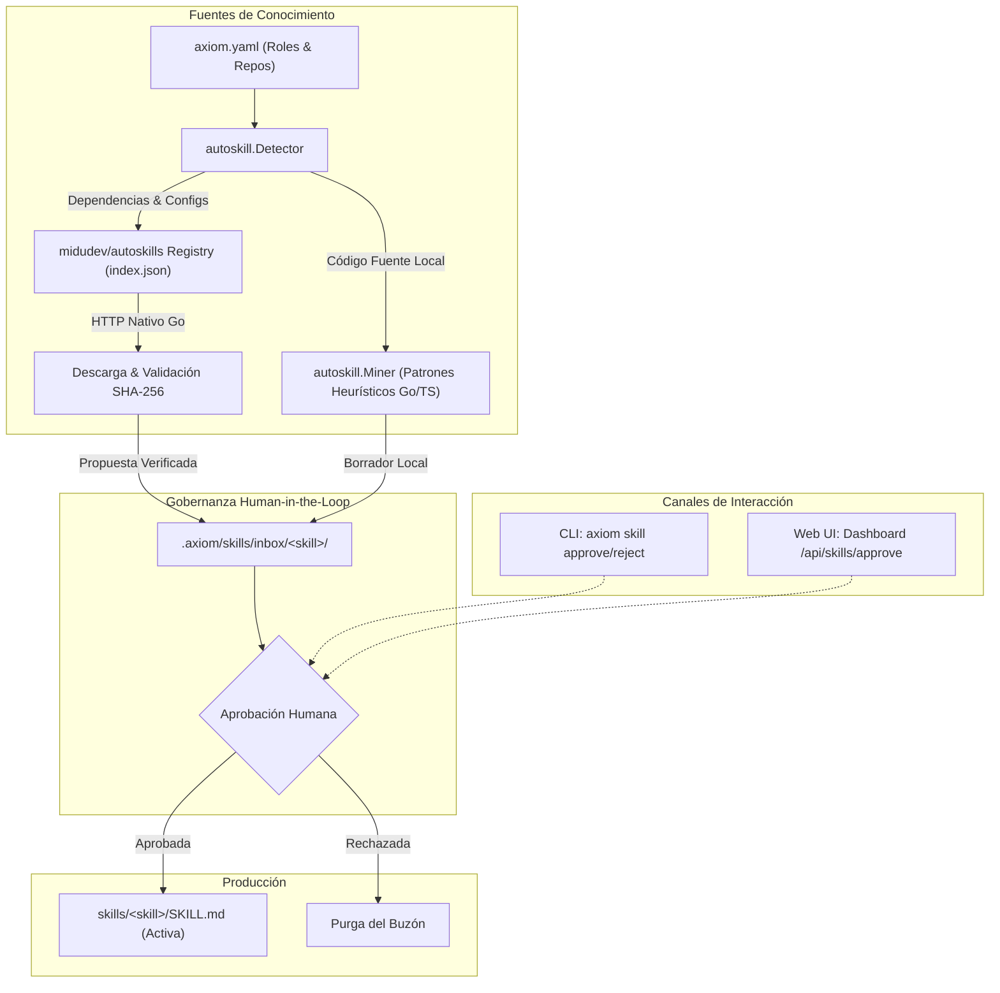
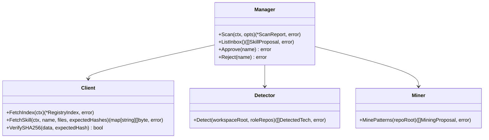

# Diseño Técnico: Autoskills (midudev/autoskills) y Minería Heurística con Gobernanza Human-in-the-Loop (INC-05)

## 1. Resumen Ejecutivo y Arquitectura Global

El Incremento 5 (INC-05) dota a Axiom de un ecosistema integral de aprovisionamiento de habilidades (*Skills*) para agentes de inteligencia artificial y desarrolladores. Combina dos fuentes de conocimiento:
1. **Catálogo Oficial Auditado de `midudev/autoskills`:** Registro de habilidades estándar de la industria curadas para frameworks y herramientas modernas (React, Next.js, Vue, Tailwind, Go, Docker, etc.).
2. **Minería Heurística de Repositorio:** Motor local que inspecciona el código fuente de los repositorios asociados a cada rol en `axiom.yaml` para descubrir patrones idiomáticos internos y formular borradores de directrices canónicas.

Ambas fuentes convergen de forma obligatoria en un **Buzón Transitorio con Gobernanza Human-in-the-Loop (`.axiom/skills/inbox/`)**. Ninguna skill entra a producción en `skills/` sin la aprobación explícita de un desarrollador o Tech Lead.



---

## 2. Componentes del Paquete `internal/autoskill`



### 2.1. Tipos de Datos Principales (`internal/autoskill/types.go`)

```go
package autoskill

import "time"

// OriginType define el origen de procedencia de una skill propuesta.
type OriginType string

const (
	OriginMidudev OriginType = "midudev"
	OriginMined   OriginType = "mined"
)

// DetectConfig define las reglas de coincidencia de una tecnología.
type DetectConfig struct {
	Packages       []string `json:"packages,omitempty"`
	ConfigFiles    []string `json:"config_files,omitempty"`
	FileExtensions []string `json:"file_extensions,omitempty"`
}

// Technology representa una tecnología soportada en SKILLS_MAP.
type Technology struct {
	ID     string       `json:"id"`
	Name   string       `json:"name"`
	Detect DetectConfig `json:"detect"`
	Skills []string     `json:"skills"`
}

// RegistryReview describe la auditoría de seguridad en midudev/autoskills.
type RegistryReview struct {
	Status      string   `json:"status"`
	Flags       []string `json:"flags"`
	Summary     string   `json:"summary"`
	ReviewedAt  string   `json:"reviewedAt"`
}

// RegistrySkillEntry representa una entrada en index.json de midudev.
type RegistrySkillEntry struct {
	Source     string            `json:"source"`
	SkillPath  string            `json:"skillPath"`
	CommitSHA  string            `json:"commitSha"`
	Files      []string          `json:"files"`
	SHA256     map[string]string `json:"sha256"`
	BundleHash string            `json:"bundleHash"`
	Review     RegistryReview    `json:"review"`
}

// RegistryIndex es el esquema raíz del archivo index.json de midudev.
type RegistryIndex struct {
	Version     int                           `json:"version"`
	GeneratedAt string                        `json:"generatedAt"`
	Skills      map[string]RegistrySkillEntry `json:"skills"`
}

// ProposalMetadata almacena la auditoría y estado en .axiom/skills/inbox/<name>/metadata.json.
type ProposalMetadata struct {
	Name          string            `json:"name"`
	Origin        OriginType        `json:"origin"`
	Source        string            `json:"source"`
	Files         []string          `json:"files"`
	SHA256        map[string]string `json:"sha256"`
	Verified      bool              `json:"verified"`
	Role          string            `json:"role,omitempty"`
	DetectedBy    string            `json:"detected_by"`
	Justification string            `json:"justification"`
	CreatedAt     time.Time         `json:"created_at"`
}

// SkillProposal representa una propuesta en memoria para el CLI o Dashboard.
type SkillProposal struct {
	Metadata ProposalMetadata `json:"metadata"`
	SkillMD  string           `json:"skill_md"`
}

// ScanReport resume la ejecución de un escaneo de autoskills.
type ScanReport struct {
	DetectedTechnologies []string        `json:"detected_technologies"`
	SkillsProposed       []SkillProposal `json:"skills_proposed"`
	MinedSkillsCount     int             `json:"mined_skills_count"`
	RegistrySkillsCount  int             `json:"registry_skills_count"`
	TotalInInbox         int             `json:"total_in_inbox"`
}
```

---

## 3. Cliente Nativo HTTP y Verificación SHA-256 (`client.go`)

### 3.1. Endpoint Oficial
- Base URL del Registro: `https://raw.githubusercontent.com/midudev/autoskills/main/packages/autoskills/skills-registry/`
- Manifiesto: `index.json`
- Contenido de Skills: `{skillPath}/SKILL.md` (o `{skillName}/SKILL.md`)

### 3.2. Algoritmo de Integridad Criptográfica
1. Para cada archivo a descargar, se efectúa una petición HTTP GET con timeout de 10s.
2. Se leen los bytes recibidos y se computa el hash:
   ```go
   hasher := sha256.New()
   hasher.Write(bodyBytes)
   actualHash := hex.EncodeToString(hasher.Sum(nil))
   ```
3. Se compara en tiempo constante (`subtle.ConstantTimeCompare` o `strings.EqualFold`) contra el hash especificado en `entry.SHA256[file]`.
4. Si difiere:
   - Se rechaza el archivo.
   - Se emite error: `discrepancia de integridad SHA-256 en <archivo>: esperado <exp>, recibido <act>`.
5. Si coincide:
   - Se marca `Verified: true` en `ProposalMetadata`.

### 3.3. Modo Offline y Resiliencia
- Si se indica `--offline` o si falla la red, el cliente consulta `.axiom/cache/autoskills/`.
- La caché almacena copias locales verificadas de `index.json` y archivos descargados.

---

## 4. Motor de Detección de Stack (`detector.go`)

El detector implementa el subconjunto fundamental de `SKILLS_MAP`:
1. **React:** Dependencia `react` en `package.json` ➔ skills: `react-best-practices`.
2. **Next.js:** Dependencia `next` o archivos `next.config.*` ➔ skills: `next-best-practices`.
3. **Vue / Nuxt:** Dependencia `vue`, `nuxt` o `nuxt.config.*` ➔ skills: `vue-best-practices`, `nuxt`.
4. **Tailwind CSS:** Dependencia `tailwindcss` o `tailwind.config.*` ➔ skills: `tailwind-best-practices`.
5. **Go:** Presencia de `go.mod` o archivos `*.go` ➔ skills: `go-best-practices`.
6. **Docker / Containers:** Presencia de `Dockerfile`, `docker-compose.yml` ➔ skills: `docker-best-practices`.

El detector lee la topología de roles desde `axiom.yaml`. Si un rol está vinculado a un repositorio específico (ej. `repos/frontend`), busca coincidencias en esa subcarpeta y asocia las skills propuestas al rol correspondiente.

---

## 5. Minería Heurística de Repositorio (`miner.go`)

El minero recorre el árbol de archivos `.go` y analiza patrones sintácticos:

1. **Patrón `axiom-go-table-tests`:**
   - Heurística: Archivos `*_test.go` que contienen estructuras anónimas de prueba:
     `tests := []struct` o `testCases := []struct` y bucle con `t.Run(tt.name, ...)`.
   - Propuesta: Genera `SKILL.md` documentando la convención de pruebas tabulares en Go idiomático para Axiom.
2. **Patrón `axiom-internal-layering`:**
   - Heurística: Existencia de paquetes dentro de `internal/` con estructura `types.go`, `service.go`, etc.
   - Propuesta: Genera `SKILL.md` documentando la encapsulación en paquetes internos y desacoplamiento de interfaces.
3. **Patrón `axiom-idiomatic-error-handling`:**
   - Heurística: Uso recurrente de `fmt.Errorf("...: %w", err)` para encadenamiento de errores con centinelas (`errors.Is`, `errors.As`).
   - Propuesta: Genera `SKILL.md` estandarizando el envoltorio de errores en el proyecto.

---

## 6. Gestor del Buzón Transitorio (`manager.go`)

- **Ruta del Buzón:** `.axiom/skills/inbox/<nombre>/`
  - `.axiom/skills/inbox/<nombre>/SKILL.md`
  - `.axiom/skills/inbox/<nombre>/metadata.json`
- **Operación `Approve(name)`:**
  1. Comprueba la existencia en `.axiom/skills/inbox/<name>/`.
  2. Crea el directorio destino `skills/<name>/`.
  3. Copia `SKILL.md` (y recursos si existieran) a `skills/<name>/SKILL.md`.
  4. Elimina la carpeta de origen `.axiom/skills/inbox/<name>/`.
- **Operación `Reject(name)`:**
  1. Comprueba la existencia en `.axiom/skills/inbox/<name>/`.
  2. Elimina recursivamente `.axiom/skills/inbox/<name>/`.

---

## 7. Integración con el Dashboard Web Local (`internal/dashboard`)

### 7.1. Endpoints REST (`server.go`):
- `GET /api/skills/inbox`: Devuelve array de `SkillProposalDTO`.
- `POST /api/skills/scan`: Parámetro opcional `offline: bool`. Ejecuta `Manager.Scan()` y retorna `ScanReport`.
- `POST /api/skills/approve`: Payload `{"name": "string"}`. Invoca `Manager.Approve()` y devuelve estado.
- `POST /api/skills/reject`: Payload `{"name": "string"}`. Invoca `Manager.Reject()` y devuelve estado.

### 7.2. Frontend SPA (`index.html`, `style.css`, `app.js`):
- Pestaña **Skills**:
  - Encabezado con botón "Escanear Tecnologías & Minar" (`POST /api/skills/scan`).
  - Tarjetas de propuestas en el buzón con:
    - Badge de Origen: Azul para `midudev (auditado)` / Púrpura para `minería local`.
    - Badge Criptográfico: Verde `SHA-256 Verificado` con tooltip de hash.
    - Rol y Justificación de detección.
    - Visor Markdown colapsable de `SKILL.md`.
    - Botones de acción: **Aprobar** (verde) y **Rechazar** (rojo/gris).

---

## 8. Integración CLI en `cmd/axiom/main.go`

```
axiom skill scan [--role <rol>] [--path <dir>] [--offline]
axiom skill list [--inbox] [--path <dir>]
axiom skill approve <nombre> [--path <dir>]
axiom skill reject <nombre> [--path <dir>]
```
