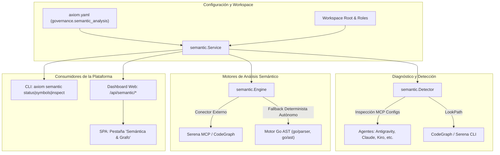
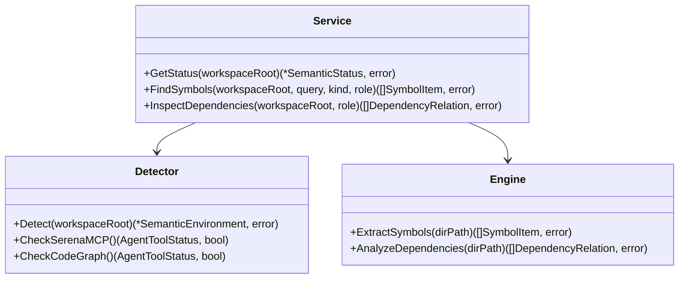

# Diseño Técnico: Conector Semántico de Código con Serena MCP y CodeGraph (INC-06)

## 1. Resumen Ejecutivo y Arquitectura Global

El Incremento 6 (INC-06) dota a Axiom de un subsistema integral de análisis, consulta y navegación semántica sobre el código fuente de los proyectos gestionados. Permite a los agentes y desarrolladores inspeccionar la estructura tipada del software: catálogo de tipos, signaturas de funciones y métodos, contratos de interfaces y grafos de dependencia entre paquetes en topologías monorrepo o multirrepo.

El diseño sigue una estrategia **híbrida y resiliente**:
1. **Detección y Diagnóstico de Herramientas Semánticas Externas:** Inspecciona la disponibilidad de **Serena MCP** (LSP/Tree-sitter) y **CodeGraph** en los archivos de configuración de agentes soportados (`Antigravity`, `Claude Code`, `Kiro`, `Cursor`, etc.) y en el `PATH` del sistema.
2. **Motor Semántico Autónomo Nativo en Go (`native-ast`):** Desarrollado sobre los paquetes estándar de Go (`go/parser`, `go/token`, `go/ast`). Garantiza que Axiom siempre cuente con capacidad de resolución semántica, extracción de símbolos e inspección de dependencias locales con latencia sub-segundo y sin dependencias externas de NodeJS, Python o binarios de terceros.
3. **Consumo Unificado:** Los resultados semánticos se consumen tanto desde la **CLI** (`axiom semantic status|symbols|inspect`) como desde la interfaz visual del **Dashboard Web local** (`axiom ui`).



---

## 2. Componentes del Paquete `internal/semantic`



### 2.1. Tipos de Datos Principales (`internal/semantic/types.go`)

```go
package semantic

// ConnectorType define los tipos de conectores semánticos admitidos.
type ConnectorType string

const (
	ConnectorSerena    ConnectorType = "serena"
	ConnectorCodeGraph ConnectorType = "codegraph"
	ConnectorNativeAST ConnectorType = "native-ast"
	ConnectorAuto      ConnectorType = "auto"
)

// SymbolKind define la clasificación de un símbolo de código.
type SymbolKind string

const (
	KindStruct    SymbolKind = "struct"
	KindInterface SymbolKind = "interface"
	KindFunc      SymbolKind = "func"
	KindMethod    SymbolKind = "method"
	KindType      SymbolKind = "type"
)

// SymbolItem representa un símbolo de código extraído.
type SymbolItem struct {
	Name       string     `json:"name"`
	Kind       SymbolKind `json:"kind"`
	Package    string     `json:"package"`
	FilePath   string     `json:"file_path"`
	LineNumber int        `json:"line_number"`
	Signature  string     `json:"signature,omitempty"`
	Receiver   string     `json:"receiver,omitempty"`
	DocComment string     `json:"doc_comment,omitempty"`
}

// DependencyRelation representa una arista en el grafo de dependencias entre paquetes.
type DependencyRelation struct {
	SourcePackage string `json:"source_package"`
	TargetPackage string `json:"target_package"`
	IsInternal    bool   `json:"is_internal"`
	FilePath      string `json:"file_path,omitempty"`
}

// AgentToolStatus describe el estado de una herramienta semántica en un agente.
type AgentToolStatus struct {
	AgentName  string `json:"agent_name"`
	ConfigPath string `json:"config_path"`
	Configured bool   `json:"configured"`
	Details    string `json:"details,omitempty"`
}

// SemanticStatus contiene el diagnóstico integral del entorno semántico.
type SemanticStatus struct {
	ConfiguredConnector ConnectorType     `json:"configured_connector"`
	ActiveConnector     ConnectorType     `json:"active_connector"`
	SerenaAvailable     bool              `json:"serena_available"`
	CodeGraphAvailable  bool              `json:"codegraph_available"`
	NativeASTReady      bool              `json:"native_ast_ready"`
	Agents              []AgentToolStatus `json:"agents"`
	TotalPackages       int               `json:"total_packages"`
	TotalSymbols        int               `json:"total_symbols"`
	Warnings            []string          `json:"warnings,omitempty"`
}
```

---

### 2.2. Detector de Conectores (`internal/semantic/detector.go`)

El detector inspecciona de manera segura y sin efectos colaterales:
1. Las configuraciones MCP locales de los agentes soportados en el home del usuario:
   - Antigravity: `~/.gemini/config/mcp_config.json` y `~/.gemini/antigravity/mcp_config.json`.
   - Claude Code: `~/.claude.json`.
   - Kiro IDE: `~/.kiro/settings/mcp.json`.
   - Cursor: `.cursor/mcp.json`.
2. Presencia de comandos en el PATH: `codegraph`, `serena`, `serena-mcp`.
3. Devuelve un informe estructurado con el estado de cada conector.

---

### 2.3. Motor de Análisis AST Nativo (`internal/semantic/engine.go`)

El motor AST aprovecha los paquetes estándar de Go (`go/parser`, `go/token`, `go/ast`):
1. **Recorrido de Directorios:** Itera recursivamente por los paquetes en los repositorios locales omitiendo `vendor/`, `.git/` y carpetas ocultas.
2. **Extracción de Declaraciones:**
   - Tipos (`ast.TypeSpec`): clasifica structs e interfaces con sus campos y firmas de métodos.
   - Funciones (`ast.FuncDecl`): extrae funciones independientes y métodos asociados a tipos receptores (`Recv`), preservando nombres de parámetros y valores de retorno.
3. **Mapeo de Imports:** Extrae cada `ast.ImportSpec` para construir las relaciones de dependencia entre paquetes del proyecto.

---

### 2.4. Capa de Servicio (`internal/semantic/service.go`)

Orquesta el detector y el motor:
- Carga la configuración del workspace desde `internal/workspace/`.
- Determina el conector activo con base en `governance.semantic_analysis` y disponibilidad.
- Implementa filtros eficientes por `query` (coincidencia de texto), `kind` (tipo de símbolo) y `role` (ámbito de repositorios).

---

## 3. Integración en la CLI (`cmd/axiom/main.go`)

Se agregan los subcomandos bajo el comando `axiom semantic`:

```bash
# 1. Diagnóstico del entorno semántico y conectores disponibles
axiom semantic status [--path <directorio>]

# 2. Búsqueda y listado estructurado de símbolos de código
axiom semantic symbols [--query <filtro>] [--kind struct|interface|func|method] [--role <rol>] [--path <directorio>]

# 3. Inspección del grafo de dependencias entre paquetes
axiom semantic inspect [--role <rol>] [--path <directorio>]
```

---

## 4. Integración en el Dashboard Web (`internal/dashboard/`)

### 4.1. Endpoints REST (`internal/dashboard/server.go`)
- `GET /api/semantic/status`: Devuelve el JSON de `SemanticStatus`.
- `GET /api/semantic/symbols`: Acepta query params `query`, `kind`, `role` y devuelve `[]SymbolItem`.
- `GET /api/semantic/dependencies`: Devuelve el listado JSON de `[]DependencyRelation`.

### 4.2. Frontend SPA Embebido (`assets/index.html`, `app.js`, `style.css`)
- Nueva pestaña en la barra de navegación: **"Semántica & Grafo"**.
- Componentes visuales:
  1. **Tarjeta de Salud del Conector:** Muestra el conector activo (`Serena MCP`, `CodeGraph`, `AST Nativo Go`) y lista de agentes verificados.
  2. **Buscador de Símbolos en Tiempo Real:** Input con autocompletado y botones de filtro por tipo (`Todos`, `Structs`, `Interfaces`, `Funciones`, `Métodos`).
  3. **Tabla de Resultados:** Lista interactiva con signaturas formateadas, paquete y número de línea.
  4. **Mapa de Dependencias:** Vista de las conexiones entre paquetes del workspace.

---

## 5. Estrategia de Pruebas Unitarias

La suite de pruebas en `internal/semantic/semantic_test.go` validará:
1. `TestDetectorSerenaAndCodeGraph`: Detección en archivos JSON simulados de configuración MCP.
2. `TestEngineExtractSymbols`: Extracción completa de interfaces, structs, funciones y métodos sobre código Go de prueba.
3. `TestEngineAnalyzeDependencies`: Correcta identificación de dependencias internas vs externas.
4. `TestServiceFindSymbolsFiltering`: Filtrado por query, kind y role con ordenamiento alfabético.
5. `TestServiceConnectorFallback`: Comprobación del fallback automático a `native-ast` cuando el conector configurado no está disponible.
6. `TestDashboardSemanticEndpoints`: Pruebas HTTP de los endpoints REST en `internal/dashboard/dashboard_test.go`.
