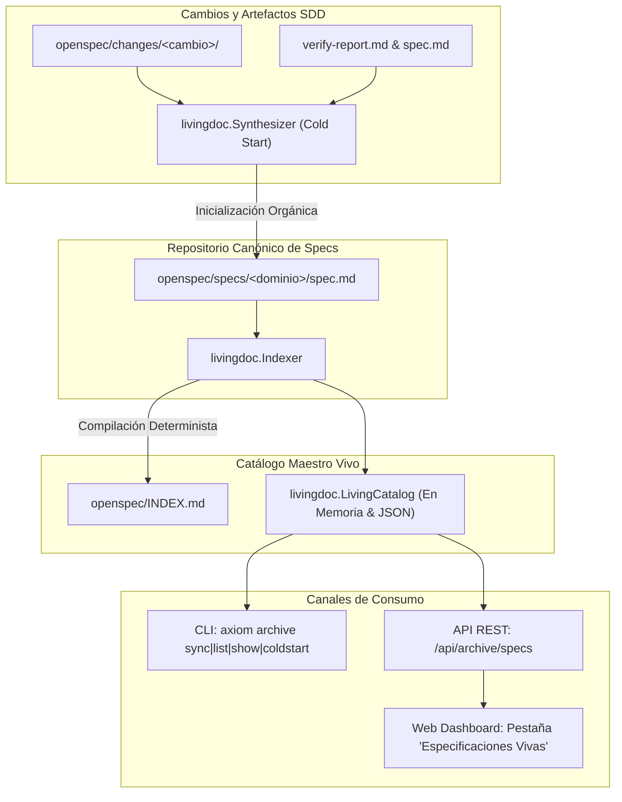
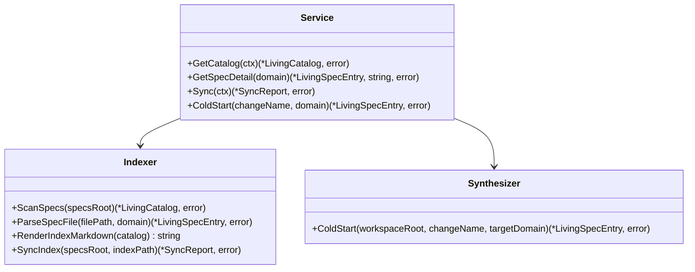

# Diseño Técnico: Motor de Documentación Viva y Adopción Orgánica en Archive (INC-07)

## 1. Resumen Ejecutivo y Arquitectura Global

El Incremento 7 (INC-07) culmina el roadmap fundacional de Axiom convirtiendo la fase de cierre (`Archive`) en un **motor continuo de documentación viva y adopción orgánica (*Zero-Doc Cold Start*)**.



---

## 2. Componentes del Paquete `internal/livingdoc`



### 2.1. Modelos de Datos (`internal/livingdoc/types.go`)

```go
package livingdoc

import "time"

// RequirementMeta describe un requerimiento canónico extraído de una spec viva.
type RequirementMeta struct {
	ID         string   `json:"id"`
	Title      string   `json:"title"`
	Scenarios  []string `json:"scenarios"`
	LineNumber int      `json:"line_number"`
}

// LivingSpecEntry representa una especificación viva consolidada en openspec/specs/.
type LivingSpecEntry struct {
	Domain           string            `json:"domain"`
	Title            string            `json:"title"`
	Description      string            `json:"description"`
	FilePath         string            `json:"file_path"`
	Requirements     []RequirementMeta `json:"requirements"`
	TotalScenarios   int               `json:"total_scenarios"`
	LastModified     time.Time         `json:"last_modified"`
}

// LivingCatalog agrupa todas las especificaciones vivas del workspace.
type LivingCatalog struct {
	Specs             []LivingSpecEntry `json:"specs"`
	TotalRequirements int               `json:"total_requirements"`
	TotalScenarios    int               `json:"total_scenarios"`
	LastSync          time.Time         `json:"last_sync"`
}

// SyncReport resume el resultado determinista de una sincronización de índice.
type SyncReport struct {
	SpecsCount        int       `json:"specs_count"`
	RequirementsCount int       `json:"requirements_count"`
	ScenariosCount    int       `json:"scenarios_count"`
	IndexPath         string    `json:"index_path"`
	SyncedAt          time.Time `json:"synced_at"`
	Warnings          []string  `json:"warnings,omitempty"`
}
```

---

### 2.2. Indexador y Generador de Manifiesto (`internal/livingdoc/indexer.go`)

- **Extracción Sintáctica:** Utiliza expresiones regulares optimizadas:
  - Título: `^# (.+)$`
  - Requerimiento: `^### Requirement:\s*(.+?)(?:\s*\((REQ-[^\)]+)\))?$`
  - Escenario BDD: `^#### Scenario:\s*(.+)$`
- **Generación de `openspec/INDEX.md`:** Genera un documento Markdown con:
  - Resumen ejecutivo y conteo de especificaciones, requerimientos y escenarios.
  - Tabla de especificaciones vivas con enlaces relativos (`specs/<dominio>/spec.md`).
  - Matriz detallada de requerimientos por dominio.

---

### 2.3. Sintetizador de Adopción Orgánica (*Cold Start*) (`internal/livingdoc/synthesizer.go`)

- Detecta si el dominio ya tiene especificación viva en `openspec/specs/<dominio>/spec.md`.
- Si no existe:
  - Crea el directorio canónico en `openspec/specs/<dominio>/`.
  - Copia o estructura la especificación viva a partir del `spec.md` del cambio.
  - Registra metadatos del incremento de origen para trazabilidad histórica.
  - Invoca la re-indexación automática para mantener `openspec/INDEX.md` al día.

---

### 2.4. Capa de Servicio (`internal/livingdoc/service.go`)

- Orquesta las rutas de `axiom.yaml` (`specs_repository` o por defecto `openspec/specs/`).
- Expone `GetCatalog`, `GetSpecDetail`, `Sync` y `ColdStart`.

---

## 3. Integración en la CLI (`cmd/axiom/main.go`)

Grupo de comandos `axiom archive`:

```bash
# 1. Sincroniza y actualiza openspec/INDEX.md
axiom archive sync [--path <directorio>]

# 2. Lista las especificaciones vivas del workspace
axiom archive list [--path <directorio>]

# 3. Muestra el detalle de una especificación viva particular
axiom archive show <dominio> [--path <directorio>]

# 4. Inicializa la especificación viva de un cambio (Cold Start)
axiom archive coldstart <nombre-cambio> [--domain <dominio>] [--path <directorio>]
```

---

## 4. Integración en el Dashboard Web (`internal/dashboard/`)

### 4.1. Endpoints REST (`internal/dashboard/server.go`)
- `GET /api/archive/specs`: Devuelve `LivingCatalog`.
- `GET /api/archive/specs/{domain}`: Devuelve `LivingSpecEntry` y el contenido Markdown original.
- `POST /api/archive/sync`: Ejecuta `Sync()` y devuelve `SyncReport`.

### 4.2. Frontend SPA Embebido (`assets/index.html`, `app.js`, `style.css`)
- Nueva pestaña de navegación: **"Especificaciones Vivas"**.
- Componentes visuales:
  1. Tarjetas métricas: Total Especificaciones, Requerimientos Canónicos, Escenarios BDD.
  2. Botón de acción reactivo: `↻ Sincronizar Catálogo`.
  3. Selector interactivo de especificaciones vivas y visor con formateador Markdown.

---

## 5. Estrategia de Pruebas Unitarias

La suite de pruebas en `internal/livingdoc/livingdoc_test.go` verificará:
1. `TestScanSpecsAndExtractMetadata`: Parseo de múltiples archivos `spec.md` con requerimientos y escenarios.
2. `TestRenderIndexMarkdown`: Generación correcta del archivo `INDEX.md` con tablas y enlaces relativos.
3. `TestColdStartSynthesis`: Generación de especificación viva inicial a partir de un cambio archivado ficticio.
4. `TestServiceSync`: Ejecución de sincronización sobre un workspace de prueba y verificación de la persistencia en disco.
5. `TestDashboardArchiveEndpoints`: Validación de los endpoints REST en `internal/dashboard/dashboard_test.go`.
