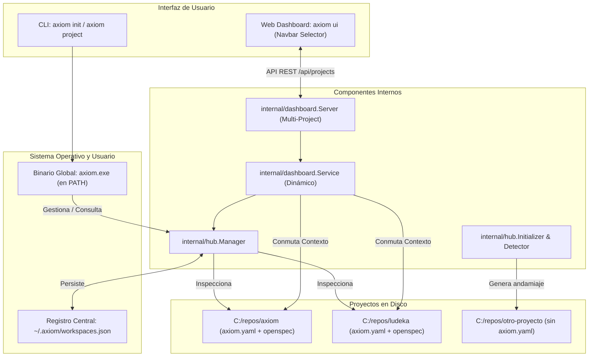
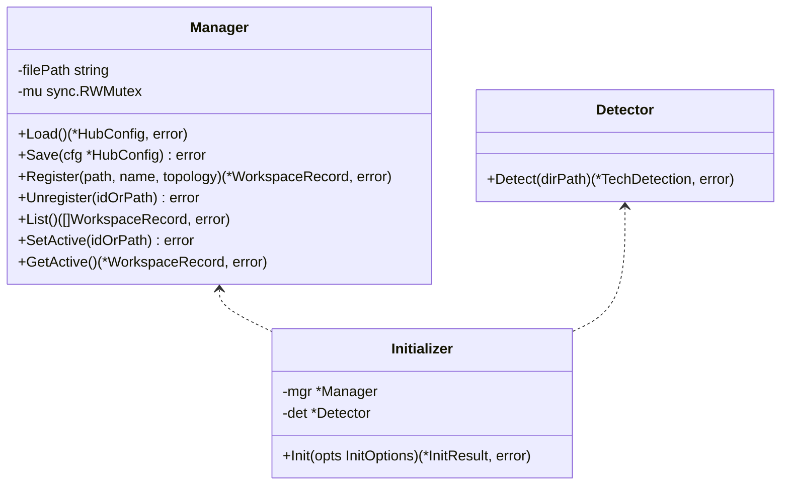

# Diseño Técnico: Hub Multi-Proyecto, Selector Dinámico en Dashboard Web y CLI axiom init (INC-08)

## 1. Resumen Ejecutivo y Arquitectura Global

El Incremento 8 (INC-08) evoluciona a Axiom de una herramienta estrictamente mono-proyecto a una **plataforma Multi-Proyecto integral**, desacoplando el binario global de la configuración de cada repositorio y proveyendo un Hub centralizado.



---

## 2. Componentes del Paquete `internal/hub`



### 2.1. Modelos de Datos (`internal/hub/types.go`)

```go
package hub

import "time"

type WorkspaceRecord struct {
    ID           string    `json:"id"`
    Name         string    `json:"name"`
    Path         string    `json:"path"`
    Topology     string    `json:"topology"`
    RegisteredAt time.Time `json:"registered_at"`
    LastAccessed time.Time `json:"last_accessed"`
    IsConfigured bool      `json:"is_configured"` // true si tiene axiom.yaml válido
}

type HubConfig struct {
    Version         string            `json:"version"`
    ActiveWorkspace string            `json:"active_workspace"` // ID o ruta
    Workspaces      []WorkspaceRecord `json:"workspaces"`
}

type TechDetection struct {
    PrimaryLanguage string   `json:"primary_language"`
    Frameworks      []string `json:"frameworks"`
    HasTests        bool     `json:"has_tests"`
    RecommendedRole string   `json:"recommended_role"`
}

type InitOptions struct {
    Path     string
    Name     string
    Topology string // monorepo-embedded por defecto
    Force    bool
}

type InitResult struct {
    ConfigPath   string
    Record       WorkspaceRecord
    CreatedFiles []string
    AlreadyExisted bool
}
```

---

## 3. Arquitectura del Dashboard Dinámico (`internal/dashboard`)

Actualmente, `dashboard.Service` recibe un `rootPath` fijo e inmutable en su constructor. En INC-08:
1. `dashboard.Service` contendrá un puntero al `hub.Manager`.
2. Proporcionará un método `SetCurrentWorkspace(path string) error` protegido por un `sync.RWMutex` que re-inicializa bajo demanda sus servicios dependientes (`autoskillManager`, `semanticService`, `livingdocService`).
3. El frontend SPA (`internal/dashboard/assets/`):
   - Añadirá en el header el dropdown `#project-selector` con badge de estado.
   - Si `/api/workspace` retorna `is_configured: false`, en vez de romper la vista mostrará la tarjeta Hero `#unconfigured-welcome-card` que ofrece un botón para inicializar con 1 clic.

---

## 4. Diseño de la CLI (`cmd/axiom`)

### Subcomando `axiom init`
```
axiom init [--name <nombre>] [--path <dir>] [--topology <tipo>] [--force]
```
- Si no se especifica `--name`, se deduce del nombre de la carpeta (`filepath.Base(absPath)`).
- Si no se especifica `--path`, se toma `.`.
- Si `axiom.yaml` ya existe, no lo destruye; solo lo valida y registra en el Hub.

### Subcomando `axiom project`
```
axiom project list
axiom project switch <id|nombre|ruta>
axiom project add <ruta> [--name <nombre>]
axiom project remove <id|nombre|ruta>
```
