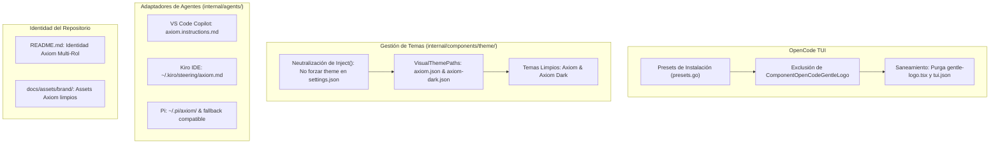

# Diseño Técnico: Desacoplamiento Visual, Eliminación del Logo Gentle AI en OpenCode y Neutralización de Temas (INC-09)

## 1. Resumen Ejecutivo y Arquitectura de Desacoplamiento

El Incremento 09 (INC-09) formaliza la independencia estética y visual de Axiom frente al proyecto origen Gentle-AI. El objetivo principal es suprimir imposiciones invasivas (banners braille de rosas, reescritura forzosa de temas en `settings.json`) y alinear las rutas de adaptadores hacia la identidad de **Axiom**, garantizando que el entorno del desarrollador se preserve intacto.



---

## 2. Detalle de Diseño por Componente

### 2.1. Supresión del Plugin de Logo en OpenCode (`internal/model/`, `internal/components/opencodeplugin/`, `internal/components/uninstall/`)

1. **`internal/model/presets.go`**:
   - Modificar `installSafePresetVisualComponents()` para que devuelva únicamente `[]ComponentID{ComponentClaudeTheme}`.
   - Retirar `ComponentOpenCodeGentleLogo` de los componentes instalados por defecto en los presets (`PresetFullGentleman` o futuros presets Axiom).
   - Mantener `ComponentOpenCodeGentleLogo` en `VisualPolishComponents()` para que los motores de saneamiento y desinstalación reconozcan el ID y puedan purgarlo en máquinas donde ya se hubiera instalado previamente.

2. **`internal/components/uninstall/service.go`**:
   - Al desinstalar o limpiar `ComponentOpenCodeGentleLogo`, asegurar que no solo se elimine `gentle-logo.tsx`, sino que también se invoque la purga de la referencia en `tui.json` mediante la lógica de `removeTUIPlugin`.

3. **`internal/components/opencodeplugin/plugin.go`**:
   - Asegurar que `Definitions()` y los instaladores no presenten el logo como un plugin activo obligatorio.

### 2.2. Neutralización y Renombrado de Temas Visuales (`internal/components/theme/`)

1. **Neutralización del Forzado de Temas (`theme.Inject`)**:
   - Actualmente, `theme.Inject()` inyecta forzosamente `{"theme": "gentleman"}` en el `settings.json` del usuario (tanto en Claude Code como en OpenCode).
   - En Axiom, respetamos la configuración de color preexistente del usuario (`nord`, `kanagawa`, `dracula`, etc.).
   - Modificar `theme.Inject()` para que sea una operación no-invasiva (no-op o condicionada explícitamente si el usuario lo solicita), no sobreescribiendo el atributo `theme` de `settings.json` durante el sync/install por defecto.

2. **Renombrado y Actualización de Paletas Opcionales**:
   - Renombrar `VisualThemePaths()`:
     ```go
     // Antes: gentleman.json, gentleman-cute.json
     // Ahora: axiom.json, axiom-dark.json
     func VisualThemePaths(homeDir string, adapter agents.Adapter) []string {
         ...
         return []string{filepath.Join(root, "axiom.json"), filepath.Join(root, "axiom-dark.json")}
     }
     ```
   - Renombrar las definiciones en Go:
     - `axiomClaudeTheme` (Name: `"axiom"`, Base: `"dark"`)
     - `axiomDarkClaudeTheme` (Name: `"Axiom Dark"`, Base: `"dark"`)
     - `axiomOpenCodeTheme`
     - `axiomDarkOpenCodeTheme`
   - El desinstalador de temas (`internal/components/uninstall/service.go`) debe limpiar tanto las rutas nuevas (`axiom*.json`) como las rutas heredadas (`gentleman*.json`) para asegurar una migración limpia sin archivos huérfanos.

### 2.3. Rutas de Instrucciones en Adaptadores (`internal/agents/`)

1. **VS Code Copilot (`internal/agents/vscode/adapter.go`)**:
   - `SystemPromptFile(homeDir string) string`:
     Retornar `filepath.Join(a.SystemPromptDir(homeDir), "axiom.instructions.md")` en lugar de `gentle-ai.instructions.md`.

2. **Kiro IDE (`internal/agents/kiro/adapter.go`)**:
   - `SystemPromptFile(homeDir string) string`:
     Retornar `filepath.Join(a.SystemPromptDir(homeDir), "axiom.md")` en lugar de `gentle-ai.md`.

3. **Pi (`internal/agents/pi/review_routing.go`)**:
   - Soporte de variable de entorno `AXIOM_PI_CONFIG_HOME` (con fallback a `GENTLE_PI_CONFIG_HOME`).
   - Ruta por defecto: `~/.pi/axiom/models.json` (y en repositorio `.pi/axiom/models.json`).
   - Fallback defensivo: si no existe en `.pi/axiom`, comprobar `.pi/gentle-ai` para garantizar compatibilidad retroactiva sin romper flujos existentes.

### 2.4. Identidad Visual del Repositorio

1. **`README.md`**:
   - Reemplazar el banner de rosa neón de Gentle AI por un encabezado sobrio y tipográfico de **Axiom**.
   - Redactar la descripción principal en torno a la identidad de Axiom: Entorno determinista de ingeniería de software con Spec-Driven Development (SDD), soporte Multi-Proyecto y agentes cooperativos.
   - Eliminar enlaces obsoletos a wikis o páginas personales de Gentleman Programming, apuntando a la documentación local en `docs/`.

2. **Assets de Marca (`docs/assets/brand/`)**:
   - Añadir un banner visual limpio `axiom-banner.svg` o gráfico representativo para Axiom.
   - Retirar dependencias duras de `gentle-ai-banner.png` y `rose.png` en los documentos activos.

---

## 3. Matriz de Trazabilidad de Requerimientos

| Requerimiento Spec | Componente de Diseño | Validación / Test |
|---|---|---|
| **REQ-09.1** (Supresión gentle-logo) | `presets.go` y `uninstall/service.go` | `TestComponentsForPreset` no incluye logo; `uninstall` purga `tui.json`. |
| **REQ-09.2** (No forzado de tema) | `theme/inject.go` | Pruebas de `Inject()` confirman que `settings.json` no se sobreescribe con `"gentleman"`. |
| **REQ-09.3** (Temas axiom.json) | `theme/inject.go` | `VisualThemePaths` devuelve `axiom.json` y `axiom-dark.json`. |
| **REQ-09.4** (Nomenclatura adaptadores) | `vscode/`, `kiro/`, `pi/` | Pruebas unitarias de `SystemPromptFile` y resolución de rutas en Pi. |
