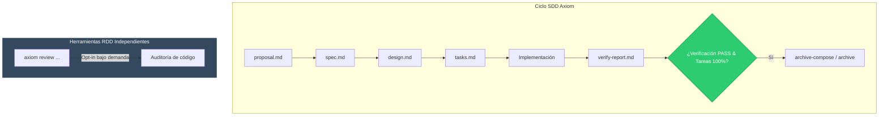

# Diseño Técnico: Desacoplamiento de RDD y Parches de Estabilidad Upstream v3 (inc-18-rdd-decoupling-and-v3-stability-fixes)

> **Incremento:** `inc-18-rdd-decoupling-and-v3-stability-fixes`  
> **Fase:** Fase 4 — Evolución Arquitectónica, Flujo Orgánico (ODD) y Absorción Upstream v3  
> **Responsabilidad:** Core SDD / Estabilidad & Plataforma  
> **Estado:** En diseño  
> **Idioma:** Español (Castellano peninsular)  

---

## 1. Arquitectura y Decisiones de Diseño

### Decisión 1: Desacoplamiento Total de RDD en `internal/sddstatus`
- **Problema:** En el flujo original heredado de Gentle-AI, tras una verificación formal exitosa (`Verify == DependencyAllDone`), la función `applyReviewOfferRouting` invocaba `reviewOfferForVerify` mediante `review_door.go`, inyectando un bloque `ReviewOfferBlock` (`gentle-ai review start`) en la proyección de estado `sdd status`. Esto ataba el estado SDD a RDD y creaba acoplamientos innecesarios.
- **Solución:**
  1. Retirar las llamadas a `applyReviewOfferRouting` en `internal/sddstatus/status.go`.
  2. En `internal/sddstatus/status.go` y `status_v2.go`, mantener el campo `ReviewOffer *ReviewOfferBlock` con etiqueta `json:"reviewOffer,omitempty"` para retrocompatibilidad estructural con esquemas serializados antiguos, pero asegurando que se evalúe como `nil` siempre. De este modo, la clave `reviewOffer` se omite limpiamente en la serialización JSON.
  3. Desacoplar `internal/cli/sdd_status.go` eliminando el callback `ReviewDisabledForWorkspace: sddReviewDisabledForWorkspace`.
  4. Preservar la integridad de los comandos de revisión CLI en `internal/cli/review.go` y `cmd/axiom/main.go` (`axiom review ...`), de modo que el usuario pueda seguir usando RDD cuando lo desee sin que ello condicione el arnés SDD.

### Decisión 2: Decodificación Tolerante a Rutas Windows (`1a2f6775`)
- **Problema:** En Windows, las rutas del sistema de archivos contienen caracteres `\` que son escapados como `\\` al emitir JSON. Pruebas como `TestRunSDDAttemptGrantPersistsAndReplaysThroughTheCLI` en `internal/cli/sdd_attempt_test.go` realizaban comprobaciones de cadenas directas (`strings.Contains`), fallando en Windows.
- **Solución:** Decodificar la salida con `json.Unmarshal(&projected)` hacia el tipo formal `sddstatus.StatusV2Projection` y validar la presencia de la ruta en el slice `projected.ActionContext.AllowedEditRoots`.

### Decisión 3: Aislamiento del CWD en la Resolución de Artefactos (`8c078527`)
- **Problema:** Al sincronizar artefactos de agentes (`persona.json`, configuraciones de Pi o OpenClaw), ciertas funciones calculaban rutas relativas o inspeccionaban el directorio de trabajo actual (`CWD`) en lugar de resolverse estrictamente contra la raíz global (`homeDir`) o la raíz de workspace (`workspaceDir`).
- **Solución:**
  1. En `internal/cli/run.go`, simplificar `componentInjectionDirScoped` y `piPersonaConfigRoots` para depender únicamente de `ResolveAgentConfigDir(scope, homeDir, workspaceDir)` sin sobreescrituras basadas en CWD o configs locales de OpenClaw.
  2. En `internal/cli/sync.go`, unificar `syncPersonaPathsWithWorkspace` e `InjectPiPersona` apuntando a `homeDir` para instalaciones globales, y limitar `opts.WorkspaceDir` a instalaciones con ámbito de workspace (`ScopeWorkspace`).

### Decisión 4: Saneamiento del Preset de Skills (`11f6c000`)
- **Problema:** El preset predeterminado (`foundationSkills`) incluía skills de colaboración interna del repositorio (`branch-pr`, `issue-creation`, `systemic-issue-triage`, `rdd-defect-workflow`, `gentle-ai-bench`, `comment-writer`).
- **Solución:**
  1. Definir explícitamente `contributorSkills` y mantener `selectableFoundationSkills` para el selector de la TUI.
  2. Computar `foundationSkills` excluyendo las `contributorSkills`, de modo que la instalación estándar solo provea skills de producto a los usuarios.

### Decisión 5: Clarificación y Recuperación ante `ambiguous_project` en Engram (`59e6705f`, `90992285`)
- **Problema:** En el inicio de sesión (`mem_session_start`), un error `ambiguous_project` debe recuperarse resolviendo el directorio raíz del repositorio y reintentando con dicho directorio en el parámetro `directory`, sin enviar campos exclusivos de herramientas de escritura como `project`, `project_choice_reason` o `recovery_token`.
- **Solución:** Actualizar `internal/assets/engram/protocol.md` incorporando las reglas normativas de inicio de sesión y recuperación ante ambigüedad.

---

## 2. Diagrama de Interacción SDD Desacoplado

---

## 3. Matriz de Componentes Afectados

| Componente / Archivo | Tipo de Cambio | Justificación |
| :--- | :---: | :--- |
| `internal/sddstatus/status.go` | Modificación | Retiro de `applyReviewOfferRouting` y desacoplamiento de RDD. |
| `internal/sddstatus/review_door.go` | Modificación | Eliminación de llamadas activas a `OfferReviewAfterVerify`. |
| `internal/cli/sdd_status.go` | Modificación | Retiro de invocación al callback de kill-switch de RDD. |
| `internal/cli/sdd_attempt_test.go` | Modificación | Absorción de fix de rutas JSON Windows (`1a2f6775`). |
| `internal/cli/run.go` & `sync.go` | Modificación | Absorción de aislamiento CWD para artefactos (`8c078527`). |
| `internal/components/skills/presets.go` | Modificación | Absorción de saneamiento de skills predeterminadas (`11f6c000`). |
| `internal/components/skills/presets_test.go` | Modificación | Actualización de tests unitarios de presets. |
| `internal/assets/engram/protocol.md` | Modificación | Absorción de resiliencia ante `ambiguous_project` (`90992285`). |
