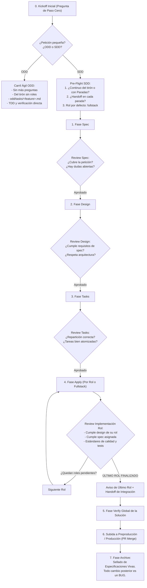

# Propuesta: Determinación Temprana de Flujo, Paradas, Reviews por Bloque, Relevos y Ciclo de Vida (inc-21-upfront-flow-governance)

> **Incremento:** `inc-21-upfront-flow-governance`  
> **Fase del Roadmap:** Fase 4 — Gobernanza de Agentes, Flujo Dual ODD/SDD y Automatización de Ciclo de Vida  
> **Responsabilidad:** Gobernanza / Orquestación SDD / Motor Multi-Rol / Experiencia de Usuario  
> **Fecha:** 2026-09-21  
> **Idioma:** Español (castellano peninsular)  
> **Estado:** Propuesta Formal para Aprobación (Revisión v2: Reviews por Bloque y Ciclo de Archive)  

---

## 0. Resumen Ejecutivo

Esta versión ampliada del incremento formaliza la gobernanza integral del ciclo de vida en Axiom, resolviendo dos problemas fundamentales:
1. **Inversión de Control en el Paso Cero (Kickoff):** La máquina de estados pregunta y sella al inicio si se transita por la vía rápida ODD o por la vía formal SDD, eliminando cualquier duda sobre si parar o continuar.
2. **Control de Calidad Riguroso por Bloques (Review Gates):** Para los incrementos SDD con paradas, se establecen puntos de control formales donde el usuario valida explícitamente el trabajo antes de avanzar:
   - **Validación de `spec`:** Verificación de cobertura funcional contra la petición original y detección de huecos o dudas abiertas.
   - **Validación de `design`:** Verificación de conformidad arquitectónica con respecto a la `spec` y reglas del repositorio.
   - **Validación de `tasks` (NUEVO):** Parada de control sobre `tasks.md` (o `tasks.<rol>.md`) para aprobar la repartición de responsabilidades y granularidad antes de picar código.
   - **Validación de `apply` por cada Rol:** Revisión de lo implementado por cada rol (código, tests unitarios, cobertura y fidelidad con su diseño).
   - **Handoff al Último Rol y `verify` Global:** Al concluir el último rol, el sistema notifica que la implementación completa ha terminado y emite un `handoff.md` de integración hacia la fase `verify` global de toda la solución.
   - **Semántica Estricta de `archive`:** El archivado no es un paso inmediato en frío tras las pruebas locales; se ejecuta cuando el incremento se integra o promociona hacia entorno preproductivo/productivo (vía PR merge). A partir de ese momento, la especificación viva queda sellada y cualquier ajuste posterior se gestiona mediante bug o nuevo incremento.

---

## 1. Propósito y Justificación Técnica (Intent)

### 1.1 El Problema Actual

1. **Falta de compuerta en el desglose de tareas:** El agente pasa con frecuencia de `design` directamente a `apply` sin dar al usuario la oportunidad de revisar cómo se han dividido las tareas en `tasks.md` o si la asignación entre roles es coherente.
2. **Revisiones tardías:** Cuando un defecto de diseño o de interpretación de la especificación se descubre en la fase `verify`, el coste de refactorización es máximo. Las revisiones deben ser por bloque acumulativo.
3. **Descoordinación en el cierre multi-rol:** En proyectos con roles (`core`, `web`, `qa`) o rol `fullstack`, no existe una señal explícita que avise: *"El último rol ha finalizado, corresponde consolidar la solución y ejecutar el verify global"*.
4. **Confusión sobre el propósito de `archive`:** Se confunde a menudo archivar con terminar los tests locales. El archivado formal es la entrega a producción/preproducción; cerrar antes de tiempo deja cambios en el limbo sin sincronización de especificaciones vivas.

### 1.2 Principios de la Solución

1. **Determinación Temprana y Bloqueante (Kickoff):** ODD es ágil, directo, sin roles y sin preguntas adicionales. SDD exige configurar al inicio si habrá paradas y si se requieren `handoffs`.
2. **Lentes de Review por Bloque:** Cada fase entrega un artefacto verificable contra criterios objetivos antes de abrir la siguiente compuerta.
3. **Conclusión Determinista de Roles:** El último rol desencadena la barrera de integración, genera un relevo formal (`handoff.md`) y traspasa el control al arnés de pruebas globales de la solución.
4. **Inmutabilidad Post-Archive:** Un incremento archivado es un incremento desplegado/consolidado. Todo lo posterior son bugs o nuevos incrementos.

---

## 2. Especificación Detallada del Flujo y Compuertas de Control

### 2.1 Mapa del Ciclo de Vida de Gobernanza



---

### 2.2 Requerimientos de Comportamiento (BDD)

#### REQ-1: Compuerta Temprana de Selección de Carril (ODD vs SDD)
* **REQ-1.1:** Ante cualquier solicitud de trabajo, el orquestador evalúa el alcance. Si se detecta un alcance acotado, formula la pregunta inicial:  
  * *"Se ha detectado una petición acotada. ¿Deseas abordarla mediante vía ágil ODD o vía formal SDD?"*
* **REQ-1.2 (Vía ODD):** Si el usuario elige ODD:
  - Cero preguntas adicionales.
  - Ejecución directa ("del tirón") sin división de roles ni generación de `handoff.md`.
  - Mantenimiento exclusivo en `odd/tasks/<feature>.md`.
* **REQ-1.3 (Vía SDD):** Si el usuario elige SDD (o la petición es de arquitectura/gran alcance), se entra al cuestionario de pre-vuelo de SDD.

#### REQ-2: Cuestionario Pre-Flight de SDD y Rol `fullstack`
* **REQ-2.1:** La máquina de estados bloquea el avance si no se definen:
  1. **Modalidad de avance:** *Continuo ("del tirón")* vs *Con Paradas y Reviews por Bloque*.
  2. **Política de relevos:** *Sin handoffs intermedios* vs *Con `handoff.md` en cada parada/relevo*.
* **REQ-2.2:** Todo proyecto Axiom DEBE tener roles informados. Si el usuario o el diseño no subdividen el trabajo en roles especializados (`core`, `web`, `qa`), el sistema asigna obligatoriamente el rol **`fullstack`** (con política `blocking`, `tasks.md` y `verify-report.md`).

#### REQ-3: Compuertas de Validación y Lentes de Review por Bloque (Modo Paradas)
Cuando el incremento se configura con paradas de validación, el orquestador DEBE detenerse al concluir cada bloque y presentar las siguientes lentes de revisión:
1. **Compuerta de `spec`:**
   - ¿Cumple la especificación con la intención original de la petición?
   - ¿Cubre todos los casos borde y escenarios funcionales, o existen huecos y dudas abiertas?
2. **Compuerta de `design`:**
   - ¿Satisface el diseño técnico todos los requerimientos de la `spec`?
   - ¿Se ajusta a las directrices de arquitectura del proyecto, tecnologías declaradas en `axiom.yaml` y patrones del repositorio?
3. **Compuerta de `tasks` (Validación de Repartición y Granularidad):**
   - El agente DEBE presentar el documento `tasks.md` (o `tasks.<rol>.md`) y detenerse antes de iniciar `apply`.
   - El usuario valida si la asignación de responsabilidades entre roles es coherente y si el plan de trabajo es suficientemente granular y verificable.
4. **Compuerta de `apply` por Rol:**
   - Al finalizar la implementación de un rol, se evalúa:
     - Conformidad con lo solicitado en el diseño de su rol.
     - Cumplimiento de las funcionalidades asignadas a su rol en la `spec`.
     - Estándares de calidad: compilación limpia, pruebas unitarias ejecutadas, cobertura y estilo.

#### REQ-4: Cierre del Último Rol, Handoff de Integración y Verify Global
* **REQ-4.1:** Al finalizar la implementación del último rol asignado (o del rol `fullstack`), el orquestador DEBE notificar formalmente al usuario:
  > *"Ha concluido la implementación del último rol activo. Se genera el relevo de integración para ejecutar la verificación global de toda la solución."*
* **REQ-4.2:** El sistema genera un artefacto `handoff.md` canónico con estado `ready`, consolidando los cambios de todos los roles y especificando las instrucciones de prueba para `sdd-verify`.
* **REQ-4.3:** La fase `verify` ejecuta la suite completa de pruebas de la solución (integración, regresión, compuertas de seguridad) y emite el informe consolidado `verify-report.md`.

#### REQ-5: Ciclo de Vida de `archive` y Gestión Posterior vía Bugs
* **REQ-5.1:** La fase `sdd-archive` NO debe ejecutarse como un mero paso inmediato tras las pruebas locales de desarrollo.
* **REQ-5.2:** `sdd-archive` se ejecuta únicamente cuando el incremento está listo para integrarse o desplegarse hacia entorno preproductivo o productivo (mediante PR formal a la rama principal).
* **REQ-5.3:** Durante `sdd-archive`:
  - Se transfiere el incremento a `openspec/changes/archive/`.
  - Se actualiza la especificación viva del sistema en `openspec/specs/`.
  - Se actualiza el inventario maestro `openspec/INDEX.md` y roadmaps.
* **REQ-5.4 (Sellado Inmutable):** Una vez archivado el incremento, su alcance queda formalmente congelado. Cualquier comportamiento anómalo, regresión o ajuste detectado con posterioridad **no se reabre en el incremento**, sino que DEBE gestionarse estrictamente mediante un **ticket de bug** o un nuevo incremento de evolución.

---

## 3. Impacto en Componentes y Código de Axiom

| Componente | Archivos | Responsabilidad Nueva |
|---|---|---|
| **CLI Kickoff** | `cmd/axiom/main.go` | Incorporar comandos interactivos y banderas (`--continuous`, `--review-gates`, `--with-handoffs`, `--role`). |
| **Gobernanza de Roles** | `internal/multirole/detector.go` | Asignación obligatoria de `fullstack` por defecto. Detección de conclusión del último rol. |
| **Compuerta de Tasks** | `internal/cli/sdd_continue.go` | Nueva parada obligatoria tras la redacción de `tasks.md` antes de entrar a `apply`. |
| **Lentes de Review** | `internal/review/`<br/>`internal/sddstatus/` | Definir los esquemas de validación de `spec`, `design`, `tasks` y `role-apply`. |
| **Handoff de Integración** | `internal/handoff/` | Generación automática del relevo multi-rol hacia `verify`. |
| **Contrato de Archive** | `internal/cli/sdd_archive_compose.go` | Verificación de que el incremento proviene de un PR/despliegue validado antes de consolidar especificaciones vivas. |
| **Prompts de Orquestación** | `internal/assets/**/sdd-orchestrator.md`<br/>`GEMINI.md` / `AGENTS.md` | Instrucciones explícitas para formular el cuestionario de pre-vuelo y aplicar las 4 compuertas de review. |

---

## 4. Esquema de Metadatos de Gobernanza (`kickoff.yaml`)

```yaml
---
change: inc-21-upfront-flow-governance
intent: Protocolo de determinación temprana de flujo, paradas de review y ciclo de archive
type: architecture
kickoff:
  flow_mode: sdd                  # odd | sdd
  execution_style: checkpointed   # continuous | checkpointed
  review_gates:
    spec: true                    # revisión de cobertura y huecos
    design: true                  # revisión de arquitectura contra spec
    tasks: true                   # revisión de desglose y asignación de tareas
    role_apply: true              # revisión de calidad e implementación por rol
  handoff_policy: per_checkpoint  # none | per_checkpoint
  roles:
    - role: fullstack             # o lista de roles (core, web, qa)
      gate_policy: blocking
      tasks_file: tasks.md
      verify_file: verify-report.md
lifecycle:
  deployment_target: staging      # local | staging | production
  post_archive_policy: bug_only   # modificaciones posteriores exclusivamente vía bug
timestamp: 2026-09-21T15:25:00Z
---
```

---

## 5. Plan de Implementación por Fases

1. **Fase 1: Especificaciones Vivas (`spec.md`):** Redacción BDD de las compuertas de review (`spec`, `design`, `tasks`, `role_apply`), el handoff de integración y la política de post-archivado.
2. **Fase 2: Motor Multi-Rol y Rol Fullstack (`internal/multirole`):** Lógica del rol `fullstack` y detección de barrera tras el último rol para invocar el `verify` global.
3. **Fase 3: Motor de Handoffs y Compuerta de Tareas (`internal/handoff`, `internal/sddstatus`):** Soporte para handoff de integración multi-rol y parada obligatoria tras `tasks.md`.
4. **Fase 4: CLI Axiom (`axiom change`, `axiom sdd continue`):** Integración de banderas y diálogo interactivo de kickoff.
5. **Fase 5: Actualización de Prompts y Assets:** Inyección del protocolo en `sdd-orchestrator.md`, `GEMINI.md` y `AGENTS.md`.
6. **Fase 6: Verificación y Pruebas Unitarias:** Cobertura de tests para cada nueva regla de gobernanza.

---

## 6. Criterios de Éxito y Verificación

- [ ] **Compuerta de Tareas:** El flujo con paradas se detiene obligatoriamente tras generar `tasks.md` (o `tasks.<rol>.md`) y no inicia `apply` sin confirmación del usuario.
- [ ] **Reviews por Bloque Operativas:** Cada fase (`spec`, `design`, `tasks`, `apply` de rol) evalúa sus criterios específicos antes de autorizar el siguiente paso.
- [ ] **Aviso de Último Rol y Handoff Global:** Al terminar el último rol, el orquestador avisa formalmente y genera el `handoff.md` hacia el `verify` global.
- [ ] **Rol Fullstack Inmutable:** En proyectos sin roles específicos, se asigna `fullstack` con política `blocking` sin errores de configuración.
- [ ] **Cierre en Archive:** El comando de archivado sella la especificación viva y advierte que los cambios posteriores deben abrirse como tickets de bug.
