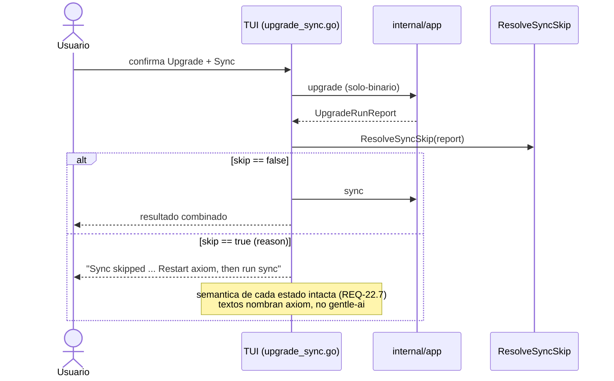
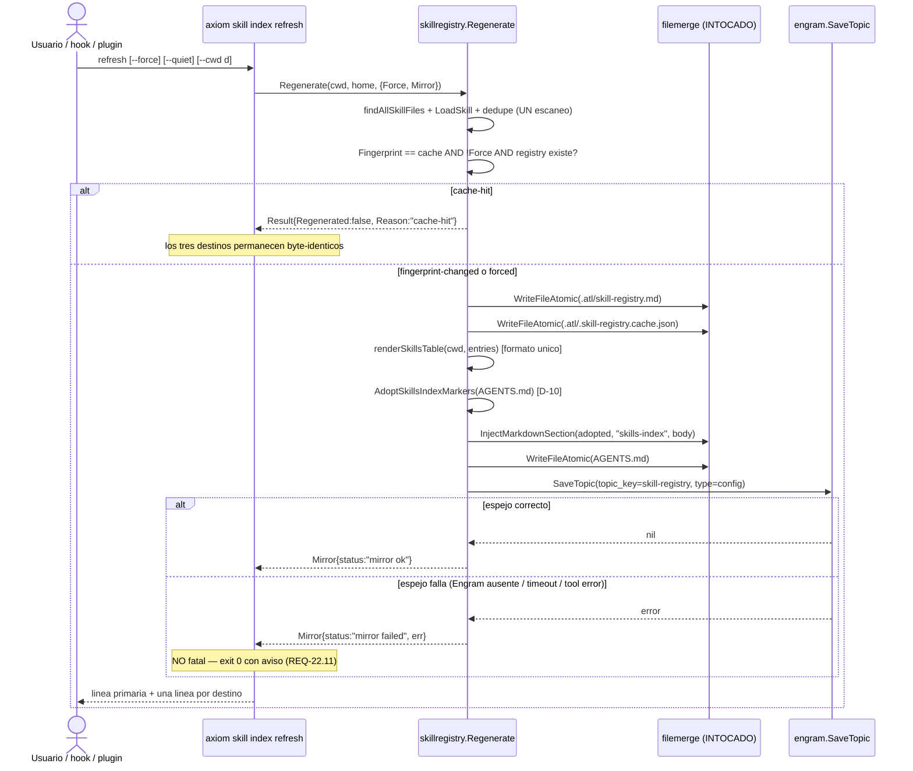
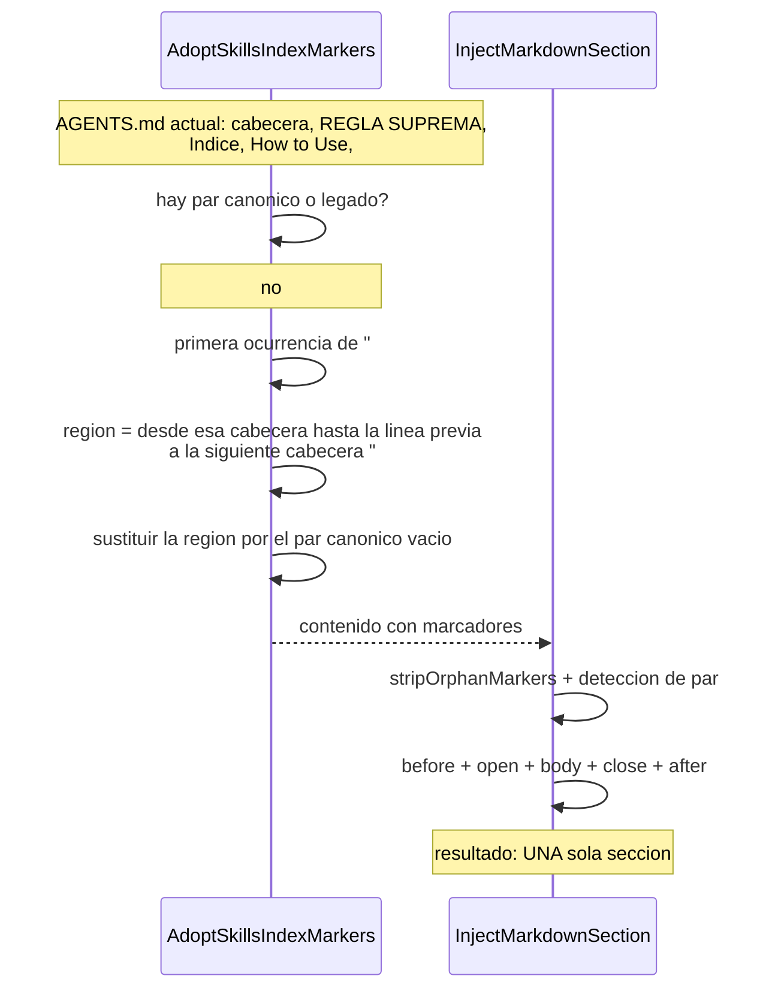

# Diseño: Actualizador Autónomo de Axiom, Encadenamiento Upgrade→Sync y Gobernanza del Índice Unificado de Skills (inc-22-axiom-updater-and-skills-index-governance)

> **Incremento:** `inc-22-axiom-updater-and-skills-index-governance`
> **Fase:** `sdd-design` · **Fecha:** 2026-09-22
> **Fuente de alcance:** `openspec/changes/inc-22-axiom-updater-and-skills-index-governance/proposal.md` y `.../spec.md` (REQ-22.1 – REQ-22.14, 36 escenarios, divergencias D-1 a D-11)
> **Idioma:** español (castellano), registro neutro y profesional, tuteo. Identificadores Go, rutas, comandos CLI, banderas y literales técnicos en inglés.
> **Verificación de árbol:** cada fichero, símbolo, número de línea y literal citado se comprobó directamente contra el árbol de trabajo el 2026-09-22. Nada se heredó de la propuesta ni de la spec sin contrastar.

---

## 0. Resumen del diseño

| Pregunta | Respuesta |
|---|---|
| ¿Cuál es la causa raíz del bloqueo Windows? | **Doble.** (1) Las salvaguardas están ancladas al literal `"gentle-ai"` y `init()` de `cmd/axiom/main.go:32-49` renombra la herramienta a `"axiom"`, dejándolas inertes. (2) `go.mod:1` declara `module github.com/gentleman-programming/gentle-ai/v3`, de modo que `go install github.com/IGutierrezZ/axiom/cmd/axiom@vX` es irresoluble por el toolchain. Ver H-1. |
| ¿Cómo se aplican las salvaguardas a `axiom` sin duplicar lógica? | **Un predicado de identidad** (`update.IsSelfTool` / `update.IsSelfToolName`) sobre un conjunto cerrado de nombres, más **valores derivados de `ToolInfo`** (nunca literales upstream) y un **módulo declarado** (`ToolInfo.GoModulePath`) que decide si un `go install` es admisible. Ver D-01, D-04. |
| ¿Cuál es la vía real de actualización en Windows? | **Compilación controlada desde clon** (`sourceBuildUpgrade`): clon por tag exacto de `Owner/Repo`, `go build ./cmd/<Name>`, reemplazo atómico tras la precondición de procedencia. Sin binarios de Releases (D-10 verificado negativo) y sin `go install` irresoluble. Degrada a manual accionable. Ver D-02, D-03. |
| ¿Cuál es el símbolo de versión? | `var version = "v0.1.0"` en `cmd/axiom` — **mismo nombre** que `cmd/gentle-ai/main.go:12` y que los `-X main.version=` que `.goreleaser.yaml:33,51` y `ci.yml:377` ya inyectan. El por defecto literal se preserva (REQ-22.8). Ver D-05. |
| ¿Dónde vive el encadenamiento `upgrade`→`sync`? | **En la capa de servicio Web UI y en la TUI**, nunca en el verbo CLI. `app.runUpgrade` conserva su contrato solo-binario. Ver D-06, D-07, D-08. |
| ¿Cómo se regenera el índice en tres destinos? | **Un escaneo, tres escrituras** dentro de `skillregistry.Regenerate`, con `Result` que reporta cada destino. `filemerge` se reutiliza **sin modificar**; la adopción de marcadores es un paso previo puro fuera de él. Ver D-09, D-10. |
| ¿Cómo persiste el binario en Engram si hoy no puede? | **Cliente MCP stdio mínimo** (`tools/call` → `mem_save`) en `internal/components/engram`, inyectado en `skillregistry` como **puerto**. Cualquier fallo es `mirror failed` + exit `0`. Ver D-11 y H-3. |
| ¿Qué NO es esto? | No es un framework de sincronización con upstream (fuera de alcance explícito). No toca el motor `filemerge`. No retira ni renombra `axiom skill-registry` (D-1, REQ-22.14). No publica binarios Windows en Releases (fuera de alcance). |
| ¿Qué NO toca este diseño? | `internal/components/filemerge/**`, `openspec/config.yaml`, `proposal.md`, `spec.md`, `docs/upstream-absorption-ledger.md`, el fallback no determinista de `DetectRoles` (O-2 de INC-21, deliberadamente no corregido), y el branding heredado fuera de `internal/tui/screens/upgrade_sync.go` (D-9 de la spec). |

---

## 1. Enfoque Técnico

### 1.1 Hallazgos de árbol que condicionan el diseño

Seis hechos verificados. Los cuatro primeros amplían o corrigen la lectura de la spec; ninguno amplía el alcance funcional.

#### H-1 — El bloqueo Windows es de **dos** frentes, y solo uno es la ruta del módulo

La spec (D-3, D-4) ya los distingue y D-3 registra además el tercer frente. El árbol confirma los tres:

1. **Salvaguardas inertes.** `internal/update/upgrade/strategy.go` ancla al literal `"gentle-ai"` en `binaryUpgrade` (`:737`), `preflightWindowsGentleAIGoInstall` (`:583`), `preflightWindowsGentleAIGoInstallWithDestination` (`:601`) e `isBetaGentleAIUpgrade` (`:642-647`, además de `Owner == "Gentleman-Programming"` y `Repo == "gentle-ai"`). `cmd/axiom/main.go:38-46` renombra la entrada a `Name: "axiom"`, `Owner: "IGutierrezZ"`, `Repo: "axiom"`. Consecuencia verificada: **ninguna** de esas salvaguardas se dispara, y `binaryUpgrade` cae en el fallback genérico de Windows (`:747-757`) que compone `https://github.com/Gentleman-Programming/%s/releases` con `r.Tool.Repo` — propietario equivocado.
2. **Módulo irresoluble.** `go.mod:1` declara `module github.com/gentleman-programming/gentle-ai/v3`. `init()` fija `GoImportPath: "github.com/IGutierrezZ/axiom/cmd/axiom"`. `effectiveMethod` (`executor.go:688`, `:741`) enruta Windows + Go disponible + `GoImportPath` no vacío a `InstallGoInstall`, y `goInstallUpgrade` (`strategy.go:564`) compone `go install github.com/IGutierrezZ/axiom/cmd/axiom@vX`, que el toolchain rechaza por discrepancia de módulo.
3. **Tercer frente, que la spec sí registra** (D-3, segunda discrepancia, asignada a REQ-22.2) y en el que este diseño profundiza. `update.GentleAISourceInstallCommand` (`internal/update/instructions.go:14-23`) compone literalmente `go install github.com/gentleman-programming/gentle-ai/v3/cmd/gentle-ai@…` — módulo **y** binario upstream. Es la instrucción que hoy se imprime como vía manual en Windows (`instructions.go:71`, `strategy.go:635`, `strategy.go:767`). Incumple REQ-22.2 por partida doble.

**Consecuencia de diseño.** Los tres frentes se resuelven con dos movimientos acoplados y una sola fuente de verdad: (a) un predicado de identidad compartido, y (b) todo valor derivado de `ToolInfo` (propietario, repo, binario, módulo declarado) en vez de literales. Ver D-01 y D-04.

#### H-2 — D-10 queda **verificado negativo**: Releases no puede tener binarios Windows

`.goreleaser.yaml:20-24` (build `axiom`) y `:42-46` (build `gentle-ai-deprecated`) declaran `goos: [linux, darwin]`. No hay build Windows en todo el pipeline de release. Además `internal/update/instructions.go:10` fija una política deliberada de producto: `WindowsDistributionHoldMessage` = "Windows binary distribution and Scoop are temporarily unavailable until publicly trusted Authenticode signing is enforced."

**Consecuencia de diseño.** La vía "descargar binario precompilado" que la propuesta menciona como primera opción **no está disponible** para Windows, y habilitarla exigiría publicar binarios sin firmar, que la propia política prohíbe. REQ-22.1 se satisface con la segunda opción de la propuesta: "proceso de compilación local/clon controlado". Nada promete assets de Releases que no existen. Ver D-02.

#### H-3 — El binario Go **no puede** escribir en Engram hoy: no hay cliente `mem_save`

Todo el código que el binario tiene frente a Engram está en `internal/components/engram`:

| Fichero | Qué hace realmente |
|---|---|
| `download.go` | Descarga el binario `engram`. |
| `healthprobe.go` | Hace `spawn` del servidor MCP `engram` por stdio y ejecuta **solo** el intercambio `initialize` (`:204`, JSON-RPC 2.0, `protocolVersion: "2024-11-05"`). El comentario de `:133-136` es explícito: "A successful probe proves only the bounded initialize exchange: **it terminates the child**". |
| `install.go`, `inject.go`, `protocol.go`, `setup.go`, `verify.go` | Instalación, inyección de configuración y verificación. Ninguno invoca `tools/call`. |

El precedente del repositorio es **emitir la carga y dejar que la persista otro**: `internal/handoff/mirror.go:9-20` define `EngramPayload` como "objeto de observación formado para guardar en Engram MCP vía `mem_save`", y el diseño de INC-21 (§5.8) documenta "`axiom sdd kickoff seal` **emite la carga**; el orquestador la persiste".

**Pero REQ-22.11 exige observar el resultado**: la salida de `refresh` debe declarar `mirror ok` / `mirror failed`, y el fallo debe ser no fatal con exit `0`. Emitir una carga sin intentar la escritura no permite declarar `mirror failed`. La spec da por supuesto una capacidad de escritura que el árbol no tiene.

**Consecuencia de diseño.** Se añade un cliente MCP stdio **mínimo y acotado** (un `initialize` + un `tools/call` de `mem_save` + terminación del hijo) en `internal/components/engram`, reutilizando la disciplina de transporte que `healthprobe.go` ya implementa, y se inyecta en `skillregistry` como puerto. Ver D-11.

#### H-4 — Las salvaguardas inertes también están en la TUI y rompen REQ-22.6

La spec (D-4) solo nombra `internal/update/upgrade/strategy.go`. El árbol muestra el **mismo** anclaje de identidad en la superficie TUI, donde decide la regla de salto de `sync` que REQ-22.6 exige:

| Sitio | Anclaje |
|---|---|
| `internal/tui/model.go:3883` | `if result.ToolName == "gentle-ai" && result.Status == upgrade.UpgradeSucceeded` |
| `internal/tui/model.go:3897` | ídem, dentro de `GentleAIUpgradeVersion()` |
| `internal/tui/screens/upgrade.go:231` | `if result.ToolName == "gentle-ai" && result.Status == upgrade.UpgradeSucceeded` |
| `internal/tui/screens/upgrade_sync.go:189` | `"⚠ Sync skipped because gentle-ai was upgraded."` |
| `internal/update/check.go:174-175` | `isGentleAIRepo`: `Name == "gentle-ai" && Owner == "Gentleman-Programming" && Repo == "gentle-ai"` |
| `internal/update/instructions.go:28` | `case "gentle-ai":` |

Tras el renombrado de `init()`, `result.ToolName` es `"axiom"`: la señal de reemplazo del binario en ejecución **no se detecta**, el aviso de reinicio no se emite y `sync` no se omite. El escenario "TUI omite `sync` y pide reinicio" de REQ-22.6 es inalcanzable sin tocar estos puntos.

**Consecuencia de diseño.** El predicado de identidad es **uno** y se aplica en todos estos sitios. El refactor es de identidad, no de branding: los textos heredados fuera de `upgrade_sync.go` siguen fuera de alcance (D-9 de la spec). Ver D-01 y D-08.

#### H-5 — La tabla de `AGENTS.md` y la de `.atl/skill-registry.md` no coinciden hoy, y §3.4 las alinea

- `AGENTS.md:32-46` declara `## Skills` con tabla de **tres** columnas (`Skill | Trigger | Path`) y **enlaces** Markdown, sin marcadores `<!-- axiom:… -->`.
- `internal/skillregistry/registry.go:270-276` emite, en `.atl/skill-registry.md`, `## Skills` con tabla de **cuatro** columnas (`Skill | Trigger / description | Scope | Path`) en **resaltado de código**, con `markdownCell` (`:408-416`) para colapsar saltos de línea, escapar `|` como `\|` y sustituir vacíos por `—`.
- `spec.md` §3.4 fija la tabla de cuatro columnas y dice literalmente "Alineado con `.atl/skill-registry.md` para mantener un único formato reconocible".

**Consecuencia de diseño.** Un único renderizador de tabla (`renderSkillsTable`) alimenta ambos destinos. La columna `Path` conserva **exactamente** el valor que `skillregistry` descubre, para que `.atl/skill-registry.md`, `axiom skill index list`, `--json` y `AGENTS.md` den la misma ruta. Ver D-09 y O-2.

#### H-6 — `filemerge.InjectMarkdownSection` añade al final sin marcadores: la adopción es obligatoria y previa

`internal/components/filemerge/section.go:441-458`: si no encuentra el par de marcadores, **anexa al final**. Sobre el `AGENTS.md` actual produciría una segunda sección `## Skills`, violando el escenario "no aparece una segunda sección `## Skills`" de REQ-22.12. El motor `filemerge` **no se modifica** (fuera de alcance explícito).

**Consecuencia de diseño.** Un paso **previo puro**, fuera de `filemerge`, envuelve la región `## Skills` existente en el par canónico vacío; después `InjectMarkdownSection` la rellena. Ver D-10.

### 1.2 Forma general

Dos dominios casi-disjuntos y sus consumidores. Nada en común salvo `internal/state` y el predicado de identidad.

```
        +-----------------------------------------------+
        |  internal/update  (identidad + ToolInfo)      |
        |  IsSelfTool, GoModulePath, SourceInstallCmd   |
        +-----------------------+-----------------------+
                                |
              +-----------------+----------------------+
              |                 |                      |
   +----------+--------+ +------+-------+  +-----------+---------+
   | internal/update/  | | internal/tui |  | internal/app        |
   | upgrade           | | + tui/screens|  | (reporte upgrade)   |
   | sourceBuildUpgrade| | identidad +  |  +-----------+---------+
   +----------+--------+ | branding     |              |
              |          +--------------+  +-----------+---------+
              |                            | internal/dashboard  |
              |                            | RunUpgradeSequence  |
              |                            +---------------------+
   +----------+-----------------------------------------------+
   |  internal/skillregistry  (motor del indice, hoja)         |
   |  Regenerate -> 3 destinos - renderSkillsTable -           |
   |  AdoptSkillsIndexMarkers - puerto MirrorFunc              |
   +------+------------------+-------------------+------------+
          |                  |                   |
   +------+-------+  +-------+--------+  +-------+----------+
   | filemerge    |  | internal/app   |  | internal/        |
   | (INTOCADO)   |  | skill index +  |  | autoskill        |
   | InjectMark.. |  | skill-registry |  | Manager.Approve  |
   | WriteFileAto |  | (mismo motor)  |  | (gancho)         |
   +--------------+  +-------+--------+  +------------------+
                             | puerto MirrorFunc
                     +-------+----------------+
                     | internal/components/   |
                     | engram  SaveTopic      |
                     | (stdio-MCP mem_save)   |
                     +------------------------+
```

**Aristas nuevas y su seguridad:**

| Arista | Existe hoy? | Cicla? | Comprobacion |
|---|---|---|---|
| `internal/update/upgrade` -> `internal/update` | ya existe | No | `update` no importa `upgrade` |
| `internal/tui` -> `internal/update` | ya existe (`model.go:42`) | No | - |
| `internal/skillregistry` -> `internal/components/filemerge` | ya existe | No | - |
| `internal/autoskill` -> `internal/skillregistry` | **nueva** | No | `skillregistry` importa solo `filemerge` |
| `internal/app` -> `internal/components/engram` | nueva (o ya latente) | No | `engram` no importa `app` |
| `internal/skillregistry` -> `internal/components/engram` | **prohibida** | Si en potencia | El espejo entra por **puerto** (`MirrorFunc`), no por import. `skillregistry` sigue siendo hoja. |

### 1.3 Frontera normativa: motor del indice != motor de fusion

`internal/components/filemerge` es un motor de fusion de secciones y formatos (Markdown, JSON, YAML, TOML) reutilizado por instalacion y sincronizacion. INC-22 lo usa **solo** a traves de `InjectMarkdownSection` y `WriteFileAtomic`, sin modificarlo. Toda la semantica del dominio de skills —que se indexa, como se renderiza la tabla, cuando se adoptan marcadores, cuando se omite un destino— vive en `internal/skillregistry`. Un *diff* de cualquier rebana que toque `internal/components/filemerge/**` esta mal derivado de este diseno.

---

## 2. Decisiones de Arquitectura

### D-01 — Un predicado de identidad del self-tool, sobre un conjunto cerrado de nombres, y valores derivados de `ToolInfo`

**Eleccion.** Tres piezas en `internal/update` (el paquete que ya posee `ToolInfo`, `types.go:40-47`):

```go
// internal/update/types.go

// selfToolNames is the closed set of on-disk/registry names that identify the
// primary CLI product across its rename. `init()` in cmd/axiom/main.go rewrites
// the shipped "gentle-ai" registry entry to "axiom"; every upgrade safeguard
// MUST route through IsSelfToolName so that rename can never disable one (REQ-22.3).
var selfToolNames = map[string]bool{"axiom": true, "gentle-ai": true}

func IsSelfToolName(name string) bool {
    return selfToolNames[strings.ToLower(strings.TrimSpace(name))]
}

func IsSelfTool(tool ToolInfo) bool { return IsSelfToolName(tool.Name) }

// GoModulePath is the `module` directive the published source actually declares.
// It is the single source of truth for whether `go install <GoImportPath>@ver`
// is resolvable by the toolchain (REQ-22.2).
type ToolInfo struct {
    // ... campos existentes sin cambios ...
    GoModulePath string
}

// GoInstallResolvable reports whether a `go install` naming GoImportPath can be
// resolved against the declared module path. For the fork this is false while
// go.mod declares the upstream module, and the system MUST NOT emit or run any
// `go install` for it (REQ-22.2).
func (t ToolInfo) GoInstallResolvable() bool {
    m := strings.TrimSpace(t.GoModulePath)
    p := strings.TrimSpace(t.GoImportPath)
    if m == "" || p == "" {
        return false
    }
    return p == m || strings.HasPrefix(p, m+"/")
}
```

Declaracion en el registro (`internal/update/registry.go:17-33`), **sin** renombrar la entrada:

```go
{
    Name:          "gentle-ai",
    Owner:         "Gentleman-Programming",
    Repo:          "gentle-ai",
    // ...
    InstallMethod: InstallBinary,
    GoImportPath:  "github.com/gentleman-programming/gentle-ai/v3/cmd/gentle-ai",
    GoModulePath:  "github.com/gentleman-programming/gentle-ai/v3", // go.mod:1, verificado
},
```

Y `cmd/axiom/main.go` `init()` pasa a **mutacion campo a campo**, no a reemplazo del struct completo — precisamente para que ningun campo anadido se pierda en silencio:

```go
func init() {
    for i := range update.Tools {
        if update.IsSelfToolName(update.Tools[i].Name) {
            t := &update.Tools[i]
            t.Name = "axiom"
            t.Owner = "IGutierrezZ"
            t.Repo = "axiom"
            t.DetectCmd = nil
            t.VersionPrefix = "v"
            t.InstallMethod = update.InstallBinary
            t.GoImportPath = "github.com/IGutierrezZ/axiom/cmd/axiom"
            // GoModulePath se conserva: es lo que go.mod declara de verdad.
        }
    }
}
```

Resultado verificable: para la entrada del fork, `GoInstallResolvable()` es `false` (el prefijo `github.com/gentleman-programming/gentle-ai/v3/` no es prefijo de `github.com/IGutierrezZ/axiom/cmd/axiom`). Para la entrada upstream intacta (binario deprecado `cmd/gentle-ai`) es `true`. Cuando `go.mod` migre a `github.com/IGutierrezZ/axiom/v3`, actualizar `GoModulePath` y `GoImportPath` **a la vez** reactiva el `go install` sin tocar ninguna salvaguarda.

**Alternativas descartadas.**

1. *Comparar `GoImportPath` contra `github.com/<Owner>/<Repo>/` para decidir si el `go install` es admisible.* Descartada porque **miente en el caso del fork**: `github.com/IGutierrezZ/axiom/cmd/axiom` si tiene ese prefijo, y sin embargo es irresoluble, que es exactamente el bloqueo que hay que detectar. La comparacion correcta es contra la directiva `module` publicada, que solo puede declararse, no derivarse del `Owner`/`Repo`.
2. *Un campo `ToolInfo.SelfTool bool` en vez del conjunto de nombres.* No sirve para los puntos que comprueban **cadenas**, no `ToolInfo`: `result.ToolName == "gentle-ai"` en `internal/tui/model.go:3883,3897` y `internal/tui/screens/upgrade.go:231` reciben `upgrade.ToolResult`, cuyo campo es un `string`. O habria que ampliar ese tipo (radio mayor) o se volveria a duplicar la logica de identidad.
3. *Un predicado basado en el slot del registro (indice o identificador estable).* Exigiria un campo nuevo igualmente y no ayudaria a las comprobaciones sobre cadenas. Conjunto cerrado + comentario que fija la invariante es suficiente: `update.Tools` es un registro **que posee este repositorio**, y ninguna entrada ajena se llama `axiom`.
4. *Dejar `isBetaGentleAIUpgrade`, `isGentleAIRepo`, etc. con sus propios literales y solo arreglar `strategy.go`.* Es el estado actual y es la causa de D-4. REQ-22.3 dice "**Toda** salvaguarda".

**Justificacion.** REQ-22.3 pide aplicar las salvaguardas a `axiom` **sin duplicar la logica**. Un predicado es una logica; seis literales son seis logicas que ya han divergido. El conjunto cerrado documentado convierte el renombrado de `init()` en un hecho que el predicado absorbe, no en una bomba de relojeria. La mutacion campo a campo elimina toda una clase de defecto: el reemplazo de struct completo que `init()` hace hoy (`main.go:38-46`) es exactamente como un campo futuro se perderia.

---

### D-02 — Via resiliente en Windows: compilacion controlada desde clon, con degradacion a manual

**Eleccion.** Un metodo de instalacion nuevo, `InstallSourceBuild`, ruteado por `effectiveMethod` para el self-tool en Windows cuando `!tool.GoInstallResolvable()`, e implementado por `sourceBuildUpgrade`:

```
1. Preflight de procedencia (D-03). Si falla -> ManualFallbackError, cero ficheros tocados.
2. git clone --depth 1 del tag exacto:
     https://github.com/<Owner>/<Repo>.git   refspec refs/tags/v<LatestVersion>
   en un directorio temporal impredecible (mismo patron que ggaScriptUpgradeForOS,
   strategy.go:924-968).
3. go build -trimpath -o <tmp>/<binaryName> ./cmd/<Name>   dentro del clon.
4. Reemplazo atomico del binario activo (reutilizando atomicReplace de download.go).
5. Cualquier fallo de 1-4 antes del paso 4 -> ManualFallbackError accionable;
   ningun binario a medias; ningun segundo binario en PATH.
```

Para canal beta (`IsSelfBetaUpgrade`, ex `isBetaGentleAIUpgrade`), la misma funcion con ref `refs/heads/main` en vez de tag: **una** implementacion de compilacion para release y para beta.

La ruta Unix no cambia: `binaryUpgrade` -> `downloadAndReplace` (asset de Releases con verificacion minisign) sigue siendo la via de Linux/macOS, que si publica `.goreleaser.yaml`.

**Alternativas descartadas.**

1. *Publicar binarios Windows en Releases y descargarlos.* Descartada por H-2: `.goreleaser.yaml` no compila para Windows y `WindowsDistributionHoldMessage` (`instructions.go:10`) prohibe distribuir binarios Windows hasta tener firma Authenticode de confianza publica. Habilitarlo seria una decision de producto nueva, y la spec lo declara fuera de alcance (§7).
2. *Degradar **siempre** a manual en Windows.* Rompe el escenario REQ-22.1 "Actualizacion disponible en Windows con estrategia automatizada valida", que exige que "el sistema completa la actualizacion" y que "el binario activo queda reemplazado de forma atomica" cuando existe una estrategia valida. Y la compilacion desde clon **si** es una estrategia valida con los prerequisitos que el propio mensaje manual ya exige ("Install/update from source with Go 1.25.10+", `instructions.go:71`).
3. *Forzar la migracion de `go.mod` a `github.com/IGutierrezZ/axiom/v3` para hacerlo resoluble por `go install`.* Es trabajo de INC-20 (su F1 migro `/v2` a `/v3`) y mueve los ~351 *imports* del arbol. INC-22 no debe abrir ese frente. La declaracion `GoModulePath` deja la puerta exactamente donde debe estar.
4. *Usar `go install` y capturar el error del toolchain como senal.* Viola REQ-22.2, que dice del `go install` no resoluble: "el sistema **NO DEBE ejecutarlo**". Un intento fallido ya es una ejecucion.

**Justificacion.** Es literalmente la segunda opcion que la propuesta ya contempla ("proceso de compilacion local/clon controlado"), y es la unica de las tres que satisface REQ-22.1 sin prometer artefactos inexistentes ni incumplir una politica de producto firmada. El clon por tag exacto evita el sesgo de `main`; `go build` dentro del clon usa el `go.mod` **del clon** y por tanto no tropieza con la discrepancia de ruta de modulo, que solo afecta a la resolucion `go install <ruta>@version`. La latencia de compilar es el coste honesto de no tener binarios firmados.

---

### D-03 — Precondicion de escritura del binario activo: una sola, compartida por toda via de escritura

**Eleccion.** Generalizar `preflightWindowsGentleAIGoInstallWithDestination` (`strategy.go:600-618`) a `preflightWindowsSelfBinaryWrite(tool, profile) error`, **activa para el self-tool** (por `IsSelfTool`) y **para toda via que escriba el binario**: `goInstallUpgrade` cuando `GoInstallResolvable()`, y `sourceBuildUpgrade`. Se mantienen el nombre y la semantica de `sameBinaryPathForOS`, `goInstallDestinationDir`, `goInstallBinaryName` y `absoluteBinaryPath` (`go_install_destination.go`), ya parametrizados por nombre de herramienta y SO.

Regla, sin cambios respecto a la actual:

- destino (`GOBIN`/`GOPATH`/`go env`) **y** activo (`lookPathFn(tool.Name)`) ambos resolubles y distintos `->` `ManualFallbackError` que **nombra las dos rutas** y como migrar de forma intencionada; **ningun** segundo binario se escribe.
- activo irresoluble `->` `ManualFallbackError`.
- destino irresoluble `->` `ManualFallbackError`.

**Alternativa descartada.** *Dejar una preflight para `go install` y otra para la compilacion desde clon.* Es exactamente la duplicacion que REQ-22.3 prohibe: la garantia es una ("no crear un segundo binario visible en PATH"), no dos implementaciones de la misma garantia.

**Justificacion.** El escenario REQ-22.1 "El reemplazo del binario no deja duplicados en PATH" es independiente de **como** se obtenga el binario. Acoplarlo a una via concreta es como se pierde en la segunda via.

---

### D-04 — Toda instruccion de instalacion se **deriva** de `ToolInfo`; cero literales upstream

**Eleccion.** Sustituir `GentleAISourceInstallCommand(version string)` por:

```go
// SourceInstallCommand returns the actionable install/update instruction for a
// tool at an exact release, a beta main build, or the latest release when
// version is empty. It emits a `go install` ONLY when the tool's declared module
// makes that command resolvable (REQ-22.2); otherwise it emits a clone-and-build
// instruction naming the tool's own Owner/Repo and never names upstream.
func SourceInstallCommand(tool ToolInfo, version string) string
```

Dos ramas, y **ninguna** literal upstream:

| `tool.GoInstallResolvable()` | Instruccion emitida |
|---|---|
| `true` | `go install <tool.GoImportPath>@<target>` (`target` en `v<X>`, `main`, `latest`; misma logica que hoy) |
| `false` | Instruccion de clon + build que nombra `https://github.com/<Owner>/<Repo>` y `./cmd/<Name>`, **sin** `go install` |

Y todos los mensajes que hoy compone un literal upstream pasan a derivar de `ToolInfo`:

| Sitio | Literal actual | Derivado |
|---|---|---|
| `instructions.go:22` | `go install github.com/gentleman-programming/gentle-ai/v3/cmd/gentle-ai@` | `SourceInstallCommand(tool, ...)` |
| `instructions.go:67` | `raw.githubusercontent.com/Gentleman-Programming/gentle-ai/main/scripts/install.sh` | `raw.githubusercontent.com/<Owner>/<Repo>/main/scripts/install.sh` |
| `instructions.go:61-62` | `brew upgrade gentle-ai` / `homebrewPackageInstalled("gentle-ai")` | `brew upgrade <Name>` / `homebrewPackageInstalled(tool.Name)` |
| `strategy.go:114` | `https://github.com/Gentleman-Programming/%s` | `https://github.com/<Owner>/<Repo>` |
| `strategy.go:753` | `https://github.com/Gentleman-Programming/%s/releases` | `https://github.com/<Owner>/<Repo>/releases` |
| `strategy.go:670-680` `gentleAIModulePath` | calcula `<Owner>/<Repo>/v3` en minusculas | devuelve `tool.GoModulePath` **declarado** |
| `strategy.go:658` | `module + "/cmd/gentle-ai@main"` | `tool.GoImportPath + "@main"` solo si `GoInstallResolvable()` |

`gentleAIModulePath` deja de calcular y pasa a leer: el valor calculado produce hoy `github.com/igutierrezz/axiom/v3` para el fork, que es un modulo inexistente y en minusculas. Se elimina `GentleAISourceInstallCommand` (solo tiene consumidores internos: `check.go:201`, `instructions.go:71`, `strategy.go:635`, `strategy.go:767`, mas un test: `internal/update/check_test.go:630`) en vez de mantener un envoltorio deprecado: un envoltorio es una segunda superficie de mantenimiento para una funcion que debe dejar de existir.

**Alternativa descartada.** *Parametro `owner, repo, name string` sueltos en cada funcion.* Multiplica firmas y vuelve a permitir que un llamador pase un literal. `ToolInfo` ya es el registro de identidad; pasarlo es la forma de que el compilador obligue a decidir desde que entrada se deriva el mensaje.

**Justificacion.** REQ-22.2, su escenario "La pista de actualizacion nombra el fork, no upstream" (prohibe `github.com/gentleman-programming/gentle-ai` **y** `cmd/gentle-ai`) y su escenario "Discrepancia de modulo detectada, sin `go install` abortado a mitad". Derivar de `ToolInfo` hace imposible que un mensaje vuelva a nombrar un propietario ajeno.

---

### D-05 — Simbolo de version: `var version` en `cmd/axiom`, con el por defecto literal preservado

**Eleccion.** En `cmd/axiom/main.go:51-55`, sustituir:

```go
const (
    Version   = "v0.1.0"
    Platform  = "axiom"
    GitCommit = "dev"
)
```

por:

```go
// version is the build-time version injection point. GoReleaser and CI set it
// with `-X main.version=...`, the SAME symbol name and package location that
// cmd/gentle-ai/main.go:12 already exposes, so one ldflags block serves both
// binaries (.goreleaser.yaml:33,51 and ci.yml:377). REQ-22.8: the default below
// is the historical cmd/axiom development marker and MUST remain the
// no-injection value.
var version = "v0.1.0"

const (
    Platform  = "axiom"
    GitCommit = "dev" // no release pipeline injects a commit symbol today
)

// Version is the value `axiom version` reports. Exported under this name because
// cli.AppVersion, app.Version and main_test.go already bind to it.
var Version = version
```

`printVersion()` (`:153-155`) conserva **byte a byte** su cadena de formato: `"%s version %s (%s/%s) commit:%s\n"`. `main()` (`:163-164`) sigue asignando `cli.AppVersion = Version` y `app.Version = Version`. `TestAppVersionInitialization` (`main_test.go:15-18`) sigue pasando sin cambios.

Los `-X main.version=` existentes **no se tocan**: `cmd/gentle-ai/main.go:12` ya declara `var version = "dev"`, y `cmd/axiom` pasa a exponer el mismo simbolo. Es el objetivo que `.goreleaser.yaml:33` y `:51` ya asumen para ambos builds, y que `ci.yml:377` ya asume para `./cmd/axiom`.

**Alternativas descartadas.**

1. *Apuntar `ldflags` a `main.Version` y dejar `cmd/gentle-ai` en `main.version`.* Arregla el no-op, pero **institucionaliza la asimetria** que causo D-7: dos binarios del mismo release con simbolos distintos para el mismo concepto. `.goreleaser.yaml` ya esta escrito asumiendo `main.version` para ambos.
2. *Usar `var version = "dev"` + `app.ResolveVersion(version)`, como `cmd/gentle-ai`.* Gana la lectura de `debug.BuildInfo` en compilaciones `go install`, pero **cambia** el por defecto sin inyeccion de `"v0.1.0"` a `"dev"`, y REQ-22.8 dice que el valor por defecto "**debe seguir siendo** el marcador de desarrollo actual". Se descarta por preservacion, y se eleva como O-1.
3. *Inyectar ademas `main.GitCommit`.* REQ-22.8 solo exige coherencia de **version** y solo prohibe que el `ldflags` quede sin efecto. Ningun pipeline inyecta hoy un commit: anadirlo amplia el alcance sin requerimiento. `GitCommit` se queda en `"dev"`.

**Justificacion.** La causa de D-7 es que el linker apunta a un simbolo inexistente. El arreglo minimo y mas seguro es **dar al simbolo el nombre que el linker ya usa**, que ademas es el que el otro binario ya declara. Todo lo demas —formato de salida, valor por defecto, asignaciones a `cli.AppVersion`/`app.Version`— queda identico, que es lo que REQ-22.8 exige preservar.

---

### D-06 — El encadenamiento `upgrade` a `sync` vive en la capa de servicio Web UI y en la TUI; el verbo CLI sigue siendo solo-binario

**Eleccion.** Tres planos separados, sin solapamiento:

| Plano | Quien lo compone | Llama a `sync`? | Regido por |
|---|---|---|---|
| Verbo CLI `axiom upgrade` | `internal/app.runUpgrade` (`app.go:511-513`) | **Nunca** | REQ-22.5 |
| Web UI `POST /api/ecosystem/upgrade` | `internal/dashboard.Service.RunUpgradeSequence` (nuevo) | Si, tras `upgrade` | REQ-22.4 |
| TUI pantalla combinada | `internal/tui/screens/upgrade_sync.go` | Si, con regla de salto | REQ-22.6 |

`app.runUpgrade` **no se modifica en su comportamiento**: sigue ejecutando solo actualizaciones binarias. Su contrato esta fijado por el comentario de `app.go:511` ("Executes binary-only upgrades; does NOT invoke install or sync pipelines") y por `internal/app/upgrade_test.go` (`TestRunArgs_UpgradeDryRun` y `TestRunArgs_UpgradeOutput_BinariesOnly`), que son la compuerta de control de D-8. Lo unico que se le anade es una **devolucion estructurada** junto al texto ya impreso:

```go
// internal/app — tipos nuevos y punto de entrada.
type UpgradeToolOutcome struct {
    ToolName   string
    Status     string // upgrade.UpgradeSucceeded | UpgradeFailed | UpgradeSkipped
    NewVersion string
    ManualHint string // de ManualFallbackError.Hint cuando Status == UpgradeSkipped
}

type UpgradeRunReport struct {
    PerTool         []UpgradeToolOutcome
    SelfToolName    string // "axiom" tras init()
    RestartRequired bool   // true si el binario axiom en ejecucion fue reemplazado
    ManualHint      string // poblado cuando el self-tool quedo en skipped
    Status          string // "succeeded" | "failed" | "skipped"
}

// RunUpgradeReport ejecuta EXACTAMENTE lo que runUpgrade ejecuta (solo-binario)
// y devuelve ademas el resultado estructurado. runUpgrade se convierte en un
// envoltorio que la invoca e imprime, conservando su salida byte a byte.
func RunUpgradeReport(ctx context.Context, parsed upgradeArgs, result system.DetectionResult, stdout io.Writer) (UpgradeRunReport, error)
```

`Service.RunUpgradeSequence` compone la cadena **desde fuera** de `app`:

```go
func (s *Service) RunUpgradeSequence() (*EcosystemActionResponse, error) {
    up, upErr := app.RunUpgradeReport(ctx, ...)      // fase 1
    // fase 2 SOLO si up.Status == "succeeded" && !up.RestartRequired
    //   -> cli.RunSync(...)  (mismo primitivo que Service.RunSync, service.go:1069)
    //   en otro caso: SyncPhaseReport{Executed:false, SkippedReason: ...}
}
```

**Alternativas descartadas.**

1. *Encadenar dentro de `app.runUpgrade`.* Rompe REQ-22.5 y la compuerta de control D-8: `upgrade_test.go` fija que `upgrade` no invoca `install` ni `sync`, y `tui-ui-parity` describe hoy el endpoint como equivalente a `axiom upgrade` **solo**. Un unico verbo con dos semanticas segun quien lo llame es exactamente la confusion que D-8 denuncia.
2. *Parsear la salida textual de `app.RunArgs(["upgrade","--yes"])` para deducir `status`/`restart_required`/`manual_hint`.* Fragil por construccion: un cambio de prosa romperia el DTO. Los datos ya existen en estructura (`upgrade.UpgradeSucceeded`/`UpgradeSkipped`/`UpgradeFailed` y `ManualFallbackError.Hint`).
3. *Dejar el encadenamiento tambien en TUI pero no en Web UI.* REQ-22.4 lo exige para el endpoint, y la TUI ya lo implementa (H-4). Es la Web UI la que falta.

**Justificacion.** REQ-22.5 dice "**Sigue siendo solo-binario**: NO DEBE invocar `install` ni `sync`". REQ-22.4 y REQ-22.6 hablan de "Web UI y TUI". El diseno respeta literalmente esa division: la cadena es una **composicion de dos primitivas** en el consumidor que la necesita, no una ampliacion del verbo.

---

### D-07 — Reporte por fases con claves opcionales, y la forma concreta del DTO

**Eleccion.** Ampliar `EcosystemActionResponse` (`internal/dashboard/types.go:206-212`) de forma **aditiva**, para que `POST /api/ecosystem/sync` y `RestoreBackup` (los otros consumidores del mismo DTO) no se vean obligados a poblar nada nuevo — spec §2.2:

```go
type EcosystemActionResponse struct {
    Success  bool             `json:"success"`
    Action   string           `json:"action"`
    Message  string           `json:"message"`
    Output   []string         `json:"output,omitempty"`
    Error    string           `json:"error,omitempty"`
    Sequence string           `json:"sequence,omitempty"` // literal "upgrade->sync"
    Phases   *EcosystemPhases `json:"phases,omitempty"`
}

type EcosystemPhases struct {
    Upgrade UpgradePhaseReport `json:"upgrade"`
    Sync    SyncPhaseReport    `json:"sync"`
}

// Los campos que la spec §2.2 marca como obligatorios dentro de phases NO
// llevan omitempty, para que siempre esten presentes en el JSON.
type UpgradePhaseReport struct {
    Success         bool     `json:"success"`
    Status          string   `json:"status"` // "succeeded" | "failed" | "skipped"
    RestartRequired bool     `json:"restart_required"`
    ManualHint      string   `json:"manual_hint"`
    Output          []string `json:"output,omitempty"`
    Error           string   `json:"error,omitempty"`
}

type SyncPhaseReport struct {
    Success       bool     `json:"success"`
    Executed      bool     `json:"executed"`
    SkippedReason string   `json:"skipped_reason"` // "" | "restart-required" | "upgrade-failed"
    Files         []string `json:"files,omitempty"`
    Output        []string `json:"output,omitempty"`
    Error         string   `json:"error,omitempty"`
}
```

Reglas de semantica (spec §2.3, literales):

1. `upgrade` se ejecuta **primero** y corresponde al comportamiento de `axiom upgrade` (solo-binario).
2. `sync` se ejecuta **solo si** `phases.upgrade.status == "succeeded"` **y** `phases.upgrade.restart_required == false`.
3. `restart_required == true` `->` `sync` **no** se ejecuta, `executed: false`, `skipped_reason: "restart-required"`.
4. `status == "failed"` `->` `sync` **no** se ejecuta, `executed: false`, `skipped_reason: "upgrade-failed"`.
5. `success` superior es `true` cuando toda fase **ejecutada** tuvo exito, incluso si `sync` quedo omitido por `restart-required`; `false` si alguna fase ejecutada fallo o si `sync` quedo omitido por `upgrade-failed`.

Codigos HTTP: `200` con reporte (total o parcial), `405` para metodo distinto de `POST` sin efectos, `500` solo cuando el servicio no logra producir reporte alguno. `handleEcosystemUpgrade` (`server.go:625-636`) **ya** devuelve `405` y `200`/`500` correctamente: solo cambia que servicio invoca.

`restart_required` se deriva del predicado de identidad, que es exactamente lo que la spec §2.2 define ("`true` cuando la fase reemplazo el binario `axiom` en ejecucion"):

```go
restart := update.IsSelfToolName(outcome.ToolName) && outcome.Status == upgrade.UpgradeSucceeded
```

**Alternativa descartada.** *Un DTO nuevo `EcosystemUpgradeSequenceResponse`.* Exigiria un segundo tipo de respuesta para un endpoint cuya forma la spec §2.2 fija **sobre** `EcosystemActionResponse`, y obligaria a `handleEcosystemUpgrade` a divergir de `handleEcosystemSync` en el manejo de errores. La adicion con `omitempty` es el patron que este repositorio ya usa para ampliar contratos JSON (`status_v2.go`, `omitempty` de `Consent`/`Archived`).

**Justificacion.** Los consumidores que no conocen `phases` leen exactamente el documento de hoy. Los que si lo conocen reciben el reporte consolidado que REQ-22.4 exige. Y los campos obligatorios dentro de `phases` van **sin** `omitempty`, para que la obligatoriedad del contrato se vea en el JSON y no solo en el struct.

---

### D-08 — La regla de salto de `sync` es **una** funcion pura compartida por TUI y Web UI

**Eleccion.** Una funcion, dos consumidores:

```go
// ResolveSyncSkip encodes the post-upgrade sync skip rule (REQ-22.6): when the
// running axiom binary was replaced, sync MUST NOT run and MUST be reported with
// an explicit reason. A fatal upgrade failure also skips sync. This is the
// single source of truth for Web UI and TUI.
func ResolveSyncSkip(u UpgradeRunReport) (skip bool, reason string)
//   u.RestartRequired      -> true,  "restart-required"
//   u.Status == "failed"   -> true,  "upgrade-failed"
//   en otro caso           -> false, ""
```

Los textos de `upgrade_sync.go:189-191` pasan a nombrar `axiom` (REQ-22.7) conservando **la semantica de cada estado**: confirmacion, progreso de `upgrade`, progreso de `sync`, resultado combinado y omision por reinicio. `upgrade_sync_test.go:135-136` exige la subcadena `"sync skipped"`, que se conserva en la redaccion nueva. Tambien `upgrade_sync.go:84` ("Updates gentle-ai, engram, and gga to latest versions") se reescribe nombrando `axiom` y conservando el sentido.

`internal/tui/model.go:3883` y `:3897`, e `internal/tui/screens/upgrade.go:231`, pasan de `result.ToolName == "gentle-ai"` a `update.IsSelfToolName(result.ToolName)` (H-4). El nombre del metodo `GentleAIUpgradeVersion` se conserva: es un identificador interno, no prosa de usuario, y renombrarlo ampliaria el radio del diff sin aportar a REQ-22.7.

**Alternativa descartada.** *Dos copias de la regla, una en `internal/tui/model.go:3824-3848` y otra en `internal/dashboard/service.go`.* Es exactamente como `upgrade_sync.go` y `/api/ecosystem/upgrade` acabarian discrepando sobre cuando saltar `sync`, que es la divergencia D-8 que este incremento viene a cerrar.

**Justificacion.** REQ-22.6 dice "Esta regla NO DEBE relajarse por el hecho de que `sync` este ahora encadenado". Una regla que se copia se relaja; una funcion compartida no.

---

### D-09 — Un escaneo, tres destinos, y `Result` que reporta cada uno

**Eleccion.** `skillregistry.Regenerate` pasa a ser el **unico** punto que escanea y escribe los tres destinos, con un resultado estructurado por destino:

```go
// internal/skillregistry
type RegenerateOptions struct {
    Force  bool
    Mirror MirrorFunc // puerto; nil -> mirror failed (D-11)
}

type DestinationStatus string

const (
    DestUpdated   DestinationStatus = "updated"
    DestUnchanged DestinationStatus = "unchanged"
    DestOmitted   DestinationStatus = "omitted" // AGENTS.md ausente: no se crea (§3.6)
)

type DestinationOutcome struct {
    Status DestinationStatus
    Path   string
    Reason string
}

type MirrorStatus string

const (
    MirrorOK     MirrorStatus = "mirror ok"
    MirrorFailed MirrorStatus = "mirror failed"
)

type MirrorOutcome struct {
    Status MirrorStatus
    Err    error
}

type Result struct {
    Regenerated bool
    SkillCount  int
    Reason      string // "cache-hit" | "fingerprint-changed" | "forced"
    Registry    string
    Cache       string
    Agents      DestinationOutcome
    Mirror      MirrorOutcome
}

func Regenerate(cwd, home string, opts RegenerateOptions) (Result, error)
```

Orden de escritura y semantica de fallo, que la spec §1.1 ya define ("parcial ya emitido"):

| # | Destino | Fallo | Codigo |
|---|---|---|---|
| 1 | `.atl/skill-registry.md` | fatal | `1` |
| 2 | `.atl/.skill-registry.cache.json` | fatal | `1` |
| 3 | `AGENTS.md` (seccion `## Skills`) | fatal **si existe**; `omitted` si no existe | `1` / `0` |
| 4 | topico Engram `skill-registry` | **no fatal** | `0` con `mirror failed` |

La cache de huella conserva su papel: `Reason == "cache-hit"` `->` **ningun** destino se escribe y los tres permanecen byte-identicos (escenario REQ-22.11 "Sin cambios, la huella evita trabajo"). El filtro de exclusiones (`registry.go:32-34`: `_shared`, `skill-registry`, prefijo `sdd-`) se conserva sin cambios y se aplica una sola vez, aguas arriba de los tres destinos.

El renderizador de tabla se **extrae** para que no haya dos formatos:

```go
// renderSkillsTable is the single table renderer shared by .atl/skill-registry.md
// and the managed `## Skills` content of AGENTS.md (spec §3.4: "Alineado con
// .atl/skill-registry.md para mantener un unico formato reconocible").
func renderSkillsTable(cwd string, entries []SkillEntry) string
```

`RenderRegistry` (`registry.go:257-283`) lo invoca en lugar de emitir su tabla en linea. El contenido gestionado de `AGENTS.md` (spec §3.3) es exactamente: la linea de titulo `## Skills`, una linea en blanco, la tabla de `renderSkillsTable`, un salto de linea final — con el titulo **dentro** del contenido gestionado.

**Alternativas descartadas.**

1. *Tres llamadas a tres funciones desde el CLI, con tres escaneos.* Viola el requisito literal "a partir de **un unico escaneo**" y garantiza que los tres destinos puedan divergir si uno se invoca con `--force` y otro no.
2. *Devolver solo el markdown y que cada consumidor escriba donde le toque.* Reparte la politica de fallos (fatal / no fatal / omitido) en tres sitios, y es como el gancho de `autoskill` olvidaria `AGENTS.md`.
3. *Incluir `Scope` solo en `.atl/skill-registry.md`.* Rompe "unico formato reconocible" (§3.4).

**Justificacion.** REQ-22.11 pide tres destinos **de un solo escaneo** con semanticas de fallo distintas por destino. Eso es exactamente lo que un `Result` con un estado por destino hace observable y testeable, y lo que permite que `axiom skill index refresh` declare su linea por destino sin re-leer ficheros.

---

### D-10 — Adopcion de marcadores como paso **previo** puro, fuera de `filemerge`

**Eleccion.** Una funcion pura en `internal/skillregistry`, ejecutada **antes** de `InjectMarkdownSection`:

```go
// AdoptSkillsIndexMarkers rewrites an AGENTS.md body so that its `## Skills`
// region is wrapped in the canonical marker pair, preparing it for
// filemerge.InjectMarkdownSection. It exists because InjectMarkdownSection
// APPENDS at end of file when it finds no marker pair
// (internal/components/filemerge/section.go:441-458), which would duplicate the
// section (REQ-22.12). The filemerge engine is reused unmodified.
//
// Contract (spec §3.5):
//   - canonical OR legacy pair already present   -> returned unchanged
//   - no pair + `## Skills` at line start        -> that region (from the header
//     up to the line before the next `## ` at line start, or EOF) is replaced in
//     situ by an empty canonical pair
//   - no pair + no `## Skills` header            -> returned unchanged
//     (InjectMarkdownSection then appends, per §3.5 final paragraph)
func AdoptSkillsIndexMarkers(existing string) string
```

Despues, la llamada canonica:

```go
body := "## Skills\n\n" + renderSkillsTable(cwd, entries) + "\n"
adopted := AdoptSkillsIndexMarkers(existing)
merged := filemerge.InjectMarkdownSection(adopted, "skills-index", body)
filemerge.WriteFileAtomic(agentsPath, []byte(merged), 0o644)
```

Invariantes que esta composicion satisface (spec §3.6), verificadas contra el cuerpo real de `InjectMarkdownSection`:

| Invariante | Por que se cumple |
|---|---|
| Atomicidad | `WriteFileAtomic` (`filemerge/writer.go`), unica escritura del fichero completo. |
| Preservacion fuera de marcadores | `InjectMarkdownSection` solo reconstruye `before + open + content + close + after` (`section.go:423-433`). |
| Idempotencia | Con el par ya presente, `AdoptSkillsIndexMarkers` devuelve identico y `InjectMarkdownSection` reconstruye el mismo bloque. |
| Reparacion | `stripOrphanMarkers` y `stripSectionDuplicates` (`section.go:321-353`, `:284-305`) ya estan en `InjectMarkdownSection`. |
| Elevacion del legado | `InjectMarkdownSection` ya reconoce `<!-- gentle-ai:... -->` y emite el canonico (`section.go:382-396`). |
| No-creacion | Comprobacion previa de existencia de `AGENTS.md`; si falta `->` `DestOmitted`, sin `WriteFileAtomic`. |

El `sectionID` es `"skills-index"` (spec §3.2). `openMarker`/`closeMarker`/`legacyOpenMarker`/`legacyCloseMarker` (`section.go:263-281`) ya producen exactamente `<!-- axiom:skills-index -->`, `<!-- /axiom:skills-index -->` y su legado, sin que `skillregistry` tenga que formarlos a mano.

**Alternativas descartadas.**

1. *Modificar `InjectMarkdownSection` para que sustituya una cabecera `## ` cuando no hay marcadores.* Fuera de alcance explicito (§7 de la spec: "Modificaciones al motor `filemerge`: se reutiliza integro y sin tocar"). Y alteraria el comportamiento de **todos** los consumidores de instalacion y sincronizacion.
2. *Borrar la region `## Skills` a mano y dejar que `InjectMarkdownSection` anexe al final.* Mueve la seccion del final del documento a otro sitio, rompiendo "todo el contenido fuera de los marcadores permanece byte-identico" en la primera adopcion: la posicion de la seccion forma parte del documento.
3. *Escribir directamente el bloque marcado sin pasar por `InjectMarkdownSection`.* Reimplementaria la reparacion de huerfanos, el colapso de duplicados y la elevacion de legado que `filemerge` ya hace y ya prueba.

**Justificacion.** D-5 de la spec identifica con precision el defecto (`InjectMarkdownSection` anexa) y su consecuencia (seccion duplicada). La correccion correcta es **preparar la entrada** de un motor que no se toca: la adopcion es una normalizacion de forma, no una fusion.

---

### D-11 — El espejo Engram es un **puerto** inyectado, servido por un cliente MCP stdio minimo

**Eleccion.** Dos piezas.

**(a) El puerto**, en `internal/skillregistry` — sin importar nada de Engram, para que el paquete siga siendo hoja:

```go
// internal/skillregistry/mirror.go
// MirrorRequest is the observation the unified skills index persists to the
// Engram topic `skill-registry` (REQ-22.11).
type MirrorRequest struct {
    Project       string // Engram project scope
    TopicKey      string // always "skill-registry"
    Type          string // always "config"
    Title         string
    Content       string // the managed `## Skills` body (§3.3)
    CapturePrompt bool   // always false — automated artifact
}

// MirrorFunc persists one observation. A nil MirrorFunc reports MirrorFailed:
// the binary cannot claim `mirror ok` for a write it never attempted.
type MirrorFunc func(req MirrorRequest) error
```

El contenido del espejo es el **cuerpo gestionado** de §3.3 (titulo `## Skills` + tabla de cuatro columnas) precedido de una linea de procedencia. Se descarta espejar el `.atl/skill-registry.md` completo: sus secciones "Sources scanned", "Contract" y "Loading protocol" son prosa orientada a fichero y duplicarlas crearia dos superficies que divergen. El formato unico de §3.4 es exactamente el activo que hay que mantener reconocible en los tres destinos.

**(b) El cliente**, en `internal/components/engram`, acotado a lo que H-3 muestra que el repositorio ya sabe hacer: *spawn* del servidor MCP `engram` por stdio, intercambio JSON-RPC delimitado por saltos de linea, y terminacion del hijo.

```go
// internal/components/engram/save.go
// SaveTopic performs a bounded stdio-MCP `tools/call` of `mem_save` against the
// installed engram server and terminates the child. It reuses the transport
// discipline of stdioHandshake (healthprobe.go:133-263): newline-delimited
// JSON-RPC 2.0, protocolVersion "2024-11-05", hard deadline, child always
// terminated. Every failure (engram absent, handshake timeout, tool error) is
// returned as an ordinary error — callers map it to `mirror failed` and MUST NOT
// treat it as fatal (REQ-22.11).
func SaveTopic(ctx context.Context, command string, args []string, req SaveTopicRequest) error
```

Secuencia acotada: `initialize` `->` `notifications/initialized` `->` `tools/call {"name":"mem_save","arguments":{title, content, type, project, topic_key, capture_prompt: false}}` `->` lectura de la respuesta `->` terminacion del hijo. El comando del servidor se resuelve con `ReadPersistedStdioCommands` (`healthprobe.go:360`), que ya sabe leer la configuracion MCP persistida de los agentes instalados. Presupuesto de tiempo: `StdioProbeDeadline` (`healthprobe.go:52`), que ya modela este riesgo ("a healthy store's handshake ALONE measured 4.87 to 5.16 seconds", `healthprobe.go:38`).

Cableado en `internal/app` (y en el gancho de `autoskill`): `RegenerateOptions.Mirror = func(req) error { return engram.SaveTopic(ctx, cmd, argv, ...) }`. Tests: stub puro. Produccion: cliente real. El campo `project` se resuelve en la capa CLI desde el nombre del workspace, con `mem_save` acotado a ese ambito para que dos proyectos no se pisen el mismo `topic_key`.

**Alternativas descartadas.**

1. *Emitir la carga como `handoff.ToEngramPayload` y dejar que el orquestador la persista.* Es el patron actual, pero **no permite** declarar `mirror ok` / `mirror failed` desde el comando, que REQ-22.11 y su tabla de codigos de salida exigen. Emitir sin intentar y reportar exito seria mentir sobre el estado del destino.
2. *Invocar un subcomando CLI de `engram`.* **No verificado.** Sabemos que `engram` habla MCP por stdio (`healthprobe.go`); no sabemos que exponga un verbo `mem save`. Apoyar el diseno en una superficie de CLI externa no verificada es exactamente el error clase D-10.
3. *Cliente MCP completo (listado de tools, sesiones, reintentos).* Sobreengeineria para una llamada. Lo que se necesita es un `tools/call` acotado y con corte temporal duro.
4. *Dejar `Mirror == nil` significar exito.* Miente. `nil` `->` `mirror failed` con motivo `mirror not configured`, y produccion siempre inyecta el cliente real.

**Justificacion.** REQ-22.11 es inequivoco sobre el **resultado observable** del espejo y sobre su no-fatalidad. El transporte ya esta inventado en el repositorio (`healthprobe.go`), con presupuesto, aislamiento de proceso y terminacion garantizada. Extenderlo una llamada es la menor superficie que cumple el contrato sin fingir una capacidad que no existe.

---

### D-12 — El gancho de `Manager.Approve()` es **no transaccional** y reporta su fallo

**Eleccion.** En `internal/autoskill/manager.go:256-299`, tras la copia correcta y `os.RemoveAll(sourceDir)`, invocar el regenerador:

```go
// Manager gains one injected field (no import of skillregistry internals).
type IndexRegenerator func(cwd, home string) error

type Manager struct {
    // ... campos existentes ...
    RegenerateIndex IndexRegenerator // nil -> se reporta el fallo, sin revertir
}

type ApproveOutcome struct {
    Promoted        bool
    RegenerateError error // no nulo -> indice no actualizado; la promocion se mantiene
}

func (m *Manager) Approve(skillName string) (ApproveOutcome, error)
```

Reglas duras (REQ-22.13):

- `error` de retorno distinto de `nil` **solo** para fallo de promocion (skill inexistente, fallo de copia). En ese caso nada se promueve y **no** se regenera.
- Promocion completa `->` el indice se regenera con `Force: false` (la huella cambia porque hay un `SKILL.md` nuevo bajo `ProjectSkillDirs`; `registry.go:84-107`). Si la huella no cambiase, el `cache-hit` es correcto.
- Fallo de regeneracion `->` `ApproveOutcome.RegenerateError` poblado, promocion **intacta**, `skills/<nombre>/` conservado, buzon ya vacio. La CLI lo imprime como aviso y termina con `0`.
- `Reject()` (`:302-318`) **no** invoca el regenerador: solo elimina del buzon y ningun destino del indice cambia.

**Alternativas descartadas.**

1. *Devolver un error que arrastre el fallo de regeneracion.* Obligaria a elegir un codigo de salida para "promovido pero indice desactualizado", y cualquier eleccion distinta de `0` haria que un *script* considere fallida una promocion que si ocurrio. REQ-22.13 dice que el fallo "NO DEBE revertir una promocion ya completada" y que "queda reportado" — un aviso, no un error.
2. *Transaccion con rollback de la copia.* Viola el mismo requisito, y ademas seria inseguro: el `RemoveAll` del buzon ya ocurrio, y deshacer la copia dejaria la skill en ningun sitio.
3. *Regenerar desde `runSkillApprove` en `cmd/axiom` en vez de dentro de `Manager.Approve`.* Cualquier otro llamador de `Approve` (el dashboard tiene `POST /api/skills/approve`, `dashboard_test.go:299-306`) quedaria sin indice al dia. REQ-22.13 situa el gancho en `Manager.Approve()`.

**Justificacion.** El indice es una **vista derivada** del sistema de ficheros, no un participante de la transaccion de promocion. Tratarlo como derivado —se regenera, su fallo se informa, no se deshace nada— es lo que el requisito pide y lo unico que mantiene `Approve` simple.

---

### D-13 — `axiom skill index` y `axiom skill-registry` comparten el **motor**; la presentacion es por verbo

**Eleccion.** Un solo motor (`skillregistry.Regenerate` + `List`) y **dos** superficies de CLI, sin retirar nada:

| | `axiom skill index <refresh\|list>` (nuevo) | `axiom skill-registry <refresh\|list>` (compat) |
|---|---|---|
| Enrutado | `cmd/axiom/main.go` `case "skill"` `->` `case "index"` (`:288-304`) | `cmd/axiom/main.go:390-393` `->` `app.RunArgs` `->` `runSkillRegistry` (`app.go:100-101`, `:350-362`) — **sin cambios** |
| Motor | `skillregistry.Regenerate` / `List` | **el mismo** |
| Flags `refresh` | `--force`/`-f`, `--quiet`/`-q`, `--no-gitignore`, `--cwd` | **identicas** (REQ-22.14) |
| Flags `list` | `--json`, `--cwd` | **identicas** |
| Salida `refresh` | linea primaria + **una linea por destino** (`updated` / `unchanged` / `omitted` / `mirror ok` / `mirror failed`) | **identica a la de hoy**: solo la linea primaria (§1.2: "Sin cambio de contrato") |
| Salida `list` | TSV `name<TAB>scope<TAB>path` · `--json` con `name`, `scope`, `description`, `path` | **identica** (REQ-22.14, escenario "list de compatibilidad conserva su forma de salida") |
| Mensajes de error | enmarcados en `axiom skill index` | **identicos a los de hoy** (`usage: gentle-ai skill-registry <refresh\|list> [flags]`, `unknown skill-registry refresh argument %q`, `--cwd requires a value`) |

Los *parsers* se comparten con una etiqueta de verbo para el mensaje de error; el motor es literalmente la misma funcion. El plugin `internal/assets/opencode/plugins/skill-registry.ts:59-61` invoca `["skill-registry", "refresh", "--quiet", "--no-gitignore", "--cwd", cwd]` por **argv literal** y con `--quiet`: no ve ninguna salida y su contrato no cambia.

Distincion obligatoria frente a `axiom skill list` (D-11 de la spec, REQ-22.10): `axiom skill list` (`main.go:1211-1259`) es autoskill (activas + buzon `--inbox`); `axiom skill index list` es el indice unificado. La ayuda de `axiom skill` lista `index` junto a `scan`, `list`, `approve`, `reject` y aclara la colision **en una linea**.

**Alternativas descartadas.**

1. *Retirar `axiom skill-registry`.* Prohibida por REQ-22.14 y rompe el plugin y los *hooks* de Claude/Codex que invocan `gentle-ai skill-registry refresh` (`internal/components/sdd/inject.go:1868`, `:1968`).
2. *Convertir `skill-registry` en alias silencioso de `skill index` con identica presentacion.* Cambiaria la salida de `skill-registry refresh`, que la spec §1.2 declara "Sin cambio de contrato". Un *hook* de arranque que de repente imprime tres lineas extra puede romper *fixtures* de consumidores.
3. *Dos motores, uno por verbo.* Garantiza divergencia; viola "DEBE compartir el mismo motor".

**Justificacion.** El motor es lo que hay que unificar; la presentacion es lo que hay que preservar por verbo. Separar esos dos ejes cumple REQ-22.14 al pie de la letra y anade `axiom skill index` sin tocar el argv que consumidores automatizados ya imprimen.

---

### D-14 — `upstream_version` es un registro **solo-escritura** en `state.json`, con respaldo al escribir

**Eleccion.** Un campo nuevo en `InstallState` (`internal/state/state.go:44-146`), mas el respaldo al escribir:

```go
// DefaultUpstreamVersion is the frozen upstream ceiling this fork is reconciled
// against: upstream tag v3.4.0 / commit 82a6de96, decision D4 of INC-20
// (docs/upstream-absorption-ledger.md). Audit-only metadata: no update, upgrade
// or sync path may read it to trigger anything (REQ-22.9).
const DefaultUpstreamVersion = "3.4.0"

type InstallState struct {
    // ... campos existentes sin cambios ...
    UpstreamVersion string `json:"upstream_version,omitempty"`
}
```

`Write` / `WriteReconciled` (`state.go:282-311`) respaldan el valor cuando viene vacio y **nunca** sobrescriben uno ya presente. Asi, "un estado de ecosistema escrito por esta version" siempre contiene `upstream_version`, sin una migracion separada ni un paso de instalacion. `MergeAgents` (`:222-248`) lo preserva, como ya preserva `PendingSync` (`:271`).

Coherencia con `axiom-user-state-and-env`: la raiz `~/.axiom/state.json` y la migracion legada `~/.gentle-ai/state.json` **no cambian**. Anadir una clave a un documento JSON ya gobernado es aditivo y compatible (spec §6 de INC-22 lo declara asi). El formato del valor es `3.4.0`, **sin** prefijo `v`, como fija REQ-22.9 (la propuesta decia `v3.4.0`; manda la spec).

**Alternativas descartadas.**

1. *Un fichero aparte (`.axiom/upstream-version` o similar).* Duplicaria el lugar donde vive el estado del ecosistema, que `axiom-user-state-and-env` ya centraliza en `state.json`.
2. *Leerlo desde `update`/`upgrade` para comparar contra upstream.* Prohibido por REQ-22.9 ("El registro **no dispara** sincronizacion") y por §7 de la spec, que descarta el framework de sincronizacion automatizada.
3. *Escribirlo solo en `axiom install`.* Un estado escrito por `sync` o por un `WriteReconciled` de la TUI quedaria sin la clave, incumpliendo el escenario "El estado expone `upstream_version`".

**Justificacion.** Es material de auditoria manual. Como tal debe estar presente de forma fiable (respaldo al escribir), ser inmutable salvo decision humana (no se sobrescribe), y no acoplarse a ningun automatismo. Un campo con respaldo al escribir cumple las tres sin anadir superficie.

---

## 3. Flujo de Datos

### 3.1 Cadena `upgrade` a `sync` en Web UI y su paridad con TUI

> `openspec/config.yaml:25-26` pide diagramas de secuencia "for complex TUI flows". Este incremento toca dos superficies interactivas (TUI combinada y dashboard web); ambas se documentan aqui.

```mermaid
sequenceDiagram
    actor U as Usuario
    participant W as Web UI (app.js)
    participant S as dashboard.Service
    participant A as internal/app
    participant X as upgrade executor
    participant C as cli.RunSync

    U->>W: pulsa "Actualizar Herramientas"
    W->>S: POST /api/ecosystem/upgrade
    S->>A: RunUpgradeReport(ctx, args, result, stdout)
    Note over A,X: SOLO actualizacion binaria (REQ-22.5)<br/>app.runUpgrade NO llama a install ni sync
    A->>X: runStrategy por herramienta
    X-->>A: []UpgradeToolOutcome
    A-->>S: UpgradeRunReport{Status, RestartRequired, ManualHint}

    alt Status == "succeeded" AND NOT RestartRequired
        S->>C: cli.RunSync(...)
        C-->>S: SyncResult{ChangedFiles}
        S-->>W: 200 sequence=upgrade-&gt;sync, phases.upgrade.status=succeeded,<br/>phases.sync.executed=true
    else RestartRequired == true
        S-->>W: 200 phases.upgrade.restart_required=true,<br/>phases.sync.executed=false, skipped_reason=restart-required
        Note over W: se pide reinicio antes de sincronizar (REQ-22.6)
    else Status == "failed"
        S-->>W: 200 success=false, phases.upgrade.status=failed,<br/>phases.sync.executed=false, skipped_reason=upgrade-failed
    end
```



### 3.2 Regeneracion unificada del indice (tres destinos, un escaneo)



### 3.3 Adopcion de marcadores (primera ejecucion sobre `AGENTS.md` sin marcadores)



---

## 4. Cambios de Ficheros por Rebana

Nueve rebana. El orden importa: cada una deja el arbol compilando y verde, y ninguna anterior a S5 altera el comportamiento observable de ningun cambio existente. El planificado de PRs encadenados y el ajuste a la politica de 400 lineas cambiadas es incumbencia de `sdd-tasks`; aqui se fijan las fronteras de coherencia.

### S1 — Identidad del self-tool y modulo declarado

| Fichero | Accion | Descripcion |
|---|---|---|
| `internal/update/types.go` | Modificar | `selfToolNames`, `IsSelfToolName`, `IsSelfTool`, campo `ToolInfo.GoModulePath`, metodo `GoInstallResolvable()` [D-01]. |
| `internal/update/registry.go` | Modificar | `GoModulePath: "github.com/gentleman-programming/gentle-ai/v3"` en la entrada self-tool [D-01]. |
| `internal/update/instructions.go` | Modificar | `SourceInstallCommand(tool, version)`; `updateHint`/`gentleAIHint` parametrizados por `tool` [D-04]. Se elimina `GentleAISourceInstallCommand`. |
| `internal/update/check.go` | Modificar | `isGentleAIRepo` delega en `IsSelfTool`; `applyBetaMainHeadStatus` usa `SourceInstallCommand` [D-01, D-04]. |
| `cmd/axiom/main.go` | Modificar | `init()` pasa a mutacion campo a campo [D-01]. |
| `internal/update/*_test.go` | Modificar/Crear | Tablas de `IsSelfToolName`, `GoInstallResolvable` y `SourceInstallCommand` (§6). |

### S2 — Via resiliente en Windows y salvaguardas de actualizacion

| Fichero | Accion | Descripcion |
|---|---|---|
| `internal/update/types.go` | Modificar | `InstallSourceBuild` en el enum `InstallMethod`. |
| `internal/update/upgrade/source_build.go` | Crear | `sourceBuildUpgrade(ctx, r, profile, targetRef)` [D-02]: preflight, clon por tag/rama, `go build`, reemplazo atomico. |
| `internal/update/upgrade/strategy.go` | Modificar | `binaryUpgrade`, `preflightWindowsGentleAIGoInstall*`, `isBetaGentleAIUpgrade`, `goInstallMainUpgrade`, `gentleAIModulePath`, `gentleAIWindowsSourceInstallHint` y los fallbacks con literal upstream pasan a `IsSelfTool` + `ToolInfo` [D-01, D-03, D-04]. Nuevo `case update.InstallSourceBuild`. |
| `internal/update/upgrade/executor.go` | Modificar | `effectiveMethod` rutea self-tool + Windows + `!GoInstallResolvable()` a `InstallSourceBuild` [D-02]. |
| `internal/update/upgrade/go_install_destination.go` | Modificar | Extraer `preflightWindowsSelfBinaryWrite` compartida [D-03]. |
| `internal/update/upgrade/*_test.go` | Crear/Modificar | Tablas de ruteo, preflight y `sourceBuildUpgrade` (§6). |

### S3 — Identidad TUI y branding de `upgrade_sync.go`

| Fichero | Accion | Descripcion |
|---|---|---|
| `internal/tui/model.go` | Modificar | `:3883` y `:3897` usan `update.IsSelfToolName(result.ToolName)` [H-4, D-08]. |
| `internal/tui/screens/upgrade.go` | Modificar | `:231` usa el predicado [H-4]. Su branding heredado (`:188`) queda **fuera** de alcance (D-9 de la spec). |
| `internal/tui/screens/upgrade_sync.go` | Modificar | `:84`, `:189`, `:191` nombran `axiom` y conservan la semantica de cada estado [REQ-22.7]. |
| `internal/tui/screens/upgrade_sync_test.go` | Modificar | La subcadena `"sync skipped"` se conserva; se afirma la ausencia de `gentle-ai` [REQ-22.7]. |

### S4 — Simbolo de version build-time

| Fichero | Accion | Descripcion |
|---|---|---|
| `cmd/axiom/main.go` | Modificar | `var version = "v0.1.0"` como objetivo de linker; `var Version = version`; `GitCommit` sin cambios [D-05]. |
| `cmd/axiom/main_test.go` | Modificar | Solo si el nombre `Version` cambiase; con la eleccion de D-05, **sin cambios**. |
| `.goreleaser.yaml`, `ci.yml` | **Sin cambios** | Sus `-X main.version=` dejan de ser un no-op [D-05]. |

### S5 — Motor del indice con tres destinos y adopcion de marcadores

| Fichero | Accion | Descripcion |
|---|---|---|
| `internal/skillregistry/types.go` | Crear | `RegenerateOptions`, `DestinationStatus`, `DestinationOutcome`, `MirrorStatus`, `MirrorOutcome`, `Result` ampliado [D-09]. |
| `internal/skillregistry/mirror.go` | Crear | `MirrorRequest`, `MirrorFunc` [D-11]. |
| `internal/skillregistry/table.go` | Crear | `renderSkillsTable`, `markdownCell` movido/exportado internamente [D-09]. |
| `internal/skillregistry/agents.go` | Crear | `AdoptSkillsIndexMarkers` y el escribe-`AGENTS.md` [D-10]. |
| `internal/skillregistry/registry.go` | Modificar | `Regenerate(cwd, home, opts)` escribe los tres destinos; `RenderRegistry` usa `renderSkillsTable` [D-09]. |
| `internal/skillregistry/*_test.go` | Crear | Tablas de adopcion, idempotencia, preservacion y destinos (§6). |

### S6 — Espejo Engram

| Fichero | Accion | Descripcion |
|---|---|---|
| `internal/components/engram/save.go` | Crear | `SaveTopic` acotado [D-11]. |
| `internal/components/engram/save_test.go` | Crear | Servidor stdio falso: exito, `tools/call` con error, timeout, hijo que no responde (§6). |

### S7 — CLI `axiom skill index`, motor compartido y ayuda

| Fichero | Accion | Descripcion |
|---|---|---|
| `internal/app/skill_index.go` | Crear | `runSkillIndex`, `runSkillIndexRefresh`, `runSkillIndexList`, *parsers* compartidos con etiqueta de verbo [D-13]. |
| `internal/app/app.go` | Modificar | `runSkillRegistryRefresh`/`runSkillRegistryList` delegan en el motor compartido conservando sus mensajes [D-13]. |
| `cmd/axiom/main.go` | Modificar | `case "skill"` `->` `case "index"` (`:288-304`); `printHelp` (`:79-82`) lista `skill index` y aclara la colision con `skill list` en una linea [REQ-22.10]. |
| `internal/app/skill_registry_guard_test.go` | Modificar | Solo donde la salida cambie; las guardas de `RefreshSkip` se conservan. |
| `internal/app/skill_index_test.go` | Crear | Codigos de salida, `--quiet`, no-raiz, banderas desconocidas, distincion de verbos (§6). |

### S8 — Gancho de autoskill

| Fichero | Accion | Descripcion |
|---|---|---|
| `internal/autoskill/manager.go` | Modificar | `IndexRegenerator`, `ApproveOutcome`, `Approve` no transaccional [D-12]. `Reject` sin gancho. |
| `internal/autoskill/autoskill_test.go` | Modificar/Crear | Promocion regenera; fallo de regeneracion no revierte; `Reject` no regenera (§6). |
| `cmd/axiom/main.go` | Modificar | `runSkillApprove` inyecta el regenerador e imprime el aviso [D-12]. |

### S9 — Cadena Web UI y `upstream_version`

| Fichero | Accion | Descripcion |
|---|---|---|
| `internal/app/upgrade_report.go` | Crear | `UpgradeToolOutcome`, `UpgradeRunReport`, `RunUpgradeReport`, `ResolveSyncSkip` [D-06, D-08]. |
| `internal/app/app.go` | Modificar | `runUpgrade` se convierte en envoltorio de `RunUpgradeReport`, salida byte a byte [D-06]. |
| `internal/dashboard/types.go` | Modificar | `Sequence`, `Phases`, `EcosystemPhases`, `UpgradePhaseReport`, `SyncPhaseReport` [D-07]. |
| `internal/dashboard/service.go` | Modificar | `RunUpgrade` se renombra a `RunUpgradeSequence` y compone la cadena [D-06]. |
| `internal/dashboard/server.go` | Modificar | `handleEcosystemUpgrade` invoca `RunUpgradeSequence` (el `405` ya existe) [D-07]. |
| `internal/dashboard/assets/app.js` | Modificar | Presenta ambas fases y el motivo de omision [REQ-22.4]. |
| `internal/state/state.go` | Modificar | `DefaultUpstreamVersion`, `UpstreamVersion`, respaldo al escribir [D-14]. |
| `internal/state/state_test.go` | Modificar | `fullyPopulatedInstallState` gana el campo; `TestInstallStatePreservesEveryField` lo cubre [D-14]. |
| `internal/app/update_test.go`, `internal/dashboard/dashboard_test.go` | Crear/Modificar | Nuevos casos de la cadena y del reporte; los `TestRunUpgrade_*` existentes **no se debilitan** [D-08]. |

### 4.1 Ficheros prohibidos (criterio de aceptacion por rebana)

Ningun *diff* de ninguna rebana puede contener: `internal/components/filemerge/**`, `openspec/config.yaml`, `openspec/changes/inc-22-*/proposal.md`, `openspec/changes/inc-22-*/spec.md`, `docs/upstream-absorption-ledger.md`, `internal/multirole/detector.go` (O-2 de INC-21), ni ficheros de branding heredado fuera de `internal/tui/screens/upgrade_sync.go` (`internal/tui/screens/upgrade.go:188`, `internal/skillregistry/registry.go:261`, `internal/app/help.go:16-20`, `internal/app/app.go:352`).

---

## 5. Interfaces y Contratos

### 5.1 Contrato CLI de `axiom skill index`

```
axiom skill index <refresh|list> [flags]
```

| Subcomando | Flags | Efecto |
|---|---|---|
| `refresh` | `--force`/`-f`, `--quiet`/`-q`, `--no-gitignore`, `--cwd <dir>` | Regenera el indice y sus tres destinos [D-09] |
| `list` | `--json`, `--cwd <dir>` | Solo lectura; no escribe ningun destino |

Salida de `refresh` sin `--quiet`: linea primaria (`Skill registry refreshed (N skills): <path>` o `Skill registry up to date (<reason>): <path>`) mas **una linea por destino secundario** con `updated` / `unchanged` / `omitted` / `mirror ok` / `mirror failed`. Con `--quiet`: sin salida estandar en exito.

Salida de `list`: TSV `name<TAB>scope<TAB>path` (sin cabecera; `No skills found.` si no hay skills) o `--json` con array de `name`, `scope`, `description`, `path` (`[]` si no hay).

| Situacion | stdout | stderr | Codigo |
|---|---|---|---|
| Exito (regenerado o al dia) | informe | vacio | `0` |
| Exito bajo `--quiet` | vacio | vacio | `0` |
| Omision por no ser raiz de proyecto (`RefreshSkip` != none) con `--quiet` | vacio | vacio | `0` |
| Omision por no ser raiz de proyecto sin `--quiet` | aviso de una linea con motivo y ruta | vacio | `0` |
| `axiom skill index` sin subcomando | vacio | `usage: axiom skill index <refresh\|list> [flags]` | `1` |
| Subcomando desconocido | vacio | mensaje que nombra `refresh` y `list` | `1` |
| Bandera desconocida o incompleta | vacio | mensaje con la bandera exacta | `1` |
| Fallo de escritura de destino primario | parcial ya emitido | error envuelto con el destino | `1` |
| Fallo del espejo Engram tras registro primario correcto | informe con `mirror failed` | aviso | `0` |
| `AGENTS.md` inexistente | informe con `unchanged`/`omitted` | vacio | `0` |

`axiom skill-registry <refresh|list>` conserva **byte a byte** sus mensajes de error y su salida (solo la linea primaria en `refresh`), y comparte el motor [D-13].

### 5.2 Contrato JSON `POST /api/ecosystem/upgrade`

Forma completa del cuerpo en §2.2 de la spec y en D-07. Resumen de obligatoriedad:

| Campo | Tipo | Obligatorio | Semantica |
|---|---|---|---|
| `sequence` | string | no | Literal `upgrade->sync` cuando se ejecuto la cadena |
| `phases` | object | no | Resultado por fase, en orden de ejecucion |
| `phases.upgrade.status` | string | si | `succeeded` \| `failed` \| `skipped` |
| `phases.upgrade.restart_required` | bool | si | `true` cuando la fase reemplazo el binario `axiom` en ejecucion |
| `phases.upgrade.manual_hint` | string | si | Instruccion manual cuando `status` es `skipped`; vacio en caso contrario |
| `phases.sync.executed` | bool | si | `false` cuando `sync` no llego a ejecutarse |
| `phases.sync.skipped_reason` | string | si | `""` \| `restart-required` \| `upgrade-failed` |
| `phases.sync.files` | string[] | no | Rutas que `sync` modifico; puede ser `[]` |

`POST /api/ecosystem/sync` **no** cambia ni de contrato ni de semantica. `GET`, `PUT`, `DELETE` sobre `/api/ecosystem/upgrade` devuelven `405` sin efectos (ya implementado en `server.go:625-628`).

### 5.3 Contrato de marcadores de `AGENTS.md`

| Elemento | Valor exacto |
|---|---|
| `sectionID` | `skills-index` |
| Marcador de apertura | `<!-- axiom:skills-index -->` |
| Marcador de cierre | `<!-- /axiom:skills-index -->` |
| Marcado legado aceptado | `<!-- gentle-ai:skills-index -->` / `<!-- /gentle-ai:skills-index -->` (se reconoce y se eleva al canonico) |

Contenido gestionado entre marcadores (spec §3.3): linea de titulo `## Skills`, una linea en blanco, la tabla de cuatro columnas de `renderSkillsTable`, un salto de linea final. El titulo permanece **dentro** del contenido gestionado.

Formato de tabla (spec §3.4), identico al de `.atl/skill-registry.md`:

```markdown
## Skills

| Skill | Trigger / description | Scope | Path |
| --- | --- | --- | --- |
| `nombre-skill` | disparador o descripcion | project | `ruta/descubierta/SKILL.md` |
| `otra-skill` | disparador o descripcion | user | `/ruta/absoluta/SKILL.md` |
```

| Columna | Contenido |
|---|---|
| `Skill` | Nombre en resaltado de codigo |
| `Trigger / description` | Campo `description` del frontmatter; `—` si esta vacio. Saltos de linea colapsados en espacio; `\|` escapado |
| `Scope` | `project` o `user` (`ScopeForPath`, `registry.go:400-406`) |
| `Path` | Ruta **descubierta**, en resaltado de codigo (ver O-2) |

Filas ordenadas por `Skill` ascendente (`dedupeBySkillName`, `registry.go:394`).

### 5.4 Contrato del espejo Engram

| Campo | Valor |
|---|---|
| `topic_key` | `skill-registry` |
| `type` | `config` |
| `title` | `Skill registry — <projectName>` |
| `content` | cuerpo gestionado de §3.3 precedido de una linea de procedencia |
| `capture_prompt` | `false` (artefacto automatizado) |
| `project` | ambito del workspace, resuelto en la capa CLI |

Semantica: *upsert* por `topic_key`. Un fallo de transporte se reporta como `mirror failed` y **nunca** convierte una regeneracion local correcta en fallo.

### 5.5 Contrato de `upstream_version`

| Elemento | Valor |
|---|---|
| Fichero | `~/.axiom/state.json` |
| Clave JSON | `upstream_version` |
| Valor inicial | `3.4.0` (sin prefijo `v`) |
| Fuente del techo | `docs/upstream-absorption-ledger.md`, decision D4 de INC-20 (etiqueta `v3.4.0`, commit `82a6de96`) |
| Consumidores automaticos | **Ninguno.** Material de auditoria manual. |

### 5.6 Espejo Engram de esta fase (almacen hybrid)

| Artefacto | `topic_key` | `type` | Productor |
|---|---|---|---|
| Este diseno | `sdd/inc-22-axiom-updater-and-skills-index-governance/design` | `architecture` | `sdd-design`, `capture_prompt: false` |

---

## 6. Estrategia de Pruebas

`strict_tdd: true` (`openspec/config.yaml:16,46`). Todo test listado se escribe en RED, con fallo observado y registrado, **antes** de la produccion que lo satisface. Convencion: tabla de structs anonimos + `t.Run`, `t.Fatalf` para precondiciones y `t.Errorf` para aserciones, sin `os.Exit` ni `panic`.

| Capa | Que se prueba | Como | Rebana |
|---|---|---|---|
| **Unit — identidad** | `IsSelfToolName` acepta `axiom`/`gentle-ai` (cualquier caja) y rechaza `engram`, `gga`, `""`, `Ax1om`; `IsSelfTool` sobre `ToolInfo` | Tabla | **S1** |
| **Unit — modulo declarado** | `GoInstallResolvable()`: `true` cuando `GoImportPath` esta bajo `GoModulePath`; `false` para el par fork (`GoModulePath` upstream + `GoImportPath` del fork); `false` con cualquiera vacio; `false` cuando `GoModulePath` es solo un prefijo parcial (`.../gentle-ai` sin `/v3`) | Tabla | **S1** |
| **Unit — instruccion derivada** | `SourceInstallCommand` con `GoInstallResolvable()==true` emite `go install <GoImportPath>@...` y **no** contiene `gentleman-programming/gentle-ai` ni `cmd/gentle-ai` cuando la herramienta es el fork; con `false` emite clon+build y **cero** `go install`; `target` `v<X>`/`main@...`/vacio | Tabla | **S1** |
| **Unit — mensajes sin literal upstream** | Ningun mensaje producido por `updateHint`, `gentleAIHint`, `scriptUpgrade`, `binaryUpgrade`, el fallback por defecto de `runStrategy` ni `gentleAIWindows*` contiene `Gentleman-Programming/gentle-ai` cuando la herramienta registrada es `axiom`/`IGutierrezZ` | Escaneo de cadena sobre la salida real | **S1, S2** |
| **Unit — ruteo Windows** | `effectiveMethod`: self-tool + Windows + `!GoInstallResolvable()` `->` `InstallSourceBuild`; self-tool + Windows + `GoInstallResolvable()` `->` `InstallGoInstall`; self-tool + linux `->` `InstallBinary`; herramienta ajena sin cambios | Tabla sobre `effectiveMethod` | **S2** |
| **Unit — preflight de procedencia** | destino != activo ambos resolubles `->` `ManualFallbackError` que **nombra las dos rutas** y **cero** escrituras; activo irresoluble; destino irresoluble; caso feliz pasa. Aplicado a `goInstallUpgrade` **y** a `sourceBuildUpgrade` (la misma funcion) | Tabla + `lookPathFn` inyectado | **S2, S3** |
| **Unit — compilacion desde clon** | tag exacto elegido (`refs/tags/v<ver>`); beta usa `refs/heads/main`; `go` o `git` ausentes `->` manual sin tocar nada; `go build` falla `->` manual sin binario a medias; reemplazo atomico solo tras preflight OK | Doble de `execCommand` + `t.TempDir()` | **S2** |
| **Caracterizacion — solo-binario** | **`TestRunArgs_UpgradeDryRun` y `TestRunArgs_UpgradeOutput_BinariesOnly` existentes de `internal/app/upgrade_test.go` siguen en verde sin modificacion**: `upgrade` no invoca `install` ni `sync` [D-08] | Compuerta de control: se ejecutan **antes** y **despues** de S9 | **S9** |
| **Unit — reporte por fases** | `RunUpgradeReport` clasifica `succeeded`/`failed`/`skipped` y `RestartRequired` solo cuando la herramienta self-tool termino en `UpgradeSucceeded`; `ManualHint` poblado en `skipped` | Tabla con `selfUpdateFn`/executor inyectado | **S9** |
| **Unit — regla de salto** | `ResolveSyncSkip`: `RestartRequired` `->` `restart-required`; `failed` `->` `upgrade-failed`; feliz `->` sin salto | Tabla pura | **S9** |
| **Unit — cadena Web UI** | `RunUpgradeSequence`: ambas fases OK `->` `sequence:"upgrade->sync"` y `executed:true`; `restart_required` `->` `executed:false` + `restart-required` y **`sync` no invocado** (doble que falla si se le llama); `failed` `->` `upgrade-failed` y `success:false`; `success` superior `true` con `restart-required` | `httptest` + dobles | **S9** |
| **Unit — HTTP** | `GET`/`PUT`/`DELETE` sobre `/api/ecosystem/upgrade` `->` `405` sin efectos; `POST` `->` `200`; sin reporte posible `->` `500` | `httptest` | **S9** |
| **Unit — paridad TUI** | Los tres sitios de H-4 detectan el self-tool bajo el nombre `axiom` **y** bajo `gentle-ai`; la subcadena `sync skipped` sobrevive al rebranding de `upgrade_sync.go`; ausencia de `gentle-ai`/`Gentle AI` en los tres textos de `upgrade_sync.go` | Tabla + `strings.Contains` | **S3** |
| **Unit — version build-time** | Un build sin inyeccion reporta `v0.1.0` (el marcador preservado); el formato de `printVersion` es exactamente `%s version %s (%s/%s) commit:%s\n`; `TestAppVersionInitialization` sin cambios | Tabla + comparacion de cadena de formato literal | **S4** |
| **Unit — adopcion de marcadores** | Sin par + `## Skills` a inicio de linea `->` la region se envuelve in situ y **no** aparece una segunda seccion; con par canonico `->` identico; con par legado `->` `InjectMarkdownSection` lo eleva; sin par ni cabecera `->` identico (anexado); cabecera `## Skills Index` **no** cuenta como `## Skills`; `## Skills` en medio de una linea **no** cuenta | Tabla sobre `AdoptSkillsIndexMarkers` + `InjectMarkdownSection` real | **S5** |
| **Unit — invariantes de `AGENTS.md`** | Idempotencia byte a byte en dos regeneraciones; preservacion de `## REGLA SUPREMA...`, `# Gentle AI...`, `## How to Use` y la cabecera; reparacion de huérfanos y duplicados; `AGENTS.md` inexistente `->` `DestOmitted` y **no** se crea | `t.TempDir()` con un `AGENTS.md` real de 46 lineas | **S5** |
| **Unit — tres destinos, un escaneo** | Un escaneo alimenta registro, cache, `AGENTS.md` y el puerto de espejo con el **mismo** conjunto; `cache-hit` `->` cero escrituras y tres destinos byte-identicos; `--force` regenera; filtro de exclusiones (`_shared`, `skill-registry`, `sdd-*`) en los tres destinos; `Mirror==nil` `->` `mirror failed` y exit `0` | Doble de `MirrorFunc` que cuenta invocaciones | **S5** |
| **Unit — formato unico de tabla** | `renderSkillsTable` produce exactamente el mismo bloque para `RenderRegistry` y para el contenido gestionado de `AGENTS.md`, incluidos `markdownCell` (colapsar `\n`, escapar `\|`, `—` en vacio) y orden por `Skill` | Comparacion de cadenas | **S5** |
| **Unit — cliente MCP** | `SaveTopic`: exito con un servidor stdio falso que responde `initialize` + `tools/call`; `tools/call` con `error` `->` error; sin respuesta hasta el deadline `->` error; hijo que termina antes de responder `->` error; el hijo **siempre** termina | Proceso hijo falso (precedente: `healthprobe_test.go:21`) | **S6** |
| **Unit — CLI `skill index`** | Los codigos de salida de §5.1; `--quiet` suprime stdout y no stderr; no-raiz `->` `0` sin ficheros creados; subcomando/bandera desconocidos `->` `1` sin escrituras; `list --json` no escribe nada | `bytes.Buffer` como `stdout` | **S7** |
| **Compatibilidad — `skill-registry`** | `skill-registry refresh --quiet --no-gitignore --cwd <ruta>` (el argv literal del plugin) termina `0`; su salida sin `--quiet` es **identica a la de hoy** (solo la linea primaria); `list --json` conserva `name`/`scope`/`description`/`path`; sus mensajes de error son identicos | Tabla + comparacion de cadenas | **S7** |
| **Unit — distincion de verbos** | La ayuda de `axiom skill` lista `index`, `scan`, `list`, `approve`, `reject` y contiene **una** linea que aclara `skill list` vs `skill index list` | `strings` sobre `printHelp` | **S7** |
| **Unit — gancho de autoskill** | `Approve` con regenerador OK `->` promovido + indice al dia; regenerador que falla `->` `RegenerateError` poblado, `skills/<nombre>/` **existe**, buzon vacio, `error` de retorno `nil`; `Reject` **no** invoca el regenerador | Doble de `IndexRegenerator` | **S8** |
| **Unit — `upstream_version`** | Un `Write`/`WriteReconciled` de un estado sin el campo deja `upstream_version == "3.4.0"`; un valor ya presente **no** se sobrescribe; `MergeAgents` lo preserva; `TestInstallStatePreservesEveryField` lo cubre | Tabla sobre `internal/state` | **S9** |
| **Estructural — alcance** | Ningun fichero de produccion de INC-22 importa `internal/components/filemerge` salvo `internal/skillregistry`; `internal/skillregistry` **no** importa `internal/components/engram`; ningun fichero de produccion menciona `gentleman-programming/gentle-ai` como literal de instruccion de instalacion del fork | Escáner `go/ast` o `strings` sobre el arbol | **S1, S5** |

### 6.1 Verificacion por rebana y la restriccion del suite completo

**Restriccion declarada por el orquestador.** `go test ./...` en Windows falla hoy en `internal/sddstatus` (subproceso git colgado) e `internal/update` (entorno/privilegios). Es irrelevante para la planificacion, pero condiciona como se verifica.

- El bucle interno usa ejecucion **por paquete y con presupuesto explicito**: `go test ./internal/update/... ./internal/skillregistry/... ./internal/autoskill/... ./internal/app/... ./internal/dashboard/... ./internal/state/... ./internal/components/engram/... -timeout 300s`.
- `internal/update` se ejecuta **aparte y con presupuesto propio** (`-timeout 600s`). Si agota el presupuesto, se reejecuta con `-run` acotado y se **registra el agotamiento como resultado real**, jamás como aprobado.
- `go test ./...` se ejecuta **una vez por rebana, al cierre**, con `-timeout 900s` (presupuesto que INC-20 ya uso para su cierre, precedente del repositorio).
- Todo test nuevo que dependa de git o de un proceso hijo es **hermetico**: `t.TempDir()`, `git init` local, servidor stdio falso, sin red.
- La **compuerta de control de S9** es que `internal/app/upgrade_test.go` (`TestRunArgs_UpgradeDryRun` y `TestRunArgs_UpgradeOutput_BinariesOnly`) siga en verde **sin modificar sus aserciones**. Si alguna exigiese cambios para compilar, se eleva como defecto de derivacion, no se ajusta en silencio.

---

## 7. Matriz de Amenazas

Aplicable: el diseno invoca subprocesos (`git`, `go`, servidor MCP `engram`), construye rutas a partir de entrada del usuario (`--cwd`), reescribe un fichero de gobernanza (`AGENTS.md`) y decide cuando sustituir el binario en ejecucion.

| # | Frontera | Casos adversariales minimos | Aplicabilidad | Respuesta de diseno | Tests RED planificados |
|---|---|---|---|---|---|
| T-1 | Segmentos de ruta de usuario `->` escritura en disco | `--cwd` relativo, absoluto, inexistente, con `..`, `/`, `\`, ruta absoluta, `con`, `nul`, 300 caracteres | **Aplicable** | `--cwd` se resuelve con `filepath.Clean` una sola vez al inicio y **falla antes** de cualquier escritura si no existe. Toda ruta destino se construye con `filepath.Join` sobre esa raiz y se valida por contencion (`filepath.Rel` sin `..` y sin ruta absoluta). `AGENTS.md` se resuelve como `Join(cwd, "AGENTS.md")` | Tabla con los ocho vectores; ningun fichero aparece fuera de `t.TempDir()` |
| T-2 | Invocacion de subproceso (`git`, `go`) | binario ausente del `PATH`; salida distinta de 0; proceso que no termina; salida desbordada; argumentos con espacios | **Aplicable** | `exec.Command` con **argv como slice**, nunca cadena de *shell* ni interpolar entrada del usuario. Presupuesto de contexto duro. Salida capturada con limite. Cada fallo `->` `ManualFallbackError`, **antes** del reemplazo del binario | `PATH` vacio; `git` que falla; `go build` con salida 128; contexto cancelado; los cuatro `->` manual y cero escrituras |
| T-3 | Subproceso MCP (`engram`) | servidor ausente; handshake que no responde; `tools/call` con `error`; hijo que no termina; salida no-JSON | **Aplicable** | Misma disciplina que `stdioHandshake`: JSON-RPC delimitado por saltos de linea, `protocolVersion` fijo, `StdioProbeDeadline`, **terminacion garantizada del hijo** en todo camino de retorno. Todo fallo `->` `mirror failed`, nunca fatal | Servidor falso que (a) no responde, (b) responde `error`, (c) emite basura, (d) se autotermina; en los cuatro, el hijo termina |
| T-4 | Corrupcion de `AGENTS.md` | marcadores huerfanos; pares duplicados; legado + canonico mezclados; dos cabeceras `## Skills`; `## Skills` como subcadena de otra cabecera | **Aplicable** | `AdoptSkillsIndexMarkers` solo envuelve la **primera** `## Skills` **a inicio de linea**; `InjectMarkdownSection` ya repara huerfanos y colapsa duplicados (`section.go:321-353`, `:284-305`). Escritura atomica unica | Los cinco casos de §6; en todos, **una** sola seccion `## Skills` y el resto byte-identico |
| T-5 | Sustitucion del binario en ejecucion | binario activo y destino de escritura en rutas distintas; `PATH` con dos copias; binario en uso por otro proceso | **Aplicable** | `preflightWindowsSelfBinaryWrite` compartida: si destino != activo **no se escribe nada** y se degrada a manual nombrando **ambas** rutas (REQ-22.1). Un solo punto de escritura atomica | Los tres casos de D-03, aplicados a las dos vias de escritura |
| T-6 | Enrutamiento de subcomandos de CLI | `axiom skill` sin subcomando; `index` sin subcomando; subcomando desconocido; bandera desconocida; `--cwd` sin valor; colision con `skill list` | **Aplicable** | Parseo manual (no `flag.ExitOnError`, que sale con `2`) que devuelve error `->` exit `1` **sin efectos**. La ayuda de `axiom skill` lista `index` y aclara la colision en una linea | Tabla de enrutamiento con las seis situaciones y cero ficheros creados |
| T-7 | Estado del indice Git durante el clon | arbol sucio del repo *huesped*; clon en un temporal ya ocupado; tag inexistente | **Aplicable, y acotado** | El clon ocurre en un temporal **propio e impredecible** (`ggaMkdirTemp`, patron de `strategy.go:898-902`), nunca en el arbol del usuario. Tag inexistente `->` fallo de `git fetch` `->` manual. El arbol del usuario **nunca** se toca salvo el binario activo | Temporal ocupado; tag `v9.9.9` inexistente; ninguno deja residuo |
| T-8 | Fabricacion de `mirror ok` | `Mirror==nil`; espejo que no se intenta; espejo que falla silenciosamente | **Aplicable, y es el riesgo de mayor severidad de la mitad de skills** | `Mirror==nil` `->` **`mirror failed`** (D-11): el comando **nunca** declara `mirror ok` por una escritura que no intento. Solo `SaveTopic` sin error produce `mirror ok` | `Mirror==nil` `->` `mirror failed`; stub que devuelve error `->` `mirror failed` y exit `0`; solo el stub OK `->` `mirror ok` |
| T-9 | Rebranding que cambia semantica | sustituir textos de `upgrade_sync.go` alterando cuando se omite `sync` o que se pide al usuario | **Aplicable** | REQ-22.7 es de **texto**, no de flujo: la regla de salto sale de `ResolveSyncSkip` (una funcion), y los tests afirman `sync skipped` **y** la instruccion de reinicio **antes y despues** del rebranding | `upgrade_sync_test.go` existente mas aserciones de ausencia de `gentle-ai` |

Toda fila `Aplicable` se traslada **sin modificacion** a `tasks.md` como test RED previo a su produccion.

---

## 8. Migracion y Despliegue

### 8.1 Adopcion inicial de `AGENTS.md`

La primera ejecucion de `axiom skill index refresh` (o del *hook* de arranque del plugin) sobre un `AGENTS.md` sin marcadores ejecuta la adopcion de D-10: la tabla de tres columnas con enlaces se sustituye por la de cuatro columnas con resaltado de codigo, envuelta en `<!-- axiom:skills-index -->`. Es un cambio **visible e intencionado** (REQ-22.12). Los usuarios que hayan editado a mano esa tabla veran su contenido reemplazado por el indice derivado del sistema de ficheros: es exactamente lo que "indice unificado y vivo" significa, y se declara aqui para que no sea una sorpresa.

Las marcas de `AGENTS.md` ya instaladas en **otros** repositorios del usuario no se tocan: la regeneracion es por workspace y `RefreshSkip` (`guard.go:36-50`) ya impide inicializar fuera de una raiz de proyecto.

### 8.2 Despliegue por rebana apiladas

Estrategia de entrega de la sesion: `auto-chain`. Las nueve rebana se apilan contra `main`.

```
main
 └─ S1 identidad ─► S2 Windows ─► S3 TUI ─► S4 version ─► S5 indice
      ─► S6 espejo ─► S7 CLI ─► S8 autoskill ─► S9 Web UI + state
```

| Rebana | Estado del arbol al cerrar | Frontera de reversion |
|---|---|---|
| S1 | Compila y verde. El predicado existe y `init()` muta campo a campo; el comportamiento observable de actualizacion **cambia** (los mensajes dejan de nombrar upstream) pero ninguna via se rutea aun diferente | Revertir `types.go`/`registry.go`/`instructions.go`/`check.go`/`init()` |
| S2 | `InstallSourceBuild` operativo. **Puerta de control: ninguna salvaguarda queda anclada a `"gentle-ai"`** | Revertir `source_build.go`, `strategy.go`, `executor.go` |
| S3 | TUI detecta el self-tool y `upgrade_sync.go` nombra `axiom`. **Puerta de control: `upgrade_sync_test.go` con `sync skipped` en verde** | Revertir los tres ficheros TUI |
| S4 | `axiom version` reporta la version inyectada en release. Aditivo y reversible aislado | Revertir `cmd/axiom/main.go` |
| S5 | Tres destinos activos con adopcion de marcadores. **Puerta de control: idempotencia y preservacion de `AGENTS.md`** | Revertir `internal/skillregistry`; `AGENTS.md` ya adoptado queda como dato inerte |
| S6 | Espejo Engram operativo. Independiente de S5 salvo por el puerto | Eliminar `save.go`; `skillregistry` sigue compilando con `Mirror==nil` |
| S7 | `axiom skill index` operativo y `skill-registry` sin cambios de contrato. **Puerta de control: el argv literal del plugin termina `0`** | Revertir `skill_index.go` y el `case "index"` |
| S8 | Gancho de autoskill activo | Quitar la inyeccion en `runSkillApprove` y el campo `RegenerateIndex` |
| S9 | Cadena Web UI activa y `upstream_version` respaldado. **Puerta de control: `TestRunArgs_UpgradeDryRun` y `TestRunArgs_UpgradeOutput_BinariesOnly` de `internal/app/upgrade_test.go` en verde sin tocar** | Revertir `service.go`/`server.go`/`types.go`/`app.js`/`state.go` |

**Orden invertido rechazado.** Poner S7 antes de S5 dejaria `axiom skill index` anunciando tres destinos que el motor no escribe. Poner S9 antes de S1/S3 dejaria el DTO declarando `restart_required` que la identidad no detecta.

**Sin banderas de funcionalidad.** Los interruptores naturales ya existen: `RefreshSkip` (no-raiz), `cache-hit` (sin cambios), `Mirror==nil` (sin Engram) y `AGENTS.md` ausente (`DestOmitted`). Una bandera anadiria una ruta de codigo que nadie desactivaria nunca.

**Compatibilidad hacia atras.** Los contratos tocados se tocan por adicion (`omitempty` en el DTO de dashboard, campo nuevo en `InstallState`, enum nuevo `InstallSourceBuild`, metodo nuevo `Regenerate`). El unico cambio de comportamiento buscado es el de REQ-22.1/22.2/22.3/22.4/22.7/22.11/22.12. Los contratos que **no** cambian y quedan fijados por tests: `axiom upgrade` solo-binario, `axiom skill-registry`, `POST /api/ecosystem/sync`, el formato de `axiom version`.

**Criterios de aborto.** (1) `internal/app/upgrade_test.go` (`TestRunArgs_UpgradeDryRun` y `TestRunArgs_UpgradeOutput_BinariesOnly`) falla tras S9. (2) El argv literal `skill-registry refresh --quiet --no-gitignore --cwd <ruta>` deja de terminar `0`. (3) Cualquier *diff* contiene un fichero de §4.1. (4) Una regeneracion doble de `AGENTS.md` no es byte-identica. (5) Algun mensaje de actualizacion del fork vuelve a nombrar `github.com/gentleman-programming/gentle-ai` o `cmd/gentle-ai`. (6) El comando declara `mirror ok` con `Mirror==nil`.

---

## 9. Riesgos

| # | Riesgo | Severidad | Mitigacion en este diseno |
|---|---|---|---|
| R-1 | **El espejo Engram acopla el binario a la superficie MCP de `mem_save`.** Si Engram cambia el nombre del tool o su esquema de argumentos, `mirror failed` pasaria a ser permanente. | Media | Todo fallo es no fatal y reportado; `protocolVersion` se fija al literal que `healthprobe.go:204` ya usa; la regeneracion local sigue siendo correcta sin el espejo. Candidato a verificacion puntual en `sdd-verify`. |
| R-2 | **La compilacion desde clon hace de `git`+`go` prerrequisitos de la actualizacion en Windows.** Una maquina sin toolchain queda en via manual. | Media | Es el mismo prerrequisito que el mensaje manual actual ya exige ("Install/update from source with Go 1.25.10+", `instructions.go:71`) y la degradacion es accionable y nombra `IGutierrezZ/axiom`. |
| R-3 | **La primera regeneracion reescribe la tabla `## Skills` de `AGENTS.md`** (tres columnas con enlaces `->` cuatro con resaltado de codigo). Los editores que lean esa tabla como enlaces pierden la navegabilidad. | Media-baja | Es lo que REQ-22.12 manda. Se eleva como O-2 para que el humano decida si la columna `Path` debe ser relativa/enlace. |
| R-4 | **Los dos ficheros de test hermanos de `internal/app` hacen fácil invertir la atribución del contrato «solo-binario».** Atribución verificada contra el árbol: `internal/app/upgrade_test.go` fija el contrato (`TestRunArgs_UpgradeDryRun`, que exige la ausencia de `install`/`sync`, y `TestRunArgs_UpgradeOutput_BinariesOnly`, que prohíbe `"Running install"`, `"Syncing agent"` y `"pipeline"`) y contiene **también** los tests de render (`TestRenderUpgradeReport_*`); que tenga tests de render no lo excluye como fijador del contrato. Los `TestRunUpgrade_*` de `internal/app/update_test.go` cubren reinicio, advisory del doctor y reenvío de argumentos, y **no** afirman nada sobre `install`/`sync`. | Baja | Corrección de citación, no de comportamiento: la cita de D-8 de la spec (`internal/app/upgrade_test.go`) es **correcta** y no necesita corrección. La compuerta de control de este diseño es `internal/app/upgrade_test.go` (`TestRunArgs_UpgradeDryRun` y `TestRunArgs_UpgradeOutput_BinariesOnly`); el contrato «solo-binario» está fijado por tests existentes y se preserva íntegro. |
| R-5 | **La tabla de campos de §2.2 de la spec es subconjunto de su ejemplo JSON**: el ejemplo incluye `phases.*.success`, `phases.upgrade.output`/`error` y `phases.sync.output`/`error`, que la tabla no enumera. | Baja | Se implementa la forma del **ejemplo** (la unica especificacion completa del objeto) y la tabla se trata como subconjunto normativo de campos con semantica. Divergencia elevada como O-3. |
| R-6 | **El vocabulario de salida de §1.1 no tiene valor para "destino omitido"**, que §3.6 si exige reportar. | Baja | Se usa `omitted`, que es el verbo que la propia spec emplea en §3.6, como quinto literal. Elevado como O-4. |
| R-7 | **`init()` renombra la entrada del registro en tiempo de arranque.** Cualquier *test* que afirme sobre `update.Tools` tras `init()` vera `axiom`; los que lo hagan antes veran `gentle-ai`. | Baja | La mutacion campo a campo la hace explicita y predecible; los tests de identidad cubren **ambos** nombres. |
| R-8 | **`go test ./...` no es utilizable como veredicto unico en Windows** (`internal/sddstatus` con git colgado, `internal/update` por entorno/privilegios). | Media | §6.1 fija presupuestos por paquete y exige registrar un agotamiento como **no ejecutado**, nunca como aprobado por omision. |
| R-9 | **El gancho de `Manager.Approve()` hace que `POST /api/skills/approve` del dashboard tambien regenere**, con escritura sobre `AGENTS.md` y un intento de espejo. | Media-baja | Es lo que REQ-22.13 exige (el gancho vive en `Approve`, no en la CLI). La escritura es atomica, el espejo no es fatal y `RefreshSkip` protege de directorios que no son proyecto. |

---

## 10. Preguntas Abiertas

- [ ] **O-1 — "El marcador de desarrollo actual" en REQ-22.8 admite dos lecturas.** `cmd/axiom` declara `Version = "v0.1.0"`; `cmd/gentle-ai` y `app.ResolveVersion` (`internal/app/version.go:18`) usan `"dev"` como marcador. REQ-22.8 dice que el valor por defecto "**debe seguir siendo** el marcador de desarrollo actual", y su primer escenario llama a ese valor "el valor por defecto de desarrollo". Este diseno interpreta "actual" en sentido literal (**preservar `"v0.1.0"`**, D-05) porque es la lectura conservadora de "seguir siendo". Si la intencion era el marcador `"dev"` compartido con `cmd/gentle-ai`, el cambio es una linea (`var version = "dev"`) mas pasar por `app.ResolveVersion`, que ademas ganaria la lectura de `debug.BuildInfo` en compilaciones `go install`. **No bloquea ninguna rebana.** Se eleva para confirmacion antes de `sdd-tasks`.

- [ ] **O-2 — Relatividad de la columna `Path`.** §3.4 muestra `ruta/relativa/SKILL.md` para `project` y `/ruta/absoluta/SKILL.md` para `user`, pero a la vez exige "Alineado con `.atl/skill-registry.md`", cuyo renderizador (`registry.go:275`) emite la ruta **descubierta** (hoy absoluta salvo que `--cwd` sea relativa). Este diseno prioriza la alineacion y la "ruta exacta" de REQ-22.11 (D-09): todos los destinos dan el **mismo** valor. Si se prefiere relativizar las rutas de proyecto (por ejemplo para que `AGENTS.md` siga siendo navegable en GitHub), hay que relativizar **tambien** en `.atl/skill-registry.md` y en `list`/`--json`, o declarar explicitamente una excepcion de formato. **No bloquea ninguna rebana**, pero debe decidirse antes de S5.

- [ ] **O-3 — Divergencia menor entre el ejemplo JSON de §2.2 y su tabla de campos.** Ver R-5. Se propone ampliar la tabla de §2.2 para enumerar tambien `phases.*.success`, `phases.upgrade.output`/`error` y `phases.sync.output`/`error`, o bien recortar el ejemplo. **No bloquea ninguna rebana.**

- [ ] **O-4 — Quinto literal de salida para destino omitido.** Ver R-6. Se propone añadir `omitted` al vocabulario de §1.1. **No bloquea ninguna rebana.**

- [ ] **O-5 — Resolucion del `project` del espejo Engram.** D-11 deja el campo `project` como parametro del puerto, resuelto en la capa CLI. El nombre exacto del proyecto Engram de un workspace (nombre de `axiom.yaml`, `filepath.Base(cwd)`, o el proyecto registrado por `mem_current_project`) no esta fijado por la spec. **No bloquea S5/S6** (el puerto no lo impone), pero debe fijarse en `sdd-tasks` antes de cablear `SaveTopic` en produccion.

Ninguna de las cinco bloquea el diseno ni el inicio de S1.

---

## 11. Trazabilidad

| Requerimiento | Decisiones y secciones que lo cubren |
|---|---|
| REQ-22.1 Ejecucion segura en Windows | H-2, **D-02**, D-03; S2; §7 T-2, T-5, T-7 |
| REQ-22.2 Coherencia de la ruta de modulo | H-1, **D-01**, **D-04**; S1, S2; §7 T-2 |
| REQ-22.3 Salvaguardas aplicadas a la identidad del fork | H-1, H-4, **D-01**, D-03; S1, S2, S3 |
| REQ-22.4 Encadenamiento `upgrade` a `sync` en Web UI | **D-06**, **D-07**; §3.1; S9; §7 T-1 |
| REQ-22.5 No-regresion del verbo `axiom upgrade` | **D-06** (compuerta `internal/app/upgrade_test.go`: `TestRunArgs_UpgradeDryRun`, `TestRunArgs_UpgradeOutput_BinariesOnly`); S9; §6.1 |
| REQ-22.6 Regla de salto de `sync` tras auto-reemplazo | H-4, **D-08**; §3.1; S3, S9 |
| REQ-22.7 Sustitucion de textos heredados en la vista | **D-08**; S3; §7 T-9 |
| REQ-22.8 Coherencia de la version build-time | H-1 (D-7 de la spec), **D-05**; S4; O-1 |
| REQ-22.9 Registro durable `upstream_version` | **D-14**; §5.5; S9 |
| REQ-22.10 Contrato CLI `axiom skill index` | **D-13**; §5.1; S7; §7 T-6 |
| REQ-22.11 Regeneracion unificada en tres destinos | H-3, H-5, **D-09**, **D-11**; §3.2; S5, S6; §7 T-3, T-8 |
| REQ-22.12 Reemplazo atomico y marcado de `## Skills` | H-5, H-6, **D-09**, **D-10**; §5.3; §3.3; S5; §7 T-4 |
| REQ-22.13 Disparo automatico desde autoskill | **D-12**; S8; §7 T-9 |
| REQ-22.14 Compatibilidad del verbo `skill-registry` | **D-13**; §5.1; S7 |
| D-1 de la spec (skill-registry ya enrutado) | **D-13** (se conserva; no se retira ni se renombra) |
| D-2 de la spec (`axiom-updater-resilience` es nueva) | §5 y §11 lo asumen; `sdd-archive` promueve ambas capacidades |
| D-5 / D-6 de la spec (filemerge, tres destinos) | **D-09**, **D-10**; §1.3 |
| D-8 de la spec (paridad `tui-ui-parity` + solo-binario) | **D-06**, **D-07**; R-4 |
| D-9 de la spec (branding fuera de alcance) | §0, §4.1 (ficheros prohibidos) |
| D-10 de la spec (sin binarios Windows verificados) | **H-2** (verificado negativo), **D-02** |
| D-11 de la spec (`skill list` vs `skill index list`) | **D-13**; §5.1; S7 |
| Reutilizacion integra de `filemerge` | §1.3, **D-10**; §4.1 |

